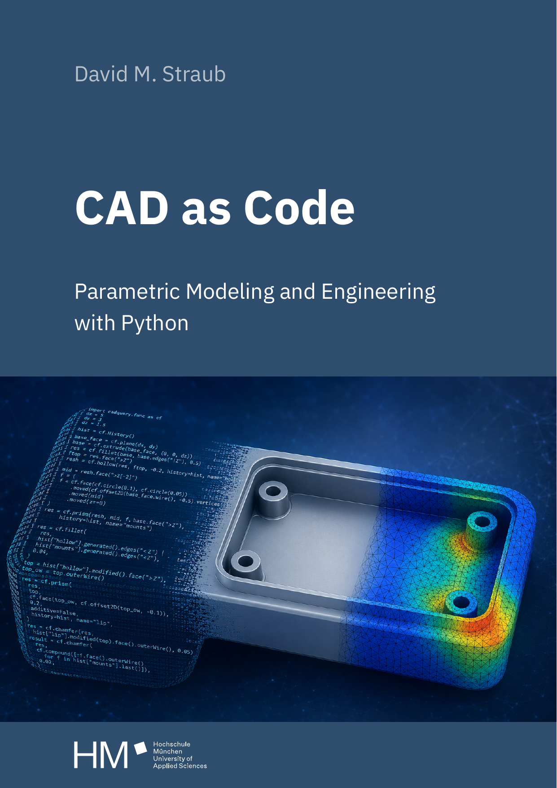

# Programmierung von CAx-Systemen

**Wintersemester 2026/27**

David Straub

### Ziel dieser Lehrveranstaltung

Die Studierenden erwerben ein fundiertes Verständnis der geometrischen **Grundlagen der 3D-Modellierung** sowie der **algorithmischen Erzeugung** und **Optimierung von CAD-Geometrien**.

Sie lernen, parametrische Modelle **mithilfe geeigneter Programmiersprachen** oder Skriptumgebungen zu erstellen, modellierungsrelevante Abläufe zu **automatisieren** und bestehende Workflows hinsichtlich Effizienz und Robustheit zu verbessern.

Zudem entwickeln sie Kompetenzen im Zusammenspiel von skriptbasierter Geometrieerzeugung und grafischen CAD-Umgebungen.

*Modulhandbuch SoSe 2026, TBM 2.2*

### Kurz gesagt

Sie lernen, **3D-Bauteile mit Python-Code zu bauen** statt mit der Maus – damit Modelle automatisch anpassbar, testbar und optimierbar werden.

Am Ende des Semesters: ein eigenes **Batteriemodul**, das Sie über Monate parametrisch aufgebaut, gegen die Zellquellung simuliert und auf Energiedichte optimiert haben.

### Heute

- Kennenlernen
- Organisatorisches & Prüfung
- Das Begleitbuch
- Motivation: warum Code statt Maus?
- **Pause**
- Umgebung einrichten
- Versionsverwaltung mit Git
- Erstes Teil: die Modul-Grundplatte

## Organisatorisches

### Rahmendaten

<!-- TODO Wochentag ergänzen -->
- Termin: 13:30–16:45 Uhr, Pause 15:00–15:15 Uhr, Raum B254
  - SU und Ü nicht streng getrennt – fließender Wechsel je nach Thema
  - Raum B358 (KCA-Labor) ebenfalls verfügbar
- Hardware: eigenes Laptop oder Laborrechner
- Prüfung: schriftlich, 90 Minuten

### Das Praktikum


- Sie bauen ein **Batteriemodul aus Pouch-Zellen** – dasselbe Teil wächst das ganze Semester
- Jede Einheit endet mit einer **Referenzlösung**; die nächste startet darauf auf sauberem Stand
- **Unbenotet** – gepushter Code heißt: ich schaue drauf und helfe gezielt
- Zugang zu Ihrem Projekt-Repository: <!-- TODO: Ablauf hier ergänzen, sobald Infrastruktur final -->

## Das Begleitbuch



- **Nachschlagewerk** für alle Kursthemen – mehr Tiefe, als die Sitzungen leisten
- Buch auf **Englisch**, Kurs und Klausur auf **Deutsch** – die deutsche Fachterminologie kommt aus den Folien
- Sauberen Python-Code und Ihr eigenes Projekt vertiefen wir im Kurs
- **Leseauftrag:** jede Sitzung endet mit einem Buchkapitel zur Vorbereitung – heute Kapitel 1

*CAD as Code* · D. M. Straub, HM · [doi.org/10.60948/OPUS-1358](https://doi.org/10.60948/OPUS-1358)

## Motivation

### Parametrische Modellierung – als Code

**Parametrisch** heißt: Sie beschreiben ein **Rezept** – die Form ergibt sich aus Variablen und Beziehungen. Ändert sich ein Parameter, rechnet sich das Modell neu.

In CAD-Programmen lebt das im Feature-Baum und in der Bemaßung. Bei uns wird das Rezept **explizit: lesbarer Code**.

- Ein Parametersatz → viele Varianten (Produktfamilien)
- Der Code ist die vollständige, nachvollziehbare Bauanleitung

### Warum Code statt Maus?

**GUI-Modellierung stößt an Grenzen:**
- Schritte schwer nachvollziehbar
- Wiederholungen von Hand, fehleranfällig
- jede Variante eine eigene Datei

**Mit Code:**
- **Versionsverwaltung** – jede Änderung nachvollziehbar, Teamarbeit über Branches
- **Automatisierung** – Wiederholaufgaben einmal programmiert, reproduzierbar
- **Optimierung** – den Rechner die beste Variante finden lassen

### Beispiel: alle Varianten auf einmal

```python
# Alle Endplatten-Stärken automatisch durchrechnen:
for plattenstaerke in [4.0, 6.0, 8.0, 10.0]:
    modul = modell(plattenstaerke)
    print(plattenstaerke, "mm →", masse(modul), "g")
```

Eine Schleife rechnet alle vier Varianten in einem Durchlauf.

Ein Optimierer findet am Ende die leichteste tragfähige Variante selbst – jedes Gramm Struktur senkt die Energiedichte.

### Hardware entwickeln wie ein Software-Team

Ein Bauteil als Code zu beschreiben bringt Werkzeuge in die Konstruktion, die die Softwarewelt seit Jahrzehnten nutzt – und die klassisches CAD nicht kennt. Sie zu beherrschen ist ein echter Teil dessen, was Sie mitnehmen:

- **Versionsverwaltung** (Git) – jeder Stand nachvollziehbar, gezielte Änderungen *(heute)*
- **Automatisiertes Testen** – das Modell prüft seine Maße bei jeder Änderung *(Einheit 7)*
- **Continuous Integration** – die Prüfung läuft bei jedem Push *(Einheit 7)*
- **Robustheit & Optimierung** – Grenzfälle abfangen, beste Variante suchen *(Einheiten 9, 11)*

### Warum Python?

- **Allzweck-Sprache** aus Informatik 1 – quelloffen, plattformunabhängig, weltweit meistgenutzt
- **Großes Ökosystem:** die Bausteine für den ganzen CAx-Weg liegen bereit – Numerik (NumPy/SciPy), Vernetzung & FEM (Gmsh, scikit-fem), Tests (pytest)

### Was ist CadQuery?

- **CadQuery** – eine **quelloffene** Python-Bibliothek für skriptbasiertes, parametrisches CAD
- Baut auf **OpenCascade** (OCCT) auf: demselben quelloffenen CAD-**Kernel** – dem Geometrie-Rechenkern –, den auch **FreeCAD** verwendet
- Erzeugt **echte, exakte Geometrie**: dieselbe, die CAD-Systeme wie FreeCAD, Fusion oder CATIA per STEP austauschen

*Was ein „Kernel“ genau ist, klären wir unterwegs – heute genügt: CadQuery erzeugt die Geometrie, wir schreiben das Rezept dafür.*

### Herkunft: quelloffenes, skriptbares CAD

| Jahr | Projekt | Bedeutung |
|---|---|---|
| 1999 | **OCCT** | professioneller CAD-Kernel, quelloffen |
| 2002 | **FreeCAD** | grafisches CAD auf OCCT, aus Python skriptbar |
| 2010 | **OpenSCAD** | „das Modell *ist* das Skript“ – populär gemacht |
| 2013 | **CadQuery** | Python-CAD auf dem professionellen Kernel |

CadQuery verbindet beide Stränge: **code-first** wie OpenSCAD, auf dem **exakten Kernel** (OCCT) wie FreeCAD.

### Gliederung

1. **Einführung**
2. Topologie
3. Grundformen
4. Kurven
5. Freiformgeometrie
6. Profile
7. Codequalität
8. Datenaustausch
9. Robustheit
10. Simulation
11. Optimierung

# Pause

## Umgebung einrichten

### Python

<!-- TODO: mit Zeitplan/ANLEITUNG abgleichen, falls sich Empfehlung ändert -->
- KCA-Rechner: Download von [WinPython 3.13](https://github.com/winpython/winpython/releases), entpacken ins Benutzerverzeichnis
- Windows: [Python Install Manager](https://www.python.org/downloads/latest/pymanager/) (nicht Installer!)
- macOS: [Python Installer](https://www.python.org/downloads/macos/)
- Debian/Ubuntu: `sudo apt install python3 python3-pip python3-venv`

### Virtuelle Umgebung

```bash
python -m venv cax-env          # Windows
python3 -m venv cax-env         # macOS/Linux
```

Aktivieren:

```bash
cax-env\Scripts\activate        # Windows
source cax-env/bin/activate     # macOS/Linux
```

### Pakete installieren

```bash
python -m pip install cadquery==2.8.0 ocp-vscode
```

Die Version pinnen wir (`==2.8.0`), damit bei allen dasselbe Verhalten herauskommt.

### OCP CAD Viewer in VS Code

- VS Code öffnen, Erweiterungen installieren:
  - [Python](https://marketplace.visualstudio.com/items?itemName=ms-python.python)
  - [OCP CAD Viewer](https://marketplace.visualstudio.com/items?itemName=bernhard-42.ocp-cad-viewer)
- Interpreter wählen: `cax-env\Scripts\python.exe` (Windows) bzw. `cax-env/bin/python` (macOS/Linux)

### Test

```python
from cadquery import func as cf
import ocp_vscode

ocp_vscode.show(cf.box(30, 20, 10))
```

Erscheint ein Quader im Viewer-Panel: Setup erfolgreich.

## Versionsverwaltung mit Git

### Das Problem ohne Versionsverwaltung

```
skript_final.py
skript_final2.py
skript_final_neu.py
skript_final_neu_v3_STIMMT.py
```

Typische Fragen ohne Versionsverwaltung:

- Wie war der Code letzte Woche?
- Welche Version haben wir abgegeben?
- Was genau habe ich seit gestern geändert?

**Git** löst das: eine Historie aller Änderungen, an einem Ort, nachvollziehbar.

Es ist die erste der Software-Engineering-Methoden dieses Kurses – der Standard, mit dem weltweit entwickelt wird, und ab heute Ihr Arbeitsstand.

### Grundkonzepte

**Repository** = Projektordner mit vollständiger Versionshistorie – bei uns: Ihr Projekt-Repository für das Semester

**Commit** = Snapshot des Projekts zu einem Zeitpunkt, mit Nachricht

```
* b3f92a1  Vier Befestigungslöcher ergänzt
* 7e4d5db  Grundplatte verrundet
* 704671c  Erste Version der Grundplatte
```

**Push** = Ihre Commits auf den Server hochladen – erst danach sehe ich sie

### Ihr Repository holen

<!-- TODO: konkreten Zugangsweg zum eigenen Repo ergänzen (Link/Einladung) -->
```bash
git clone <ihre-repo-url>
cd <repo>
```

Einmalig, jetzt gleich – danach arbeiten Sie nur noch lokal in diesem Ordner.

### Grundbefehle


```bash
git add w01/                    # Änderungen zum nächsten Commit vormerken
git commit -m "Modul-Grundplatte" # Snapshot mit Nachricht erstellen
git push                        # Commits hochladen
```

- **Ihr Projekt-Repository ist ab jetzt Ihr Arbeitsstand** – jede Sitzung endet mit einem Push
- Referenzlösungen kommen ebenfalls per Git zu Ihnen (`git pull`)
- Mehr Tiefe (`.gitignore`, Branches, Merge Requests) im Selbststudium: **X1 Versionsverwaltung**

## Erstes Teil: die Modul-Grundplatte

### Grundkörper: `box`

```python
from cadquery import func as cf

grundplatte = cf.box(170, 110, 6)
```

- Erzeugt einen Quader mit den angegebenen Maßen in mm
- In `x`/`y` um den **Ursprung** zentriert; steht auf der `xy`-Ebene (`z = 0 … 6`)

### Kanten auswählen und verrunden

```python
grundplatte = grundplatte.fillet(6, grundplatte.edges("|Z"))
```

- `edges("|Z")` wählt alle Kanten parallel zur Z-Achse (die vier senkrechten)
- `fillet(radius, kanten)` verrundet genau diese

*Warum genau diese Kanten? Dazu mehr in der nächsten Einheit (Topologie).*

### Grundkörper: `cylinder`, Positionierung

```python
loch = cf.cylinder(d=5, h=10).moved(cf.Location((75, 45, -2)))
grundplatte = grundplatte - loch
```

- `Location(x, y, z)` definiert eine Position im Raum (in mm)
- `moved(...)` verschiebt eine Kopie – das Original bleibt unverändert
- `-` erzeugt eine boolesche Differenz
- Der Bohrer (`h = 10`) ragt oben **und** unten über die 6 mm dicke Platte hinaus – ein Schnitt genau auf einer Fläche macht später Ärger

### Aufgabe: vier Befestigungslöcher

Ergänzen Sie die Grundplatte um vier Bohrungen (d = 5 mm) in den Ecken, mit Abstand zum Rand – auf ihr steht später der Zellstapel.

```python
grundplatte.exportStep("w01/grundplatte.step")
```

Committen und pushen Sie `w01/` – das ist Ihr erster Beitrag zum Semesterprojekt.

## Abschluss

### Leseauftrag & Ausblick

- **Leseauftrag:** Buch Kapitel 1–2
- **Wer mehr will:** ein eigenes Wunschteil aus Box, Zylinder und Bohrungen bauen und pushen
- **Nächste Woche:** Topologie – Aufbau der heute gebauten Grundplatte im Detail: Flächen, Kanten, Ecken, ihre Hierarchie
- Bis dahin: `w01/` committet und gepusht; bei Setup-Problemen vor W2 melden
