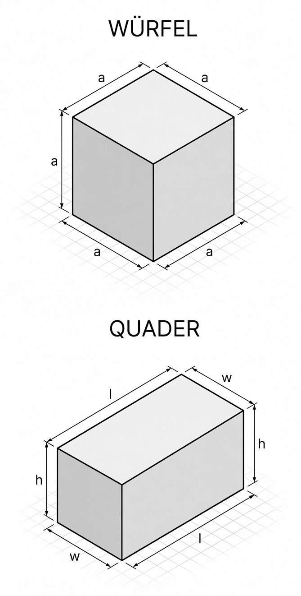

# Programmierung von CAx-Systemen

David Straub

### Gliederung

1. Einführung
2. **Topologie**
3. Grundformen
4. Kurven
5. Freiformgeometrie
6. Profile
7. Codequalität
8. Datenaustausch
9. Robustheit
10. Simulation
11. Optimierung

## Darstellung von Geometrie in CAD-Systemen

Dreidimensionale Geometrie kann in CAD-Systemen auf verschiedene Arten dargestellt werden:

- **CSG (Constructive Solid Geometry):** Volumen durch boolesche Operationen einfacher Körper
- **B-Rep (Boundary Representation):** Oberfläche definiert Volumen, Kanten definieren Flächen
- **Mesh (Netz):** Oberfläche aus Polygonen, z. B. Dreiecken

### CSG (Constructive Solid Geometry)

**Konstruktive Festkörpergeometrie**

- Modellierung durch boolesche Operationen (Union, Intersection, Difference)
- Grundkörper: Würfel, Zylinder, Kugel, Kegel
- **Kompakt und intuitiv** – die Darstellung hinter **OpenSCAD** (2010), das code-basiertes CAD populär machte
- **Grenze:** Freiformflächen, Verrundungen, gezielte Flächenauswahl brauchen mehr


### B-Rep (Boundary Representation)

**Begrenzungsflächenmodell**

- Geometrie durch **Oberfläche** beschrieben
- Hierarchie: Faces (Flächen), Edges (Kanten), Vertices (Ecken)
- Standard in professionellen CAD-Systemen – **das verwenden wir**
- Boolesche Operationen (`+`, `-`) nutzen wir weiter – ihr Ergebnis ist ein B-Rep mit auswählbaren Flächen und Kanten


### Mesh (Netz)

Die Geometrie wird durch viele kleine Facetten **angenähert** – in zwei Arten:

- **Oberflächennetz:** Dreiecke/Vierecke auf der Haut → 3D-Druck (STL), Visualisierung
- **Volumennetz:** Tetraeder/Hexaeder füllen den Körper → FEM

Beide sind approximativ – die exakte Krümmung geht verloren.


## Theorie A: Geometrie vs. Topologie, Grundelemente

### Was ist der Unterschied?

**Topologie** beschreibt die **Struktur** eines Körpers:
- Wie viele Flächen, Kanten, Ecken hat er? Wie sind diese verbunden?

**Geometrie** beschreibt die **Form** im Raum:
- Wo liegen die Punkte? Welche Kurve/Fläche liegt zugrunde? Krümmung, Länge, Flächeninhalt

> B-Rep = Topologie + Geometrie: Die Topologie liefert das Gerüst, die Geometrie füllt es mit konkreter Form.

### Beispiel: Würfel vs. Quader

Beide haben dieselbe **Topologie**: 8 Ecken, 12 Kanten, 6 Flächen, jede Fläche von 4 Kanten begrenzt.

Aber unterschiedliche **Geometrie**: Würfel – alle Flächen quadratisch, alle Kanten gleich lang; Quader – Rechteckflächen, unterschiedliche Kantenlängen.

→ Gleiche Topologie, verschiedene Geometrie ist möglich!



### Analogie: S-Bahn-Netz

**Netzplan (Topologie):** Welche Stationen sind verbunden? Wo muss ich umsteigen?

**Geografische Karte (Geometrie):** Wo liegen die Stationen genau? Wie lang ist die Strecke in km?

→ In CAD: B-Rep trennt genauso **Struktur** (Topologie) von **Form** (Geometrie).


### Zur Erinnerung: unsere Grundplatte

```python
from cadquery import func as cf

grundplatte = cf.box(170, 110, 6)
grundplatte = grundplatte.fillet(6, grundplatte.edges("|Z"))
```

Letzte Woche gebaut, aber nicht angeschaut: **was für ein Objekt ist das eigentlich, strukturell?**

### Topologie inspizieren

```python
print("Faces:   ", len(grundplatte.Faces()))
print("Edges:   ", len(grundplatte.Edges()))
print("Vertices:", len(grundplatte.Vertices()))
```

**Ergebnis:** `Faces: 10  Edges: 24  Vertices: 16` – ein Quader hätte 6/12/8. Warum mehr? Jede Verrundung ersetzt eine gerade Kante durch eine gekrümmte Fläche mit **eigenen** neuen Kanten und Ecken.

### Zylinder: 3 Flächen, 3 Kanten, 2 Ecken

Ein glatter Zylinder, ganz ohne Verrundung:

```python
zyl = cf.cylinder(d=20, h=20)
print(len(zyl.Faces()), len(zyl.Edges()), len(zyl.Vertices()))
# 3 3 2
```

Drei Flächen (Mantel, Boden, Deckel) sind klar. Aber **2 Ecken** und **3 Kanten** bei zwei runden Rändern – wie kommt das zustande?

### Die Nahtkante

```python
def show_topology(shape, indent=""):
    print(indent + shape.ShapeType())
    for child in shape:
        show_topology(child, indent + "  ")

show_topology(zyl)
```

Die Mantelfläche ist ein aufgerolltes Rechteck; wo seine Enden zusammenstoßen, liegt eine **Nahtkante**, die dieselbe Fläche zweimal begrenzt. Ihre beiden Endpunkte sind die 2 Ecken; die beiden Kreisränder plus die Naht ergeben die 3 Kanten. Topologie zählt nach der tatsächlichen Verbindung der Elemente.

### Vertex – der Punkt

- Nulldimensional – ein **Punkt** im Raum, Geometrie (x, y, z)
- Begrenzungselement von Kanten

```python
quader = cf.box(30, 20, 10)
v = quader.Vertices()[0]
print(v.toTuple())          # Position einer Ecke
```


### Edge – die Kante

- Eindimensional – ein **Kurvenstück**, begrenzt durch Vertices
- Geometrie: eine parametrische Kurve (Linie, Kreis, Spline, …)

```python
for k in quader.Edges():
    print(k.geomType(), round(k.Length(), 1))   # beim Quader: alle LINE
```


### Wire – der Kantenzug

- Geordnete, zusammenhängende Folge von Edges
- Bildet die **Kontur** einer Fläche – selbst kein geometrisches Objekt

```python
wire = quader.Faces()[0].Wires()[0]
print(len(wire.Edges()), "Kanten im Wire")   # 4
```

→ Eine Fläche kann mehrere Wires haben: **äußere Kontur + innere Löcher**


### Face – die Fläche

- Zweidimensional – ein **Flächenstück**, begrenzt durch Wires
- Geometrie: eine parametrische Fläche (Ebene, Zylinder, Kugel, Spline, …)

```python
for f in quader.Faces():
    print(f.geomType(), round(f.Area(), 1))     # beim Quader: alle PLANE
```


### Shell – die Hülle

- Zusammenhängende Menge von Faces, über gemeinsame Edges verbunden
- Offen oder geschlossen

```python
shell = quader.Shells()[0]
print(len(shell.Faces()), "Flächen in der Shell")   # 6
```

→ Eine geschlossene Shell begrenzt ein Volumen


### Solid – der Körper

- Dreidimensional – ein **Volumenkörper**, begrenzt durch eine oder mehrere Shells
- Das Zielobjekt der parametrischen Konstruktion

```python
solid = quader.Solids()[0]
print(solid.Volume(), solid.Area())   # Volumen mm³, Oberfläche mm²
```


### Compound – die Sammlung

- Container für **beliebige Shapes**, auch gemischter Typen – ohne nötige Verbindung

```python
gruppe = cf.compound([quader, cf.cylinder(d=10, h=10)])
print(len(gruppe.Solids()), "Solids in der Gruppe")
```

`geomType()` (mit `Area()`/`Length()`) zeigt die **Geometrie** – `PLANE`, `CYLINDER`, `CIRCLE`, … Diese Namen kehren gleich als Selektoren wieder (`%PLANE`, `%CYLINDER`, `%CIRCLE`).

### Übersicht: Topologie-Hierarchie

| Typ | Dim. | Begrenzt durch | Geometrie |
|---|---|---|---|
| Vertex | 0D | – | Punkt |
| Edge | 1D | Vertices | Kurve |
| Wire | 1D | Edges | – |
| Face | 2D | Wires | Fläche |
| Shell | 2D | Faces | – |
| Solid | 3D | Shells | – |
| Compound | beliebig | – | – |

## Praktikum A: Anatomie der Grundplatte

### Aufgabe 1: Zählen und vorhersagen

Nutzen Sie Ihre Grundplatte aus Einheit 1 (`grundplatte`, mit vier Bohrungen).

1. Zählen Sie Faces, Edges, Vertices – stimmen die Zahlen mit Ihrer Vorhersage überein?
2. Was trägt jede Bohrung zur Topologie bei? Was jede Verrundung?

### Aufgabe 2: Geometrietypen

Gehen Sie Flächen und Kanten Ihrer Grundplatte durch.

1. Welche Geometrietypen kommen bei Flächen vor? Bei Kanten?
2. Wie viele Kanten sind Kreise? Passt das zur Anzahl der Bohrungen und Verrundungen?

*Hinweise:* `.Faces()`, `.Edges()`, `.geomType()`, `.Area()`, `.Length()`

### Aufgabe 3: Wie verändern Features die Topologie?

Sagen Sie **vor** dem Ausführen voraus, wie sich Faces/Edges/Vertices ändern – dann prüfen:

1. eine zusätzliche Bohrung in die Platte (`- cf.cylinder(...)`)
2. `show_topology(grundplatte)` aufrufen und die Hierarchie ablesen: Wie viele Faces hat die Shell, wie viele Kanten begrenzen eine Fläche?

## Theorie B: Hierarchie, Orientierung, Selektoren

### Konnektivität durch gemeinsame Teilelemente

Zwei Flächen sind verbunden, wenn sie eine gemeinsame **Kante** haben; zwei Kanten, wenn sie einen gemeinsamen **Vertex** haben. Teilelemente werden **geteilt**, nicht kopiert.

```python
appearances = sum(len(f.Edges()) for f in grundplatte.Faces())
print(appearances, "vs.", len(grundplatte.Edges()), "eindeutige Kanten")
```

Jede „normale“ Kante wird von zwei Flächen genutzt – die Differenz verrät, wie viele Kanten sich selbst teilen (Nahtkanten).

### Orientierung: warum reicht Topologie allein nicht?

**Gedankenexperiment:** Sechs quadratische Flächen, zu einer Shell verbunden – ein massiver Würfel, oder eine würfelförmige Aussparung? Die Topologie ist identisch. Fehlende Information: **wohin zeigt jede Fläche?**

**Regel:** In einem gültigen Solid zeigt die Normale **immer vom Material weg**.

```python
for f in grundplatte.Faces()[:3]:
    print(f.normalAt())   # jede Normale zeigt nach außen
```

→ Wichtig für Boolesche Operationen, Wasserdichtheit, Export (falsche Orientierung → ungültige STL/STEP).

### B-Rep ist Industriestandard

| Software | Kernel |
|---|---|
| CATIA, SolidWorks, NX | CGM / Parasolid |
| FreeCAD, CadQuery | OCCT |

Vertex, Edge, Face, Shell, Solid – überall dieselben Konzepte. **STEP** (ISO 10303) transportiert diese Struktur zwischen Systemen, verlustfrei in der Topologie. *Vertiefung: Leseauftrag.*

### String-Selektoren

| Selektor | Bedeutung |
|---|---|
| `>Z` / `<Z` | größter / kleinster Z-Wert |
| `\|Z` | parallel zur Z-Achse |
| `%CIRCLE` / `%PLANE` / `%CYLINDER` | Geometrietyp |

Kombinierbar: `grundplatte.edges("<Z and %CIRCLE")`. Was nicht als String geht: direkt in Python filtern.

```python
groesste = max(grundplatte.Faces(), key=lambda f: f.Area())
zylindrisch = [f for f in grundplatte.Faces() if f.geomType() == "CYLINDER"]
```

### Warum String vor Index? Ein Vorgriff

⚠️ `teil.Faces()[3]` meint nicht „diese bestimmte Fläche“, sondern „was gerade an Position 3 steht“. Fügt eine spätere Änderung irgendwo im Modell eine neue Fläche ein, kann Index 3 danach auf eine völlig andere Fläche zeigen – ohne Fehlermeldung.

Das heißt **Topological Naming Problem**; eng verwandt: ob ein Ergebnis überhaupt **gültig** ist (`isValid()`). Beides greifen wir später mit einem konkreten Beispiel vollständig auf.

## Praktikum B: Gezielte Selektion und Erweiterung

### Aufgabe 4: Gezielte Selektion

1. Selektieren Sie die **Oberseite** der Platte – Typ und Flächeninhalt?
2. Selektieren Sie alle **zylindrischen Flächen** (Bohrungswände) – wie viele?
3. Fasen Sie gezielt die **unteren** Kreiskanten – über ein Selektor-Kriterium statt über den Index.

### Aufgabe 5: Zentrierzapfen auf der Oberseite *(Vorgriff)*

Bauen Sie einen Zentrierzapfen (⌀ 16 mm, Höhe 8 mm) mittig auf die Oberseite der Platte – er positioniert später den Zellstapel. Nutzen Sie zunächst eine fest angenommene Höhe (`z = 6`).

**Denkfrage:** Was passiert mit `z = 6`, wenn die Grundplatte dicker wird? Nächste Woche leiten wir die Platzierung **aus der Fläche selbst** ab.

### Zusatzaufgabe: Lüftungslochraster

Bauen Sie eine Platte **170 × 110 × 6 mm** (Ecken r = 6) mit einem **4 × 3-Raster** von Lüftungslöchern (⌀ 8 mm), Rastermaß 36 mm (x) und 32 mm (y).

1. Wie viele Flächen hat die Platte, wie viele davon zylindrisch?
2. Verrunden Sie alle **oberen** Kreiskanten.

*Hinweise:* zwei verschachtelte `for`-Schleifen, `cf.cylinder`, `.moved(cf.Location(...))`, Selektor `">Z and %CIRCLE"`

### Zusatzaufgabe: Topologie eines fremden Modells

```python
import cadquery
teil = cadquery.importers.importStep("mein_teil.step").val()
```

`importStep` ist die einzige Stelle im Kurs, an der kurz die `Workplane`-API auftaucht – `.val()` holt sofort die normale `Shape` heraus. Wie viele Faces/Edges/Vertices hat das fremde Teil? Welche Geometrietypen kommen vor?

## Abschluss

### Leseauftrag & Ausblick

- **Leseauftrag:** Buch Kapitel 5 (erste Hälfte)
- **Wer mehr will:** Prädikat-Selektoren für Fälle, die kein String trifft (Buch Kapitel 5)
- **Nächste Woche:** Grundformen – Extrude, Muster; die Pouch-Zelle, der Zellstapel und die Endplatten kommen dazu
- Bis dahin: `w02/` committet und gepusht
