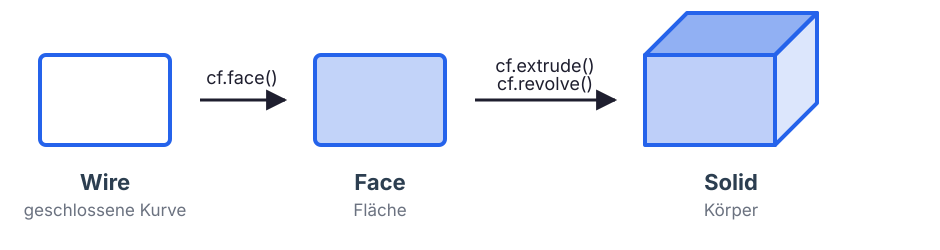
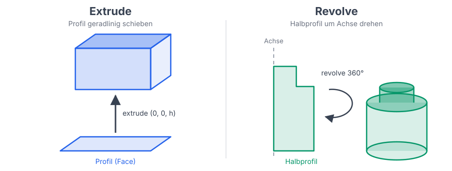
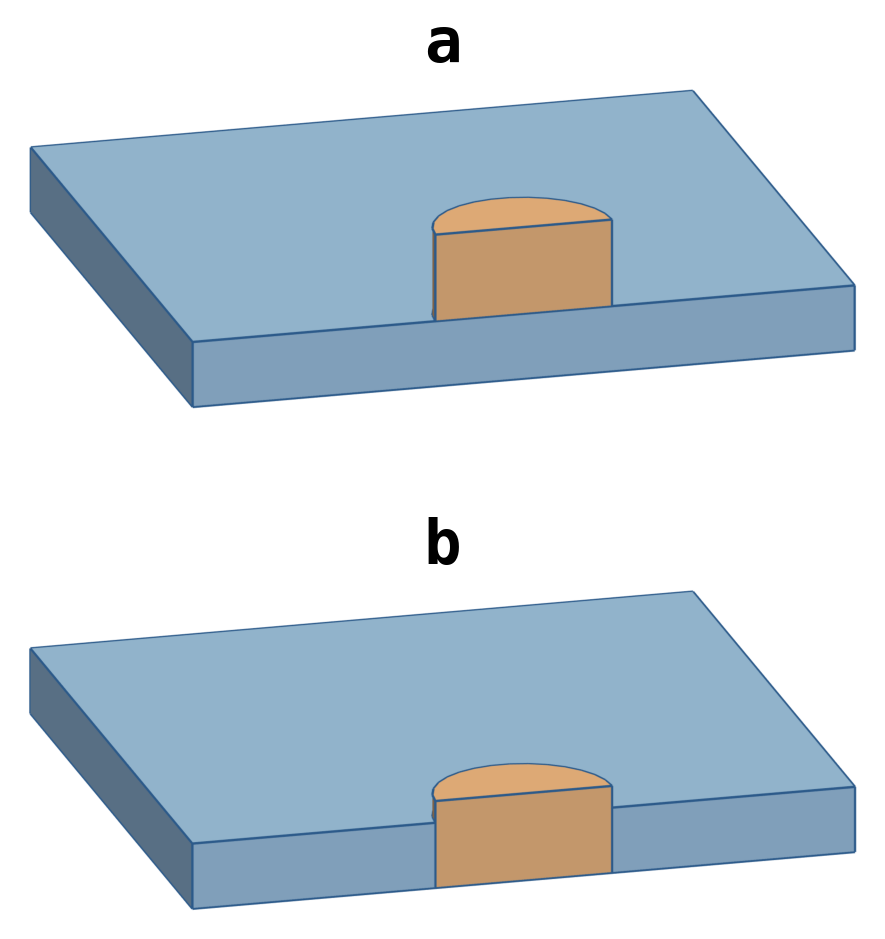
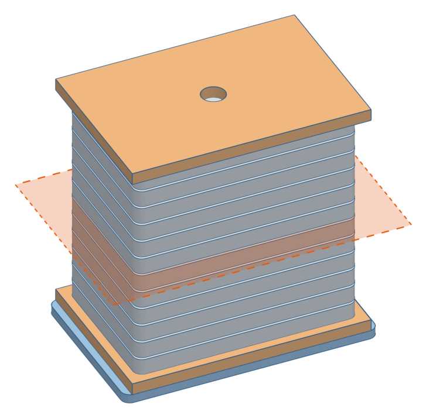

# Programmierung von CAx-Systemen

David Straub

### Gliederung

1. Einführung
2. Topologie
3. **Grundformen**
4. Kurven
5. Freiformgeometrie
6. Profile
7. Codequalität
8. Datenaustausch
9. Robustheit
10. Simulation
11. Optimierung

## Grundformen

- **Feature-basiert:** Reihenfolge der Konstruktion
- **Extrude & Revolve:** Profil → Körper
- **Muster als Schleifen:** Raster, linearer Stapel
- **Konstruktionsebenen:** aus Flächen ableiten
- **Spiegeln & Drehen:** Symmetrie und Lage
- **Parametersätze:** als Dataclass

*Durchgängiges Beispiel:* die Pouch-Zelle, der Zellstapel und die Endplatten

## Feature-basiertes Modellieren

### Modell als Abfolge von Features

**Feature** = eine atomare Modellierungsoperation (Extrude, `+`, `-`, `fillet`, …)

**Konstruktionsstrategie:**
1. **Grundform** – einfachster Körper als Ausgangsbasis
2. **Additive Features** – Bosse, Rippen, Zapfen
3. **Subtraktive Features** – Bohrungen, Nuten, Taschen
4. **Finishing** – Verrundungen und Fasen zuletzt

### Warum „Finishing zuletzt“? Selektoren fragen den aktuellen Stand

Ein Selektor wie `"%CIRCLE"` beantwortet seine Frage **an dem Modell, wie es in der Zeile steht**, nicht am fertigen Teil:

```python
platte = cf.box(40, 30, 6)
tasche = cf.cylinder(d=18.6, h=3).moved(cf.Location((0, 0, 3)))
loch   = cf.cylinder(d=3.4, h=6).moved(cf.Location((16, 11, 0)))

basis = platte - tasche - loch                 # Loch schon gebohrt
rand  = basis.edges(">Z and %CIRCLE")          # 2 Treffer: Tasche UND Loch!
zu_frueh = cf.fillet(basis, rand, 1.0)         # verrundet auch den Lochrand
```

Vor dem Bohren fände `"%CIRCLE"` nur **einen** Rand (die Tasche). Beide Varianten sind `isValid()` – der Unterschied (2,6 mm³) fällt nur auf, wenn man danach sucht. Deshalb: Finishing zuletzt, oder präziser selektieren (Radius statt „ist ein Kreis“).

## Vom Profil zum Körper

### Von der Kurve zur Fläche

`extrude()` und `revolve()` erwarten eine **Fläche** als Eingang:



Der Wire muss **geschlossen und eben** sein – sonst bricht `cf.face()` ab oder liefert eine ungültige Fläche.

### Zwei Wege vom Profil zum Körper



### extrude() – Profil zu Körper

```python
profil = cf.face(cf.rect(20, 10))   # Rechteck, zentriert im Ursprung
block = cf.extrude(profil, (0, 0, 5))
```

**Profil-Bausteine:** `cf.rect(b, h)` · `cf.circle(r)` (Bohrungen!) · `cf.ellipse(r1, r2)` · `cf.polygon(*pts)` · `cf.spline(*pts)` (Freiformkurven → Einheit 5)

`cf.polygon` schließt die Kontur selbst; `cf.polyline` bleibt offen – dort wiederholt der letzte Punkt den ersten:

```python
pts = [(0, 0, 0), (20, 0, 0), (20, 10, 0), (0, 10, 0), (0, 0, 0)]
profil = cf.face(cf.polyline(*pts))
```

### revolve() – Rotationskörper *(zum Kennenlernen)*

Statt ein Profil geradlinig zu schieben, dreht `revolve` es um eine Achse – aus einem **Halbprofil** (x = Radius, z = Höhe) wird ein Rotationskörper:

```python
# Halbprofil in der XZ-Ebene: x = Radius, z = Höhe
halbprofil = cf.face(cf.polyline((0, 0, 0), (15, 0, 0), (15, 0, 8), (0, 0, 8), (0, 0, 0)))
scheibe = cf.revolve(halbprofil, (0, 0, 0), (0, 0, 1), 360)   # volle Umdrehung um Z
```

*Das Batteriemodul hat kein Rotationsteil – Revolve zeigen wir diese Woche einmal; die Technik bleibt für später im Werkzeugkasten.*

## Muster: Wiederholung durch Schleifen

### Rechteckraster als Schleife

```python
platte = cf.box(60, 60, 8)
for ix in range(3):
    for iy in range(3):
        x, y = (ix - 1) * 16, (iy - 1) * 16
        loch = cf.cylinder(d=4, h=10).moved(cf.Location((x, y, 0)))
        platte = platte - loch
```

Kein spezielles „Pattern“-Objekt nötig – eine Schleife über `Location`-Werte reicht und bleibt lesbar. Ein linearer Stapel entlang einer Achse ist dasselbe Muster mit nur einer Schleife.

## Konstruktionsebenen

### Konstruktionsebenen aus Flächen ableiten

Eine `Plane` ist ein **lokales Koordinatensystem** – Ursprung plus Ausrichtung. Aus einer Fläche abgeleitet sitzt sie genau auf dieser Fläche – die Antwort auf die Denkfrage zum Zentrierzapfen:

```python
from cadquery import Plane, Location

platte = cf.box(170, 110, 6)
oben   = platte.faces(">Z")
ebene  = Plane(origin=oben.Center())
zapfen = cf.cylinder(d=16, h=8).moved(Location(ebene))
```

> **Wird die Platte dicker, wandert der Zapfen mit** – ein fest eingetipptes `z = 6` bliebe stehen.
> Die Ebene ist so treffsicher wie der Selektor, der die Fläche findet – mehr dazu in Aufgabe 2.

### Auf der Ebene platzieren: Wo landet der Zapfen?

```python
platte = cf.box(170, 110, 6)
oben   = platte.faces(">Z")
ebene  = Plane(origin=oben.Center())

a = cf.cylinder(d=16, h=8).moved(Location(ebene) * Location((40, 0, 0)))
b = cf.cylinder(d=16, h=8).moved(Location(ebene, (40, 0, 0)))
```

**Sagen Sie zuerst voraus:** Beide Zeilen laufen fehlerfrei durch. Wo sitzen `a` und `b`?

### Locations verketten mit `*`



- `a`: Mittelpunkt (40, 0, 10) – sitzt **auf** der Platte
- `b`: Mittelpunkt (40, 0, 4) – steckt **in** der Platte

`Location(ebene)` ist die Lage der Ebene; die **Multiplikation** hängt einen lokal in dieser Ebene gemessenen Versatz an.

`Location(ebene, (40, 0, 0))` ersetzt dagegen den Ursprung der Ebene durch den angegebenen Punkt – in globalen Koordinaten. Das Ergebnis liegt um die volle Plattendicke daneben.

## Praktikum A: Zelle und Zellstapel

### Aufgabe 1: Pouch-Zelle extrudieren

Bauen Sie eine Pouch-Zelle – im Kern ein flacher Block mit gerundeten Ecken:

- **148 × 98 × 11 mm**, Ecken mit **r = 6 mm** gerundet

*Hinweise:* `cf.rect`, `cf.face`, `cf.extrude`, `cf.fillet(form, kanten, r)`

*Prüfen:* `zelle.isValid()`; Volumen ungefähr 148 · 98 · 11

### Aufgabe 2: Stapeln und auf der Grundplatte platzieren

1. Stapeln Sie **12 Zellen** mit einer Schleife, Abstand **12,5 mm** (Zelldicke + 1,5 mm Kompressionspad).
2. Leiten Sie aus Ihrer Grundplatte – **mit** Zentrierzapfen – eine Ebene auf der **Plattenoberseite** ab. **Sagen Sie zuerst voraus:** Welche Fläche liefert `grundplatte.faces(">Z")`? Prüfen Sie mit `.Center()`.
3. Setzen Sie den Stapel **8 mm** über diese Ebene – dazwischen liegt in Teil B die untere Endplatte.

*Hinweise:* `.moved(cf.Location(...))`, `Plane(origin=...)`, `Location(ebene) * Location(...)`, `">Z[-2]"` = zweithöchste Fläche in Z

*Prüfen:* Unterseite des Stapels bei z = 14 (`stapel.BoundingBox().zmin`)

## Spiegeln und Drehen

### Spiegeln statt zweimal bauen

Zwei symmetrische Features sind eine Entscheidung plus ihr Spiegelbild:

```python
loch = cf.cylinder(d=4, h=10).moved(cf.Location((30, 0, 0)))
loecher = loch + loch.mirror("YZ", basePointVector=(0, 0, 0))
```

`mirror` spiegelt an einer Ebene (hier „YZ“ durch den Ursprung) und gibt die gespiegelte Kopie zurück – Original und Kopie zusammen ergeben beide Löcher aus einer einzigen Platzierung. Gleich bei den Endplatten angewendet.

### Rotation: Drehen mit `moved`

```python
gedreht = cf.box(20, 5, 5).moved(rz=45)
```

`moved` nimmt Verschiebung (`x`, `y`, `z`) und Drehung (`rx`, `ry`, `rz`, in Grad) gemeinsam entgegen. Eine Drehung erfolgt **immer um den Ursprung** – nicht um den Mittelpunkt des Bauteils, außer der liegt zufällig dort.

Was daraus für die Reihenfolge von Drehen und Verschieben folgt, zeigt nächste Woche der Zell-Flip im Stapel.

## Parameter als Dataclass

### Warum die Maße bündeln?

Dieselben Maße tauchen in jeder Funktion wieder auf – die Zelle brauchte `zell_b`, `zell_h`, `zell_t`, der Stapel `n_zellen`, `spacer`, die Endplatten gleich `plattenstaerke` … Reicht man sie einzeln durch, gerät leicht ein Wert in Vergessenheit oder zwei passen nicht zusammen:

```python
pitch  = zell_t + spacer            # im Stapel
aussen = cf.box(zell_b + 12, ...)   # in der Endplatte
# zell_t, n_zellen, plattenstaerke … überall lose herumgereicht
```

Besser: alle Maße des Moduls in **einem** Objekt.

### `@dataclass`: Maße in einem Objekt

```python
from dataclasses import dataclass

@dataclass
class ModulParam:
    zell_b: float = 148.0         # mm, Zellbreite
    zell_h: float = 98.0          # mm, Zellhöhe
    zell_t: float = 11.0          # mm, Zelldicke
    n_zellen: int = 12
    spacer: float = 1.5           # mm, Kompressionspad
    plattenstaerke: float = 8.0   # mm, Endplatte
```

- Das `@dataclass` davor ist ein **Dekorator** – er erzeugt Konstruktor und Attribute automatisch, ohne Boilerplate.
- Die `: float` sind **Typ-Hinweise** (dokumentieren die erwartete Art des Werts) – für eine Dataclass nötig.

### ModulParam: der Stapel, jetzt parametrisch

```python
def zelle_bauen(p: ModulParam) -> cf.Shape:
    z = cf.extrude(cf.face(cf.rect(p.zell_b, p.zell_h)), (0, 0, p.zell_t))
    return cf.fillet(z, z.edges("|Z"), 6)

def stapel_bauen(p: ModulParam) -> cf.Shape:
    pitch = p.zell_t + p.spacer
    zelle = zelle_bauen(p)
    stapel = zelle
    for i in range(1, p.n_zellen):
        stapel = stapel + zelle.moved(cf.Location((0, 0, i * pitch)))
    return stapel
```

Derselbe Stapel wie in Praktikum A – aber die Maße kommen jetzt aus `p`.

### Varianten mit `replace()`

```python
from dataclasses import replace

p_standard = ModulParam()
p_gross    = replace(p_standard, n_zellen=16, zell_t=14.0)
```

Ein Parametersatz, viele Varianten – der Rest der Werte bleibt unverändert.

## Praktikum B: Endplatten und Zusammenführung

### Aufgabe 3: Zelle und Stapel parametrisch

Überführen Sie Ihren Code aus Praktikum A in die Funktionen `zelle_bauen(p: ModulParam)` und `stapel_bauen(p: ModulParam)`.

*Prüfen:* `stapel_bauen(ModulParam())` liefert denselben Stapel wie in Aufgabe 2 – gleiches Volumen. Und eine Variante mit `replace(..., n_zellen=8)` baut ohne weitere Änderung.

### Aufgabe 4: Endplatten mit Mirror



Schreiben Sie `endplatten(p: ModulParam)`. Zwei **gleiche** Platten verspannen den Stapel – eine bauen, die andere spiegeln:

- **12 mm größer** als der Zellquerschnitt (Breite und Höhe), **8 mm** dick (= Zapfenhöhe)
- Die untere liegt **auf der Grundplatte**, mit einer **Zentrierbohrung** (⌀ 16 mm) für den Zapfen
- Die obere entsteht durch **Spiegelung** an der Ebene auf halber Stapelhöhe

*Hinweise:* `cf.box`, `.moved(...)`, `.mirror("XY", basePointVector=(0, 0, ...))`

Ergänzen Sie die nötigen Felder in `ModulParam`. *Prüfen:* obere Platte endet bei z = 170,5 mm.

### Aufgabe 5 *(Zusatz)*: alles an einem Parametersatz

Erweitern Sie `ModulParam` um die Maße aus Einheit 1 (Grundplatte) und dieser Einheit (Zellstapel, Endplatten). Ziel: ein einziger `ModulParam()`-Aufruf parametrisiert das bisherige Modul – Grundplatte, Stapel, Endplatten.

## Abschluss

### Leseauftrag & Ausblick

- **Leseauftrag:** Buch Kapitel 3 und 4
- **Wer mehr will:** ein gekerbtes Profil extrudieren (statt Rechteck) oder ein Revolve-Teil (Buchse, Rundstab) frei bauen
- **Nächste Woche:** Kurven – die Mathematik hinter den `Location`-, Plane- und Rotations-Aufrufen von heute
- Bis dahin: `w03/` committet und gepusht
