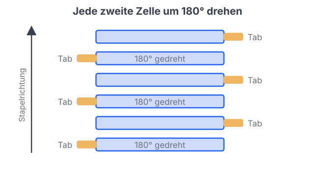
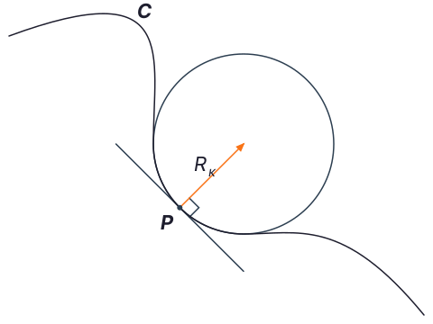
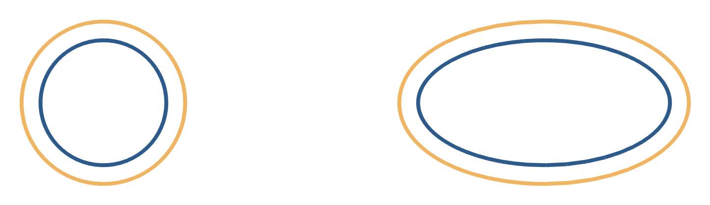

# Programmierung von CAx-Systemen

David Straub

### Gliederung

1. Einführung
2. Topologie
3. Grundformen
4. **Kurven**
5. Freiformgeometrie
6. Profile
7. Codequalität
8. Datenaustausch
9. Robustheit
10. Simulation
11. Optimierung

## Kurven

- Koordinatensysteme und Transformationen: die Mathematik hinter letzter Woche
- Reihenfolge von Drehen und Verschieben – im Code Ihre Entscheidung
- Was ist eine Kurve? Parametrische Darstellung
- Tangente, Bogenlänge, Krümmung
- Analytische Kurven und ihre Grenzen

*Durchgängiges Beispiel:* der alternierende Zell-Flip im Stapel; Kurven am eigenen Teil auslesen

### Rückblick: Stand des Projekts

Letzte Woche gebaut: Zellstapel (Muster-Schleife), Endplatten (Mirror), alles über einen `ModulParam`-Satz.

Dabei im Einsatz:

- `Location` und `moved(...)` – Objekte im Raum platzieren
- `Plane(origin=...)` – Konstruktionsebene aus einer Fläche
- `moved(rz=90)` – Drehung, deren **Reihenfolge** Sie am Ende vorhergesagt haben

**Heute:** die Mathematik dahinter – und was eine „Kante“ geometrisch ist.

## Theorie A: Koordinatensysteme und Transformationen

### Verschieben und Drehen im Code

Im Code ist jede Transformation ein **expliziter Schritt** – und ihre **Reihenfolge** ist Ihre Entscheidung, die das Ergebnis verändert.

Das räumliche Handwerkszeug in `cadquery`:

| Objekt | Bedeutung |
|---|---|
| `Vector(x, y, z)` | Punkt oder Richtung; `.Length`, `.dot()`, `.cross()` |
| `Plane(origin=...)` | Ebene = lokales Koordinatensystem |
| `Location` | Lage eines Objekts: Verschiebung **und** Drehung |

### Location: das Koordinatensystem eines Objekts

Jedes Objekt trägt eine **Location** – seine Lage relativ zur Welt. Sie kodiert zweierlei:

- **Translation:** Verschiebung $(dx,\, dy,\, dz)$
- **Rotation:** Orientierung (intern als Matrix)

```python
from cadquery import func as cf
from cadquery import Location

teil = cf.box(60, 10, 6).moved(x=40)        # nur Verschiebung
teil = cf.box(60, 10, 6).moved(x=40, rz=30) # Verschiebung + Drehung
```

`moved(...)` nimmt Verschiebung (`x, y, z`) und Drehung (`rx, ry, rz`, in Grad) gemeinsam entgegen und liefert ein **neues** Objekt – das Original bleibt.

### Drehung: Achse plus Winkel

Eine Drehung im Raum ist vollständig durch **Achse + Winkel** beschrieben:

$$\text{Drehung} = (\hat{\mathbf{e}},\ \varphi)$$

Intern wird daraus eine **Rotationsmatrix** $\mathbf{R} \in \mathbb{R}^{3\times3}$, die auf jeden Punkt wirkt: $\mathbf{p}' = \mathbf{R}\,\mathbf{p}$.

- `rz=90` dreht um die Z-Achse (Rechte-Hand-Regel)
- Gedreht wird **immer um den Ursprung** – nicht um den Bauteilmittelpunkt, außer der liegt zufällig dort

Das ist der Grund, warum die Reihenfolge zählt.

### Reihenfolge: $\mathbf{T}\mathbf{R} \neq \mathbf{R}\mathbf{T}$

Translationen **kommutieren** – Reihenfolge egal:
$$\mathbf{T}_1\mathbf{T}_2 = \mathbf{T}_2\mathbf{T}_1$$

Drehung und Verschiebung **kommutieren nicht**:
$$\mathbf{T}\mathbf{R} \neq \mathbf{R}\mathbf{T}$$

```python
a = cf.box(60, 10, 6).moved(rz=90).moved(x=40)  # erst drehen, dann schieben
b = cf.box(60, 10, 6).moved(x=40).moved(rz=90)  # erst schieben, dann drehen
```

`a` sitzt bei `x=40` und zeigt gedreht; `b` wird als Ganzes um den Ursprung geschwenkt und landet bei `y=40`.

**Ausnahme:** Verschiebt man *entlang* der Drehachse, kommutiert es doch.

### Die Ebene als lokales Koordinatensystem

Letzte Woche haben Sie `Plane(origin=top.Center())` benutzt, um den Stapel auf die Grundplatte zu setzen. Der Mechanismus dahinter:

Eine `Plane` **ist** ein lokales Koordinatensystem (Ursprung + Ausrichtung). `Location(plane) * Location((dx, dy, 0))` heißt: „gehe ins Koordinatensystem der Fläche, dann dort lokal weiter“.

> Aus der Fläche abgeleitet bleibt die Platzierung korrekt, auch wenn sich Maße ändern. Dieselbe Robustheit wie bei der Stapel-Platzierung.

## Praktikum A: Zellstapel mit alternierendem Flip

### Aufgabe 1: Zelle mit Terminal-Tab

Ergänzen Sie Ihre Zelle aus Einheit 3 um einen Terminal-Tab – **aus der Mitte versetzt**, damit der Flip sichtbar wird:

- Tab: Quader **24 × 12 × 6 mm**
- an der langen Seite, **40 mm** aus der Mitte versetzt

*Hinweise:* `cf.box`, `.moved(Location(...))`, `+`

### Aufgabe 2: Alternierend flippen und stapeln



Stapeln Sie **12 Zellen** im Abstand **12,5 mm**. Für die Reihenschaltung wird **jede zweite Zelle um 180° um Z gedreht**.

1. **Vorher raten:** Ändert die Reihenfolge etwas – erst drehen, dann heben, oder umgekehrt? Prüfen Sie beide.
2. Warum kommt es hier auf dasselbe heraus?
3. `stapel.isValid()`; kontrollieren Sie, dass die Tab-Seite von Zelle zu Zelle wechselt.

*Hinweise:* `.moved(rz=...)`, `.moved(Location((0, 0, ...)))`, `i % 2`

### Aufgabe 3 *(Zusatz)*: wenn die Reihenfolge doch zählt

Legen Sie eine Zelle **quer** ab: Drehung um Z (90°), Verschiebung um 120 mm in X – also **senkrecht** zur Drehachse. Bauen Sie beide Reihenfolgen.

Wo landet welche? Erklären Sie den Unterschied über $\mathbf{T}\mathbf{R} \neq \mathbf{R}\mathbf{T}$.

## Theorie B: Was ist eine Kurve?

### Geometrie im B-Rep: was eine Kante trägt

In Einheit 2 gab `geomType()` Namen wie `LINE`, `CIRCLE` zurück. Diese Namen benennen die **Geometrie**, die ein Element trägt:

| Topologie | trägt als Geometrie |
|---|---|
| `Vertex` | einen Punkt |
| `Edge` | eine Kurve, begrenzt auf ein Stück davon |
| `Face` | eine Fläche, begrenzt auf einen Bereich davon |

Die Topologie war das Gerüst – jetzt die Form, die es füllt: **was ist eine Kurve?**

### Drei Arten, eine Kurve aufzuschreiben

Am Beispiel Kreis mit Radius $R$:

| Form | Kreis | Problem |
|---|---|---|
| **explizit** | $y = \pm\sqrt{R^2 - x^2}$ | mehrwertig; senkrechte Tangente bricht |
| **implizit** | $x^2 + y^2 - R^2 = 0$ | kein Startpunkt, kein „nächster Punkt“ |
| **parametrisch** | $x = R\cos u,\ y = R\sin u$ | jeder $u$ → genau ein Punkt |

> CAD-Kerne speichern ausschließlich die **parametrische** Form – nur sie beantwortet „welcher Punkt liegt bei $u$?“ und „wohin zeigt die Kurve hier?“ ohne Zusatzmaschinerie.

### Tangente und Bogenlänge

Eine Kurve als Funktion eines Parameters:
$$\mathbf{C}(u) = \begin{pmatrix} x(u) \\ y(u) \\ z(u) \end{pmatrix}, \qquad u \in [u_{\min}, u_{\max}]$$

**Tangentenvektor** = Ableitung, zeigt in die Bewegungsrichtung:
$$\mathbf{T}(u) = \mathbf{C}'(u) = \frac{d\mathbf{C}}{du}$$

**Bogenlänge** = tatsächlich zurückgelegter Weg:
$$s(u) = \int_{u_0}^{u} |\mathbf{C}'(\tilde u)|\, d\tilde u$$

Die Länge von $\mathbf{T}$ ist eine „Geschwindigkeit“ im Parameterraum – sie hängt von der Parametrisierung ab, nicht von der Form.

### Krümmung

Die **Krümmung** $\kappa$ misst, wie stark sich die Tangentenrichtung pro Weglänge dreht:

$$\kappa(u) = \frac{|\mathbf{C}'(u) \times \mathbf{C}''(u)|}{|\mathbf{C}'(u)|^3}$$

- Gerade: $\kappa = 0$  $\quad|\quad$  Kreis mit Radius $R$: $\kappa = 1/R$ überall
- $R_\kappa = 1/\kappa$: **Krümmungsradius** – Radius des anschmiegenden Kreises



### Parameter und Bogenlänge

Der Parameter läuft **gleichmäßig** – die Punkte im Raum liegen es **nicht**:

```
u:   0.0       0.25      0.5       0.75      1.0
     ●─────────●─────────●─────────●─────────●
```

```python
ell = cf.ellipse(30.0, 15.0)
print(ell.curvatureAt(0.0), ell.curvatureAt(0.25))
# 0.133 (spitzes Ende) ... 0.0167 (flaches Ende)
```

- `positionAt(t)` – Standard `mode="length"`: $t$ = Bruchteil der **Bogenlänge**
- `positionAt(t, mode="parameter")`: $t$ = roher Kurvenparameter $u$

Bei der Ellipse variiert die Krümmung 8-fach – gleiche Parameterschritte, sehr ungleiche Wege.

### Analytische Kurven – und ihre Grenzen

Exakt durch eine Formel beschreibbar: **Linie, Kreis, Ellipse** (die Kegelschnitte). Für Standardkörper reicht das vollständig.

Aber schon eine einfache Operation sprengt die Familie – der **Versatz** (Offset), jeder Punkt um $d$ entlang der Normalen:

```python
kreis  = cf.circle(10.0)
print([e.geomType() for e in cf.offset2D(cf.wire(kreis), 3.0).Edges()])
# ['CIRCLE']  – größerer Kreis, R = 13

ell = cf.ellipse(20.0, 10.0)
print([e.geomType() for e in cf.offset2D(cf.wire(ell), 3.0).Edges()])
# ['OFFSET', 'OFFSET', 'OFFSET', 'OFFSET']  – keine Ellipse mehr!
```

### Warum es Freiformkurven braucht



Konstante Krümmung (Kreis) → Versatz bleibt Kreis. Variable Krümmung (Ellipse) → etwas Neues, das keine analytische Formel mehr trägt.

> CAD-Systeme brauchen eine Darstellung für **beliebige** glatte Kurven: Bézier, B-Spline, NURBS.

## Praktikum B: Kurven am eigenen Teil auslesen

### Aufgabe 4: Geometrietypen und Radien

Nehmen Sie ein Teil Ihres Moduls (die Grundplatte mit Bohrungen) und gehen Sie ihre Kanten durch.

1. Welche `geomType`-Werte kommen vor? Wie viele Kreiskanten?
2. Selektieren Sie die Kreiskanten und lesen Sie ihre `radius()`-Werte aus. Passen sie zu Ihren Konstruktionsmaßen (Bohrungen, Verrundung)?

*Hinweise:* `e.geomType() == "CIRCLE"`, `e.radius()`

### Aufgabe 5: Punkte und Tangenten

Wählen Sie die **längste Kreiskante** und werten Sie Punkt und Tangente bei $t = 0;\ 0{,}25;\ 0{,}5;\ 0{,}75$ aus.

1. Auf welcher Höhe liegen die Punkte – oben oder unten?
2. Sind aufeinanderfolgende Punkte gleich weit entfernt? Was sagt das über den Parameter?

*Hinweise:* `max(..., key=...)`, `.positionAt(t)`, `.tangentAt(t)`

### Aufgabe 6: Versatz – Kreis vs. Ellipse

```python
kreis = cf.circle(20.0)
ell   = cf.ellipse(30.0, 15.0)
```

1. Versetzen Sie beide um 5 (`cf.offset2D(cf.wire(...), 5.0)`) und vergleichen Sie die `geomType`-Werte der Ergebniskanten.
2. Berechnen Sie den Radius der Kreis-Versatzkurve aus ihrer Länge ($r = l / 2\pi$). Stimmt $R + d$?
3. **Diskussion:** Warum ist die Versatz-Ellipse keine Ellipse mehr?

## Abschluss

### Leseauftrag & Ausblick

- **Leseauftrag:** Buch Kapitel 6
- **Wer mehr will:** Krümmung entlang der Ellipse abtasten und die Stelle größter/kleinster Krümmung finden
- **Nächste Woche:** Freiformgeometrie – Freiformkurven (Bézier, B-Spline, NURBS) und das Kühlkanal-Profil
- Bis dahin: `w04/` committet und gepusht
