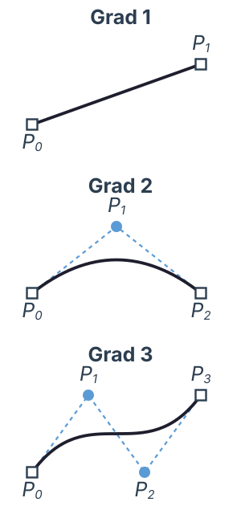
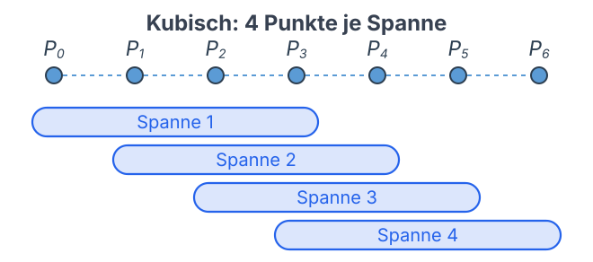
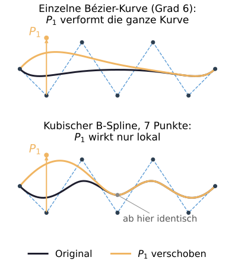
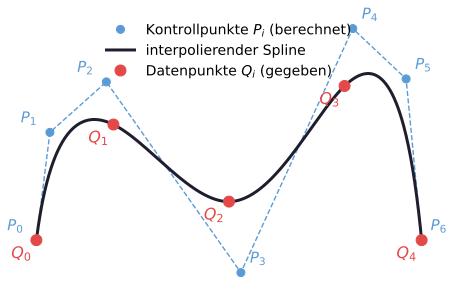
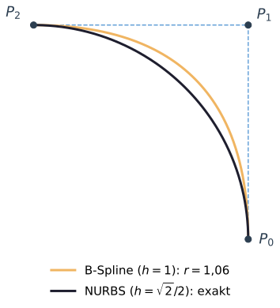
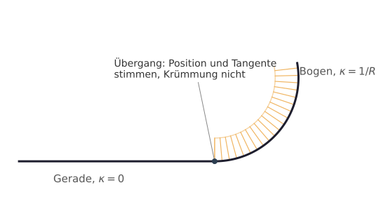

# Programmierung von CAx-Systemen

David Straub

### Gliederung

1. Einführung
2. Topologie
3. Grundformen
4. Kurven
5. **Freiformgeometrie**
6. Profile
7. Codequalität
8. Datenaustausch
9. Robustheit
10. Simulation
11. Optimierung

## Freiformgeometrie

- Von Kontrollpunkten zu Freiformkurven: Bézier → B-Spline → NURBS
- Stetigkeit: $C^0$, $G^1$, $G^2$ – und wo sie wirklich zählt
- Freiformflächen: was Loft & Co. eigentlich erzeugen

*Durchgängiges Beispiel:* das Kühlkanal-Profil – Einlass- und Auslass-Querschnitt als Spline

### Rückblick: die analytische Familie ist zu klein

Letzte Woche: schon der Versatz einer **Ellipse** war keine Ellipse mehr (`OFFSET`).

Der **Kühlkanal** des Moduls braucht ein frei geformtes Profil – über Linie, Kreis und Ellipse hinaus:

- Bisher: Profile aus analytischen Kurven
- Heute: ein frei geformtes, glattes Profil

**Frage:** Wie beschreibt man eine *beliebige* glatte Kurve mathematisch?

## Theorie A: Von Kontrollpunkten zu B-Splines

### Warum Polynome – aber niedrigen Grades?

Eine Kurve ist $\mathbf{C}(u) = (x(u), y(u), z(u))$ – welche Funktion?

| Ansatz | Problem |
|---|---|
| Lineare Interpolation | Knick an jedem Stützpunkt |
| Sinus/Kosinus | schwer zu verketten, teuer |
| Ein Polynom hohen Grades | Runge-Phänomen: Oszillation |
| **Stückweise Polynome niedrigen Grades** | ✓ flexibel, stabil, lokal steuerbar |

→ Alle Freiformkurven (Bézier, B-Spline, NURBS) sind **stückweise Polynome niedrigen Grades**.

### Der naive Weg: Potenzbasis

Koordinaten direkt als Polynom in $u$:

$$\mathbf{C}(u) = \mathbf{a}_0 + \mathbf{a}_1 u + \mathbf{a}_2 u^2 + \cdots + \mathbf{a}_n u^n$$

Unbrauchbar in der Praxis:

- **Kein geometrischer Bezug:** aus $\mathbf{a}_3$ liest man den Kurvenverlauf nicht ab
- **Numerisch empfindlich** bei hohem Grad
- **Ändern = Gleichungssystem lösen**, nicht per Hand

→ Gesucht: eine Basis, deren Parameter **selbst Punkte im Raum** sind.

### Bézier: Kontrollpunkte statt Koeffizienten



Renault, 1962 (Karosseriedesign). Kurve direkt über $n+1$ **Kontrollpunkte**:

$$\mathbf{C}(u) = \sum_{i=0}^{n} B_{i,n}(u)\, \mathbf{P}_i, \quad u \in [0,1]$$

- $B_{i,n}$: **Bernstein-Basis** – nicht-negativ, $\sum_i B_{i,n} = 1$
- $\mathbf{C}(u)$ ist eine **Konvexkombination** → Kurve liegt in der konvexen Hülle
- Läuft durch $\mathbf{P}_0$ und $\mathbf{P}_n$; Tangente in $\mathbf{P}_0$: Richtung $\mathbf{P}_1 - \mathbf{P}_0$

### Die Grenzen der einzelnen Bézier-Kurve

Eine einzelne Bézier-Kurve über *alle* Punkte hat zwei Schwächen:

- **Grad = Punktzahl − 1:** 20 Punkte → Grad 19 → numerisch instabil, wellig
- **Globale Kontrolle:** jeder Punkt beeinflusst die **ganze** Kurve – kein lokales Anpassen

### Stückweise Bézier: Übergänge von Hand

**Ausweg:** die Kurve in **Segmente** teilen, jedes ein Bézier-Stück niedrigen Grades. Aber wie glatt müssen die Übergänge sein?

| Bedingung | Effekt | fixiert |
|---|---|---|
| $C^0$ | kein Spalt | $\mathbf{a}_3 = \mathbf{b}_0$ |
| $C^1$ | glatte Tangente | + 1 Punkt |
| $C^2$ | glatte Krümmung | + 1 Punkt |

→ Bei $C^2$ sind **3 von 4** Kontrollpunkten je Segment gebunden – bei vielen Segmenten mühsam von Hand.

**Interaktiv:** [Piecewise Bézier Editor](https://davidstraub.de/teaching-apps/bezier-editor/) – Segmente ziehen und die Übergänge selbst verwalten

### Der B-Spline: überlappende Fenster



Der **B-Spline** nimmt diese Buchhaltung ab: benachbarte Spannen teilen sich alle Kontrollpunkte **bis auf einen**.

- **Eine Bézier-Kurve:** eine Spanne, jeder Punkt wirkt überall
- **Stückweise Bézier:** eigene Punkte je Spanne, jeder Übergang von Hand
- **B-Spline:** überlappende Spannen → Stetigkeit entsteht **von selbst**

→ Automatische Stetigkeit *und* lokale Kontrolle, ohne Übergangsgleichungen.

### Die B-Spline-Formel



$$\mathbf{C}(u) = \sum_{i=0}^{n} \mathbf{P}_i\, N_{i,k}(u)$$

- $\mathbf{P}_i$ – die $n+1$ **Kontrollpunkte** (die Griffe)
- $N_{i,k}(u)$ – **Basisfunktionen** der Ordnung $k$ (Grad $k-1$): das Gewicht, mit dem $\mathbf{P}_i$ beim Parameter $u$ zieht
- jede $N_{i,k}$ ist nur über ein **Fenster** ungleich null → **lokale** Kontrolle (rechts: Bézier global, B-Spline lokal)
- $\sum_i N_{i,k}(u) = 1$ → Konvexkombination wie bei Bézier

### Der Knotenvektor

Was die $N_{i,k}$ überhaupt festlegt, ist der **Knotenvektor**:

$$T = (t_0 \le t_1 \le \dots \le t_m)$$

- eine **nicht-fallende** Folge von Parameterwerten (die „Knoten"); sie teilen die Parameterachse in **Spannen** und legen fest, **wo** jede $N_{i,k}$ ihr Fenster hat
- bei einfachen Knoten: Ordnung $k$ → **$C^{k-2}$** (kubisch, $k=4$ → $C^2$, der CAD-Standard)
- **Multiplizität:** einen Knoten mehrfach setzen senkt dort die Stetigkeit; volle Multiplizität → Knick

**Interaktiv:** [B-Spline-Editor](https://davidstraub.de/teaching-apps/bspline-editor/) – Knoten-Ticks ziehen, Multiplizität erhöhen und den Knick entstehen sehen

### Interpolation: Kurve durch gegebene Punkte



Kontrollpunkte sind Hebel – die Kurve läuft an ihnen vorbei. Oft liegen die Punkte aber **fest**: gemessen, aus einer Tabelle, aus einer Formel. Dann soll die Kurve **genau hindurch**.

Das ist **Interpolation**: Zu den Datenpunkten $\mathbf{Q}_i$ löst der Kern die passenden Kontrollpunkte $\mathbf{P}_i$ – ein lineares Gleichungssystem.

Rechts: die Kurve trifft jeden Datenpunkt (rot), die dafür berechneten Kontrollpunkte (blau) liegen woanders.

## Praktikum A: Kühlkanal-Querschnitt als Spline

### Aufgabe 1: Spline durch Punkte

Legen Sie eine Kurve durch fünf frei gewählte Punkte – einmal als **Spline**, einmal als **Polyline**.

1. Trifft die Spline-Kurve den ersten und letzten Punkt exakt?
2. Wo liegt der Unterschied zwischen beiden – geometrisch und im `geomType`?

*Hinweise:* `cf.spline`, `cf.polyline`, `.geomType()`, `.positionAt(0.0)` / `.positionAt(1.0)`

### Aufgabe 2: Der Einlass-Querschnitt

Bauen Sie den Kühlkanal-Querschnitt als **geschlossene, glatte** Kurve aus etwa acht Punkten (Breite ≈ 50 mm, Höhe ≈ 14 mm) und daraus eine Fläche.

1. Prüfen Sie `IsClosed()` und den Flächeninhalt.
2. Vergleichen Sie mit `periodic=False` und dupliziertem Endpunkt: Wo entsteht der Knick?

*Hinweise:* `cf.spline(*pts, periodic=True)` – den Startpunkt am Ende **nicht** wiederholen; `cf.face`, `.IsClosed()`, `.Area()`

## Theorie B: NURBS, Stetigkeit, Flächen

### NURBS: warum ein B-Spline nicht genügt



> Kann ein B-Spline einen **exakten Kreis** darstellen?

**Nein.** Wäre $\mathbf{C}(t)$ ein Polynom mit $x(t)^2 + y(t)^2 = R^2$ für alle $t$, müssten alle nicht-konstanten Terme verschwinden – die Kurve wäre ein Punkt. Widerspruch.

**Lösung – Gewichte** $h_i > 0$ (rationale Kurve):

$$\mathbf{C}(u) = \frac{\sum_i h_i\, \mathbf{P}_i\, N_{i,k}(u)}{\sum_i h_i\, N_{i,k}(u)}$$

Viertelkreis exakt: 3 Punkte, Gewichte $1, \tfrac{\sqrt2}{2}, 1$. Rechts: gleiche Punkte, ein Gewicht – B-Spline wölbt sich, NURBS trifft den Bogen exakt.

### NURBS ist die universelle Darstellung

**Linie ⊂ Bézier ⊂ B-Spline ⊂ NURBS**

Jede analytische Kurve ist ein NURBS-Spezialfall → **einheitlicher Standard** (CATIA, SolidWorks, NX, OCCT).

| `geomType` | Bedeutung |
|---|---|
| `LINE`, `CIRCLE`, `ELLIPSE` | analytisch, exakt gespeichert |
| `BSPLINE` | Freiformkurve (B-Spline / NURBS – dieselbe Klasse) |

Beim STEP-Import erscheinen Freiformkurven als `BSPLINE`, teils sogar ursprüngliche Kreise – je nach exportierendem System.

### Stetigkeit: $C^0$, $G^1$, $G^2$



Beim Aneinanderstoßen von Kurven/Flächen zählt die Anschlussbedingung:

| Klasse | stimmt überein | sichtbar |
|---|---|---|
| $C^0$ | Position | Knick erlaubt |
| $G^1$ | Tangentenrichtung | glatt fürs Auge |
| $G^2$ | Krümmung | reflexionsglatt |

Rechts: Linie trifft Kreisbogen tangential – **$G^1$**, kein Knick. Der **Krümmungskamm** springt aber am Übergang von 0 auf $1/R$: nur $G^1$, nicht $G^2$.

### Wo Stetigkeit wirklich zählt

Nicht überall ist $G^2$ nötig – aber wo, dann hart:

| Anwendung | warum $G^2$ |
|---|---|
| Optik / Design | Lichtreflexion folgt der Krümmung – ein Sprung ist sichtbar |
| Fertigung | Fräserbahn = Versatz der Fläche – Krümmungssprung → Maßfehler |
| Aerodynamik | Grenzschicht reagiert auf Krümmungsänderung |
| Kontakt / Implantate | Spannungsspitze genau am Krümmungssprung |

Faustregel: $C^0$ für boolesche Kanten, $G^1$ für `fillet`, $G^2$ für Karosserie/Strömung.

### Von Kurven zu Flächen

Eine Fläche hat **zwei** Parameter:
$$\mathbf{S}(u, v) = \begin{pmatrix} x(u,v) \\ y(u,v) \\ z(u,v) \end{pmatrix}$$

Alles von den Kurven gilt eine Dimension höher weiter. Die **analytische Familie** (Ebene, Zylinder, Kegel, Kugel, Torus) reicht für Standardkörper – der Rest wird `BSPLINE`.

Die Normale ist $\mathbf{S}_u \times \mathbf{S}_v$ (normiert) – genau das, was `normalAt()` aus Einheit 2 berechnet.

### Was Loft erzeugt: `ruled` vs. glatt


Das **Eingangsprofil** bestimmt die Ausgabefläche. Loft hat zusätzlich eine Stetigkeits-Entscheidung:

```python
secs = [cf.wire(cf.circle(10)),
        cf.wire(cf.circle(16)).translate((0,0,25)),
        cf.wire(cf.circle(10)).translate((0,0,50))]

cf.loft(secs, ruled=True)    # ['CONE', 'CONE'] – Knick in der Mitte
cf.loft(secs, ruled=False)   # ['BSPLINE'] – eine glatte Fläche
```

`ruled=True`: gerade Verbindung, $C^0$ (Bézier-Analogon). Default glatt: eine B-Spline-Fläche über alle Schnitte.

### `fillet` ist ein Flächenerzeuger

```python
box = cf.box(50, 30, 20)
box_f = cf.fillet(box, box.edges(), 3.0)
print(sorted(set(f.geomType() for f in box_f.Faces())))
# ['CYLINDER', 'PLANE', 'SPHERE']
```

- Zylinderfläche entlang jeder gerundeten Kante, Kugelfläche in jeder Ecke
- Beide **tangential** ($G^1$) an die Ebenen – aber die Krümmung springt: nicht $G^2$

Das ist dieselbe Verrundung wie seit Einheit 1 – jetzt sehen Sie, *welche* Flächen sie erzeugt.

## Praktikum B: Auslass-Querschnitt und Kurveneigenschaften

### Aufgabe 3: Der Auslass-Querschnitt

Der Kanal verjüngt sich zum Auslass (gleichmäßige Flussverteilung). Bauen Sie einen **zweiten**, kleineren Querschnitt – gleiches Prinzip, kleinere Maße:

```python
auslass = [(22,0,0),(13,4,0),(0,5,0),(-10,3,0),
           (-15,0,0),(-10,-3,0),(0,-5,0),(13,-4,0)]
profil_auslass = cf.spline(*auslass, periodic=True)
```

1. Erzeugen Sie beide Profile (Einlass aus Aufgabe 2, Auslass hier) und legen Sie sie in verschiedene Höhen (`.translate((0,0,z))`).
2. **Damit ist der Kanal vorbereitet:** aus den beiden Querschnitten wird per Loft der verjüngte Kühlkanal – speichern Sie beide.

### Aufgabe 4: Kurveneigenschaften auslesen

1. `profil.geomType()` für Ihre Splines – und für einen Kreis (`cf.circle`). Was fällt auf?
2. Versetzen Sie das geschlossene Profil um 3 (`cf.offset2D(cf.wire(profil), 3.0)`) und lesen Sie die `geomType`-Werte der Ergebniskanten. Analytisch oder nicht?
3. *(Zusatz)* Tasten Sie `curvatureAt(t)` entlang eines Profils ab – wo ist die Krümmung am größten (Nase vs. flanke)?

## Abschluss

### Leseauftrag & Ausblick

- **Leseauftrag:** Buch Kapitel 6
- **Wer mehr will:** einen Loft der beiden Profile schon vorab probieren (`cf.loft`) – und `ruled=True` vs. `False` vergleichen
- **Nächste Woche:** Profile – Sweep und Loft: die beiden Querschnitte werden zum verjüngten Kühlkanal (Loft), der Kanal läuft als Sweep durch die Platte
- Bis dahin: `w05/` (beide Profile) committet und gepusht
