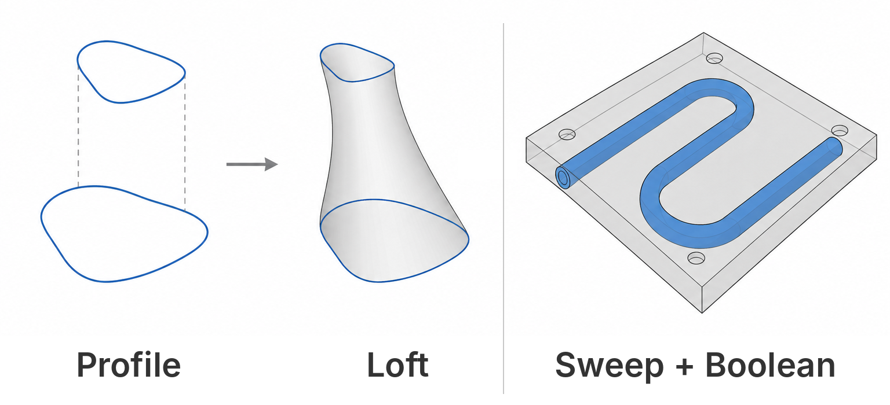
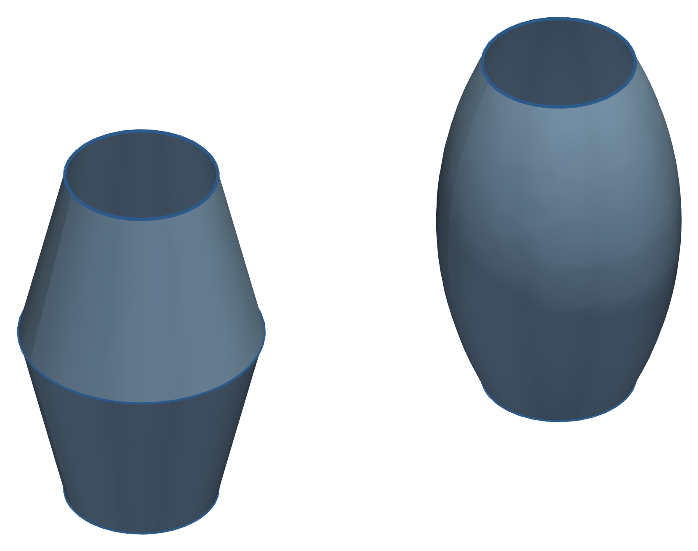
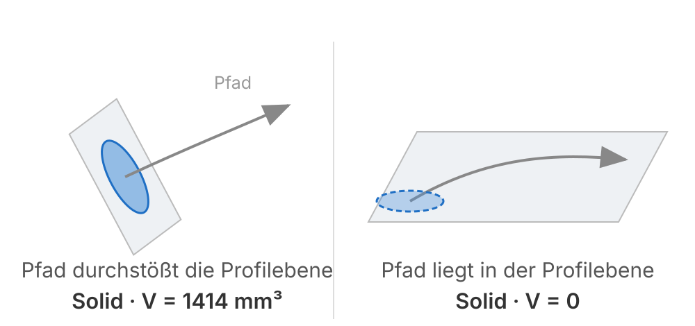
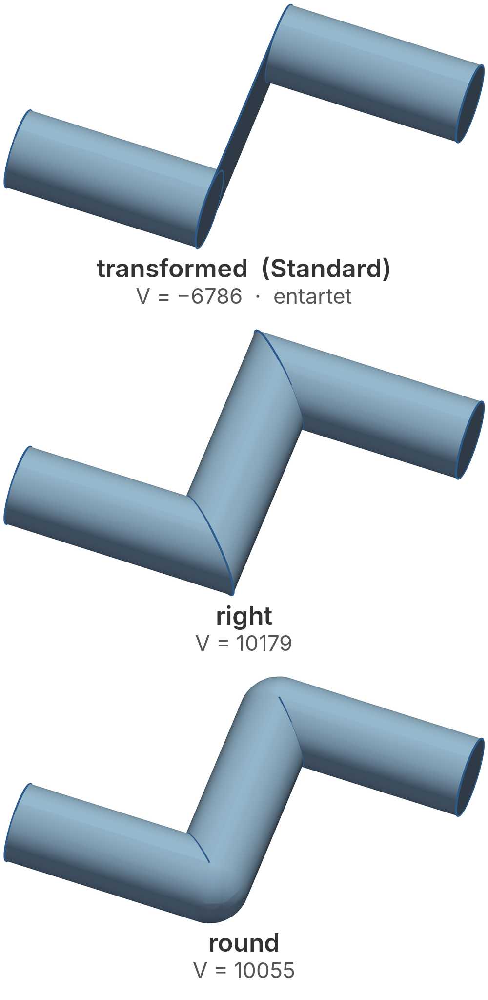
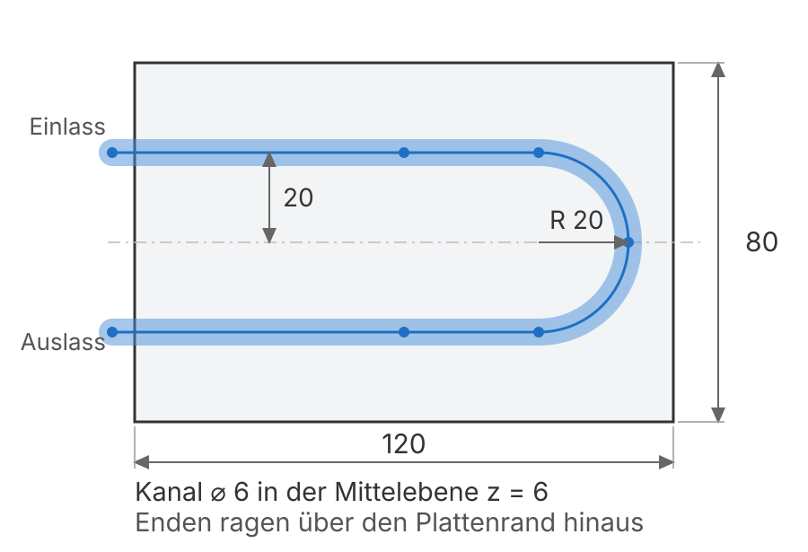

# Programmierung von CAx-Systemen

David Straub

### Gliederung

1. Einführung
2. Topologie
3. Grundformen
4. Kurven
5. Freiformgeometrie
6. **Profile**
7. Codequalität
8. Datenaustausch
9. Robustheit
10. Simulation
11. Optimierung

## Profile

- **Loft:** ein Körper zwischen zwei Profilen
- **Sweep:** ein Profil entlang eines Pfades
- **Boolean, Fillet/Chamfer:** Körper kombinieren und finishen



*Durchgängiges Beispiel:* der Kühlkanal der Cold Plate – aus den Profilen von Einheit 5 wird ein Körper, dann wandert der Kanal durch die Platte

### Rückblick: zwei Kanalprofile

Letzte Woche gebaut: **Einlass-** und **Auslass-Querschnitt** als geschlossene Splines.

Bislang sind das nur Kurven in der Ebene. Heute:

- aus den zwei Profilen wird ein **verjüngter Kanal** (Loft)
- ein konstantes Profil wandert als **Serpentine** durch die Platte (Sweep)
- der Kanal wird aus der Cold Plate **ausgeschnitten** (Boolean)

## Theorie A: Loft

### Loft: ein Körper zwischen Profilen

```python
from cadquery import func as cf

kanal = cf.loft([w_einlass, w_auslass], cap=True)
```

- `loft` interpoliert eine Fläche **zwischen** den Querschnitten
- Eingang: `Wire`s oder `Face`s in verschiedenen Ebenen
- `cap=True` schließt die Enden → ein **`Solid`**

### Shell oder Solid?


| Eingang | `cap` | Ergebnis |
|---|---|---|
| `Wire`s | `False` *(Standard)* | `Shell` |
| `Wire`s | `True` | `Solid` |
| `Face`s | beliebig | `Solid` |

Der **Standard ist `cap=False`** – aus Wires kommt ohne Zutun eine Hülle zurück, kein Volumen.

> Faustregel: `Face` rein → `Solid` raus. Wer mit `Wire`s arbeitet, setzt `cap=True`.

### Ruled vs. smooth



```python
cf.loft([w1, w2, w3], ruled=True)    # Regelflächen
cf.loft([w1, w2, w3], ruled=False)   # glatt (Standard)
```

- `ruled=True`: gerade Verbindungslinien, Knick an jedem Profil ($C^0$) – rechts die sichtbare Kante am mittleren Querschnitt
- `ruled=False`: tangentenstetiger Übergang ($C^2$), eine glatte `BSPLINE`-Fläche (Einheit 5)

### Der `cap`-Stolperstein: gültig, aber falsch

```python
solid = cf.loft([w1, w2], cap=True)    # Volumen 15932 mm³
shell = cf.loft([w1, w2], cap=False)   # Volumen  3794 mm³ (!)
print(solid.isValid(), shell.isValid())  # True True
```

- Ohne `cap` bleibt eine offene **`Shell`** – `isValid()` meldet trotzdem `True`
- Sie meldet als „Volumen“ ihre Oberfläche: `Volume()` und `Area()` liefern **dieselbe Zahl**

> `isValid()` heißt gültig, sagt aber nichts über richtig. Der verlässliche Test ist `len(Solids()) == 1`.

## Praktikum A: verjüngter Kühlkanal (Loft)

### Aufgabe 1: Die zwei Profile loften

Verbinden Sie Ihre beiden Profile aus Einheit 5 zu einem Körper – den Auslass **40 mm** über dem Einlass.

1. Erzeugen Sie den Kanal und prüfen Sie Volumen und Flächenzahl.
2. Vergleichen Sie `ruled=True` und `ruled=False` – wo sitzt der Knick?

*Hinweise:* `.translate((0, 0, 40))` hebt den Auslass an, `cf.loft([...], cap=True)`, `.Volume()`, `.Faces()`

### Aufgabe 2: Die `cap`-Falle selbst sehen

Bauen Sie denselben Loft noch einmal mit `cap=False`.

1. Was meldet `isValid()`? Was das Volumen?
2. Wie viele Faces hat die `Shell`, wie viele der `Solid` mit `cap=True`?
3. **Diskussion:** Woran würden Sie im Code merken, dass hier etwas nicht stimmt?

*Hinweise:* `.isValid()`, `.Volume()`, `.Faces()`, `.Solids()`

## Theorie B: Sweep, Boolean, Fillet

### Sweep: ein Profil entlang eines Pfades

```python
profil = cf.face(cf.circle(3)).moved(pfad.locationAt(0.0))
kanal  = cf.sweep(profil, pfad)
```

- `sweep` zieht ein **konstantes** Profil entlang einer Pfadkurve
- `pfad.locationAt(0.0)` liefert das Koordinatensystem am Pfadstart – dort quer zur Tangente
- Ein `Face` als Profil liefert einen `Solid` – dieselbe Regel wie beim Loft

### Wenn der Pfad in der Profilebene liegt



Der Pfad muss die Profilebene **durchstoßen**. Schräg genügt: 45° liefert einen sauberen Körper, nur mit schiefwinkligem Querschnitt. Läuft der Pfad dagegen **in** der Ebene, entartet der Sweep – `isValid()` ist `True`, `Solids()` hat ein Element, `Volume()` ist **0**.

### Ecken im Pfad: `transition`



```python
cf.sweep(profil, pfad, transition="round")
```

- `transformed` *(Standard)*: Gehrungsschnitt
- `right`: scharf rechtwinklig
- `round`: abgerundet

Am 90°-Knick durchdringt sich der Querschnitt beim Standard selbst und schnürt die Röhre zu. Das Volumen wird **negativ** – `isValid()` bleibt `True`. Bei engen Serpentinen ist `round` die sichere Wahl.

### Boolean und Fillet

`+`, `-`, `&` sind Union, Cut und Intersect – im Einsatz seit Einheit 1:

```python
cold_plate = plate - kanal          # Kanal aus der Platte schneiden
cold_plate = cold_plate.fillet(3.0, cold_plate.edges("|Z"))
```

Finishing (Fillet/Chamfer) kommt zuletzt – der Grund aus Einheit 3: Selektoren fragen den aktuellen Stand ab.

## Praktikum B: Serpentinen-Kanal in der Cold Plate

### Aufgabe 3: Ein gerader Kanal

Die Cold Plate ist **120 × 80 × 12 mm**. Ziehen Sie zunächst einen runden Kanal (⌀ 6 mm) **geradlinig** durch ihre Mittelebene, von Rand zu Rand.

1. Erzeugen Sie ihn; prüfen Sie `isValid()`, `len(Solids())` **und** `Volume()`.
2. Nehmen Sie einmal ein Profil in der `XY`-Ebene **ohne** Ausrichtung am Pfadstart. Was melden die drei Prüfungen jetzt?

*Hinweise:* `cf.circle` + `cf.face` für das Profil, `pfad.locationAt(0.0)` richtet es aus, `cf.sweep(profil, pfad)`

### Aufgabe 4: Die Serpentine



Ersetzen Sie den geraden Pfad durch die Serpentine rechts: zwei Spuren, eine Kehre.

1. Bauen Sie den Pfad als Spline und sweepen Sie erneut.
2. Vergleichen Sie `transition="round"` mit dem Standard.

*Hinweise:* `cf.spline(*punkte)`, Punkte entlang der Spuren und um die Kehre verteilen

### Aufgabe 5: Ausschneiden und verrunden

Schneiden Sie den Kanal aus der Cold Plate heraus.

1. Volumen vor und nach dem Schnitt – ist die Differenz plausibel?
2. Verrunden Sie die vier äußeren senkrechten Kanten.

*Hinweise:* `cf.box(120, 80, 12)`, `-`, `.fillet(r, ...edges("|Z"))`, `.Volume()`; die Kanalenden müssen über den Plattenrand **hinausragen** – ein Schnitt exakt auf der Randfläche hinterlässt Artefakte

### Aufgabe 6 *(Zusatz)*: Ein- und Auslass anschließen

Setzen Sie an die beiden Kanalenden je eine senkrechte Bohrung (Anschluss für den Kühlmittel-Schlauch).

*Hinweise:* `pfad.locationAt(1.0)` liefert das Koordinatensystem am Pfadende – daraus die Ebene für die Bohrung, wie in Einheit 3

## Abschluss

### Leseauftrag & Ausblick

- **Leseauftrag:** Buch Kapitel 7
- **Wer mehr will:** einen Multisection-Sweep bauen (Profil variiert *entlang* des Pfads) – Sweep und Loft in einer Operation
- **Nächste Woche:** Codequalität – Type Hints und Unittests für den Modul-Code: Massenbudget, Zell-Passung, CI auf Ihrem Repo
- Bis dahin: `w06/` committet und gepusht
