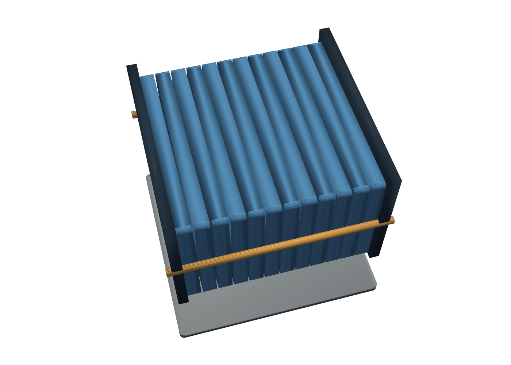

# Programmierung von CAx-Systemen

David Straub

### Gliederung

1. Einführung
2. Topologie
3. Grundformen
4. Kurven
5. Freiformgeometrie
6. Profile
7. Codequalität
8. **Datenaustausch**
9. Robustheit
10. Simulation
11. Optimierung

## Datenaustausch

- **Formate:** STEP, BREP, STL – wofür welches
- **Assembly:** Teile getrennt halten – Namen, Farben, Baum
- **BOM:** Stückliste direkt aus der Baugruppe
- **Release-Pipeline:** ein Skript erzeugt alle Liefer-Artefakte

*Durchgängiges Beispiel:* die Wochenteile werden **eine Baugruppe** – exportiert und mit Stückliste

### Rückblick: lauter Einzelteile



Sieben Wochen: Grundplatte, Zellen, Endplatten, Zuganker, Cold Plate.

Bisher haben Sie Teile mit `+` zu **einem** Körper verschmolzen. Für den Austausch muss mehr mit:

- welches Teil eine **Kaufzelle** ist und welches Eigenfertigung
- **Stückliste**, Farben und Namen

**Heute:** Teile getrennt zusammenhalten – als Baugruppe.

## Theorie A: Formate und Assembly

### Dateiformate: wofür welches

| Format | Typ | Inhalt | Einsatz |
|---|---|---|---|
| **STEP** | B-Rep | exakte Geometrie + Namen, Farben, Baum | Austausch mit anderen CAD-Systemen |
| **BREP** | B-Rep | exakte Kernel-Geometrie, roh | Zwischenspeichern (Eigenbedarf) |
| **STL** | Mesh | Dreiecksnetz, verlustbehaftet | 3D-Druck, FEM |

> **B-Rep** hält exakte Kurven und Flächen; **Mesh** nähert sie durch Dreiecke an.

### STEP – der Industriestandard

**ISO 10303** – universeller Austausch für CAD-Daten:

- Exakte Geometrie (Kurven, Flächen, Volumen)
- **Produktstruktur:** Baugruppe mit Unterkomponenten
- **Metadaten:** Farben, Namen, Einheiten

Alle professionellen Systeme lesen STEP (FreeCAD, Fusion 360, CATIA, NX). Faustregel: STEP, wenn das Modell woanders weiterbearbeitet wird.

### Assembly: Teile getrennt halten

Ein `+` verschmilzt Körper zu einem. Eine **Baugruppe** hält sie getrennt – jedes Teil mit Name, Farbe und Platz im Baum:

```python
import cadquery as cq
from cadquery import func as cf
```

`cq.Assembly` und `cq.Color` liegen im **Top-Level** `cadquery`, nicht in `cadquery.func` – es ist eine **Struktur-Ebene über** den Shapes, keine neue Geometrie-Operation.

### Baugruppe bauen

```python
def modul(p: ModulParam) -> cq.Assembly:
    assy = cq.Assembly(name="pouch_modul")
    assy.add(grundplatte, name="grundplatte", color=cq.Color("gray"))
    zelle = zelle_bauen(p)
    for i in range(p.n_zellen):
        loc = cf.Location((0, 0, 10 + i * (p.zell_t + p.spacer)))
        assy.add(zelle, name=f"zelle_{i}", color=cq.Color("steelblue"), loc=loc)
    return assy
```

- `add(shape, name=, color=, loc=)` hängt ein Teil in den Baum
- Die Zellen kommen per **Schleife** über `Location`s – dasselbe Muster wie beim Stapel

### Verschachteln: Modul → Pack

Ein Kind einer Baugruppe darf selbst eine Baugruppe sein – der Baum ist wörtlich gemeint:

```python
def pack(p: ModulParam, n_module: int = 2) -> cq.Assembly:
    packung = cq.Assembly(name="pack")
    for i in range(n_module):
        packung.add(modul(p), name=f"modul_{i}", loc=cf.Location((0, i * 130, 0)))
    return packung

print([c.name for c in pack(ModulParam()).children])   # ['modul_0', 'modul_1']
```

Die Lage komponiert **den Baum hinab**: jedes Modul wird einmal platziert, seine Zellen bleiben relativ dazu.

## Praktikum A: das Modul als Baugruppe

### Aufgabe 1: Baugruppe aus den Wochenteilen

Bauen Sie `modul(p)` als Baugruppe mit allen Teilen der letzten Wochen: Grundplatte, 12 Zellen, 2 Endplatten, 4 Zuganker, Cold Plate.

1. Jedes Teil mit sprechendem Namen und eigener Farbe.
2. `len(assy.children)` – stimmt die Teilezahl?

*Hinweise:* `cq.Assembly(name=...)`, `.add(shape, name=, color=cq.Color(...), loc=)`, die Zellen per Schleife über `cf.Location`

### Aufgabe 2: STEP exportieren

Exportieren Sie die Baugruppe nach `w08/pouch_modul.step` und öffnen Sie die Datei in FreeCAD.

1. Sind Namen und Farben erhalten?
2. Erscheint der Baum mit allen Teilen?

*Hinweise:* `assy.export(pfad)`; FreeCAD ist frei installierbar (freecad.org) – zum Prüfen, nicht zum Modellieren

## Theorie B: BOM, Caching, Release

### BOM: Stückliste aus der Baugruppe

Die Baugruppe **ist** die Stückliste – man muss sie nur auszählen. `Counter` zählt gleiche Werte:

```python
from collections import Counter

# Namen heißen "zelle_0", "zelle_1", … – der Teil vor dem "_" ist der Typ:
typen = [c.name.split("_")[0] for c in assy.children]
bom = Counter(typen)              # {"zelle": 12, "endplatte": 2, ...}

for typ, anzahl in bom.items():
    print(f"{anzahl}x  {typ}")
```

```
1x  grundplatte
12x  zelle
2x  endplatte
4x  zuganker
1x  coldplate
```

`"zelle_3".split("_")` ergibt `["zelle", "3"]`, `[0]` nimmt das erste Stück. Die Stückliste entsteht **aus dem Modell** – sie kann nicht veralten.

### BREP: schnell und verlustfrei – für sich selbst

```python
koerper.exportBrep("stapel.brep")
wieder = cf.Shape.importBrep("stapel.brep")
```

- **BREP** ist das rohe Dateiformat des Kernels; **B-Rep** die Darstellung darin (Kanten + Flächen)
- Speichert diese Struktur **direkt** – keine Konvertierung, kein Rundungsfehler
- **Kein** Industriestandard → nur für den Eigenbedarf: teure Zwischenergebnisse zwischenspeichern

### STL: das Netz für Druck und FEM

```python
assy.export("modul.stl", tolerance=0.1)
```

- `assy.export` erkennt am Suffix, welches Format – `.step` wie `.stl`
- Dreiecksnetz – die exakte Geometrie geht dabei verloren
- Ziel für **3D-Druck** und **FEM-Vernetzung**; wie fein, entscheidet sich beim Simulieren

### Release-Pipeline: alles aus einem Aufruf

Ein Skript erzeugt reproduzierbar **alle** Liefer-Artefakte – jede Zeile ein Aufruf, den Sie schon kennen:

```python
def release(p: ModulParam, ordner: str) -> None:
    assy = modul(p)
    assy.export(f"{ordner}/modul.step")     # Austausch
    assy.export(f"{ordner}/modul.stl")      # Druck
    schreibe_bom(assy, f"{ordner}/bom.csv") # Stückliste (aus Aufgabe 3)
```

Aus einem Parametersatz fällt ein vollständiges, konsistentes Paket – der nächste Schritt nach der CI aus Einheit 7.

## Praktikum B: Stückliste und Release

### Aufgabe 3: BOM erzeugen

Schreiben Sie `schreibe_bom(assy, pfad)` – die Funktion, die Aufgabe 4 wieder aufgreift.

1. Zählen Sie die Teile Ihrer Baugruppe mit `Counter` aus.
2. Ergänzen Sie je Teil **Material** und **Masse** (Dichte × Volumen) – schreiben Sie die BOM als CSV.

*Hinweise:* `import csv`, dann `csv.writer(open(pfad, "w", newline=""))` und `.writerow([...])` je Zeile; Dichten in einem `dict` je Materialname

### Aufgabe 4: Release-Funktion

Fassen Sie STEP, STL und Ihre BOM aus Aufgabe 3 zu einer Funktion `release(p, ordner)` zusammen. Der eigentliche Test ist die **Reproduzierbarkeit**:

1. Rufen Sie `release` für zwei `ModulParam`-Varianten auf (`n_zellen=12` und `16`) in getrennte Ordner.
2. Vergleichen Sie die zwei `bom.csv`: unterscheidet sich nur die Zellzahl, oder auch anderes?
3. Löschen Sie einen Ordner und erzeugen Sie ihn neu – sind die Dateien identisch?

### Aufgabe 5 *(Zusatz)*: Platzierung lösen statt rechnen

Lassen Sie die Zell-Höhe vom Solver bestimmen: Grundplatte und eine Zelle mit Platzhalter-Position in eine Baugruppe legen, die Zell-Unterseite mit der Plattenoberseite verknüpfen, lösen.

*Hinweise:* `flaeche = platte.faces(">Z")`, dann `.constrain("platte", flaeche, "zelle", zelle.faces("<Z"), "Plane")`, `.solve()`; die Lage danach über `next(c for c in paar.children if c.name == "zelle").loc`

## Abschluss

### Leseauftrag & Ausblick

- **Leseauftrag:** Buch Kapitel 9
- **Wer mehr will:** die Baugruppe zu einem `pack()` aus mehreren Modulen verschachteln und exportieren
- **Nächste Woche:** Robustheit – wenn Parameter das Modell sprengen: stille Kernel-Fehler, `isValid()` vs. richtig, Validierung vor dem Bauen
- Bis dahin: `w08/` (Baugruppe + STEP + BOM) committet und gepusht
