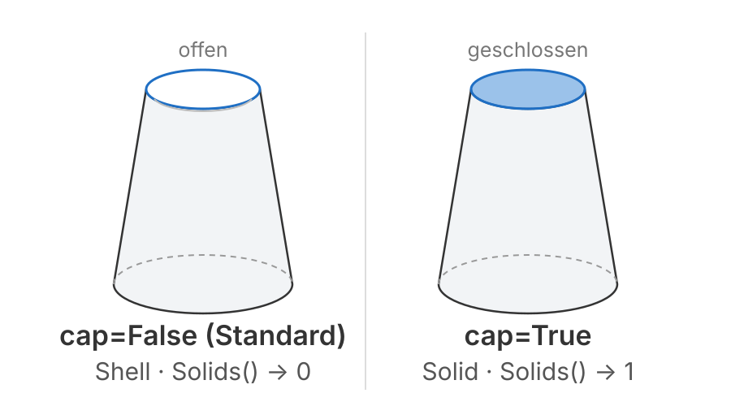
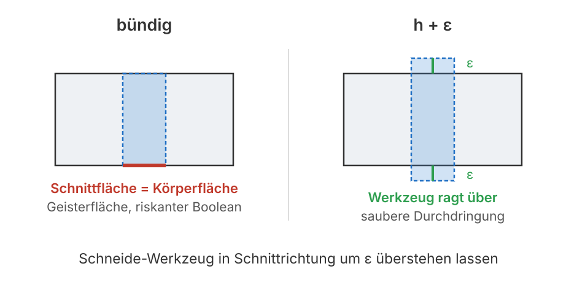
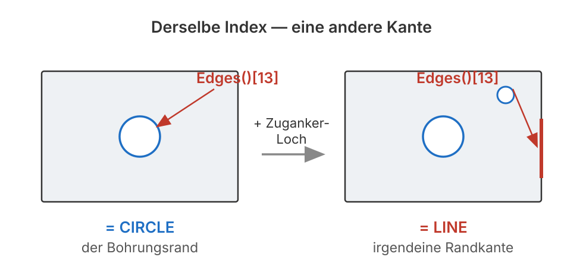
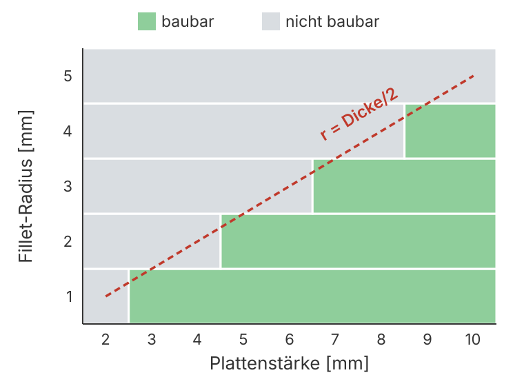

# Programmierung von CAx-Systemen

David Straub

### Gliederung

1. Einführung
2. Topologie
3. Grundformen
4. Kurven
5. Freiformgeometrie
6. Profile
7. Codequalität
8. Datenaustausch
9. **Robustheit**
10. Simulation
11. Optimierung

## Robustheit

- **Eingaben prüfen,** bevor der Kernel läuft
- **Stilles Kernel-Versagen:** gültig ist nicht richtig
- **Topological Naming Problem:** Selektoren statt Indizes
- **`assert` vs. `raise`**

*Durchgängiges Beispiel:* das Modul so härten, dass ein Parameter-Sweep durchläuft – die Grundlage für die Optimierung nächste Woche

### Rückblick: das Modell hält nur bei „schönen“ Werten

Acht Wochen Modul-Code – gebaut mit sinnvollen Maßen. Was passiert an den Rändern?

```python
endplatten(replace(p, plattenstaerke=0))    # entartete Geometrie
endplatten(replace(p, plattenstaerke=-4))   # negatives Maß
stapel_bauen(replace(p, n_zellen=0))         # leerer Stapel
```

Interaktiv: Fehler sehen, korrigieren, weiter. Im **Sweep** (gleich) oder **Optimierer** (nächste Woche): eine einzige Exception stoppt den ganzen Lauf.

## Theorie A: Validierung und stilles Versagen

### Eingaben zuerst prüfen: `if` / `raise`

Ungültige Parameter **vor** dem ersten Kernel-Aufruf abfangen:

```python
def endplatten(p: ModulParam) -> Shape:
    if p.plattenstaerke <= 0:
        raise ValueError(f"plattenstaerke muss > 0 sein, war {p.plattenstaerke}")
    if p.n_zellen < 1:
        raise ValueError(f"n_zellen muss >= 1 sein, war {p.n_zellen}")
    ...
```

Eine frühe, klare Meldung ersetzt eine kryptische OCCT-Ausnahme zehn Zeilen später.

### Geometrische Grenzen: weich kappen

Ein zu großer Fillet-Radius sprengt die Platte – hier hilft **Kappen** statt Ablehnen:

```python
plate = cf.box(160, 118, 8)
plate.fillet(5.0, plate.edges(">Z or <Z")).isValid()   # False – r > Dicke/2!
plate.fillet(3.5, plate.edges(">Z or <Z")).isValid()   # True

fillet_r = min(fillet_r, p.plattenstaerke * 0.45)      # bleibt immer baubar
```

- **Weich kappen** bei geometrisch motivierten Grenzen ($r < \text{Dicke}/2$)
- **Ablehnen** (`raise`) bei physikalisch sinnlosen Werten (negative Maße)

Das `0.45` ist eine Sicherheitsmarge unter der theoretischen Grenze $0{,}5 \cdot \text{Dicke}$, bei der der Fillet tangential zu sich selbst wird.

### Stilles Kernel-Versagen: gültig ≠ richtig



Der Kernel wirft manchmal **kein** Exception – und liefert trotzdem keinen Körper:

```python
schale = cf.loft([w_ein, w_aus], cap=False)
schale.isValid()        # True
len(schale.Solids())    # 0  ← Shell, kein Solid

leer = zelle & nachbar  # nicht überlappend
len(leer.Solids())      # 0  ← leerer Boolean, Volume 0
```

Die `cap`-Falle aus Einheit 6 und der leere Boolean sehen beide „gültig“ aus.

### Der Guard: auf einen Solid bestehen

```python
def sicher(shape: Shape) -> Solid:
    solids = shape.Solids()
    assert len(solids) == 1, "kein eindeutiger Volumenkörper"
    return solids[0]
```

- `isValid()` prüft **topologische Konsistenz** – nicht, ob ein Volumen existiert
- `len(Solids()) == 1` fängt Shell, leeren Boolean und entartete Loft ab

### Koinzidente Flächen: `h + ε`



Liegt eine Schnittfläche **exakt** auf einer Körperfläche, ist mehrdeutig, was Innen und Außen ist – der Kernel erzeugt Geisterflächen oder einen fehlerhaften Boolean.

**Regel:** Bohrer und Kanäle in Schnittrichtung mit `h + ε` überstehen lassen – dann trennt ein klarer Abstand die Flächen.

Denselben Konflikt regelt auch der **Toleranz-Parameter** der Booleschen Operationen:

```python
cf.cut(platte, kanal, tol=0.0)   # Standard: exakt rechnen
```

`tol` legt fest, ab wann zwei Flächen als deckungsgleich gelten. `h + ε` ist die robustere Lösung – man umgeht den Grenzfall, statt ihn auszuhandeln.

## Praktikum A: das Modul härten

### Aufgabe 1: die Ränder ausprobieren

Rufen Sie Ihre Funktionen mit Grenzwerten auf und notieren Sie, was passiert:

| Aufruf | Beobachtung |
|---|---|
| `endplatten(replace(p, plattenstaerke=0))` | |
| `endplatten(replace(p, plattenstaerke=-4))` | |
| `stapel_bauen(replace(p, n_zellen=0))` | |
| Fillet mit `r = plattenstaerke` | |

### Aufgabe 2: Eingaben absichern

Ergänzen Sie `if`/`raise` und den Solid-Guard:

1. `plattenstaerke <= 0`, `zell_t <= 0`, `n_zellen < 1` → je ein `ValueError`.
2. Fillet-Radius weich kappen: `min(r, plattenstaerke * 0.45)`.
3. Nach jedem Loft/Boolean: `sicher(...)` – auf genau einen Solid bestehen.

## Theorie B: Naming Problem, `assert` vs. `raise`, Sweep

### Topological Naming Problem



Ein fester Index meint nicht „diese Kante“, sondern „was gerade an Position 13 steht“:

```python
teil = endplatte - bohrung
teil.Edges()[13].geomType()          # CIRCLE – der Bohrungsrand
```

Kommt ein **zusätzliches Loch** dazu – eine ganz gewöhnliche Revision –, baut der Kernel die Topologie neu auf und nummeriert um:

```python
teil = endplatte - bohrung - zuganker_loch
teil.Edges()[13].geomType()          # LINE – jetzt eine Randkante!
```

Kein Fehler, keine Warnung. Ein Fillet auf `Edges()[13]` träfe nun die falsche Kante.

### Lösung: die Kante beschreiben, nicht abzählen

Statt einer Position sagt man, **was** die Kante ist – das überlebt jede Umnummerierung:

```python
teil.edges(">Z and %CIRCLE")     # obere Kreiskanten – egal an welcher Position
```

Gibt es mehrere gleichartige Kanten (Zuganker- neben Zell-Bohrung), hilft ein Selektor-Objekt aus `cadquery.selectors`:

```python
from cadquery.selectors import RadiusNthSelector

teil.faces(">Z").edges(RadiusNthSelector(-1))   # die Kreiskante mit dem größten Radius
```

`RadiusNthSelector(-1)` wählt nach Radius-Rang – findet also die größte Bohrung, egal wie viele kleine dazukommen.

> **Vorsicht:** `edges(...)` gibt bei *einem* Treffer eine einzelne `Edge` zurück, bei mehreren ein `Compound`. Für `fillet` sicher in `list(...)` verpacken.

### `assert` oder `if` / `raise`?

| Einsatz | Mittel |
|---|---|
| **Sanity-Check:** Invariante, die bei fehlerfreiem Code *nie* bricht | `assert` |
| **Fehlerbehandlung:** ungültige Eingaben, externe Bibliotheken | `if` / `raise ValueError` |

`assert` ist mit `python -O` **abschaltbar** – ein Werkzeug für die Entwicklung, kein Schutz für Nutzereingaben. `len(Solids()) == 1` ist ein Sanity-Check (bei validen Eingaben *muss* es stimmen); `plattenstaerke > 0` ist Eingabeprüfung → `raise`.

### Ein Sweep, der überlebt

Statt beim ersten Fehler zu sterben, prüft eine Funktion jeden Parametersatz und meldet nur baubar / nicht baubar:

```python
def ist_baubar(p: ModulParam) -> bool:
    try:
        modul = stapel_bauen(p) + endplatten(p)
        return modul.isValid() and len(modul.Solids()) >= 1 and modul.Volume() > 0
    except Exception:
        return False

for n in range(0, 20):
    print(n, "ok" if ist_baubar(replace(basis, n_zellen=n)) else "—")
```

Der `try/except` + die drei Checks machen die Funktion **sweep-fest** – genau das braucht der Optimierer nächste Woche.

## Praktikum B: robuster Sweep

### Aufgabe 3: das Naming Problem auslösen und beheben

1. Bauen Sie `endplatte - bohrung` und finden Sie den Index, unter dem der Bohrungsrand steht (`geomType() == "CIRCLE"`).
2. Fügen Sie ein **zweites Loch** hinzu (Zuganker). Zeigt derselbe Index noch auf den Bohrungsrand?
3. Ersetzen Sie den Index durch `edges(">Z and %CIRCLE")` – bleibt die Auswahl jetzt stabil, wenn Sie das zweite Loch wieder entfernen?

*Hinweise:* `[e.geomType() for e in teil.Edges()]` zeigt alle Kanten; Auswahl für `fillet` in `list(...)` verpacken

### Aufgabe 4: den gültigen Bereich abtasten



Verrunden Sie die **Deck- und Bodenkanten** der Endplatte (`edges(">Z or <Z")`) und tasten Sie mit `ist_baubar` zwei Parameter ab: Plattenstärke (2 … 10 mm) und Fillet-Radius (1 … 5 mm).

1. Zeichnen Sie die Karte baubar / nicht baubar.
2. Deckt sich die Grenze mit der Regel $r < \text{Dicke}/2$?

*Hinweise:* verschachtelte Schleifen über beide Wertebereiche, `dataclasses.replace`, im Check `try/except` + `isValid()` + `Solids()`

### Aufgabe 5 *(Zusatz)*: Checkliste anwenden

- Eingaben zuerst (`if`/`raise` vor dem ersten Kernel-Aufruf)
- Keine festen Indizes – geometrische Selektoren
- Werkzeug überragen lassen (`h + ε`)
- Parameter weich kappen statt crashen
- Ergebnis prüfen (`len(Solids()) == 1`, `Volume() > 0`)

## Abschluss

### Leseauftrag & Ausblick

- **Leseauftrag:** Buch Kapitel 5 und 8
- **Wer mehr will:** `ist_baubar` als Test aus Einheit 7 formulieren – der gültige Bereich wird zur Regression
- **Nächste Woche:** Simulation – aus dem Solid wird ein FEM-Netz; die Endplatte unter dem Quelldruck der Zellen
- Bis dahin: `w09/` (gehärtetes Modul + Sweep) committet und gepusht
