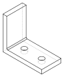
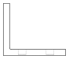

# Programmierung von CAx-Systemen

David Straub

### Gliederung

1. Einführung
2. Topologie
3. Geometrie
4. Modellierungsstrategien
5. Datenaustausch
6. Meshing & Simulation
7. **Parametrische Robustheit & Optimierung**

## Parametrische Robustheit & Optimierung

- **Parametrische Robustheit:** Modelle, die bei ungültigen Parametern nicht abstürzen
- **Optimierungsproblem:** Design-Variablen, Zielfunktion, Nebenbedingungen
- **Algorithmen:** `scipy.optimize` für CAD-Anwendungen
- **Vollständiger Workflow:** von Parametern zum optimalen Bauteil

## Parametrische Robustheit

### Das Problem: Topologische Instabilität

Ein parametrisches Modell kann bei bestimmten Parameterwerten **versagen**:

```python
def rundzelle(r_aussen, wandstaerke, hoehe):
    aussen = bd.Cylinder(radius=r_aussen, height=hoehe)
    innen  = bd.Cylinder(radius=r_aussen - wandstaerke, height=hoehe)
    return aussen - innen

rundzelle(9.0, 2.0,  65)   # ✓ funktioniert
rundzelle(9.0, 9.5,  65)   # ✗ r_innen < 0 → Fehler
rundzelle(9.0, 0.0,  65)   # ✗ wandstaerke = 0 → entartete Geometrie
rundzelle(9.0, 2.0, -10)   # ✗ negative Höhe
```

**Im interaktiven Betrieb:** Fehlermeldung → manuell korrigieren → weiter.
**Im Optimierungsloop:** Eine Exception stoppt den gesamten Lauf.

### Ungültige Parameter abfangen

Ungültige Parameter **vor** der Modellierung abfangen:

```python
def rundzelle(r_aussen: float, wandstaerke: float, hoehe: float) -> bd.Part:
    if wandstaerke <= 0:
        raise ValueError(f"wandstaerke muss > 0 sein, ist {wandstaerke}")
    if r_aussen - wandstaerke <= 0.5:
        raise ValueError(f"Innenradius zu klein: {r_aussen - wandstaerke:.2f} mm")
    if hoehe <= 0:
        raise ValueError(f"hoehe muss > 0 sein, ist {hoehe}")

    aussen = bd.Cylinder(radius=r_aussen, height=hoehe)
    # +1: überragt → keine koinzidenten Flächen
    innen  = bd.Cylinder(radius=r_aussen - wandstaerke, height=hoehe + 1)
    return aussen - innen
```

→ Frühe, klare Fehlermeldung statt kryptischer OCCT-Ausnahme.

### Konstruktive Absicherung

Nicht jeden Grenzwert prüfen – Parameter im Code **weich kappen**:

```python
def rundzelle(r_aussen, wandstaerke, hoehe, fasen_radius=1.0):
    fasen_radius = min(fasen_radius, wandstaerke * 0.45)  # kein Crash bei zu großem Radius
    ...
```

Der Optimierer bleibt immer im validen Bereich – der Parameter klebt an der geometrisch möglichen Grenze statt eine Exception zu werfen.

→ Sinnvoll bei geometrisch motivierten Grenzen (`fillet_radius < wandstaerke / 2`).  
→ Nicht für physikalisch sinnlose Werte – negative Maße immer explizit ablehnen (`if/raise`).

### Weitere Quellen für Instabilität

| Parameterwert | Symptom |
|---------------|---------|
| `fillet_radius > wandstaerke / 2` | Verrundung kann nicht erzeugt werden |
| Bohrungstiefe > Körperhöhe | Durchgangsbohrung statt Sackloch |
| `r_aussen - wandstaerke ≤ 0` | Innenkörper größer als Außenkörper |
| Pfad-Krümmungsradius < Querschnittsbreite | Sweep degeneriert (Innenseite faltet sich) |
| Bool'sche Op auf tangentialen Flächen | Numerisch instabiles Ergebnis |

→ OCCT gibt nicht immer eine saubere Fehlermeldung – manchmal entsteht stilles Fehlverhalten.

*Koinzidente Flächen:* Liegt die Schnittfläche exakt auf einer Körperfläche, entstehen durch Fließkomma-Ungenauigkeiten des CAD-Kerns „Geisterflächen”. Gegenmittel: das Werkzeug in Schnittrichtung immer **überragen lassen**.

### Das „Topological Naming Problem“

Parametrische Änderungen können die **Indexreihenfolge** von Kanten und Flächen verschieben:

```python
# ✗ fragil – edges()[3] ist heute die Oberkante, nach Parameteränderung eine andere
bauteil = fillet(bauteil.edges()[3], radius=1.0)
```

OCCT vergibt topologische IDs bei jeder Neuberechnung intern neu.

**Lösung:** geometrische Selektoren statt fester Indizes:

```python
# ✓ robust – immer die geometrisch oberste Kante, unabhängig von der Indexreihenfolge
oberkante = bauteil.edges().sort_by(Axis.Z).last
bauteil   = fillet(oberkante, radius=1.0)
```

### Stilles Kernel-Versagen

Parameter können gültig sein, aber OCCT trotzdem **lautlos ein leeres Compound** zurückgeben – kein Exception, trotzdem kaputtes Ergebnis (z. B. bei tangentialen Boole'schen Operationen).

```python
    ergebnis = aussen - innen
    solids = ergebnis.solids()
    assert len(solids) == 1, "Boolean-Operation hat keinen Solid erzeugt"
    return solids[0]
```

Bool'sche Operationen geben in build123d ein `Compound` zurück – `.solids()` extrahiert die enthaltenen Körper. Ein leeres Compound liefert eine leere Liste → `assert len == 1` fängt stilles Kernel-Versagen ab (→ Einheit X3).

### `assert` — Werkzeug für Invarianten

`assert expr, "msg"` ist eine Abkürzung für:

```python
if __debug__:
    if not expr:
        raise AssertionError("msg")
```

`__debug__` ist normalerweise `True`, mit `python -O` wird es `False`. `assert` ist **bewusst deaktivierbar** — es ist ein Werkzeug für Entwicklung und Debugging, nicht für Laufzeitfehler im Produktivbetrieb.

### Wann `assert`, wann `if/raise`?

| Einsatz | Mittel |
|---------|--------|
| **Sanity-Check:** Invariante, die bei fehlerfreiem Code *nie* verletzt wird | `assert` |
| **Fehlerbehandlung:** Fehler durch Eingaben, externe Bibliotheken, Laufzeitbedingungen | `if/raise ValueError` |

`assert len(solids) == 1` ist ein Sanity-Check: bei validen Eingaben *weiß* man, dass genau ein `Solid` herauskommen muss — schlägt es fehl, liegt ein Bug im eigenen Code vor.

Soll die Prüfung auch im Produktivbetrieb sicher feuern: `if not isinstance(ergebnis, bd.Solid): raise ValueError(...)`.

### Fail-Fast im Optimierungsloop

Kernel-Operationen kosten **Sekunden** – arithmetische Checks kosten **Nanosekunden**.

| Schritt | Mittel | Kosten |
|---------|--------|--------|
| 1. Eingabevalidierung | `if/raise` | ~0 |
| 2. Geometrieerzeugung & Boolean | Kernel (OCCT) | Sekunden |
| 3. Ergebnisvalidierung | `assert` / `if/raise` | ~0 |

→ Ungültige Parameter werden abgefangen, bevor der Kernel überhaupt gestartet wird.

### Checkliste: Robustes parametrisches Modell

- **Eingaben zuerst** – `if/raise` vor dem ersten OCCT-Aufruf
- **Keine festen Indizes** – geometrische Selektoren statt `edges()[3]`
- **Werkzeug überragen lassen** – bei Boolean-Subtraktion `height + ε` verwenden
- **Parameter weich kappen** – `min(radius, wandstaerke * 0.45)` statt crashen
- **Ergebnis prüfen** – `isinstance(ergebnis, bd.Solid)` nach Boolean-Operationen

## Einschub: Dataclasses

### Parametersatz als Typ

Parametrische Modelle haben oft viele Parameter, die man als Einheit behandeln will – speichern, vergleichen, leicht variieren:

```python
# Variante mit anderer Höhe → alle Argumente wiederholen
rundzelle(r_aussen=9.0, wandstaerke=2.0, hoehe=65)
rundzelle(r_aussen=9.0, wandstaerke=2.0, hoehe=50)
```

```python
from dataclasses import dataclass, replace

p_basis    = RundzellParam(r_aussen=9.0, wandstaerke=2.0, hoehe=65)
p_variante = replace(p_basis, hoehe=50)   # Kopie, nur hoehe geändert

rundzelle(p_basis)
rundzelle(p_variante)
```

Dataclass: Parametersatz als **Typ** – speicherbar, vergleichbar, variierbar.

### `@dataclass` – Syntax

```python
from dataclasses import dataclass, replace

@dataclass
class RundzellParam:
    r_aussen:    float = 9.0  # Typannotation Pflicht; Standardwert optional
    wandstaerke: float = 2.0
    hoehe:       float = 65.0

p  = RundzellParam(r_aussen=12.0)  # Rest: Defaults
p2 = replace(p, hoehe=50)          # Kopie mit einer Änderung

p.r_aussen   # 12.0
print(p)     # RundzellParam(r_aussen=12.0, wandstaerke=2.0, hoehe=65.0)
```

## Praktikum: Parametrische Robustheit

### L-Halter




```python
@dataclass
class LHalterParam:
    laenge:           float = 80.0
    breite:           float = 40.0
    dicke_h:          float = 5.0
    hoehe_v:          float = 60.0
    dicke_v:          float = 5.0
    r_bohrung:        float = 4.0
    t_bohrung:        float = 4.0
    abstand_bohrung:  float = 40.0
    r_vr:             float = 2.0

def l_halter(p: LHalterParam) -> bd.Solid: ...
```

Horizontaler und vertikaler Flansch, zwei Sacklöcher, Verrundung an der Innenecke.

### Aufgabe 1: Grundmodell

Implementieren Sie `l_halter(p: LHalterParam)` in build123d.

Testen Sie danach – was beobachten Sie?

| Aufruf | Beobachtung |
|--------|-------------|
| `LHalterParam()` | |
| `LHalterParam(dicke_h=0)` | |
| `LHalterParam(r_bohrung=25)` | |
| `LHalterParam(t_bohrung=9)` | |

### Aufgabe 1: Hinweise

- `bd.Box(laenge, breite, hoehe)` — Mittelpunkt im Ursprung
- `bd.Pos(x, y, z) * körper` — verschiebt den Körper (nur Positionsargumente, keine Keywords)
- Sacklöcher: Zylinder mit `height = p.t_bohrung + 1` — Werkzeug soll nach oben überragen
- Bohrpositionen: symmetrisch um die Mittelachse, Abstand `p.abstand_bohrung` → bei `x = ±p.abstand_bohrung / 2`

*Frage:* Was passiert bei `LHalterParam(t_bohrung=9)`? Öffnen Sie das Modell im Viewer.

### Aufgabe 2: Modell absichern

Ergänzen Sie `l_halter` um **Gültigkeitsprüfungen** – jede kritische Bedingung soll einen `ValueError` werfen:

| Bedingung | Problem |
|-----------|---------|
| `p.dicke_h <= 0` oder `p.dicke_v <= 0` | entartete Geometrie |
| `p.hoehe_v <= 0` | kein vertikaler Flansch |
| `p.r_bohrung >= p.breite / 2` | Bohrung breiter als Bauteil |
| `p.t_bohrung > p.dicke_h` | Sackloch wird Durchgangsbohrung |
| `p.abstand_bohrung > p.laenge - 2·p.r_bohrung` | Bohrung außerhalb des Flansches |

### Aufgabe 2 *(Forts.)*

Ergänzen Sie außerdem:

2. **`assert isinstance`** nach der Boolean-Vereinigung der Flansche
3. **Koinzidente Flächen** zwischen den Flanschen beseitigen

### Aufgabe 2: Hinweis – Koinzidente Flächen

Liegt die Unterkante von `v` exakt auf der Oberkante von `h`, entstehen durch Fließkomma-Ungenauigkeiten „Geisterflächen".

Gegenmittel: `v` leicht in `h` hineinragen lassen — selbes Prinzip wie `height = t_bohrung + 1` bei den Sacklöchern.

### Aufgabe 3: Verrundung *(Zusatz)*

Fügen Sie eine Verrundung an der Innenecke hinzu.

Zunächst mit festem Index:
```python
halter = bd.fillet(halter.edges()[?], radius=p.r_vr)
```
Variieren Sie `p.dicke_v`: 3 mm, 8 mm, 15 mm. Was passiert?

### Aufgabe 3: Verrundung *(Zusatz, Forts.)*

Beheben Sie das Topological Naming Problem mit geometrischen Selektoren:

- `filter_by(Axis.Y)` — nur Y-parallele Kanten
- `group_by(Axis.Z)` — nach Höhe gruppieren
- `sort_by(Axis.X)` — innerhalb einer Gruppe nach X sortieren

Hinweis: `bd.fillet()` gibt `Part` zurück, nicht `Solid` — extrahieren Sie das erste Solid.

## Optimierung

### Design-Variablen, Zielfunktion, Nebenbedingungen

Jedes Optimierungsproblem besteht aus drei Bestandteilen:

| Begriff | Bedeutung | Beispiel |
|---------|-----------|----------|
| **Design-Variablen** $\mathbf{x}$ | Was darf der Optimierer ändern? | Radius, Wandstärke, Höhe |
| **Zielfunktion** $f(\mathbf{x})$ | Was soll minimiert werden? | Materialvolumen |
| **Nebenbedingungen** | Was muss erfüllt bleiben? | Mindestinnenvolumen |

$$\min_{\mathbf{x}} \; f(\mathbf{x}) \quad \text{sodass} \quad \underbrace{g_i(\mathbf{x}) \leq 0}_{\text{Nebenbedingungen}}, \quad \underbrace{x_j^{\text{lb}} \leq x_j \leq x_j^{\text{ub}}}_{\text{Bounds}}$$

> In der CAD-Optimierung ist $f(\mathbf{x})$ oft teuer (Sekunden pro Auswertung) und nicht differenzierbar.

### Beispiel: Rundzelle mit minimalem Materialverbrauch

**Aufgabe:** Zylindrisches Zellengehäuse mit kleinstmöglichem Materialvolumen.

| Größe | Symbol | Beschreibung |
|-------|--------|--------------|
| Außenradius | $r_a$ | Design-Variable, 5–25 mm |
| Wandstärke | $t$ | Design-Variable, 0,5–5 mm |
| Höhe | $h$ | Design-Variable, 30–120 mm |
| **Materialvolumen** | $V_{\text{mat}}$ | **Zielfunktion** (minimieren) |
| Innenvolumen | $V_{\text{in}}$ | Nebenbedingung: $V_{\text{in}} \geq 15\,000 \;\text{mm}^3$ |

$$V_{\text{in}} = \pi\,(r_a - t)^2\,h \geq V_{\text{min}}$$

### scipy.optimize

`scipy.optimize` ruft die Zielfunktion wiederholt auf – immer mit derselben Signatur:

```python
import numpy as np

def zielfunktion(x: np.ndarray) -> float:
    r_a, t, h = x   # Design-Variablen aus dem Array entpacken
    ...
    return wert     # zu minimierender Skalar
```

- `x` ist ein **NumPy-Array** – Variablennamen kennt der Optimierer nicht
- Rückgabewert ist ein **Skalar** (`float`) – nie ein Array, nie `None`
- Die Funktion darf **keine Exception werfen** – Fehler durch `return float('inf')` signalisieren

### Nebenbedingungen als Strafterm

`scipy.optimize` unterstützt Nebenbedingungen – aber nicht alle Algorithmen.
**Einfachste Alternative:** ungültige Bereiche mit einem Strafterm bestrafen:

```python
V_MIN = 15_000  # mm³ – Mindest-Innenvolumen

def zielfunktion(x: np.ndarray) -> float:
    r_a, t, h = x   # Außenradius, Wandstärke, Höhe
    try:
        v_innen = np.pi * (r_a - t)**2 * h          # analytisch berechenbar
        strafe  = max(0, V_MIN - v_innen)**2 * 1e-1
        return rundzelle(r_a, t, h).volume + strafe  # Materialvolumen: CAD nötig
    except Exception:
        return float('inf')
```

### Strafterm-Logik

Zwei konzeptionell verschiedene Fälle:

**Quantitative Nebenbedingung** — Verletzungsgröße ist messbar:
$$p_\text{quad} = \max(0,\; g(x))^2 \cdot \rho$$
Beispiel: $g(x) = V_{\min} - V_\text{in}$ — je weiter daneben, desto teurer.

**Qualitative / binäre Nebenbedingung** — Modell existiert oder nicht:
```python
except Exception:
    return float('inf')   # kein Maß für "wie sehr" verletzt
```
Beispiel: Boolean-Operation schlägt fehl, Fillet nicht erzeugbar.

> ⚠ `float('inf')` funktioniert nicht mit allen Algorithmen — dazu gleich mehr.

## Optimierungsalgorithmen

### Überblick: CAD-relevante Algorithmen

| | Nelder-Mead | L-BFGS-B | Differential Evolution |
|-|-------------|----------|------------------------|
| Gradient nötig | ✗ | ✓ (numerisch) | ✗ |
| Konvergenz | lokal | lokal | global |
| CAD-Eignung | **Hoch** (robust) | **Bedingt** | **Sehr hoch** |

> **Warum diese?** CAD-Ziele sind oft "verrauscht" (Toleranzen) oder unstetig (Booleans). Nelder-Mead und DE kommen damit ohne Ableitungen am besten klar.

**Einschränkung L-BFGS-B:** schätzt Ableitungen numerisch – `float('inf')` im `except`-Block kollabiert die Gradientenschätzung sofort. Nur mit quadratischem Strafterm (überall differenzierbar) verwenden.

**Empfehlung für CAD:** `float('inf')` im `except`-Block + quadratischer Strafterm + DE.

### scipy.optimize.minimize

```python
from scipy.optimize import minimize

x0     = [12.0, 2.0, 65.0]
result = minimize(zielfunktion, x0, method='Nelder-Mead',
                  options={'xatol': 0.1, 'fatol': 10, 'maxiter': 1000})
print(f"Optimale Parameter:  {result.x}")
print(f"Materialvolumen:     {result.fun:.0f} mm³")
print(f"Konvergiert:         {result.success}")
```

**Einschränkung:** Nelder-Mead ignoriert Bounds – Gültigkeitsprüfung in `zielfunktion` ist zwingend nötig.

### scipy.optimize.differential_evolution

```python
from scipy.optimize import differential_evolution

bounds = [(5, 25), (0.5, 5), (30, 120)]  # [r_aussen, wandstaerke, hoehe]

result = differential_evolution(
    zielfunktion, bounds,
    rng=42, maxiter=300, tol=1e-4,
    workers=1,   # workers=-1 → alle CPU-Kerne
)
print(result.x)
print(result.fun)
```

**Vorteil:** Kein Startwert nötig – der Algorithmus erkundet den gesamten Parameterraum.

**Nachteil:** Viele Auswertungen — typisch Populationsgröße × Iterationen (oft 10.000+). Bei CAD-Modellen mit Sekunden pro Auswertung und mehr als ~5–10 Design-Variablen wird DE schnell prohibitiv teuer.

### Konvergenz visualisieren

Mit einem **Callback** lässt sich der Optimierungsverlauf aufzeichnen:

```python
import matplotlib.pyplot as plt

verlauf = []

def callback(xk, convergence=None):
    verlauf.append(zielfunktion(xk))

result = differential_evolution(zielfunktion, bounds, callback=callback, rng=42)

plt.plot(verlauf)
plt.xlabel("Iteration")
plt.ylabel("Materialvolumen [mm³]")
plt.yscale('log')
plt.show()
```

→ Zeigt, ob der Optimierer konvergiert ist – oder ob mehr Iterationen nötig wären.

## Vollständiger Workflow

### Schema

| Schritt | Bei Fehler |
|---------|-----------|
| 1. `if/raise` – Parametergrenzen | `return inf` |
| 2. `assert` – Geometrieergebnis | `return inf` |
| 3. Kennwert = Volumen + Strafterme | – |
| 4. f(x) → scipy-Optimierer | – |

→ `return inf` an jeder Fehlerstelle schützt den Optimierungsloop.

*Tipp:* BREP-Caching (Einheit 8) beschleunigt wiederholte Auswertungen desselben Parametersatzes.

### Vollständiges Beispiel

```python
V_MIN = 15_000  # mm³

def rundzelle(r_a, t, h) -> bd.Solid:
    if t <= 0 or r_a - t <= 0.5 or h <= 0:
        raise ValueError("Ungültige Parameter")
    ergebnis = bd.Cylinder(radius=r_a, height=h) - bd.Cylinder(radius=r_a - t, height=h + 1)
    solids = ergebnis.solids()
    assert len(solids) == 1, "Boolean hat keinen Solid erzeugt"
    return solids[0]

def zielfunktion(x: np.ndarray) -> float:
    r_a, t, h = x
    try:
        v_innen = np.pi * (r_a - t)**2 * h          # analytisch
        strafe  = max(0, V_MIN - v_innen)**2 * 1e-1
        return rundzelle(r_a, t, h).volume + strafe  # CAD-Aufruf nur wo nötig
    except Exception:
        return float('inf')

bounds = [(5, 25), (0.5, 5), (30, 120)]
result = differential_evolution(zielfunktion, bounds, rng=42, maxiter=300)
r_a, t, h = result.x
print(f"r_aussen={r_a:.1f} mm,  wandstaerke={t:.2f} mm,  hoehe={h:.1f} mm")
print(f"Materialvolumen: {result.fun:.0f} mm³")
```

### Ergebnis interpretieren

*Auch `rundzelle().volume` ließe sich hier analytisch berechnen. Bei komplexen Geometrien — Verrundungen, Bohrungen, Freiformflächen — ist das nicht mehr möglich: dort ist der CAD-Aufruf unverzichtbar (→ Praktikum).*


```
r_aussen=13.1 mm,  wandstaerke=0.50 mm,  hoehe=30.0 mm
Materialvolumen: 1213 mm³
```

**Geometrische Intuition:**
- Wandstärke geht auf die untere Grenze (0,5 mm) → so dünn wie erlaubt
- Material $\approx 2t \cdot V_{\text{min}} / r_a$ → minimiert durch **großen Radius**
- Höhe geht auf die untere Grenze (30 mm), Radius ergibt sich aus $V_{\text{in}} = V_{\text{min}}$

*Frage:* Was ändert sich, wenn wir `r_aussen ≤ 10 mm` als zusätzliche Bound einführen?

## Ausblick: Optimierung mit Simulation

### Physikbasierte Optimierung

Dieselbe Zielfunktionsstruktur — aber statt `.volume` steht ein FEM-Ergebnis im Mittelpunkt:

```python
def zielfunktion(x: np.ndarray) -> float:
    p = dataclasses.replace(P_FIX, dicke_h=x[0], dicke_v=x[1])
    try:
        bauteil = l_halter(p)
        netz    = mesh(bauteil)           # Einheit 6: Meshing
        result  = simulate(netz, load=F)  # FEM-Löser
        return result.max_stress          # Spannung minimieren
    except Exception:
        return float('inf')
```

FEM-Auswertungen können teuer sein → DE mit vielen Auswertungen stößt schnell an Grenzen.

Ansatz: **Surrogatmodell** — wenige FEM-Auswertungen, Rest durch Interpolation approximieren.

## Praktikum: L-Halter optimieren

### Aufgabe: Zielfunktion

Ausgangspunkt: der robuste `l_halter` aus dem ersten Teil. Design-Variablen (Rest fixiert):

| Variable | Bounds | Bedeutung |
|----------|--------|-----------|
| `dicke_h` | 5–12 mm | Dicke des horizontalen Flansches |
| `dicke_v` | 5–12 mm | Dicke des vertikalen Flansches |
| `hoehe_v` | 20–80 mm | Höhe des vertikalen Flansches |

**Zielfunktion:** Materialvolumen des Halters minimieren.

**Nebenbedingungen** (als Strafterme):

| Nebenbedingung | Formel | Grenzwert |
|----------------|--------|-----------|
| Biegesteifigkeit | $I_h = b \cdot t_h^3 / 12$ | $\geq 1000\;\text{mm}^4$ |
| Befestigungsfläche | $A_v = h_v \cdot t_v$ | $\geq 400\;\text{mm}^2$ |

Implementieren Sie `zielfunktion(x: list[float]) -> float`.

### Aufgabe: Hinweise – Zielfunktion

- `dataclasses.replace(P_FIX, ...)` erzeugt eine Kopie mit geänderten Feldern
- Strafterm-Schema: `max(0, GRENZWERT - kennwert)**2 * rho`
- `except Exception: return float('inf')` schützt den Optimierungsloop

*Prüfen:* Was gibt `zielfunktion([5, 5, 60])` zurück? Sind die Nebenbedingungen erfüllt?

### Aufgabe: Optimierung ausführen

Führen Sie die Optimierung durch – einmal mit `differential_evolution`, einmal mit `minimize` (Nelder-Mead, `x0 = [5, 5, 60]`).

- Bounds für DE: `dicke_h` 5–12 mm, `dicke_v` 5–12 mm, `hoehe_v` 20–80 mm
- Zeichnen Sie den Konvergenzverlauf mit einem Callback auf.
- Welches Verfahren liefert ein besseres Ergebnis? Warum?

### Aufgabe: Ergebnis analysieren

1. Sind $I_h$ und $A_v$ im Ergebnis erfüllt?
2. Visualisieren Sie den Konvergenzverlauf.
3. Vergleichen Sie mit `l_halter(LHalterParam()).volume` – warum ist das Optimum größer?

### Zusatz: Interpretation

- Verdoppeln Sie $I_{\min} = 2000\;\text{mm}^4$ – wie ändert sich `dicke_h`?
- Setzen Sie `workers=-1` – was passiert?
- Versuchen Sie Nelder-Mead mit `x0 = [5, 5, 60]` – konvergiert es zuverlässig?
