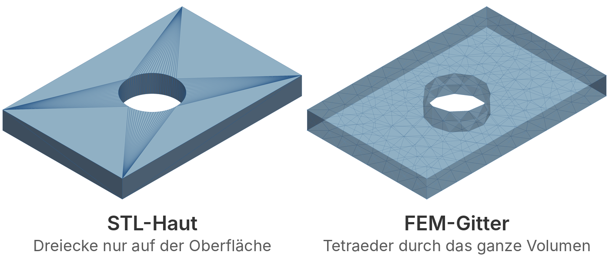
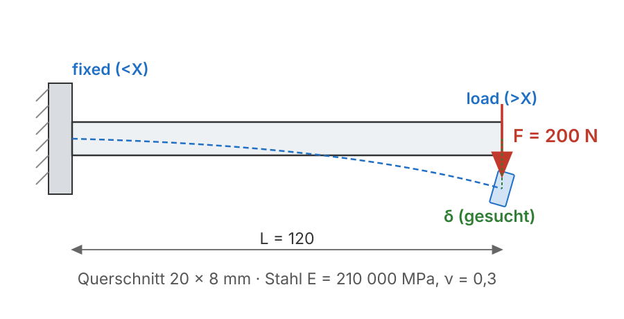
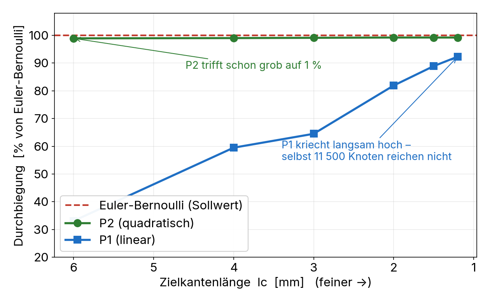
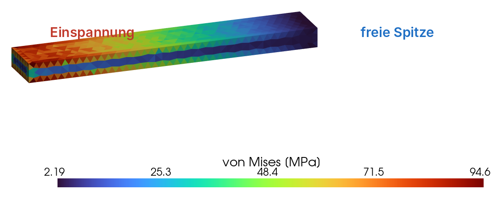

# Programmierung von CAx-Systemen

David Straub

### Gliederung

1. Einführung
2. Topologie
3. Grundformen
4. Kurven
5. Freiformgeometrie
6. Profile
7. Codequalität
8. Datenaustausch
9. Robustheit
10. **Simulation**
11. Optimierung

## Simulation

- **Vom Solid zum Netz:** warum diskretisieren, Volumengitter mit `cadgmsh`
- **FEM-Grundidee:** $K\mathbf{u} = \mathbf{f}$, lineare Elastizität
- **Elementwahl:** warum lineare Tetraeder bei Biegung versagen
- **Plausibilität:** FEM gegen eine Handrechnung

*Durchgängiges Beispiel:* der Verspannungsbalken unter dem **Quelldruck** der Pouch-Zellen

### Rückblick: das Modell hält – aber trägt es?

Neun Wochen: ein gehärtetes, gültiges Modul. Bisher ging es um **Geometrie**.

Pouch-Zellen **quellen** beim Zyklieren und drücken gegen die Verspannung. Die Frage ist jetzt physikalisch:

- Wie stark biegt sich der Verspannungsbalken?
- Kommt er der Streckgrenze nahe?

**Heute:** aus dem Solid wird ein FEM-Netz, und wir rechnen die Durchbiegung – geprüft gegen eine Handrechnung.

## Theorie A: Vom Solid zum Netz

### Warum diskretisieren?

Jede bisher gebaute Form ist **exakt**: eine Zylinderwand *ist* ein Zylinder, keine Näherung. Das Meiste, was danach kommt, kann damit nicht rechnen:

- eine Grafikkarte zeichnet **Dreiecke**, keine NURBS-Flächen
- ein 3D-Drucker braucht eine geschlossene **Haut**
- ein FEM-Löser braucht das **Volumen** in kleine Stücke zerlegt, für die er je *eine* Gleichung aufstellt

Ein **Netz** ist die exakte Geometrie, ersetzt durch endlich viele einfache Stücke – Dreiecke auf der Fläche, Tetraeder im Volumen. Das ist immer eine Näherung: ein flaches Dreieck berührt eine Rundung nur.

### STL-Haut vs. FEM-Gitter



| | STL (Einheit 8) | FEM-Gitter |
|---|---|---|
| füllt | nur die **Oberfläche** | das ganze **Volumen** |
| Element | Dreieck | Tetraeder |
| Größe | fein nur an Rundungen | überall gleichmäßig |
| Zweck | Ansicht, 3D-Druck | Physik rechnen |

Der Löser braucht auch auf einer glatten Fläche viele gleichmäßige Elemente – nicht damit die *Form* stimmt, sondern damit die *Physik* darüber aufgeht.

### cadgmsh: vernetzen mit benannten Flächen

```python
import cadgmsh
from skfem.io.meshio import from_meshio

cadmesh = cadgmsh.mesh(balken, dim=3, lc=4.0,
                       physical={"fixed": balken.faces("<X"),
                                 "load":  balken.faces(">X")})
mesh = from_meshio(cadmesh)
```

- **Gmsh** ist das Standard-Werkzeug, `cadgmsh` reicht ihm eine CadQuery-Form direkt
- `dim=3` füllt das Volumen mit Tetraedern; `lc` ist die **Zielkantenlänge** in mm – feiner = genauer, aber teurer
- `physical={...}` benennt CAD-**Flächen** als Rand-Gruppen; die Selektoren aus Einheit 2 zeigen direkt auf Lager- und Lastfläche
- `mesh.boundaries["fixed"]` sind später genau die dort erzeugten Netz-Facetten

### FEM: eine Gleichung ohne geschlossene Lösung

Durchbiegung, Temperatur, Spannung – solche Größen gehorchen einer **Differentialgleichung**. Für einfache Formen (gerader Stab, ebene Platte) löst man sie mit Papier. Ein reales Teil mit Bohrungen und Fillets hat **keine** geschlossene Lösung – nicht wegen der Physik, wegen der Geometrie.

Die **Finite-Elemente-Methode** nähert sie trotzdem: das Volumen in Elemente zerlegen, die Größe in jedem Element durch eine einfache Funktion annähern, alles an den Knoten zusammenstückeln. Aus einer unlösbaren DGL wird ein großes **lineares Gleichungssystem**.

### $K\mathbf{u} = \mathbf{f}$

$$K\,\mathbf{u} = \mathbf{f}$$

- $\mathbf{u}$: die **Freiheitsgrade** – hier drei Verschiebungen (x, y, z) **pro Knoten**
- $\mathbf{f}$: die Knotenkräfte  $\quad K$: die **Steifigkeitsmatrix** aus Geometrie und Material
- **linear:** Spannung proportional zur Dehnung; **statisch:** Last aufgebracht und gehalten, keine Trägheit

> Beides prüft der Löser **nie** selbst. Ein gehaltener Verspannungsbalken passt in beide Annahmen; ein Crashtest nicht.

### Material: lineare Elastizität

`linear_elasticity` baut $K$ aus den zwei **Lamé-Parametern** statt aus $E$ und $\nu$:

$$\lambda = \frac{E\,\nu}{(1+\nu)(1-2\nu)}, \qquad \mu = \frac{E}{2(1+\nu)}$$

```python
from skfem.models.elasticity import lame_parameters
lam, mu = lame_parameters(210e3, 0.3)     # Stahl, MPa
```

$\mu$ ist der Schubmodul, $\lambda$ hat keinen Alltagsnamen. Zusammen sind sie nichts als Hooke in 3D – dieselbe Physik, nur die zwei Zahlen, die die Assemblierung frisst, heißen anders.

### Der Ablauf in scikit-fem

```python
from skfem import Basis, ElementVector, ElementTetP2, condense, solve
from skfem.models.elasticity import linear_elasticity

basis = Basis(mesh, ElementVector(ElementTetP2()))       # 3 DOF pro Knoten
K = linear_elasticity(lam, mu).assemble(basis)           # Steifigkeitsmatrix

load_dofs = basis.get_dofs(mesh.boundaries["load"]).nodal["u^3"]
f = basis.zeros(); f[load_dofs] = -F / len(load_dofs)    # Querlast auf die Knoten
fixed = basis.get_dofs(mesh.boundaries["fixed"]).all()
u = solve(*condense(K, f, D=fixed))                      # lösen
```

- `ElementVector(...)` sagt: drei Unbekannte pro Knoten, kein Skalar
- `nodal["u^3"]` greift die **z-Komponente** der Verschiebung (die Lastrichtung)
- `condense` nimmt die eingespannten Freiheitsgrade heraus und setzt sie danach wieder ein

## Praktikum A: den Verspannungsbalken lösen

### Aufgabe 1: vernetzen



Vernetzen Sie den Verspannungsbalken als Kragbalken. Benennen Sie zwei Flächen: die **Einspannung** am einen Ende, die **Lastfläche** am anderen.

*Hinweise:* `cf.box(120, 20, 8)`, Selektoren `"<X"` / `">X"`, `cadgmsh.mesh(..., dim=3, lc=4.0, physical={...})`, `from_meshio`

### Aufgabe 2: assemblieren und lösen

Bringen Sie eine **Querlast von 200 N** in z-Richtung auf die Lastfläche auf und lösen Sie das System mit `ElementTetP2`.

1. Lesen Sie die Spitzendurchbiegung aus.
2. Notieren Sie sich den Wert – gleich prüfen wir ihn gegen eine Handrechnung.

*Hinweise:* `Basis`, `ElementVector(ElementTetP2())`, `linear_elasticity(...).assemble(basis)`, `get_dofs(...).nodal["u^3"]`, `condense`, `solve`; Durchbiegung über `u[basis.nodal_dofs[2]]`

## Theorie B: Plausibilität und Spannung

### Der Lastfall – ehrlich als Idealisierung

Die Endplatte bowt unter dem Quelldruck; wir prüfen den **Worst Case** mit dem einfachsten Balkenmodell:

- **Kragbalken**, Länge $L$ (Zuganker → Plattenmitte), fest eingespannt
- Quelldruck-Resultierende $F$ als Querlast an der Spitze

Das ist eine **Modellreduktion** – bewusst grob. Ob sie trägt, sagt die Handrechnung.

### Handrechnung: Euler-Bernoulli

$$\delta = \frac{F L^3}{3 E I}, \qquad I = \frac{b\,h^3}{12}, \qquad \sigma = \frac{M\,c}{I}$$

Ein geschlossener Ausdruck als **unabhängiger** Sollwert:

```python
I = 20 * 8**3 / 12                          # 853 mm⁴
delta_eb = 200 * 120**3 / (3 * 210e3 * I)   # 0.643 mm
sigma_eb = 6 * 200 * 120 / (20 * 8**2)      # 112 MPa an der Einspannung
```

**FEM (P2) 0,637 mm** gegen **EB 0,643 mm** → **−1 %**. Die Idealisierung trägt.

### Elementwahl: P1 lockt bei Biegung



**Lineare** Tetraeder (`ElementTetP1`) sind bei Biegung viel zu steif – *Shear Locking*. Sie konvergieren nur **langsam von unten**:

- lc = 6 → 33 %, lc = 2 → 82 %, selbst 11 500 Knoten → 92 %

**Quadratische** Tetraeder (`ElementTetP2`) bilden die Biegung im Element ab und treffen schon bei grobem Netz auf **99 %**.

> Kein fester Fehler-Boden, sondern zwei Konvergenzraten. Für Biegung: **P2** – billiger *und* genauer.

### Von Mises: wie nah am Fließen



$\sigma_\text{vM}$ fasst den 3D-Spannungszustand in **eine** Zahl (Abstand zum Fließen):

```python
from skfem.models.elasticity import linear_stress, sym_grad

eps = sym_grad(basis.interpolate(u))
s = linear_stress(lam, mu)(eps)
vm = np.sqrt(0.5 * ((s[0,0]-s[1,1])**2 + (s[1,1]-s[2,2])**2
     + (s[2,2]-s[0,0])**2 + 6*(s[0,1]**2 + s[1,2]**2 + s[2,0]**2)))
```

Maximum an der **Einspannung** (rot): FEM **107 MPa** gegen $Mc/I =$ **112 MPa** – dieselbe Größenordnung.

### Warum überhaupt eine Handrechnung?

FEM kann **still falsch** sein: falsche Randbedingung, lockende Elemente, zu grobes Netz – das Bild sieht trotzdem plausibel aus.

> Eine geschlossene Näherung im richtigen ±%-Bereich ist der Sanity-Check der Simulation – dasselbe Prinzip wie `assert` für die Geometrie (Einheiten 7 und 9).

## Praktikum B: Plausibilität und Konvergenz

### Aufgabe 3: gegen Euler-Bernoulli prüfen

1. Rechnen Sie $\delta_\text{EB} = FL^3/3EI$ von Hand und vergleichen Sie mit Ihrer FEM aus Aufgabe 2.
2. Liegt der Abgleich im ±%-Bereich? Wenn nicht: Randbedingung, Lastrichtung oder Element prüfen.

### Aufgabe 4: P1 gegen P2, und Konvergenz

1. Lösen Sie einmal mit `ElementTetP1` statt `P2`. Wie weit unter der Handrechnung liegt die Durchbiegung?
2. Verfeinern Sie `lc` (6 → 4 → 3 → 2) für **beide** Elemente. Zeichnen Sie Durchbiegung über `lc` – welche Kurve steht schon grob auf dem Sollwert?

### Aufgabe 5: Von Mises und Spannung

1. Bilden Sie das Von-Mises-Feld und lesen Sie das Maximum aus. Wo sitzt es?
2. Vergleichen Sie mit der Wurzel-Biegespannung $\sigma = 6FL / (b\,h^2)$.

### Aufgabe 6 *(Zusatz)*: dickere Platte

Variieren Sie $h$ (6, 8, 10 mm). Skaliert die Durchbiegung wie $1/h^3$? Deckt sich das mit $\delta \propto 1/I$ und $I \propto h^3$?

## Abschluss

### Leseauftrag & Ausblick

- **Leseauftrag:** Buch Kapitel 10 und 11
- **Dieselbe Maschinerie, andere Physik:** $K\mathbf{u}=\mathbf{f}$ löst mit einer Wärmeleitfähigkeit statt Elastizität auch die **Erwärmung** der Zelle – ein Skalar pro Knoten statt drei.
- **Wer mehr will:** die Last als **Flächendruck** auf die Innenfläche aufbringen statt als Punktlast an der Spitze – näher an der echten Quellung
- **Nächste Woche:** Optimierung – die Struktur so leicht wie möglich, ohne die Durchbiegungsgrenze zu reißen
- Bis dahin: `w10/` (Netz + FEM + Handrechnungs-Abgleich) committet und gepusht
