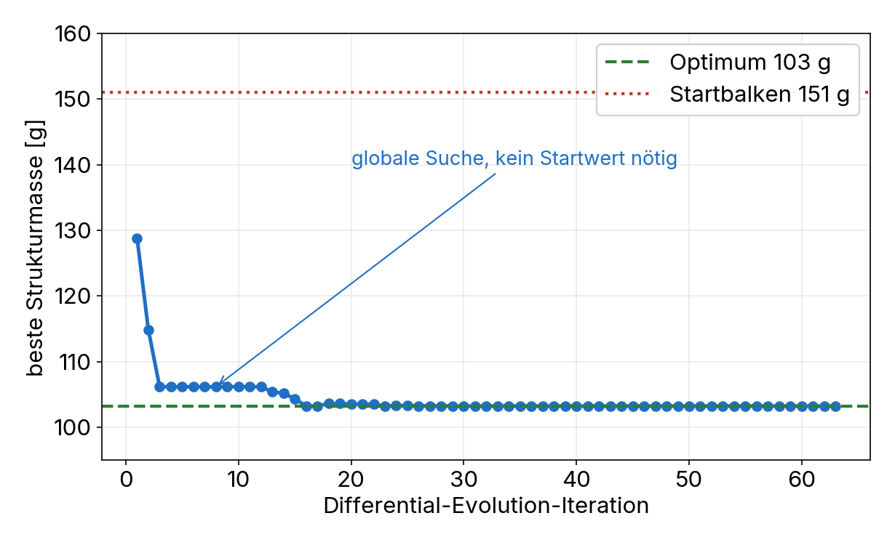
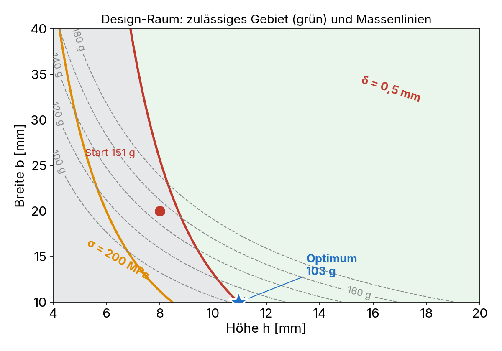

# Programmierung von CAx-Systemen

David Straub

### Gliederung

1. Einführung
2. Topologie
3. Grundformen
4. Kurven
5. Freiformgeometrie
6. Profile
7. Codequalität
8. Datenaustausch
9. Robustheit
10. Simulation
11. **Optimierung**

## Optimierung

- **Designvariablen, Zielfunktion, Nebenbedingungen**
- **Strafterme** statt harter Nebenbedingungen
- **Ableitungsfreie** Verfahren (Nelder-Mead, Differential Evolution)
- **Was in die Schleife gehört:** Kernel-Abfragen ja, feine FEM nein

*Durchgängiges Beispiel:* die Verspannung so leicht wie möglich – jedes Gramm Struktur senkt die **Energiedichte**

### Rückblick: validiertes Modell, offene Frage

Einheit 10 hat ein **validiertes** Durchbiegungsmodell geliefert: FEM ≈ Euler-Bernoulli auf 1 %.

Der Startbalken (b = 20, h = 8 mm) wiegt 151 g und biegt sich 0,64 mm – die Durchbiegungsgrenze liegt bei 0,5 mm. Also:

- Er ist **zu weich** – und vielleicht **schwerer als nötig**
- **Heute:** die leichteste Struktur finden, die die Grenze gerade hält

## Theorie A: Das Optimierungsproblem

### Drei Bestandteile

| Begriff | Bedeutung | hier |
|---|---|---|
| **Designvariablen** $\mathbf{x}$ | was der Optimierer ändern darf | Balkenbreite $b$, -höhe $h$ |
| **Zielfunktion** $f(\mathbf{x})$ | was minimiert wird | Strukturmasse |
| **Nebenbedingungen** | was erfüllt bleiben muss | $\delta \le \delta_\text{max}$, $\sigma \le \sigma_\text{max}$ |

$$\min_{\mathbf{x}} \; f(\mathbf{x}) \quad \text{s.t.} \quad g_i(\mathbf{x}) \le 0, \quad x_j^\text{lb} \le x_j \le x_j^\text{ub}$$

### Die Zielfunktion für scipy

`scipy.optimize` ruft die Funktion immer gleich auf: ein Array rein, ein Skalar raus.

```python
import numpy as np

def ziel(x: np.ndarray) -> float:
    b, h = x
    ...
    return masse   # ein zu minimierender float
```

- `x` ist ein **NumPy-Array** – der Optimierer kennt keine Variablennamen
- Rückgabe ist ein **Skalar**, nie ein Array, nie `None`
- Die Funktion darf **nicht** werfen – Fehler mit `return float("inf")` melden

### Nebenbedingung als Strafterm

Statt harter Nebenbedingungen bestraft man Verletzungen im Zielwert:

$$f_\text{pen}(\mathbf{x}) = f(\mathbf{x}) + \sum_i \rho_i \, \max\bigl(0,\; g_i(\mathbf{x})\bigr)^2$$

```python
strafe = max(0, delta - DELTA_MAX)**2 * 1e3 \
       + max(0, sigma - SIGMA_MAX)**2 * 1e-2
return masse + strafe
```

- Innerhalb der Grenze: Strafe 0, es zählt nur die Masse
- Darüber: quadratisch wachsend – der Optimierer wird zur Grenze zurückgedrängt
- `rho` muss zur **Skala** passen (mm gegen MPa → verschiedene Faktoren)

Eine quadratische Strafe landet **nie exakt** auf der Grenze – sie lässt eine Restverletzung, die mit `rho` schrumpft:

| `rho` | Durchbiegung am Optimum | Verletzung |
|---|---|---|
| 100 | 0,50034 mm | +0,00034 |
| 1 000 | 0,50003 mm | +0,00003 |

Zu kleines `rho` → das „Optimum" reißt die Grenze spürbar. Groß genug wählen und am Ende prüfen.

## Praktikum A: die Zielfunktion

### Aufgabe 1: Kennwerte

Schreiben Sie `kennwerte(b, h)`, das für den Balken (L = 120 mm, Stahl, F = 200 N) drei Werte liefert:

- Durchbiegung $\delta = \dfrac{FL^3}{3EI}$ mit $I = \dfrac{b\,h^3}{12}$ *(Formel, in Einheit 10 gegen FEM validiert)*
- Wurzel-Biegespannung $\sigma = \dfrac{6FL}{b\,h^2}$ *(Formel)*
- Masse **aus dem Modell**: `cf.box(120, b, h).Volume() * rho`, $\rho = 7{,}85 \cdot 10^{-6}$ kg/mm³

Die Masse kommt aus dem **Kernel**, nicht aus einer Formel. Beim Quader ist beides gleich – aber sobald das Teil Erleichterungsbohrungen bekommt, gibt es keine geschlossene Formel mehr, `.Volume()` liefert trotzdem.

*Hinweise:* `.Volume()` kostet Millisekunden – das darf in der Schleife stehen

### Aufgabe 2: Ziel mit Strafterm

Schreiben Sie `ziel(x)` für `scipy.optimize`: Eingabe ein Array `[b, h]`, Rückgabe die **Masse plus Strafterme** für verletzte Grenzen ($\delta_\text{max} = 0{,}5$ mm, $\sigma_\text{max} = 200$ MPa).

Prüfen: Was gibt `ziel([20, 8])` – hält der Startbalken beide Grenzen?

*Hinweise:* quadratischer Strafterm `max(0, wert - grenze)**2 * rho`; die Faktoren müssen zur Skala passen (mm gegen MPa)

## Theorie B: Verfahren und aktive Nebenbedingung

### Ableitungsfreie Verfahren

| | Nelder-Mead | Differential Evolution |
|---|---|---|
| Gradient nötig | ✗ | ✗ |
| Konvergenz | lokal (Startwert) | global (Bounds) |
| CAD-Eignung | hoch, schnell | sehr hoch, robust |

> CAD-Ziele sind oft verrauscht (Toleranzen) oder unstetig (Booleans, Kernel-Fehler) – **ableitungsfreie** Verfahren kommen damit klar. Gradientenverfahren stolpern über das `inf` im Fehlerfall.

### scipy.optimize



```python
from scipy.optimize import differential_evolution

bounds = [(10, 40), (4, 20)]          # [b, h] in mm
res = differential_evolution(ziel, bounds, seed=42, tol=1e-8)

b, h = res.x
print(f"b={b:.1f}  h={h:.1f}  {kennwerte(b, h)[2]*1000:.0f} g")
```

- **DE** braucht keinen Startwert – es erkundet den ganzen `bounds`-Raum
- Preis: viele Auswertungen (hier ~1900) – deshalb die Zielfunktion **billig** halten
- rechts: die beste Masse fällt in ~15 Iterationen von 129 g auf 103 g

### Was in die Schleife gehört: die Kostenhierarchie

DE wertet ~1900 mal aus. Was die Zielfunktion pro Aufruf kostet, entscheidet, ob das Sekunden oder Stunden dauert:

| Zielgröße | Kosten/Auswertung | 1900 Auswertungen |
|---|---|---|
| analytische Formel | µs | Sekunden |
| **CAD-Kernel** (`.Volume()`, `.Center()`) | ms | ~1 Minute |
| FEM-Solve (grobes Netz) | 0,1–0,4 s | Minuten |
| FEM-Solve (feines Netz) | ~3 s | > 1 Stunde |

**Kernel-Abfragen sind billig genug für die Schleife** – nur ein feiner FEM-Solve sprengt sie. Und man steuert die Kosten: ein gröberes Netz war hier fast gleich genau (Einheit 10: lc 4 → 6 kaum Unterschied).

### Welches Modell wofür?

- **Geschlossene Formel vorhanden** (unser Balken): auf dem billigen, in Einheit 10 validierten Surrogat optimieren, FEM **einmal** am Ende zur Kontrolle.
- **Keine Formel** (reale Geometrie mit Taschen, Kontakt): FEM **in** der Schleife – Netz grob halten, Budget klein, Ergebnis validieren. Das ist kein Widerspruch, nur eine andere Stelle auf derselben Kostenachse.

> Nie in Absoluten: „FEM geht nicht in der Schleife" ist falsch. Es kostet – so wenig oder viel, wie Netz und Budget es machen.

### Das Ergebnis: welche Grenze hält?



```
b = 10,0 mm   h = 11,0 mm   103 g  (Start 151 g, −31 %)
Durchbiegung  0,50 / 0,50 mm  → 100 %
Spannung      120 / 200 MPa   →  60 %
```

Eine Nebenbedingung heißt **aktiv**, wenn sie am Optimum genau erfüllt ist (100 %) und es begrenzt.

- **Aktiv ist die Durchbiegung** (rote Linie), nicht die Spannung – der Balken ist steifigkeits-, nicht festigkeitsgetrieben
- Das Optimum sitzt auf der roten Grenze, wo sie die niedrigste Massenlinie berührt
- `b` läuft an die **untere Schranke**: für Biegung ist schmal-und-hoch masseeffizienter ($I \propto h^3$)

## Praktikum B: optimieren und interpretieren

### Aufgabe 3: Optimierung ausführen

1. Führen Sie `differential_evolution` mit den Bounds aus.
2. Wiederholen Sie es mit `minimize(ziel, x0=[20, 8], method="Nelder-Mead")` – gleiches Optimum?

### Aufgabe 4: aktive Nebenbedingung und Energiedichte

1. Welche Nebenbedingung ist am Optimum aktiv (bei 100 %)? Welche hat Luft?
2. Wie viel Strukturmasse spart das Optimum – und was heißt das für die **Wh/kg** des Moduls?

### Aufgabe 5 *(Zusatz)*: gegen die FEM prüfen

Rechnen Sie **eine** FEM (Einheit 10) mit dem optimalen $b, h$. Trifft die Durchbiegung die 0,5 mm, die die analytische Optimierung versprochen hat?

## Abschluss

### Leseauftrag & Ausblick

- **Leseauftrag:** Buch Kapitel 12
- **Wer mehr will:** eine dritte Variable (Zuganker-Abstand $L$) aufnehmen – wandert die aktive Nebenbedingung?
- **Nächste Woche:** Parameterstudie und Ergebnis-Schau – Zellformat und Kapazität gegen Masse und Energiedichte; Ihr Modul im Vergleich
- Bis dahin: `w11/` (Optimierung + FEM-Kontrolle) committet und gepusht
