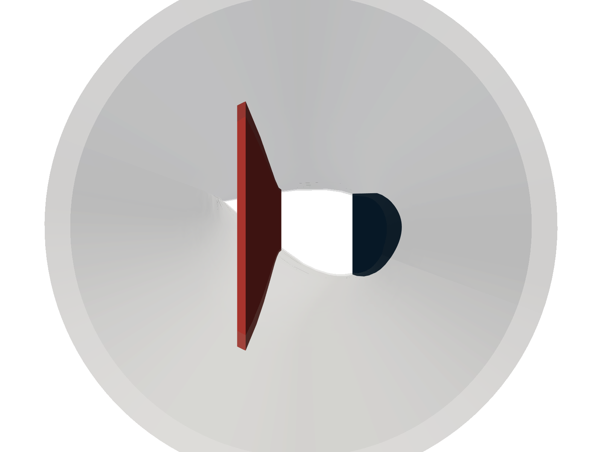

# Programmierung von CAx-Systemen

David Straub

### Gliederung

1. Einführung
2. Topologie
3. Geometrie
4. Modellierungsstrategien
5. Datenaustausch
6. Meshing & Simulation
7. Parametrische Robustheit & Optimierung
8. **Finales Projekt: Rotorblatt**

### Fahrplan

**Teil I** — Äußere Geometrie (Einheit 11)
NACA-Profile, Loft-Querschnitte, parametrisches Rotorblatt

**Teil II** — Innenstruktur & Simulation (diese Einheit)
Hohlstruktur, Holme, Vernetzung, FEM-Simulation, Parameterstudie


## Innenstruktur

### StructureParam

```python
@dataclass
class StructureParam:
    wall_thickness:      float       = 15.0 * bd.MM  # Blattwandstaerke
    root_wall_thickness: float       = 80.0 * bd.MM  # Flanschwandstaerke
    spar_positions:      list[float] = field(default_factory=lambda: [0.25, 0.60])
    spar_thickness:      float       = 50.0 * bd.MM  # Holmstegdicke
```

Holmpositionen als Sehnenanteil $\in [0, 1]$ (Sehne = Profiltiefe, engl. *chord*) — Länge der Liste bestimmt die Anzahl der Holme.

Reale 45-m-Blätter: Schale 10–20 mm GFK-Sandwich, Flansch 60–100 mm.
Holme verlaufen **spanwise** (von der Wurzel zur Spitze) als Scherstege.

### Aufgabe 4: Hohlstruktur

Implementieren Sie `hollow_blade(blade: bd.Solid, p: BladeParam, s: StructureParam) -> bd.Solid`:

`bd.offset` schlägt auf Freiform-Loft-Geometrie fehl. Stattdessen: inneren Loft durch `loft_sections(p_inner)` aufbauen und subtrahieren.

```python
from dataclasses import replace
from rotorblatt import _inner_naca
```

1. `replace(p, ...)` — reduzierte `chord_max`, `chord_tip`, `flange_radius` sowie `naca_root`/`naca_tip` via `_inner_naca(naca, chord, wall)`
2. `inner_loft = bd.loft(loft_sections(p_inner))`
3. `blade - inner_loft` — liefert ein `Compound`; analog zu Aufgabe 3 `.solids()[0]` zurückgeben

### Aufgabe 5: Holme

Implementieren Sie `blade_spars(hollow: bd.Solid, outer: bd.Solid, p: BladeParam, s: StructureParam) -> bd.Solid`:

`hollow` = Hohlstruktur (Aufgabe 4), `outer` = massives Außen-Solid (Aufgabe 3).

Initialisieren Sie `result = hollow` und iterieren Sie über `s.spar_positions`:

1. `x_center = (x_s - 0.5) * p.chord_max`
2. Box mit `align=(..., bd.Align.MIN)` auf der Z-Achse, dann `.move(bd.Location((x_center, 0, p.flange_length)))`
3. `(spar_box & outer).solids()[0]` — schneidet den Quader auf die Außengeometrie zu
4. `result = result + spar`



### Aufgabe 6a: Vernetzen & Visualisieren

Wie in Einheit 9: `cadgmsh.mesh` direkt an PyVista übergeben — noch ohne Physical Groups.

`structured` = Ergebnis von `blade_spars` (Aufgabe 5) — Hohlstruktur mit Holmen.

```python
import cadgmsh, pyvista as pv

m = cadgmsh.mesh(structured, dim=3, lc=200)
pv.from_meshio(m).plot(show_edges=True)
```

### Aufgabe 6b: Physical Groups — Flächenauswahl

FEM-Solver brauchen benannte Randflächen für Randbedingungen. Kapseln Sie den Mesh-Code in `mesh_blade(solid: bd.Solid, lc: float = 200.0)`.

Wählen Sie aus `solid.faces()` mit `f.geom_type` und `f.center()`:

| Gruppe | Typ | Kriterium |
|--------|-----|-----------|
| `upper_skin` | BSPLINE | `f.center().Y > 0` |
| `lower_skin` | BSPLINE | `f.center().Y < 0` |
| `root` | PLANE | kleinstes `f.center().Z` |
| `spars` | PLANE | alle übrigen |

### Aufgabe 6b: Physical Groups — Vernetzung

```python
m = cadgmsh.mesh(solid, dim=3, lc=lc, physical={
    "upper_skin": ..., "lower_skin": ..., "root": ..., "spars": ...,
})
grid = pv.from_meshio(m)
grid.extract_surface().plot(scalars=next(iter(grid.cell_data)), cmap="tab10")
```

## Statische FEM-Simulation

### Lineare Elastizität

Gesucht: Verschiebungsfeld $\mathbf{u}(\mathbf{x})$, das das Gleichgewicht

$$-\nabla \cdot \boldsymbol{\sigma} = \mathbf{0}, \qquad \boldsymbol{\sigma} = \lambda\,\text{tr}(\boldsymbol{\varepsilon})\,\mathbf{I} + 2\mu\,\boldsymbol{\varepsilon}, \qquad \boldsymbol{\varepsilon} = \tfrac{1}{2}(\nabla\mathbf{u} + \nabla\mathbf{u}^\top)$$

mit Randbedingungen erfüllt:

| Rand | Typ | Bedingung |
|------|-----|-----------|
| `root` | Dirichlet | $\mathbf{u} = \mathbf{0}$ (Einspannung) |
| `upper_skin` | Neumann | $\boldsymbol{\sigma}\,\mathbf{n} = -p\,\mathbf{e}_y$ (Saugdruck) |

Die Lamé-Parameter $\lambda$, $\mu$ folgen aus $E$ und $\nu$ — bereitgestellt in `rotorblatt_fem.py`.

### SimParam

```python
@dataclass
class SimParam:
    E:        float = 25_000.0   # MPa  — GFK in-plane
    nu:       float = 0.3
    pressure: float = 0.002      # N/mm² = 2 kPa Schlagbiegelast
```

Vernetzung (Aufgabe 6) ist Ihre Arbeit — die FEM-Mechanik dahinter ist nicht Kursinhalt. `rotorblatt_fem.py` kapselt sie in einer Funktion:

`simulate_flapwise(m, param, pressure_boundary, fixed_boundary) -> SimResult`
Black Box: Material, Einspannung, Drucklast und Lösen — alles aus den Argumenten, nichts geraten.

### Aufgabe 7: Simulation aufrufen

```python
from rotorblatt_fem import SimParam, simulate_flapwise

result = simulate_flapwise(m, SimParam())
print(f"Max. Schlagbiegung: {abs(result.uy).max():.0f} mm")
```

`result` enthält `mesh`, `basis`, `u`, `ux`/`uy`/`uz`, `vm` — alles, was Sie für Auswertung und Visualisierung brauchen (Aufgabe 8).

**Parametrisch denken:** wie ändert sich die Durchbiegung mit Carbon-Holmen statt GFK?

```python
result_cf = simulate_flapwise(m, SimParam(E=120_000.0, nu=0.28))
```

### Aufgabe 8: Ergebnisauswertung

```python
import numpy as np, pyvista as pv

mesh = result.mesh
cells      = np.hstack([np.full((mesh.t.shape[1], 1), 4), mesh.t.T]).ravel()
cell_types = np.full(mesh.t.shape[1], pv.CellType.TETRA)
grid       = pv.UnstructuredGrid(cells, cell_types, mesh.p.T)

grid.point_data["u"]              = np.column_stack([result.ux, result.uy, result.uz])
grid.point_data["Verschiebung"]   = result.uy
grid.cell_data["Von-Mises [MPa]"] = result.vm
```

### Aufgabe 8: Visualisierung

```python
pl = pv.Plotter(shape=(1, 2))

pl.subplot(0, 0)
pl.add_text("Verformung (5×)", font_size=10)
pl.add_mesh(grid.warp_by_vector("u", factor=5),
            scalars="Verschiebung", cmap="coolwarm")

pl.subplot(0, 1)
pl.add_text("Von-Mises-Spannung", font_size=10)
pl.add_mesh(grid, scalars="Von-Mises [MPa]", cmap="hot_r")

pl.link_views()
pl.show()
```

### Aufgabe 9: Parameterstudie Holmpositionen

Schleife über `spar_positions`-Konfigurationen, `hollow` einmal außerhalb gebaut. Nicht jede Position liefert gültige Geometrie → `try`/`except`.

```python
for positions in konfigurationen:
    try:
        s = StructureParam(spar_positions=positions)
        structured = blade_spars(hollow, blade, p, s)
        m = mesh_blade(structured, lc=100.0)
        # ... FEM lösen wie in Aufgabe 7 ...
    except Exception:
        continue
```

Vergleichen Sie Durchbiegung und Von-Mises-Spannung zwischen den Konfigurationen. Welche schneidet am besten ab, und warum?
