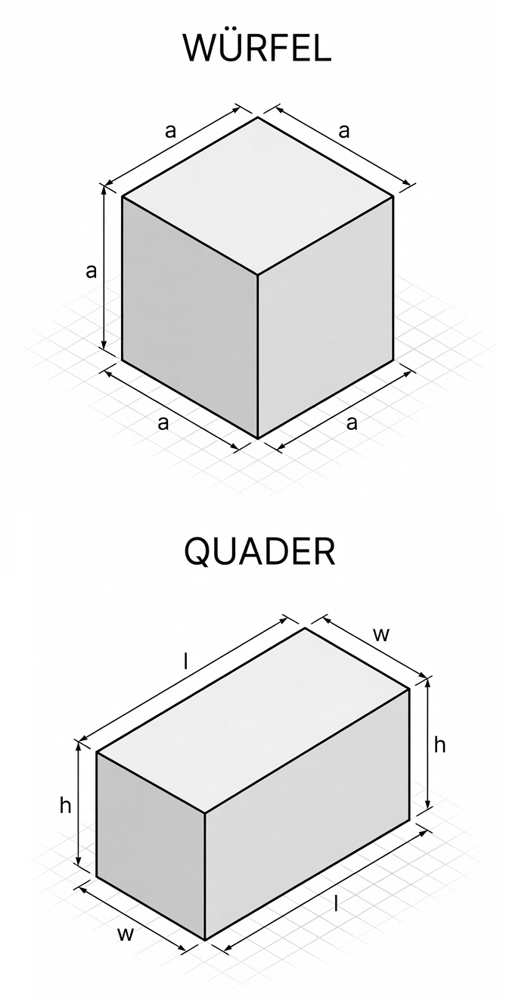

# Programmierung von CAx-Systemen

David Straub

### Gliederung

1. Einführung
2. **Topologie**
3. Geometrie
4. Modellierungsstrategien
5. Datenaustausch
6. Simulation
7. Optimierung
8. Fertigung

## Topologie

- Geometrie vs. Topologie
- Einstieg: Ein konkreter Körper
- Topologische Grundelemente
- Hierarchie und Konnektivität
- Orientierung
- B-Rep als Industriestandard
- Topologie in build123d

## Geometrie vs. Topologie

### Was ist der Unterschied?

**Topologie** beschreibt die **Struktur** eines Körpers:
- Wie viele Flächen, Kanten, Ecken hat er?
- Wie sind diese miteinander verbunden?
- Welche Elemente begrenzen welche anderen?

**Geometrie** beschreibt die **Form** im Raum:
- Wo liegen die Punkte (Koordinaten)?
- Welche mathematische Kurve/Fläche liegt zugrunde?
- Krümmung, Länge, Flächeninhalt

> B-Rep = Topologie + Geometrie: Die Topologie liefert das Gerüst, die Geometrie füllt es mit konkreter Form.

### Beispiel: Würfel vs. Quader

Beide haben dieselbe **Topologie**:
- 8 Ecken, 12 Kanten, 6 Flächen
- Jede Fläche von 4 Kanten begrenzt
- Jede Kante von 2 Ecken begrenzt

Aber unterschiedliche **Geometrie**:
- Würfel: alle Flächen quadratisch, alle Kanten gleich lang
- Quader: Rechteckflächen, unterschiedliche Kantenlängen

→ Gleiche Topologie, verschiedene Geometrie ist möglich!



### Analogie: S-Bahn-Netz

**Netzplan (Topologie):** Welche Stationen sind verbunden? Wo muss ich umsteigen?

**Geografische Karte (Geometrie):** Wo liegen die Stationen genau? Wie lang ist die Strecke in km?

Beide Darstellungen beschreiben dasselbe Netz – aber unterschiedliche Aspekte davon.

→ In CAD: B-Rep trennt genauso **Struktur** (Topologie) von **Form** (Geometrie).


## Einstieg: Ein konkreter Körper

### Unser erstes Objekt: der Zylinder

```python
import build123d as bd

zylinder = bd.Cylinder(radius=10, height=20)
zylinder
```

Ein einfacher Zylinder – aber wie ist er intern aufgebaut?

### Topologie inspizieren

```python
zylinder.show_topology()
```

Ausgabe (vereinfacht):
```
Solid
└── Shell
    ├── Face  (zylindrische Mantelfläche)
    ├── Face  (untere Kreisfläche)
    └── Face  (obere Kreisfläche)
        ├── Wire
        │   └── Edge  (Kreisbogen)
        ...
```

→ Drei Flächen, jede durch Kanten begrenzt, Kanten durch Ecken.

### Elemente zählen

```python
print("Solids:  ", len(zylinder.solids()))
print("Shells:  ", len(zylinder.shells()))
print("Faces:   ", len(zylinder.faces()))
print("Wires:   ", len(zylinder.wires()))
print("Edges:   ", len(zylinder.edges()))
print("Vertices:", len(zylinder.vertices()))
```

**Ergebnis:**
```
Solids:   1
Shells:   1
Faces:    3
Wires:    3
Edges:    3
Vertices: 2
```

→ Warum nur 2 Ecken? Warum nur 3 Kanten?

### Anatomie des Zylinders

```
Solid
└── Shell
    ├── Face: Mantel (Zylinderfläche)  — 1 Kante (Seam-Kante)
    ├── Face: Boden (Kreisfläche)      — 1 Kante (Kreis)
    └── Face: Deckel (Kreisfläche)     — 1 Kante (Kreis)
```

- Die Kreiskanten (Boden, Deckel) teilen sich je **einen Vertex** mit der Mantelkante
- Die Mantel-Kante ist eine **Nahtkante** (seam edge)
- Kanten werden zwischen Flächen **geteilt** – nicht dupliziert!

## Topologische Grundelemente

### Vertex – der Punkt

- Nulldimensionales Element
- Repräsentiert einen **Punkt** im Raum
- Geometrie: ein 3D-Punkt $(x, y, z)$
- Begrenzungselement von Kanten

```python
v = zylinder.vertices()[0]
print(type(v))       # <class 'build123d.topology.Vertex'>
print(v.center())    # Position im Raum
```

### Edge – die Kante

- Eindimensionales Element
- Ein **Kurvenstück**, begrenzt durch Vertices
- Geometrie: eine parametrische Kurve (Linie, Kreis, Spline, …)

```python
kanten = zylinder.edges()
for k in kanten:
    print(k.geom_type)  # CIRCLE oder LINE oder ...
    print(k.length)
```

### Wire – der Kantenzug

- Geordnete, zusammenhängende Folge von Edges
- Bildet eine **geschlossene Schleife** (Kontur einer Fläche)
- Kein eigenes geometrisches Objekt – nur eine Anordnung

```python
wire = zylinder.faces()[0].wires()[0]
print(len(wire.edges()), "Kanten im Wire")
```

→ Flächen können mehrere Wires haben: **äußere Kontur + innere Löcher**

### Face – die Fläche

- Zweidimensionales Element
- Ein **Flächenstück**, begrenzt durch Wires
- Geometrie: eine parametrische Fläche (Ebene, Zylinder, Kugel, Spline, …)

```python
flaechen = zylinder.faces()
for f in flaechen:
    print(f.geom_type)  # PLANE oder CYLINDER oder ...
    print(f.area)
```

### Shell – die Hülle

- Zusammenhängende Menge von Faces (verbunden über gemeinsame Edges)
- Bildet eine **geschlossene oder offene Hülle**

```python
shell = zylinder.shells()[0]
print(len(shell.faces()), "Flächen in der Shell")
```

→ Eine geschlossene Shell begrenzt ein Volumen

### Solid – der Körper

- Dreidimensionales Element
- Ein **Volumenkörper**, begrenzt durch eine (oder mehrere) Shells
- Das Zielobjekt in der parametrischen Konstruktion

```python
solid = zylinder.solids()[0]
print(solid.volume)  # Volumen in mm³
print(solid.area)    # Oberfläche in mm²
```

### Compound – die Sammlung

- Container für **beliebige Objekte** (*Shapes*, auch gemischter Typen)
- Kein geometrisches Konzept, nur Verwaltung
- `Part`, `Sketch`, `Curve` in build123d sind spezialisierte Compounds

```python
quader = bd.Box(30, 20, 10)
gruppe = bd.Compound([zylinder, quader])
print(len(gruppe.solids()), "Solide in der Gruppe")
```

### Übersicht: Topologie-Hierarchie

| Typ | Dimension | Begrenzt durch | Geometrie |
|---|---|---|---|
| Vertex | 0D | – | Punkt |
| Edge | 1D | Vertices | Kurve |
| Wire | 1D | Edges | – |
| Face | 2D | Wires | Fläche |
| Shell | 2D | Faces | – |
| Solid | 3D | Shells | – |
| Compound | – | beliebig | – |

## Hierarchie und Konnektivität

### Der Topologie-Graph

Die Elemente bilden eine **hierarchische Struktur** (gerichteter Graph):

```
Solid
 └── Shell
      ├── Face
      │    └── Wire
      │         └── Edge
      │              └── Vertex
      └── Face
           └── Wire
                └── Edge
                     └── Vertex  ← derselbe Vertex wie oben!
```

Entscheidend: Teilelemente werden **geteilt**, nicht kopiert.

### Konnektivität durch gemeinsame Teilelemente

Zwei Objekte sind **verbunden**, wenn sie ein gemeinsames Begrenzungselement teilen:

- Zwei **Flächen** sind verbunden, wenn sie eine gemeinsame **Kante** haben
- Zwei **Kanten** sind verbunden, wenn sie einen gemeinsamen **Vertex** haben

```python
quader = bd.Box(20, 20, 10)

# Welche Flächen teilen eine bestimmte Kante?
kante = quader.edges()[0]
for f in quader.faces():
    if kante in f.edges():
        print("Fläche enthält diese Kante:", f.center())
```

### Teilelemente abfragen

```python
quader = bd.Box(20, 20, 10)

# Alle Kanten einer bestimmten Fläche
oberseite = quader.faces().sort_by(bd.Axis.Z).last
print("Kanten der Oberseite:", len(oberseite.edges()))

# Alle Vertices einer bestimmten Kante
kante = oberseite.edges()[0]
print("Vertices der Kante:", len(kante.vertices()))
```

→ Die Topologie erlaubt Navigation **von oben nach unten** durch die Hierarchie

### Topologie vs. Anzahl bei komplexeren Körpern

```python
# Quader nach boolescher Operation
quader = bd.Box(40, 40, 20)
loch = bd.Cylinder(radius=8, height=20)
ergebnis = quader - loch

print("Faces:   ", len(ergebnis.faces()))    # 7
print("Edges:   ", len(ergebnis.edges()))    # 15
print("Vertices:", len(ergebnis.vertices())) # 10
```

Boolesche Operationen **verändern die Topologie** – neue Elemente entstehen, alte entfallen.

## Orientierung

### Orientierung: Motivation

**Gedankenexperiment:** Sechs quadratische Flächen, topologisch zu einer Shell verbunden.

Was entsteht?

- Ein **Würfel** (massiv, Material innen)?
- Eine **würfelförmige Aussparung** (Hohlraum, Material außen)?

Die Topologie ist identisch – 6 Faces, 12 Edges, 8 Vertices, alles verbunden.

→ Wir brauchen eine zusätzliche Information: **in welche Richtung zeigt jede Fläche?**

### Orientierung: Normale zeigt nach außen

Die Lösung: Jede Face trägt eine **Richtungsinformation** – den Normalenvektor.

**Regel:** In einem gültigen Solid zeigt die Normale **immer vom Material weg** (nach außen).

- Würfel: Normalen zeigen nach außen → Material liegt innen ✓
- Hohlraum: Normalen zeigen nach innen → das ist ein anderes Objekt (z.B. nach Boolean-Differenz)


### Orientierung: Material liegt links

Dieselbe Logik eine Ebene tiefer: Welche Seite einer Fläche ist „innen"?

**Regel:** Wenn man **von außen auf eine Face schaut** (entgegen der Normalen), liegt das Material **links** von der Durchlaufrichtung jeder Kante.

- **Outer Wire**: Material liegt links → Fläche ist begrenzt
- **Inner Wire**: läuft entgegengesetzt → Material liegt rechts → Loch

### Warum ist Orientierung wichtig?

- **Boolesche Operationen** brauchen korrekte Orientierung (Vereinigung, Differenz, Schnitt)
- **Wasserdichtheit**: Normalen müssen konsistent nach außen zeigen
- **Export**: Falsche Orientierung → ungültige STL- oder STEP-Dateien

```python
# build123d prüft automatisch die Orientierung
ergebnis = quader - loch
print(ergebnis.is_valid)  # True wenn korrekt
```

→ build123d und OCCT kümmern sich meist automatisch darum – aber das Konzept erklärt, warum manche Operationen fehlschlagen.

## B-Rep als Industriestandard

### B-Rep – ein Standard

Die Topologie-Konzepte dieser Vorlesung sind **nicht** an eine Software gebunden:

| Software | Kernel | Standard |
|---|---|---|
| CATIA | CGM (Dassault) | B-Rep |
| SolidWorks | Parasolid (Siemens) | B-Rep |
| NX (Unigraphics) | Parasolid (Siemens) | B-Rep |
| FreeCAD | OCCT | B-Rep |
| build123d | OCCT | B-Rep |

→ Vertex, Edge, Wire, Face, Shell, Solid – **überall dieselben Konzepte**, nur unterschiedliche Syntax.

### STEP: der gemeinsame Nenner

**ISO 10303 (STEP)** ist das universelle Austauschformat für B-Rep-Geometrie.

- Exportiert von CATIA, SolidWorks, NX, FreeCAD, CadQuery, build123d …
- Speichert exakt **dieselbe topologische Struktur**: Vertices, Edges, Faces, Shells, Solids
- Kein Informationsverlust bei der Topologie

```python
import build123d as bd

# Eine STEP-Datei aus CATIA laden:
fremdes_teil = bd.import_step("catia_teil.step")

# Und sofort mit denselben Methoden arbeiten:
print(len(fremdes_teil.faces()))   # Flächen zählen
print(len(fremdes_teil.edges()))   # Kanten zählen
fremdes_teil.show_topology()       # Struktur anzeigen
```

### Kernel-Unterschiede: was variiert?

**Das Gleiche** (normiert durch B-Rep / ISO 10303):
- Hierarchie: Vertex → Edge → Wire → Face → Shell → Solid
- Orientierungskonzept (FORWARD / REVERSED)
- Boolesche Operationen (Union, Cut, Common)

**Das Unterschiedliche** (kernel-spezifisch):
- Welche Kurven-/Flächentypen unterstützt werden
- Toleranzen und Präzisionsstrategie
- Interne Datenstrukturen und Algorithmen
- API-Syntax

→ Wer B-Rep versteht, kann sich in **jedem** professionellen CAD-System orientieren.

## Topologie in build123d

### Teilelemente selektieren

Jedes Objekt stellt Selektoren bereit, die `ShapeList` zurückgeben:

```python
part = bd.Box(40, 30, 20) - bd.Cylinder(radius=8, height=20)

part.vertices()   # alle Vertices
part.edges()      # alle Kanten
part.wires()      # alle Wires
part.faces()      # alle Flächen
part.solids()     # alle Körper
```

`ShapeList` ist eine Liste mit Zusatzmethoden zum Filtern und Sortieren.

### Selektoren: Sortieren

```python
part = bd.Box(40, 30, 20)

# Nach Position entlang einer Achse
oberseite  = part.faces().sort_by(bd.Axis.Z).last   # höchste Fläche
unterseite = part.faces().sort_by(bd.Axis.Z).first  # tiefste Fläche

# Nach Geometrieeigenschaft
groesste = part.faces().sort_by(bd.SortBy.AREA).last
laengste = part.edges().sort_by(bd.SortBy.LENGTH).last

# Gruppieren
gruppen = part.faces().group_by(bd.SortBy.AREA)  # Liste von Listen
```

### Selektoren: Filtern

```python
from build123d import GeomType

part = bd.Box(30, 20, 10) - bd.Cylinder(radius=5, height=10)

# Nach Achsausrichtung (Kanten parallel, Flächen normal)
part.edges().filter_by(bd.Axis.Z)       # vertikale Kanten
part.faces().filter_by(bd.Axis.Z)       # Ober-/Unterseite

# Nach Geometrietyp
part.edges().filter_by(GeomType.CIRCLE)    # Kreiskanten
part.faces().filter_by(GeomType.PLANE)     # ebene Flächen
part.faces().filter_by(GeomType.CYLINDER)  # zylindrische Flächen

# Nach Position (Mittelpunkt der Kante/Fläche)
part.edges().filter_by_position(bd.Axis.Z, 4, 6)
```

### Topologische Stabilität nach Operationen

⚠️ **Problem**: Nach jeder Operation kann sich die interne Nummerierung der Objekte ändern!

```python
part_v1 = bd.Box(40, 30, 20)
# part_v1.faces()[0]  ← Index 0 ist eine bestimmte Fläche

part_v2 = bd.fillet(part_v1.edges(), radius=2)
# part_v2.faces()[0]  ← Index 0 kann jetzt eine ANDERE Fläche sein!
```

→ Deshalb: immer **semantisch** selektieren (sort_by, filter_by), nie hart auf Index verlassen.

## Zusammenfassung

### Topologie vs. Geometrie

| | Topologie | Geometrie |
|---|---|---|
| **Beschreibt** | Struktur, Verbindungen | Form, Position |
| **Fragt** | Was ist womit verbunden? | Wo liegt was? |
| **Beispiel** | 6 Flächen, 12 Kanten | Fläche liegt bei z=10 |
| **Ändert sich bei** | Bool. Operationen | Skalierung, Verschiebung |

### Topologische Hierarchie

```
Solid  →  Shell  →  Face  →  Wire  →  Edge  →  Vertex
  3D         2D        2D      1D      1D        0D
```

- Elemente werden **geteilt** (nicht kopiert)
- Zwei Objekte sind **verbunden** durch gemeinsame Teilelemente
- Orientierung bestimmt, was „innen" und „außen" ist (Loch vs. Material, Hohlraum vs. Solid)

### Selektoren in build123d

```python
part.faces().sort_by(Axis.Z).last          # höchste Fläche
part.edges().filter_by(GeomType.CIRCLE)    # Kreiskanten
part.faces().group_by(SortBy.AREA)[-1]     # größte Flächen
part.edges().filter_by_position(Axis.Z, 4, 6)  # Kanten in Bereich
```

→ **Robuste Selektion** durch semantische Kriterien statt Indizes

### B-Rep – ein universelles Konzept

- Vertex, Edge, Face, Shell, Solid: **dieselben Konzepte** in CATIA, SolidWorks, NX, FreeCAD, build123d
- **STEP** (ISO 10303) transportiert diese Struktur zwischen Systemen
- Wer B-Rep-Topologie versteht, kann sich in jedem professionellen CAD-System orientieren
- build123d ist unser Werkzeug – **nicht das Ziel**

### Ausblick: Geometrie

In der nächsten Einheit: **Wie wird Form mathematisch beschrieben?**

- Kurven: Linien, Kreise, B-Splines
- Flächen: Ebenen, Zylinder, NURBS-Flächen
- Parameter und Koordinatensysteme
- Wie OCCT Geometrie und Topologie verbindet (B-Rep)
