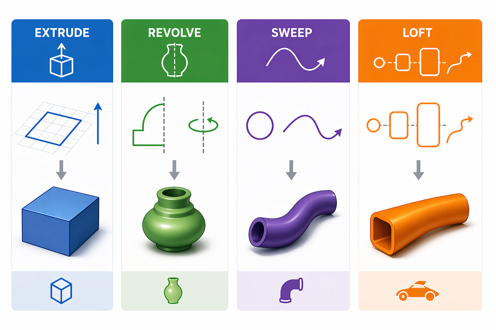

# Programmierung von CAx-Systemen

David Straub

### Gliederung

1. Einführung
2. Topologie
3. Geometrie
4. **Modellierungsstrategien**
5. Datenaustausch
6. Simulation
7. Optimierung
8. Fertigung



## Modellierungsstrategien I

- Feature-basiertes Modellieren
- Konstruktionsebenen (Workplanes)
- **Extrude:** 2D-Profil → 3D-Körper
- **Revolve:** Rotationskörper aus Halbprofil
- Parametrische Modelle: Maße als Variablen

*Durchgängiges Beispiel:* prismatische und zylindrische Batteriezellen

## Feature-basiertes Modellieren

### Modell als Abfolge von Features

**Feature** = eine atomare Modellierungsoperation

| Feature-Typ | Beispiel | build123d |
|---|---|---|
| Skizze → Solid | Profil extrudieren | `extrude(sketch, amount)` |
| Addition | Material hinzufügen | `part += boss` |
| Subtraktion | Material entfernen | `part -= Hole(radius=3, depth=8)` |
| Modifikation | Kanten verrunden | `fillet(part.edges(), radius)` |

**Konstruktionsstrategie:**
1. **Grundform** – einfachster Körper als Ausgangsbasis
2. **Additive Features** – Bosse, Rippen, Zapfen
3. **Subtraktive Features** – Bohrungen, Nuten, Taschen
4. **Finishing** – Verrundungen und Fasen zuletzt

### Konstruktionsebenen (Workplanes)

```python
box = Box(40, 40, 10)

Plane.XY                                    # Standardebene
Plane.XY.offset(20)                         # verschoben um 20 mm
Plane(box.faces().sort_by(Axis.Z).last)     # ← aus Fläche ableiten
Plane(origin=(0, 0, 15), z_dir=(0, 0, 1))  # beliebig definiert
```

> **`Plane(face)` ist die robuste Wahl:** bleibt korrekt, auch wenn sich Parameter ändern.
> `Plane.XY.offset(10)` wäre nach `Box(..., height=12)` schlicht falsch.

```python
top = Plane(box.faces().sort_by(Axis.Z).last)
box += top * Cylinder(5, 8, align=(Align.CENTER, Align.CENTER, Align.MIN))
```

### Platzieren und Musterfertigung

```python
box = Box(60, 60, 10)
top = Plane(box.faces().sort_by(Axis.Z).last)
a   = (Align.CENTER, Align.CENTER, Align.MIN)  # sitzt AUF der Ebene

box += top * Pos(20, 0) * Cylinder(4, 8, align=a)

# Rechteckraster (3×3 Bohrungen)
box -= [top * loc * Hole(radius=2, depth=10)
        for loc in GridLocations(16, 16, 3, 3)]

# Lochkreis (6 Bohrungen)
box -= [top * loc * Hole(radius=2, depth=10)
        for loc in PolarLocations(radius=20, count=6)]
```

`GridLocations(x_spacing, y_spacing, x_count, y_count)` – zentriert um Ebenenursprung

### Parametrische Modelle

```python
z_tiefe, z_breite, z_hoehe = 27, 148, 91
t_radius, t_abstand        = 4, 97
a = (Align.CENTER, Align.CENTER, Align.MIN)

zelle = Box(z_tiefe, z_breite, z_hoehe, align=a)
oben  = Plane(zelle.faces().sort_by(Axis.Z).last)
zelle += oben * Pos(0, -t_abstand / 2) * Cylinder(t_radius, 5, align=a)
zelle += oben * Pos(0, +t_abstand / 2) * Cylinder(t_radius, 5, align=a)
```

→ Nur `z_tiefe = 31` ändern → alles passt sich automatisch an ✓

**Warum `align=a` beim Zylinder?**
Standard-Zentrierung in Z bettet die Hälfte des Zapfens im Körper ein.
`Align.MIN` in Z lässt ihn vollständig auf der Ebene sitzen.

## Übung 1: Prismatische Batteriezelle

Prismatische LFP-Zellen: Quadergehäuse, zwei Terminals oben.
Maße angelehnt an **100-Ah-Klasse**.

| Maß | Wert |
|-----|------|
| Breite X (Stapelrichtung) | 27 mm |
| Länge Y | 148 mm |
| Höhe Z | 91 mm |
| Terminal-Radius | 4 mm |
| Terminal-Höhe | 5 mm |
| Terminal-Abstand | 97 mm |


### Aufgabe 1.1 – Einzelne Zelle

Parameter: `z_tiefe=27`, `z_breite=148`, `z_hoehe=91`, `t_radius=4`, `t_hoehe=5`, `t_abstand=97` (alle in mm)

1. Modellieren Sie das Gehäuse als quaderförmigen Körper. Die Stapelrichtung liegt in X, der Boden auf Z = 0.
2. Leiten Sie eine Konstruktionsebene von der Oberseite des Gehäuses ab.
3. Platzieren Sie die beiden Terminals auf dieser Ebene – je einer bei Y = ±`t_abstand`/2.

*Denkfrage:* Was passiert mit dem Volumen, wenn Sie den Zylinder nicht explizit auf der Fläche ausrichten?

*Prüfen:* `round(zelle.volume)` ≈ `364 890` mm³

### Aufgabe 1.2 – Modulhalter

Parameter: `n_zellen=6`, `spiel=0.5`, `wand=4`, `plattendicke=8` (mm)

1. Berechnen Sie die Plattenabmessungen so, dass zwischen je zwei Zellen und an beiden Rändern eine Wand der Stärke `wand` bleibt.
2. Erzeugen Sie die Halterplatte.
3. Erzeugen Sie einen rechteckigen Ausschnitt für eine Zelle (mit Spiel auf jeder Seite).
4. Subtrahieren Sie `n_zellen` Ausschnitte in gleichmäßigen Abständen.

*Prüfen:* `n_zellen = 8` setzen – passt sich das Modell automatisch an?

### Aufgabe 1.3 – Baugruppe *(Zusatz)*

Setzen Sie `n_zellen` Zellen in den Halter ein – als Baugruppe, nicht als verschmolzener Körper.

- Wann `Compound`, wann `+` (Boolesche Union)? Was wäre der Unterschied?

## Extrude & Revolve

### build123d: Compound-Typen mit fester Dimension

| Typ | Inhalt | Dimension |
|-----|--------|-----------|
| `Curve` | Compound aus Edges | 1D |
| `Sketch` | Compound aus Faces | 2D |
| `Part` | Compound aus Solids | 3D |

`Polyline` / `Line` / `Arc` → `Wire` → `make_face()` → `Sketch` → `extrude()` / `revolve()` → `Part`

Alle drei sind Unterklassen von `Compound` – benannte Container für Geometrie einer Dimension.
`Curve` ist hauptsächlich im Builder-Modus relevant; im Functional API arbeitet man direkt mit `Wire`.

### extrude() – Profil zu Körper

```python
extrude(profil: Sketch, amount: float) -> Part
```

Das Profil muss eine **geschlossene Fläche** (`Sketch`) sein – kein *Wire*, keine *Curve*.

```python
wandstaerke, breite, hoehe, laenge = 1.5, 27, 91, 148

aussen = Polyline((0, 0), (breite, 0), (breite, hoehe), (0, hoehe), (0, 0))
innen  = Polyline(
    (wandstaerke,        wandstaerke),
    (breite-wandstaerke, wandstaerke),
    (breite-wandstaerke, hoehe-wandstaerke),
    (wandstaerke,        hoehe-wandstaerke),
    (wandstaerke,        wandstaerke),
)
gehaeuse = extrude(make_face(aussen), laenge) - extrude(make_face(innen), laenge)
```

→ Dünnwandiges Zellengehäuse (27 × 91 mm Querschnitt, Wandstärke 1,5 mm)

### revolve() – Rotationskörper

```python
revolve(profil, axis=Axis.Z, revolution_arc=360) -> Part
```

Das Profil muss vollständig auf **einer Seite** der Rotationsachse liegen.

```python
profil = Plane.XZ * make_face(Polyline(
    (8, 0), (20, 0), (20, 5), (8, 5), (8, 0)
))
scheibe = revolve(profil, axis=Axis.Z)               # 360° → Ringscheibe
bogen   = revolve(profil, axis=Axis.Z, revolution_arc=270)  # ¾-Körper
```

**Halbprofil-Schema:**
- **x** in 2D → **radialer Abstand** von der Achse
- **y** in 2D → **Höhe** entlang der Achse
- Profil in XY definieren → `Plane.XZ *` transformiert in XZ-Ebene

### Warum make_face()?

`revolve()` erwartet eine **Fläche** – keine Kurve, keinen Draht.

```
Polyline / Line / Arc   →   Wire (offene oder geschlossene Kurve)

                ↓  make_face()

             Sketch (Fläche, die revolve() einlesen kann)
```

Geschlossene Kurve → Fläche → Rotationskörper: das ist die feste Abfolge.

### make_face() – Kurve zu Fläche

```python
# Polyline muss geschlossen sein (letzter Punkt = erster Punkt)
profil = make_face(
    Polyline((0, 0), (30, 0), (30, 50), (0, 50), (0, 0))
)
```

Beliebige Kurventypen kombinieren:

```python
kurve = (
    Line((0, 0), (30, 0))
    + RadiusArc((30, 0), (30, 40), 60)
    + Line((30, 40), (0, 40))
    + Line((0, 40), (0, 0))
)
profil = make_face(kurve)
```

## Übung 2: Zylindrische Batteriezelle (18650)

**18650:** ∅ 18 mm, Höhe 65 mm – meistverwendeter zylindrischer Zellentyp (Tesla, BMW, Laptops, E-Bikes)

| Maß | 18650 | 2170 | 4680 |
|-----|-------|-------|-------|
| Außenradius | 9,0 mm | 10,5 mm | 23,0 mm |
| Höhe | 65,0 mm | 70,0 mm | 91,0 mm |
| Terminal-Radius | 2,5 mm | 3,0 mm | 4,5 mm |
| Terminal-Höhe | 1,0 mm | 1,2 mm | 1,8 mm |

Nachfolger **2170**, **4680**: nur Parameter anpassen, Code identisch.


### Aufgabe 2.1 – Halbprofil und Revolve

Parameter: `r_aussen=9.0`, `h_zelle=65.0`, `r_terminal=2.5`, `h_terminal=1.0` (mm)

1. Skizzieren Sie den **Querschnitt** der Zelle auf Papier: voller Außenradius über die Höhe, oben ein kleiner Terminal-Nub mit engerem Radius.
2. Übersetzen Sie diesen Querschnitt in eine geschlossene `Polyline` (x = Radius, y = Höhe).
3. Erzeugen Sie daraus ein Profil in der XZ-Ebene und drehen Sie es um die Z-Achse.

*Prüfen:* Wie viele Flächen hat `zelle_rund`? Welche `geom_type`-Werte kommen vor?

*Variation:* Ändern Sie auf 2170-Maße – was muss angepasst werden?

### Aufgabe 2.2 – Crimping-Nut *(Zusatz)*

Zylindrische Zellen haben am oberen Rand eine umlaufende Einschnürung (Crimping), die Deckel und Dose verbindet. Sie ist ca. 0,5 mm tief und 2 mm hoch.

Subtrahieren Sie diese Nut mit demselben Ansatz wie die Zelle selbst: Profil → revolve → `-=`.

*Prüfen:* Welchen `geom_type` haben die neuen Flächen an der Nut?

### Aufgabe 2.3 – Zylindrisches Modul *(Zusatz)*

Zylindrische Zellen im **Sechseckraster** (dichteste Packung):

```python
# HexLocations(radius, x_count, y_count)
# Mindestabstand zwischen Zellmitten = 2 * radius
locs_hex = HexLocations(r_aussen + 1, 3, 3)
modul    = Part() + [loc * zelle_rund for loc in locs_hex]
```

1. Wie viele Körper zählt `len(modul.solids())`?
2. Auf 5×5 vergrößern – welche Parameter ändern sich?
3. Vergleich mit `GridLocations`: welche Anordnung ist kompakter?

## Zusammenfassung

### Kernkonzepte dieser Einheit

**Konstruktionsebenen**
- `Plane(face)` → robust, parametrisch – bevorzugen
- `align=(…, Align.MIN)` → Objekt sitzt *auf* der Fläche, nicht halb darin

**Extrude / Feature-basiert**
- `GridLocations`, `PolarLocations` → Musterfertigung in einer Zeile
- Maße als Variablen → ein Parameter ändern = Modell aktualisiert sich

**Revolve**
- Halbprofil in XY → `Plane.XZ *` → `make_face` → `revolve(…, axis=Axis.Z)`
- `geom_type` der Flächen verrät, welche Geometrie OCCT intern speichert
