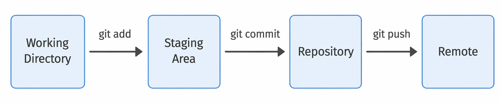
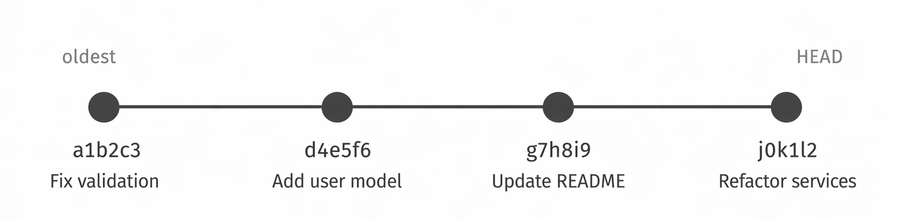
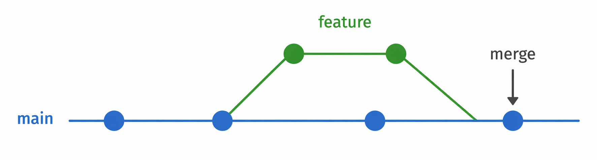
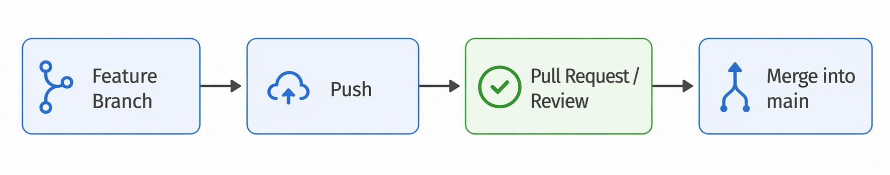

# Programmierung von CAx-Systemen

David Straub

## Software Engineering Basics

1. **Versionsverwaltung mit Git**
2. Unittests mit Pytest
3. Type Hints und statische Codeanalyse


## Warum Versionsverwaltung?

### Das Problem ohne Git

```
skript_final.py
skript_final2.py
skript_final_neu.py
skript_final_neu_v3_STIMMT.py
```

Typische Fragen ohne Versionsverwaltung:

- Wie war der Code letzte Woche?
- Warum liefert die Funktion seit gestern andere Ergebnisse?
- Welche Version haben wir abgegeben?
- Wer hat was geändert – und warum?

### Was Versionsverwaltung löst

| Situation | Ohne Git | Mit Git |
|---|---|---|
| Etwas geändert | Datei überschrieben | `git diff` zeigt genau was |
| Idee ausprobieren | Kopie anlegen | Branch erstellen |
| Fehler eingebaut | Manuell rückgängig | `git revert` |
| Im Team arbeiten | Datei per E-Mail | Pull Request |

## Git-Grundkonzepte

### Repository, Commit, History

**Repository** = Projektordner mit vollständiger Versionshistorie

**Commit** = Snapshot des Projekts zu einem Zeitpunkt

```
* b3f92a1  Extract tolerance as configurable parameter
* 7e4d5db  Add input validation
* 704671c  Initial working version
```

Jeder Commit hat: Zeitstempel, Autor, Nachricht, eindeutiger Hash.



### Was gehört ins Repository?

**Ja:**
- Quellcode (`.py`, `.js`, ...)
- Konfigurationsdateien (`.yaml`, `.json`)
- Dokumentation (`.md`)

**Nein:**
- Generierte Dateien – groß, aus Code rekonstruierbar
- Virtuelle Umgebungen (`venv/`, `__pycache__/`)
- IDE-spezifische Dateien (`.vscode/`)

→ `.gitignore` regelt was ignoriert wird

## Grundbefehle

### Repository einrichten und committen

```bash
git init                        # neues Repository anlegen
git status                      # Was hat sich geändert?
git add datei.py                # Datei zur Staging Area hinzufügen
git add .                       # alle Änderungen stagen
git commit -m "Short description"    # Commit erstellen
git log --oneline               # History ansehen
git diff                        # unstaged Änderungen anzeigen
git diff HEAD~1                 # Vergleich mit letztem Commit
```

### Gute Commit-Messages

```bash
# Schlecht:
git commit -m "fix"
git commit -m "changes"

# Gut:
git commit -m "Fix validation for negative radius"
git commit -m "Extract wall thickness as configurable parameter"
git commit -m "Handle empty input list gracefully"
```

Commit-Messages auf **Englisch** – Konvention in der gesamten Softwareentwicklung.

**Faustregel:** "If applied, this commit will *[message]*" muss einen sinnvollen Satz ergeben.



## Branches

### Branch = parallele Entwicklungslinie

```bash
git branch                      # alle Branches anzeigen
git checkout -b mein-feature    # neuen Branch erstellen und wechseln
git checkout main               # zurück zum Hauptbranch
git merge mein-feature          # Branch zusammenführen
```



### Wann Branches?

- **Neue Funktion** entwickeln ohne `main` zu destabilisieren
- **Experiment** das vielleicht verworfen wird
- **Parallele Varianten** die dauerhaft koexistieren

```bash
git checkout -b variante-b

# Entwickeln, testen, committen
git add skript.py
git commit -m "Add variant B: alternative algorithm"

# Zurück – Variante A unverändert
git checkout main
```

## GitHub / GitLab: PR- und MR-Workflow

### Remote Repository

```bash
git remote add origin https://github.com/user/projekt.git
git push -u origin main         # erstmaliges Hochladen
git push                        # weitere Commits hochladen
git pull                        # Änderungen herunterladen
git clone <url>                 # Repository klonen
```

**GitHub** / **GitLab** = Remote-Repository + Kollaborationsplattform

### Pull Request / Merge Request

**Pull Request (GitHub)** / **Merge Request (GitLab)** = Anfrage, einen Branch in `main` zu mergen – mit Review.

Vorteile: Änderungen werden begründet, zweite Person prüft, History ist nachvollziehbar.



### PR-Workflow in der Praxis

```bash
# 1. Branch für Aufgabe erstellen
git checkout -b fix-validierung

# 2. Entwickeln und committen
git add modul.py
git commit -m "Handle empty input list in validation"

# 3. Hochladen
git push -u origin fix-validierung

# 4. Auf GitHub/GitLab: Pull Request öffnen
#    → Beschreibung: Was, Warum, Wie getestet
#    → Reviewer zuweisen
#    → Nach Review: Merge in main
```

## Übung

### Aufgabe X1.1 – Repository einrichten

1. Legen Sie in Ihrem Projektordner ein Git-Repository an.
2. Erstellen Sie eine `.gitignore` (generierte Dateien, `__pycache__/`, `*.pyc`).
3. Committen Sie Ihre Skripte mit einer sinnvollen Nachricht.
4. Ändern Sie etwas und committen Sie die Änderung separat.

*Prüfen:* `git log --oneline` zeigt mindestens 2 Commits.

### Aufgabe X1.2 – Variante als Branch

1. Erstellen Sie einen Branch für eine Variante oder ein Experiment.
2. Nehmen Sie eine inhaltliche Änderung vor und committen Sie sie.
3. Wechseln Sie zurück zu `main` – ist der alte Stand wieder da?
4. Mergen Sie den Branch (oder verwerfen Sie ihn bewusst).

*Denkfrage:* Wann würden Sie einen Branch mergen, wann dauerhaft behalten?

### Aufgabe X1.3 – Pull Request *(Zusatz)*

1. Legen Sie ein leeres Repository auf GitHub oder GitLab an.
2. Verbinden Sie Ihr lokales Repository mit dem Remote.
3. Pushen Sie `main` und einen Feature-Branch.
4. Öffnen Sie einen Pull Request mit einer Beschreibung der Änderung.

*Denkfrage:* Was wäre ein sinnvolles Review-Kriterium in Ihrem Projekt?

## Zusammenfassung

### Kernkonzepte

**Repository & Commits**
- `git init` → `git add` → `git commit` – die Grundschleife
- Commit-Messages beschreiben *warum*, nicht *was*

**Branches**
- Parallele Entwicklung ohne Dateikopien
- Merge wenn stabil, dauerhaft behalten wenn Variante

**GitHub / GitLab**
- Remote = Backup + Kollaboration
- PR/MR: strukturierter Review-Prozess, nachvollziehbare Entscheidungen
