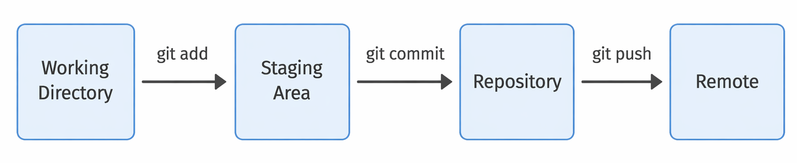
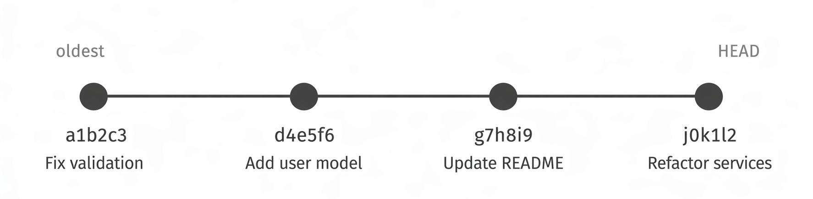
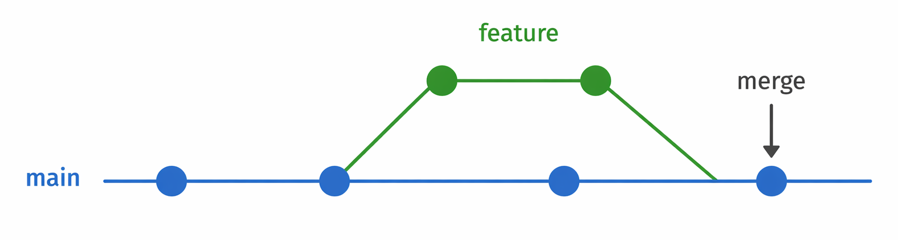
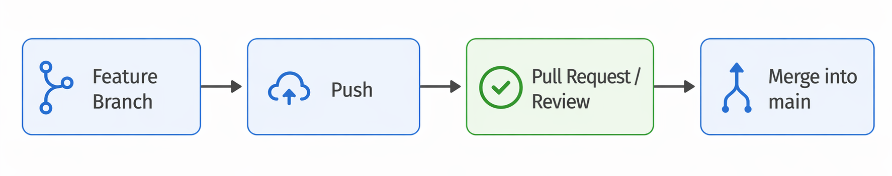

# Programmierung von CAx-Systemen

## Versionsverwaltung mit Git

**Selbststudium** – Nachschlagematerial zum eigenständigen Durcharbeiten

David Straub

### Wozu dieses Dokument?

Git brauchen Sie ab Woche 1, um Ihr Projekt zu pushen. Die Vorlesung führt nur den nötigen Kern ein (`add` → `commit` → `push`).

Dieses Dokument ist zum **Nachschlagen und selbst Üben** – vom ersten Repository bis zu Branches und Pull Requests. Arbeiten Sie es in Ihrem Tempo durch; bei Problemen vor Woche 2 melden.

## Warum Versionsverwaltung?

### Das Problem ohne Git

```
grundplatte_final.py
grundplatte_final2.py
grundplatte_neu.py
grundplatte_neu_v3_STIMMT.py
```

Typische Fragen ohne Versionsverwaltung:

- Wie war der Code letzte Woche?
- Warum baut das Modell seit gestern anders?
- Welchen Stand habe ich abgegeben?
- Was genau habe ich seit dem letzten Mal geändert?

### Was Versionsverwaltung löst

| Situation | Ohne Git | Mit Git |
|---|---|---|
| Etwas geändert | Datei überschrieben | `git diff` zeigt genau was |
| Idee ausprobieren | Kopie anlegen | Branch erstellen |
| Fehler eingebaut | Manuell rückgängig | `git revert` |
| Abgabe festhalten | Ordner zippen | Commit + Push |

## Git-Grundkonzepte

### Die vier Orte



- **Working Directory** – Ihr Projektordner, wie er gerade auf der Platte liegt
- **Staging Area** – was in den nächsten Commit soll (`git add`)
- **Repository** – die lokale Historie aller Commits (`git commit`)
- **Remote** – der Server, auf dem ich Ihren Stand sehe (`git push`)

### Repository, Commit, History

**Repository** = Projektordner mit vollständiger Versionshistorie

**Commit** = Snapshot des Projekts zu einem Zeitpunkt, mit Nachricht

```
* b3f92a1  Vier Befestigungslöcher ergänzt
* 7e4d5db  Grundplatte verrundet
* 704671c  Erste Version der Grundplatte
```

Jeder Commit hat: Zeitstempel, Autor, Nachricht, eindeutigen Hash.

### Was gehört ins Repository?

**Ja:**
- Ihr Code (`.py`)
- Konfigurationsdateien (`.gitlab-ci.yml`, `requirements.txt`)
- Dokumentation (`.md`)

**Nein:**
- Generierte Dateien – groß, aus Code rekonstruierbar (`.step`, `.stl`)
- Virtuelle Umgebungen (`cax-env/`, `__pycache__/`)
- IDE-Dateien (`.vscode/`)

→ eine `.gitignore` regelt, was Git ignoriert.

## Grundbefehle

### Git konfigurieren

Einmalig nach der Installation – wird in jeden Commit geschrieben:

```bash
git config --global user.name "Vorname Nachname"
git config --global user.email "email@hm.edu"
```

Editor für Commit-Nachrichten:

```bash
git config --global core.editor "code --wait"
```

`--wait` sorgt dafür, dass Git wartet, bis das VS-Code-Fenster geschlossen ist.

### Die tägliche Grundschleife

```bash
git status                      # Was hat sich geändert?
git add w01/                    # Änderungen zum nächsten Commit vormerken
git commit -m "Modul-Grundplatte"   # Snapshot mit Nachricht
git push                        # auf den Server hochladen
```

Weitere nützliche Befehle:

```bash
git log --oneline               # History ansehen
git diff                        # noch nicht gestagte Änderungen
git pull                        # Referenzlösung / Serverstand holen
```

### Gute Commit-Nachrichten

```bash
# Wenig hilfreich:
git commit -m "fix"
git commit -m "änderung"

# Gut – beschreibt, was der Commit bewirkt:
git commit -m "Vier Befestigungslöcher ergänzt"
git commit -m "Zellstapel parametrisch gemacht"
git commit -m "Kollisionstest für Nachbarzellen ergänzt"
```

**Faustregel:** „Wenn angewendet, wird dieser Commit *[Nachricht]*" muss einen sinnvollen Satz ergeben. (Viele Teams schreiben Commit-Nachrichten auf Englisch – im Kurs genügt Deutsch.)



## Branches

### Branch = parallele Entwicklungslinie

```bash
git branch                      # alle Branches anzeigen
git checkout -b variante-hoch   # neuen Branch erstellen und wechseln
git checkout main               # zurück zum Hauptbranch
git merge variante-hoch         # Branch zusammenführen
```



### Wann Branches?

- **Variante** ausprobieren, ohne `main` zu destabilisieren (z. B. eine schmalere Endplatte)
- **Experiment**, das vielleicht verworfen wird
- **Parallele Entwürfe**, die dauerhaft nebeneinander bestehen

```bash
git checkout -b endplatte-leicht

# Entwickeln, testen, committen
git add w09/
git commit -m "Endplatte mit Erleichterungstaschen"

# Zurück – der alte Stand ist unverändert
git checkout main
```

## Remote: GitHub / GitLab

### Remote-Repository

```bash
git clone <url>                 # Repository erstmalig holen
git push                        # Commits hochladen
git pull                        # Änderungen herunterladen
```

Im Kurs bekommen Sie ein fertiges Projekt-Repository – Sie `clone`n es einmal und arbeiten dann lokal, mit `push` am Ende jeder Sitzung.

**GitLab** (Kurs) / **GitHub** = Remote-Repository + Kollaborationsplattform mit Weboberfläche, Pipelines und Reviews.

### Pull Request / Merge Request



**Merge Request (GitLab)** / **Pull Request (GitHub)** = Anfrage, einen Branch in `main` zu mergen – mit Review.

Vorteile: Änderungen werden begründet, eine zweite Person prüft, die History bleibt nachvollziehbar. Im Berufsalltag ist das der Normalweg, wie Code in `main` gelangt.

### MR-Workflow in der Praxis

```bash
# 1. Branch für die Aufgabe
git checkout -b kuehlkanal

# 2. Entwickeln und committen
git add w06/
git commit -m "Serpentinen-Kanal in die Cold Plate geschnitten"

# 3. Hochladen
git push -u origin kuehlkanal

# 4. In GitLab: Merge Request öffnen
#    → Beschreibung: was, warum, wie geprüft
#    → nach Review: Merge in main
```

## Zusammenfassung

### Kernkonzepte

**Repository & Commits**
- `git add` → `git commit` → `git push` – die Grundschleife jeder Sitzung
- Commit-Nachrichten beschreiben, *was* der Commit bewirkt

**Branches**
- parallele Entwicklung ohne Dateikopien
- mergen wenn stabil, behalten wenn dauerhafte Variante

**GitLab**
- Remote = Backup + Kollaboration + Pipeline
- Merge Request: strukturierter Review, nachvollziehbare Entscheidungen

### Zum Weiterlernen

- **Pro Git** – das freie Standardwerk, umfassend und gründlich
  [git-scm.com/book/en/v2](https://git-scm.com/book/en/v2)
- **Atlassian Git Tutorials** – aufgabenorientiert, gut erklärte Diagramme
  [atlassian.com/git/tutorials](https://www.atlassian.com/git/tutorials)
- **Learn Git Branching** – interaktiv im Browser, Branches und Merges zum Ausprobieren
  [learngitbranching.js.org](https://learngitbranching.js.org/)
