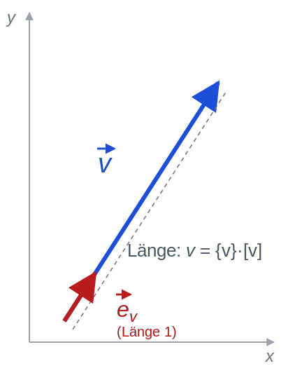

# Elektrotechnik – 1. Einführung

**Luft- und Raumfahrttechnik Bachelor, 1. Semester**

David Straub

### Organisatorisches

- 🎓 Moodle-Kurs: tbd
- 💬 Matrix-Raum: tbd
- 🕥 Sprechstunde: tbd
- 📖 Literatur
    - Pregla – [OPAC](https://link.hm.edu/2c6h)
    - Hagmann – [OPAC](https://link.hm.edu/fvqd)
    - Hering u.a. – [online](https://link.springer.com/book/10.1007/978-3-662-67538-0)
    - Fischer – [online](https://link.springer.com/book/10.1007/978-3-658-25644-9)
- 🗒️ Vorlesungsskript Prof. Palme u.a.: https://palme.userweb.mwn.de/
    - ⚠️ Kapitelnummerierung weicht von diesem Kurs ab (Reihenfolge ist aber gleich!)
- ✍️ Prüfung: schriftlich, 60 Minuten, keine Hilfsmittel

### So läuft jede Vorlesung ab

- **Montagsaufgabe** (10 min): kleine Aufgabe zur Vorwoche, zu zweit
- Theorie-Blöcke von max. 40 Minuten
- Nach jedem Theorie-Block: **📝 Sie rechnen selbst** – die Aufgaben sind vom Typ der Prüfungsaufgaben
- ☕ Pause: immer 11:30–11:45
- Mitschreiben: Tafelanschriebe ergänzen die Folien und sind prüfungsrelevant

### Gliederung des Kurses

1. **Einführung** (Physikalische Größen, Einheiten)
2. **Das elektrische Feld** (Ladungen, Kräfte, Felder, Potential, Spannung, Kondensatoren)
3. **Gleichstrom** (Stromstärke, Widerstand, Stromkreisberechnungen, Energie, Leistung)
4. **Magnetismus** (Feld in Vakuum und Materie, Kräfte, magnetischer Kreis)
5. **Elektromagnetische Induktion** (Induktion, Selbstinduktion, Energie)
6. **Wechselstrom** (Komplexe Wechselstromrechnung, Schaltungen, Leistung, Resonanz)
7. **Drehstrom** (Dreiphasensystem)
8. **Schaltvorgänge** an Kapazitäten und Induktivitäten

## 1. Einführung

1. Physikalische Größen
2. Internationales Einheitensystem (SI)
3. Rechnen mit Einheiten und Dimensionen

### Physikalische Größen

... sind messbare Eigenschaften eines Systems.

**Skalare Größen**: werden durch einen *Zahlenwert* und eine *Einheit* beschrieben.

$$x = \underbrace{\lbrace x \rbrace}_{\text{Zahlenwert}} \cdot \underbrace{[x]}_{\text{Einheit}}$$

Beispiele:

- $t = 10 \, \text{s}$ (Zeit)
- $m = 5 \, \text{kg}$ (Masse)
- $\Delta T = -20 \, \text{K}$ (Temperaturdifferenz)

### Rechnen mit Einheiten

- Nur Größen mit gleichen Einheiten können addiert oder subtrahiert werden

$$x = 2 \, \text{m} + 3 \, \text{m} = 5 \, \text{m}$$

- Bei Multiplikation/Division von Größen werden die Einheiten multipliziert/dividiert

$$v = \frac{s}{t} = \frac{10 \, \text{m}}{5 \, \text{s}} = 2 \, \frac{\text{m}}{\text{s}} = 7{,}2 \, \text{km/h}$$

Hinweis: im Textsatz werden Einheiten immer aufrecht geschrieben, Variablen *kursiv*.

### Vektorielle physikalische Größen

... sind physikalische Größen, die durch einen *Betrag* und eine *Richtung* beschrieben werden. Der Betrag wird durch einen *Zahlenwert* und eine *Einheit* beschrieben.

$$\vec{v}\equiv \mathbf{v} = \underbrace{|\vec{v}|}_{\text{Betrag}} \cdot \underbrace{\vec{e}_v}_{\text{Richtung}}$$

$$ |\vec{v}| \equiv v = \underbrace{\lbrace v \rbrace}_{\text{Zahlenwert}} \cdot \underbrace{[v]}_{\text{Einheit}}$$

Der Zahlenwert des Betrags ist immer positiv.

Beispiele:

- $\vec{v} = 10 \, \frac{\text{m}}{\text{s}} \cdot \vec{e}_x$ (Geschwindigkeit)
- $\vec{a} = 9{,}81 \, \frac{\text{m}}{\text{s}^2} \cdot (\vec{e}_{-z})$ (Beschleunigung)

### Das Internationale Einheitensystem (SI)

| Basisgröße                    | Größensymbol      | Dimensionssymbol         | Einheit   | Einheitenzeichen |
| ----------------------------- | ----------------- | ------------------------ | --------- | ---------------- |
| Zeit                          | $t$               | $\text{T}$               | Sekunde   | s                |
| Länge                         | $l$               | $\text{L}$               | Meter     | m                |
| Masse                         | $m$               | $\text{M}$               | Kilogramm | kg               |
| **Elektrische Stromstärke**   | $I$               | $\text{I}$               | Ampere    | A                |
| Thermodynamische Temperatur   | $T$               | $\Theta$                 | Kelvin    | K                |
| Stoffmenge                    | $n$               | $\text{N}$               | Mol       | mol              |
| Lichtstärke                   | $I_v$             | $\text{J}$               | Candela   | cd               |

Für die Elektrotechnik zentral: das **Ampere** – alle elektrischen Einheiten bauen darauf auf.

### Was *ist* eigentlich eine Basiseinheit?

Seit 2019 ist jede Basiseinheit über **exakt festgelegte Naturkonstanten** definiert – kein Urmeter, kein Urkilogramm mehr:

| Konstante    | Beschreibung                                         | Exakter Wert         | Einheit |
|--------------|------------------------------------------------------|----------------------|---------|
| $\Delta\nu_\mathrm{Cs}$ | Strahlung des Caesium-Atoms                       | 9 192 631 770        | Hz      |
| $c$            | Lichtgeschwindigkeit                                 | 299 792 458          | m/s     |
| $h$            | Planck-Konstante                                     | 6,62607015 × 10−34   | J·s     |
| $e$            | **Elementarladung**                                  | 1,602176634 × 10−19  | C       |
| $k_\mathrm{B}$ | Boltzmann-Konstante                                 | 1,380649 × 10−23     | J/K     |
| $N_\mathrm{A}$ | Avogadro-Konstante                                  | 6,02214076 × 1023    | mol⁻¹   |
| $K_\mathrm{cd}$ | Photometrisches Strahlungsäquivalent               | 683                  | lm/W    |

### Abgeleitete Einheiten

Von den Basisgrößen lassen sich durch mathematische Operationen abgeleitete Einheiten bilden.
Beispiele für abgeleitete Einheiten:

- **Kraft**: $\vec{F} = m \cdot \vec{a}$
    $[F] = [m] \cdot [\vec{a}]= \text{kg} \cdot \frac{\text{m}}{\text{s}^2} = \text{N}$ (Newton)

- **Energie/Arbeit**: $W = F \cdot s$
    $[W]  = \text{N} \cdot \text{m} = \frac{\text{kg} \cdot \text{m}^2}{\text{s}^2}= \text{J}$ (Joule)

- **Leistung**: $P = \frac{\Delta W}{\Delta t}$
$[P]  = \frac{[W]}{[t]} = \frac{\text{J}}{\text{s}} = \frac{\text{kg} \cdot \text{m}^2}{\text{s}^3}= \text{W}$ (Watt)

### 🎯 Prüfungsklassiker: Basiseinheiten

In der Prüfung gibt es regelmäßig eine Tabelle wie diese:

| Elektrische Größe | Formelzeichen | Einheit | Basiseinheiten |
|---|---|---|---|
| Kraft | $F$ | N | $\text{kg} \cdot \text{m} \cdot \text{s}^{-2}$ |
| Kapazität | $C$ | F | ❓ |
| Induktivität | $L$ | H | ❓ |
| Magn. Flussdichte | $B$ | T | ❓ |

**Strategie:** nicht auswendig lernen, sondern aus einer bekannten Formel herleiten
(z.B. $[F] = [m] \cdot [a]$).

Diese Tabelle füllt sich im Laufe des Semesters – am Ende jedes Kapitels ergänzen wir sie.

### 📝 Jetzt sind Sie dran: Einheiten (10 min, zu zweit)

**Aufgabe 1**
a) Rechnen Sie um: $v = 108 \, \text{km/h}$ in m/s.
b) Die kinetische Energie ist $E = \frac{1}{2} m v^2$. Drücken Sie die Einheit von $E$ in Basiseinheiten aus und zeigen Sie: das ist genau 1 J.
c) Ein Triebwerk leistet $P = 30 \, \text{MW}$ für $t = 2$ Minuten. Wie viel Energie in Joule?

### Dimensionsanalyse

Jede physikalische Größe hat – unabhängig von Einheit oder Zahlenwert – eine **Dimension**, die beschreibt, wie die Größe aus den Grundgrößen zusammengesetzt ist.

Beispiele:

- Geschwindigkeit: $\text{dim}[v] = \frac{\text{L}}{\text{T}}$
- Kraft: $\text{dim}[F] = \text{M} \cdot \frac{\text{L}}{\text{T}^2}$
- Winkel: $\text{dim}[\varphi] = \frac{\text{L}}{\text{L}} = 1$ (dimensionslos)

**Beide Seiten einer Gleichung müssen dieselbe Dimension haben!**

→ Der schnellste Fehler-Check in jeder Klausur: Einheiten am Ende prüfen.

### SI-Präfixe

|    Faktor      | Name   | Präfix | Faktor      | Name   | Präfix             |
| ----------- | -------- | ---------------- | ----------- | -------- | ---------------- |
| $10^{-1}$   | Dezi     | d                | $10^{1}$    | Deka     | da               |
| $10^{-2}$   | Zenti    | c                | $10^{2}$    | Hekto    | h                |
| $10^{-3}$   | Milli    | m                | $10^{3}$    | Kilo     | k                |
| $10^{-6}$   | Mikro    | µ                | $10^{6}$    | Mega     | M                |
| $10^{-9}$   | Nano     | n                | $10^{9}$    | Giga     | G                |
| $10^{-12}$  | Piko     | p                | $10^{12}$   | Tera     | T                |

In der Elektrotechnik alltäglich: µF, nF, pF (Kondensatoren), mH (Spulen), kΩ, MΩ (Widerstände), mA, kV, MW ...

### µ & °C: praktische Tipps

- Mikro: µ (griechischer Buchstabe "My")
    - Deutsches Tastaturlayout: `AltGr` + `m`

- Grad Celsius: °C (Gradzeichen + Großbuchstabe C)
    - Deutsches Tastaturlayout: `Shift` + `^` + `C`

Nur in Systemen, die diese Schriftzeichen nicht unterstützen (ASCII), laut DIN 66030:2002-05:

- µ -> u
- °C -> Cel

### ⚠️ Nicht-SI-Einheiten in der Luftfahrt ✈️

Immer noch weit verbreitet:

- Flughöhe in **Fuß** 🦶
    - 1 ft = 0,3048 m
- Entfernung in **Seemeilen** 🚢
    - 1 NM = 1852 m
- Geschwindigkeit in **Knoten** 🪢
    - 1 kt = 1 NM/h = 1,852 km/h

### Mars Climate Orbiter

Was passiert, wenn man Einheiten verwechselt:

https://www.youtube.com/watch?v=MfavzjbZzl8

### Zusammenfassung: Einführung

- Physikalische Größe = Zahlenwert × Einheit; Vektoren zusätzlich mit Richtung
- 7 SI-Basiseinheiten – für uns zentral: das **Ampere**
- Abgeleitete Einheiten aus Formeln herleiten können ($\text{N}, \text{J}, \text{W}, \dots$) – **Prüfungsklassiker**
- Dimensionsanalyse: beide Seiten einer Gleichung müssen dieselbe Dimension haben → Fehler-Check
- SI-Präfixe von p bis T sicher beherrschen
- Luftfahrt: ft, NM, kt – Umrechnung in SI

**Nächstes Kapitel:** Das elektrische Feld – Ladungen, Kräfte und warum der Blitz einschlägt ⚡

