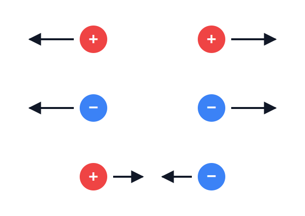
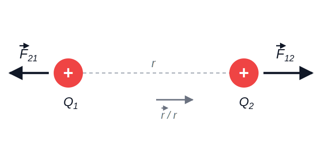
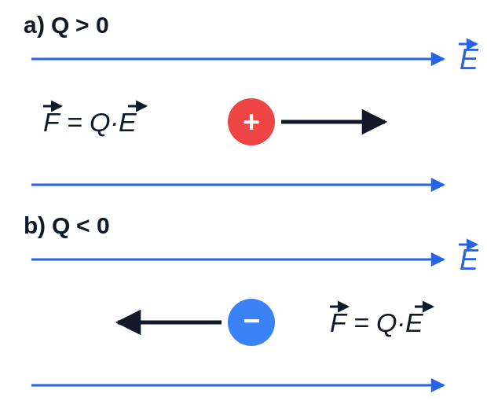

# Elektrotechnik – 2. Das elektrische Feld

**Luft- und Raumfahrttechnik Bachelor, 1. Semester**

David Straub

## 2. Das elektrische Feld

1. Elektrische Ladung
2. Coulomb’sches Gesetz
3. Elektrische Feldstärke
4. Feldlinien und Satz von Gauß
5. Elektrisches Feld in Materie
6. Potential, Spannung, Arbeit
7. Homogenes Feld und Kondensatoren

### Die vier fundamentalen Wechselwirkungen

1. **Gravitation** 🪐
    - Hält das Sonnensystem zusammen – wirkt auf Masse
2. **Elektromagnetismus** ⚡
    - Hält Atome und Moleküle zusammen – wirkt auf elektrische Ladung
3. **Starke Wechselwirkung** 🎨
    - Hält Atomkerne zusammen
4. **Schwache Wechselwirkung** ☢️
    - Verantwortlich für radioaktiven Zerfall

###

### Elektrische Ladung (*electric charge*)

- Alle Materie besteht aus Elementarteilchen, von denen einige elektrische Ladungen tragen
- Elektrische Ladungen treten in zwei Arten auf: positive und negative Ladungen (Vorzeichen: Konvention!)
- Gleichnamige Ladungen stoßen sich ab, ungleichnamige ziehen sich an

### Aufbau der Materie

- Atome bestehen aus positiv geladenen Protonen, neutralen Neutronen und negativ geladenen Elektronen
- Protonen und Neutronen bilden den Atomkern
- Elektronen bewegen sich in der Atomhülle um den Atomkern

### Elementarladung

- Elektrische Ladungen sind immer ganzzahlige Vielfache der Elementarladung $e= 1{,}602176634 \cdot 10^{-19} \, \text{C}$ (Definition des Coulombs – vgl. Kapitel 1!)
    - Elektron: $Q = -e$ (!)
    - Proton: $Q = +e$
    - Up-Quark: $Q = +\frac{2}{3}e$, Down-Quark: $Q = -\frac{1}{3}e$
- Man sagt, die Ladung sei *quantisiert*

### Coulomb’sches Gesetz (*Coulomb’s law*)

Die Kraft zwischen zwei Punktladungen ist $\sim Q_1 \cdot Q_2$ und $\sim 1/r^2$:

$$|\vec{F}_{12}| = k \cdot \frac{Q_1 \cdot Q_2}{r^2}$$

Im SI-System: $k = \frac{1}{4 \pi \varepsilon_0}$ mit der elektrischen Feldkonstante $\varepsilon_0 \approx 8{,}854 \cdot 10^{-12} \, \frac{\text{C}^2}{\text{N} \cdot \text{m}^2}$.

### Analogie zur Schwerkraft

Newtonsches Gravitationsgesetz: Kraft zwischen zwei Himmelskörpern

$$|\vec{F}_{12}| = G \cdot \frac{m_1 \cdot m_2}{r^2}$$

$G$: Gravitationskonstante, $G \approx 6{,}6743 \cdot 10^{-11} \, \frac{\text{m}^3}{\text{kg} \cdot \text{s}^2}$

### Beispiel: Relative Stärke von Coulomb- und Gravitationskraft

Wasserstoffatom: Proton + Elektron. Wie viel stärker ist die elektrische Anziehung als die Gravitation? (→ Tafel)

- Proton: $m_p \approx 1{,}67 \cdot 10^{-27} \, \text{kg}$, $Q_p = +e$
- Elektron: $m_e \approx 9{,}11 \cdot 10^{-31} \, \text{kg}$, $Q_e = -e$
- $\varepsilon_0 \approx 8{,}854 \cdot 10^{-12} \, \frac{\text{As}}{\text{Vm}}$
- $G \approx 6{,}6743 \cdot 10^{-11} \, \frac{\text{m}^3}{\text{kg} \cdot \text{s}^2}$

### Elektromagnetismus im Alltag

Fast alle alltäglichen physikalischen Phänomene werden von der elektromagnetischen Wechselwirkung bestimmt!

Die Gravitation spielt nur eine Rolle, da

- es keine negativen Massen gibt → immer anziehend
- sich die elektrischen Ladungen von Elektronen und Protonen exakt aufheben

### Elektrische Feldstärke (*electric field [strength]*)

- Ein elektrisch geladenes Teilchen übt eine Kraft auf andere elektrisch geladene Teilchen aus
- Diese Kraft ist umso größer, je größer die Ladung der Probeteilchen ist
- Elektrische Feldstärke: Kraft pro Ladungseinheit, die auf eine Probeladung wirkt

$$\vec{E} = \frac{\vec{F}}{Q} \Leftrightarrow \vec{F} = Q \cdot \vec{E}$$

Feld = ortsabhängige physikalische Größe (Vektorfeld/Skalarfeld)

$[\vec{E}] = \frac{\text{N}}{\text{C}}$

### Elektrisches Feld einer Punktladung

Die elektrische Feldstärke $\vec{E}$ im Abstand $r=|\vec{r}|$ einer Punktladung $Q$ ist:

$$\vec{E}(\vec r) = \frac{Q}{4 \cdot \pi \cdot \varepsilon_0 \cdot r^2} \cdot \frac{\vec{r}}{r} = \frac{Q}{4 \cdot \pi \cdot \varepsilon_0 \cdot r^2} \cdot \vec{e}_r$$

### 📝 Jetzt sind Sie dran: Coulomb & Feldstärke (zu zweit)

**Aufgabe 2**

a) Im Feld einer Punktladung $Q_1$ wirkt auf eine zweite Punktladung $Q_2$ eine Kraft $F_1 = 2 \cdot 10^{-8} \, \text{N}$. $Q_2$ wird entfernt. Welche Kraft $F_2$ wirkt auf eine neue Punktladung $Q_3$, die die **vierfache Ladung** besitzt und sich im **doppelten Abstand** zu $Q_1$ befindet? (Mit Begründung – ohne Taschenrechner lösbar!)

b) Eine Punktladung $Q = 10 \, \text{nC}$ befindet sich im Vakuum.
Wie groß ist die elektrische Feldstärke $E$ im Abstand $r_1 = 24 \, \text{cm}$?

c) Welche Kraft wirkt dort auf ein Elektron ($Q_e = -e$)? In welche Richtung?

### Zwischenstand & Ausblick

Heute:

- Ladung ist quantisiert ($e$) und hat zwei Vorzeichen
- Coulomb’sches Gesetz: $F \sim \frac{Q_1 Q_2}{r^2}$ – gleiche Form wie die Gravitation, aber *viel* stärker
- Elektrische Feldstärke $\vec{E} = \vec{F}/Q$: die Kraft, die eine Ladung „spüren würde"

**Nächste Woche:** Feldlinien – wie man Felder sichtbar macht, der Satz von Gauß und das elektrische Potential.
