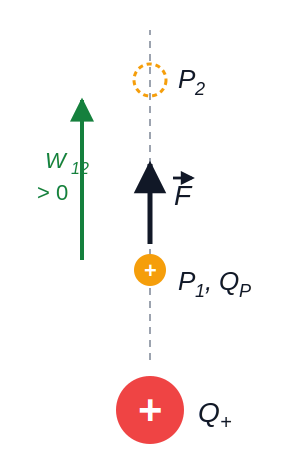
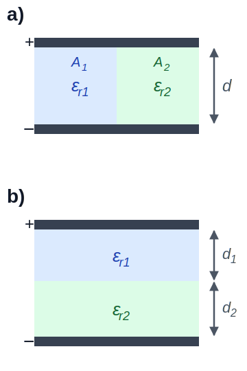

# Elektrotechnik – 2. Das elektrische Feld

**Luft- und Raumfahrttechnik Bachelor, 1. Semester**

David Straub

## 2. Das elektrische Feld

1. Elektrische Ladung
2. Coulomb’sches Gesetz
3. Elektrische Feldstärke
4. Feldlinien und Satz von Gauß
5. Elektrisches Feld in Materie
6. Potential, Spannung, Arbeit
7. Homogenes Feld und Kondensatoren

### Die vier fundamentalen Wechselwirkungen

1. **Gravitation** 🪐
    - Hält das Sonnensystem zusammen – wirkt auf Masse
2. **Elektromagnetismus** ⚡
    - Hält Atome und Moleküle zusammen – wirkt auf elektrische Ladung
3. **Starke Wechselwirkung** 🎨
    - Hält Atomkerne zusammen
4. **Schwache Wechselwirkung** ☢️
    - Verantwortlich für radioaktiven Zerfall

###

### Elektrische Ladung (*electric charge*)

- Alle Materie besteht aus Elementarteilchen, von denen einige elektrische Ladungen tragen
- Elektrische Ladungen treten in zwei Arten auf: positive und negative Ladungen (Vorzeichen: Konvention!)
- Gleichnamige Ladungen stoßen sich ab, ungleichnamige ziehen sich an

### Aufbau der Materie

- Atome bestehen aus positiv geladenen Protonen, neutralen Neutronen und negativ geladenen Elektronen
- Protonen und Neutronen bilden den Atomkern
- Elektronen bewegen sich in der Atomhülle um den Atomkern

### Elementarladung

- Elektrische Ladungen sind immer ganzzahlige Vielfache der Elementarladung $e= 1{,}602176634 \cdot 10^{-19} \, \text{C}$ (Definition des Coulombs – vgl. Kapitel 1!)
    - Elektron: $Q = -e$ (!)
    - Proton: $Q = +e$
    - Up-Quark: $Q = +\frac{2}{3}e$, Down-Quark: $Q = -\frac{1}{3}e$
- Man sagt, die Ladung sei *quantisiert*

### Coulomb’sches Gesetz (*Coulomb’s law*)

Die Kraft zwischen zwei Punktladungen ist $\sim Q_1 \cdot Q_2$ und $\sim 1/r^2$:

$$|\vec{F}_{12}| = k \cdot \frac{Q_1 \cdot Q_2}{r^2}$$

Im SI-System: $k = \frac{1}{4 \pi \varepsilon_0}$ mit der elektrischen Feldkonstante $\varepsilon_0 \approx 8{,}854 \cdot 10^{-12} \, \frac{\text{C}^2}{\text{N} \cdot \text{m}^2}$.

### Analogie zur Schwerkraft

Newtonsches Gravitationsgesetz: Kraft zwischen zwei Himmelskörpern

$$|\vec{F}_{12}| = G \cdot \frac{m_1 \cdot m_2}{r^2}$$

$G$: Gravitationskonstante, $G \approx 6{,}6743 \cdot 10^{-11} \, \frac{\text{m}^3}{\text{kg} \cdot \text{s}^2}$

### Beispiel: Relative Stärke von Coulomb- und Gravitationskraft

Wasserstoffatom: Proton + Elektron. Wie viel stärker ist die elektrische Anziehung als die Gravitation? (→ Tafel)

- Proton: $m_p \approx 1{,}67 \cdot 10^{-27} \, \text{kg}$, $Q_p = +e$
- Elektron: $m_e \approx 9{,}11 \cdot 10^{-31} \, \text{kg}$, $Q_e = -e$
- $\varepsilon_0 \approx 8{,}854 \cdot 10^{-12} \, \frac{\text{As}}{\text{Vm}}$
- $G \approx 6{,}6743 \cdot 10^{-11} \, \frac{\text{m}^3}{\text{kg} \cdot \text{s}^2}$

### Elektromagnetismus im Alltag

Fast alle alltäglichen physikalischen Phänomene werden von der elektromagnetischen Wechselwirkung bestimmt!

Die Gravitation spielt nur eine Rolle, da

- es keine negativen Massen gibt → immer anziehend
- sich die elektrischen Ladungen von Elektronen und Protonen exakt aufheben

### Elektrische Feldstärke (*electric field [strength]*)

- Ein elektrisch geladenes Teilchen übt eine Kraft auf andere elektrisch geladene Teilchen aus
- Diese Kraft ist umso größer, je größer die Ladung der Probeteilchen ist
- Elektrische Feldstärke: Kraft pro Ladungseinheit, die auf eine Probeladung wirkt

$$\vec{E} = \frac{\vec{F}}{Q} \Leftrightarrow \vec{F} = Q \cdot \vec{E}$$

Feld = ortsabhängige physikalische Größe (Vektorfeld/Skalarfeld)

$[\vec{E}] = \frac{\text{N}}{\text{C}}$

### Elektrisches Feld einer Punktladung

Die elektrische Feldstärke $\vec{E}$ im Abstand $r=|\vec{r}|$ einer Punktladung $Q$ ist:

$$\vec{E}(\vec r) = \frac{Q}{4 \cdot \pi \cdot \varepsilon_0 \cdot r^2} \cdot \frac{\vec{r}}{r} = \frac{Q}{4 \cdot \pi \cdot \varepsilon_0 \cdot r^2} \cdot \vec{e}_r$$

### 📝 Jetzt sind Sie dran: Coulomb & Feldstärke (zu zweit)

**Aufgabe 2**

a) Im Feld einer Punktladung $Q_1$ wirkt auf eine zweite Punktladung $Q_2$ eine Kraft $F_1 = 2 \cdot 10^{-8} \, \text{N}$. $Q_2$ wird entfernt. Welche Kraft $F_2$ wirkt auf eine neue Punktladung $Q_3$, die die **vierfache Ladung** besitzt und sich im **doppelten Abstand** zu $Q_1$ befindet? (Mit Begründung – ohne Taschenrechner lösbar!)

b) Eine Punktladung $Q = 10 \, \text{nC}$ befindet sich im Vakuum.
Wie groß ist die elektrische Feldstärke $E$ im Abstand $r_1 = 24 \, \text{cm}$?

c) Welche Kraft wirkt dort auf ein Elektron ($Q_e = -e$)? In welche Richtung?

### Zwischenstand & Ausblick

Heute:

- Ladung ist quantisiert ($e$) und hat zwei Vorzeichen
- Coulomb’sches Gesetz: $F \sim \frac{Q_1 Q_2}{r^2}$ – gleiche Form wie die Gravitation, aber *viel* stärker
- Elektrische Feldstärke $\vec{E} = \vec{F}/Q$: die Kraft, die eine Ladung „spüren würde"

**Nächste Woche:** Feldlinien – wie man Felder sichtbar macht, der Satz von Gauß und das elektrische Potential.

### Feldlinien

- Feldlinien stellen Richtung und Stärke des elektrischen Feldes bildlich dar
- Sie verlaufen von positiven zu negativen Ladungen und zeigen die Richtung der Kraft an, die auf eine **positive** Probeladung wirken würde
- Je dichter die Linien, desto stärker das Feld

### Feldlinien: Beispiele

 

### Feldlinien: Plattenkondensator

Zwischen zwei entgegengesetzt geladenen Platten: **homogenes Feld** (dazu gleich mehr)

### Superpositionsprinzip

Das elektrische Feld mehrerer Ladungen ist die **Vektorsumme** der Felder der einzelnen Ladungen:

$$\vec{E}(\vec{r}) = \sum_{i} \vec{E}_i(\vec{r})$$

- Felder stören sich nicht gegenseitig – sie addieren sich einfach
- Für kontinuierliche Ladungsverteilungen wird aus der Summe ein Integral (hier nicht vertieft)

### Elektrische Flussdichte (*electric flux density*)

$$\vec{D} = \varepsilon_0 \cdot \vec{E}$$

$$[\vec{D}] = [\varepsilon_0] \cdot [\vec{E}] = \frac{\text{C}^2}{\text{N} \cdot \text{m}^2} \cdot \frac{\text{N}}{\text{C}} = \frac{\text{C}}{\text{m}^2}$$

Fluss durch eine Fläche $A$:

$$\Psi = \int_{A} \vec{D} \cdot d\vec{A}$$

### Satz von Gauß (*Gauss’s law*)

Der elektrische Fluss durch eine **geschlossene** Oberfläche ist gleich der eingeschlossenen Ladung:

$$\oint_{A} \vec{D} \cdot d\vec{A} = Q_{\text{innen}}$$

Anschaulich: Feldlinien beginnen und enden nur auf Ladungen – was an Fluss „herauskommt", muss von Ladung im Inneren stammen.

Besonders nützlich bei **hoher Symmetrie** (Kugel, Zylinder, Ebene).

### Beispiel: Punktladung mit dem Satz von Gauß

Kugeloberfläche mit Radius $r$ um eine Punktladung $Q$ – aus Symmetriegründen ist $D$ überall auf der Kugel gleich groß und radial:

$$\oint_{A} \vec{D} \cdot d\vec{A} = D(r) \cdot 4\pi r^2 = Q$$

$$\Rightarrow \quad D(r) = \frac{Q}{4\pi r^2} \quad \Rightarrow \quad E(r) = \frac{Q}{4\pi \varepsilon_0 r^2}$$

Das Coulomb-Feld aus Woche 1 – jetzt ohne Coulomb’sches Gesetz hergeleitet!

### Elektrisches Feld in Materie

- In nicht oder schwach leitenden Materialien führen elektrische Felder zu **Polarisation**: die positiven und negativen Ladungen im Material verschieben sich gegeneinander
- Das erzeugt ein internes Gegenfeld, das das äußere Feld abschwächt
- Solche polarisierbaren Materialien nennt man **Dielektrika**

### Abschwächung des Feldes in Dielektrika

$$\vec{E}_\text{Materie} = \frac{1}{\varepsilon_r} \cdot \vec{E}_\text{Vakuum}$$

mit der Permittivitätszahl $\varepsilon_r \geq 1$ (auch relative Permittivität):

| Material     | $\varepsilon_r$ |
|--------------|------------------|
| Luft         | 1,00059          |
| Gummi        | 2,5–3,5          |
| Glas         | 5–7              |
| Destilliertes Wasser | 81       |

### Elektrische Flussdichte in Dielektrika

**Konvention:** $\vec{D}$ bezieht sich immer auf das Feld der *freien* Ladungen:

$$\vec{D} = \varepsilon_0 \varepsilon_r \vec{E}_\text{Materie} = \varepsilon \vec{E}_\text{Materie}, \qquad \varepsilon = \varepsilon_0 \varepsilon_r$$

Vorteil: der Satz von Gauß gilt unverändert, wenn man nur die freien Ladungen zählt:

$$\oint_{A} \vec{D} \cdot d\vec{A} = Q_{\text{innen, frei}}$$

### 📝 Jetzt sind Sie dran: Feldlinien & Dielektrika (zu zweit)

**Aufgabe 3**

a) Skizzieren Sie das Feldlinienbild zweier **gleichnamiger** Punktladungen. Wo ist das Feld null?

b) Die Punktladung aus letzter Woche ($Q = 10 \, \text{nC}$, $r = 24 \, \text{cm}$) wird von Vakuum in destilliertes Wasser ($\varepsilon_r = 81$) getaucht. Wie groß sind dort $E$ und $D$? Was ändert sich, was bleibt gleich?

### Elektrische Arbeit im Feld

Bewegung einer positiven Probeladung $Q_P$ im Feld einer positiven Punktladung $Q^+$:

- $P_1 \rightarrow P_2$ (nach außen): $W > 0$ – Arbeit wird freigesetzt
- $P_2 \rightarrow P_1$ (nach innen): $W < 0$ – Arbeit muss aufgebracht werden

Vgl. Mechanik: $W = \vec{F} \cdot \vec{s}$ — aber hier ist $\vec{F}$ abhängig von $r$!

$$W_{12} = \sum_{i} F_i \cdot \Delta r \quad \xrightarrow{\Delta r \to 0} \quad W_{12} = \int_{r_1}^{r_2} F(r) \, dr$$

### Elektrisches Potential

$$W_{12} = Q_P \int_{r_1}^{r_2} E(r) \, dr = Q_P \cdot \left[ \frac{Q^+}{4 \pi \varepsilon} \cdot \frac{1}{r_1} - \frac{Q^+}{4 \pi \varepsilon} \cdot \frac{1}{r_2} \right] = Q_P \cdot (\varphi_1 - \varphi_2)$$

Das **elektrische Potential** $\varphi$ im Abstand $r$ von einer Punktladung $Q$:

$$\varphi(r) = \frac{Q}{4 \pi \varepsilon_0 \varepsilon_r \cdot r}$$

Einheit: $[\varphi] = \frac{\text{J}}{\text{C}} = \text{V}$ (Volt)

### Äquipotentialflächen

Punkte gleichen Potentials bilden **Äquipotentialflächen** – sie stehen immer senkrecht auf den Feldlinien.

### Analogie: Gravitationspotential

$$E_\text{pot} = m \cdot g \cdot h = m \cdot \varphi_g(h)$$

- Höhenlinien auf der Landkarte = Äquipotentiallinien
- Die Kraft wirkt in Richtung des stärksten Gefälles (senkrecht zu den Höhenlinien)

Elektrostatische Felder sind **Potentialfelder**: Feldlinien beginnen/enden auf Ladungen („Quellen/Senken") und sind nie in sich geschlossen.

### Spannung & Arbeit

**Elektrische Spannung** (*voltage*) = Potentialdifferenz:

$$U_{12} = \varphi_1 - \varphi_2, \qquad [U] = \text{V}$$

**Elektrische Arbeit**:

$$W_{12} = Q \cdot (\varphi_1 - \varphi_2) = Q \cdot U_{12}, \qquad [W] = \text{J}$$

Die elektrische Arbeit ist **unabhängig vom Weg**!

### Feld und Spannung

Allgemeiner Zusammenhang zwischen Feldstärke und Spannung:

$$U_{12} = \int_{P_1}^{P_2} \vec{E} \cdot d\vec{s} = \varphi_1 - \varphi_2$$

### 📝 Jetzt sind Sie dran: Spannung (zu zweit)

**Aufgabe 4**

Noch einmal die Punktladung $Q = 10 \, \text{nC}$ (im Vakuum):

Welche Spannung $U$ besteht zwischen zwei Punkten, die $r_1 = 24 \, \text{cm}$ bzw. $r_2 = 50 \, \text{cm}$ von der Punktladung entfernt sind?

### Homogenes elektrisches Feld

- Konstante Feldstärke $E$ in Betrag und Richtung, parallele Feldlinien
- Äquipotentialflächen senkrecht zu den Feldlinien
- Spannung: $U = E \cdot d$ ($d$: Abstand in Feldrichtung)

### Kondensatoren (*capacitors*)

Kondensatoren sind Bauelemente, die elektrische Ladung speichern.

**Kapazität** (*capacitance*):

$$C := \frac{Q}{U}$$

Einheit: $[C] = \frac{\text{C}}{\text{V}} = \text{F}$ (Farad)

### ⚠️ Kapazität ≠ Kapazität

Die Kapazität (*capacity*) einer Batterie ist eine Ladungsmenge!

z.B.: $\text{mAh} = 10^{-3} \, \text{A} \cdot 3600 \, \text{s} = 3{,}6 \, \text{C}$

Nicht zu verwechseln mit der Kapazität (*capacitance*) eines Kondensators in Farad!

### Plattenkondensator

$$E = \frac{Q}{\varepsilon_0 \varepsilon_r A}, \qquad U = E \cdot d = \frac{Q \cdot d}{\varepsilon_0 \varepsilon_r A}$$

$$C = \frac{Q}{U} = \frac{\varepsilon_0 \varepsilon_r A}{d} = \frac{\varepsilon A}{d}$$

Kapazität steigt mit Fläche $A$, Permittivität $\varepsilon_r$ und kleinerem Abstand $d$.

### Kugel- und Zylinderkondensator

| | Kugel | Zylinder |
|---|---|---|
| | $C = 4\pi \varepsilon \dfrac{R_1 R_2}{R_2 - R_1}$ | $C = 2 \pi \varepsilon \dfrac{l}{\ln(R_2/R_1)}$ |

Herleitung: Satz von Gauß + $U = \int E \, dr$ (→ Skript; gleiche Methode wie beim Punktladungs-Beispiel)

### Parallelschaltung von Kondensatoren

$$C_{\text{ges}} = C_1 + C_2 + \dots + C_n = \sum_{i=1}^n C_i$$

- Gleiche Spannung an allen Kondensatoren
- Gesamtladung = Summe der Einzelladungen

### Reihenschaltung von Kondensatoren

$$\frac{1}{C_{\text{ges}}} = \frac{1}{C_1} + \frac{1}{C_2} + \dots + \frac{1}{C_n} = \sum_{i=1}^n \frac{1}{C_i}$$

- Gleiche Ladung auf allen Kondensatoren: $Q_1 = Q_2 = \dots = Q_\text{ges}$
- Gesamtspannung = Summe der Einzelspannungen

Herleitung: $C_{\text{ges}} = \frac{Q}{U_1 + U_2 + \dots} = \frac{Q}{Q \cdot \left(\frac{1}{C_1} + \frac{1}{C_2} + \dots\right)}$

### Energie im Kondensator

Beim Aufladen nimmt die Spannung mit der Ladung zu: $U(q) = \frac{q}{C}$

$$W = \int_0^Q U(q) \, dq = \int_0^Q \frac{q}{C} \, dq = \frac{Q^2}{2C} = \frac{1}{2} Q U = \frac{1}{2} C U^2$$

$$[W] = \text{V} \cdot \text{C} = \text{W} \cdot \text{s} = \text{J}$$

### Kondensatoren mit geschichteten Dielektrika

**Nebeneinander** (= Parallelschaltung):

$$C = \frac{\varepsilon_0}{d} \left(\varepsilon_{r1} A_1 + \varepsilon_{r2} A_2\right)$$

**Hintereinander** (= Reihenschaltung):

$$C = \frac{\varepsilon_0 \, \varepsilon_{r1} \varepsilon_{r2} \, A}{\varepsilon_{r2} d_1 + \varepsilon_{r1} d_2}$$

Anwendung: kapazitiver Ölstandsensor

### 📝 Jetzt sind Sie dran: Kondensatoren (zu zweit)

**Aufgabe 5**

Zwei Kondensatoren $C_1 = 1 \, \mu\text{F}$ und $C_2 = 4 \, \mu\text{F}$ werden **in Reihe** geschaltet und an eine Spannung $U = 5000 \, \text{V}$ gelegt.

a) Wie groß ist die Gesamtkapazität $C_g$?

b) Wie groß sind die Teilspannungen $U_1$ und $U_2$?

c) Wie viel Energie ist insgesamt gespeichert?

### Übersicht: Größen im elektrischen Feld

Größe | Definition | Einheit
--- | --- | ---
Elektrische Ladung (*electric charge*) | $Q$ | $[Q] = \text{C}$
Spannung (*voltage*) | $U = \Delta \varphi$ | $[U] = \text{V}$
Kapazität (*capacitance*) | $C = \frac{Q}{U}$ | $[C] = \text{F} = \frac{\text{C}}{\text{V}}$
Elektrische Feldstärke (*electric field [strength]*) | $\vec{E} = \frac{\vec{F}}{Q}$ | $[\vec{E}] = \frac{\text{V}}{\text{m}}=\frac{\text{N}}{\text{C}}$
Elektrische Flussdichte (*electric flux density*) | $\vec{D} = \varepsilon_0 \varepsilon_r \vec{E}$ | $[\vec{D}] = \frac{\text{C}}{\text{m}^2}$
Elektrische Feldkonstante (*electric constant*) | $\varepsilon_0$ | $[\varepsilon_0] = \frac{\text{C}^2}{\text{N} \cdot \text{m}^2}$
Relative Permittivität (*relative permittivity*) | $\varepsilon_r = \frac{\varepsilon}{\varepsilon_0}$ | dimensionslos

### Unsere Basiseinheiten-Tabelle wächst

| Elektrische Größe | Formelzeichen | Einheit | Basiseinheiten |
|---|---|---|---|
| Ladung | $Q$ | C | $\text{A} \cdot \text{s}$ |
| Spannung | $U$ | V | $\dfrac{\text{kg} \cdot \text{m}^2}{\text{A} \cdot \text{s}^3}$ |
| **Kapazität** | $C$ | F | $\dfrac{\text{A}^2 \cdot \text{s}^4}{\text{kg} \cdot \text{m}^2}$ |

Herleitung an der Tafel: $[U] = \frac{[W]}{[Q]}$, $[C] = \frac{[Q]}{[U]}$

### Zusammenfassung: Das elektrische Feld

- Feldlinien: von + nach −, Dichte = Feldstärke; Äquipotentialflächen ⊥ Feldlinien
- Satz von Gauß: $\oint \vec{D} \cdot d\vec{A} = Q_\text{innen}$ – mächtig bei Symmetrie
- Dielektrika schwächen das Feld: $E \to E/\varepsilon_r$
- Potential $\varphi$, Spannung $U = \varphi_1 - \varphi_2$, Arbeit $W = Q \cdot U$ (wegunabhängig!)
- Homogenes Feld: $U = E \cdot d$
- Kondensator: $C = Q/U$; Platte: $C = \varepsilon A/d$; parallel: $C$ addieren, in Reihe: $1/C$ addieren
- Energie: $W = \frac{1}{2} C U^2$

**Nächstes Kapitel:** Gleichstrom – jetzt bewegen sich die Ladungen! 🔌
