# Elektrotechnik – 3. Gleichstrom

**Luft- und Raumfahrttechnik Bachelor, 1. Semester**

David Straub

## 3. Gleichstrom

1. Stromstärke und Stromdichte
2. Stromleitung in Metallen
3. Ohm’sches Gesetz und Widerstand
4. Temperaturabhängigkeit des Widerstands
5. Die Kirchhoff’schen Gesetze
6. Reihen- und Parallelschaltung, Teilerregeln
7. Zweipoltheorie
8. Arbeit und Leistung
9. Reale Messungen im Gleichstromkreis

### Elektrischer Strom (*electric current*)

Strom ist der gerichtete Fluss von elektrischer Ladung

- Stromdichte $\vec{J} = \rho \cdot \vec{v}$
    - $\vec{v}$: Geschwindigkeit *positiver* Ladungsträger
- Stromstärke $I = \int_A \vec{J} \cdot d\vec{A} = \dfrac{dQ}{dt}$
- $[I] = \text{A} = \dfrac{\text{C}}{\text{s}}$
- $[\vec{J}] = \dfrac{\text{A}}{\text{m}^2}$

### Stromrichtung & Ladungsträger

- $\vec{J} = \rho \cdot \vec{v}$ zeigt in die Richtung, in die sich *positive* Ladung bewegt – egal ob die tatsächlichen Ladungsträger positiv oder negativ sind!
- Das ist auch die *Zählrichtung* der Stromstärke $I$ („technische Stromrichtung")

### Stromleitung in Metallen

- In Metallen gibt jedes Atom Elektronen ab, die sich frei im Gitter der positiv geladenen Atomrümpfe bewegen können („Elektronengas")
- Die Ladungsdichte der Elektronen ist jederzeit konstant, da eine Ansammlung ein elektrisches Feld erzeugen würde, das durch Abstoßung der Elektronen wieder ausgeglichen wird → der Leiter ist überall elektrisch neutral

### Metalle im elektrischen Feld

Klassisches Bild: erfährt das Elektronengas ein elektrisches Feld, werden die Elektronen beschleunigt, nach kurzer Zeit aber durch Stöße mit dem Metallgitter wieder abgebremst. Im Mittel ergibt sich eine konstante **Driftgeschwindigkeit** $\vec{v}_d$, *entgegen* der Feldrichtung: $\vec{v}_d = \vec{J}/\rho$ mit $\rho = -ne$.

### Zahlenbeispiel: Driftgeschwindigkeit im Kupferdraht

Kupfer, $A=1 \, \text{mm}^2$, $I=1 \, \text{A}$:

- Dichte freier Elektronen: $n \approx 8{,}5 \cdot 10^{28} \, \frac{1}{\text{m}^3}$
- Ladungsträgerdichte: $\rho = -n \cdot e \approx -1{,}36 \cdot 10^{10} \, \frac{\text{C}}{\text{m}^3}$
- Stromdichte: $|\vec{J}| = \frac{I}{A} = 1 \cdot 10^{6} \, \frac{\text{A}}{\text{m}^2}$
- Driftgeschwindigkeit: $|\vec{v_d}| = \frac{|\vec{J}|}{|\rho|} \approx 7{,}35 \cdot 10^{-5} \, \frac{\text{m}}{\text{s}} \approx 0{,}26 \, \frac{\text{m}}{\text{h}}$ 🐌

Warum geht das Licht trotzdem sofort an? → Das *Feld* breitet sich (fast) mit Lichtgeschwindigkeit aus, nicht die Elektronen.

### Ohm’sches Gesetz (*Ohm’s law*)

- Für ein gegebenes Material ist die Stromdichte umso höher, je höher das elektrische Feld ist
- Der Proportionalitätsfaktor ist die elektrische **Leitfähigkeit** $\sigma$:

$$\vec{J} = \sigma \cdot \vec{E}$$

Achtung: die proportionale Beziehung gilt nur für *lineare Leiter* (z.B. Metalle bei konstanter Temperatur)

### Ohm’sches Gesetz im linearen Leiter

$$\vec{J} = \sigma \cdot \vec{E}$$

Leiter der Länge $l$, Querschnitt $A$, homogenes Feld:

$$I = J \cdot A = \sigma \cdot E \cdot A = \sigma \cdot \frac{U}{l} \cdot A = \frac{U}{R}$$

**Elektrischer Widerstand** (*electric resistance*):

$$R = \frac{l}{\sigma \cdot A} = \rho_R \cdot \frac{l}{A}$$

### Widerstand und Leitwert

Der elektrische Widerstand $R$ ist definiert durch das Ohm’sche Gesetz:

$$R = \frac{U}{I}, \qquad [R] = \frac{\text{V}}{\text{A}} = \Omega \ \text{(Ohm)}$$

Der elektrische Leitwert $G$ ist der Kehrwert des Widerstands:

$$G = \frac{1}{R} = \frac{I}{U}, \qquad [G] = \frac{\text{A}}{\text{V}} = \text{S} \ \text{(Siemens)}$$

### Materialeigenschaften vs. Bauteilgrößen

**Materialeigenschaften** (unabhängig von der Geometrie):
- **Spezifischer Widerstand** $\rho$
- **Leitfähigkeit** $\sigma = \frac{1}{\rho}$

**Bauteilgrößen** (abhängig von der Geometrie):
- **Widerstand** $R = \rho \frac{l}{A}$
- **Leitwert** $G = \frac{1}{R} = \sigma \frac{A}{l}$

**Beispiel:** Kupfer hat immer die gleiche Leitfähigkeit $\sigma_{\text{Cu}} = 58 \, \text{MS/m}$, aber ein dickeres Kabel hat einen kleineren Widerstand $R$.

### Übersicht der Größen im linearen Leiter

Größe | Definition | Einheit | Name
--- | --- | --- | ---
Spannung (*voltage*) | $U = \Delta \varphi$ | $[U] = \text{V}$ | Volt
Stromstärke (*current*) | $I = \frac{\Delta Q}{\Delta t}$ | $[I] = \text{A}$ | Ampere
Widerstand (*resistance*) | $R = \frac{U}{I}$ | $[R] = \Omega$ | Ohm
Leitwert (*conductance*) | $G = \frac{1}{R}$ | $[G] = \text{S} = \frac{1}{\Omega}$ | Siemens
spezifischer Widerstand (*resistivity*) | $\rho = R \frac{A}{l}$ | $[\rho] = \Omega \cdot \text{m}$ | Ohm-Meter
Leitfähigkeit (*conductivity*) | $\sigma = \frac{1}{\rho}$ | $[\sigma] = \text{S/m}$ | Siemens pro Meter

### 📝 Jetzt sind Sie dran: Stromdichte & Widerstand (zu zweit)

**Aufgabe 6**

In einer Glühlampe (12 V, Kfz-Blinker) fließt ein Strom $I = 0{,}5 \, \text{A}$.

a) Wie groß ist die Stromdichte $S_1$ im Glühfaden ($d_1 = 100 \, \mu\text{m}$)?
b) Wie groß ist die Stromdichte $S_2$ in der Zuleitung ($d_2 = 1{,}5 \, \text{mm}$)?
c) Ein Kupferdraht hat die Länge $l = 5 \, \text{m}$ und den Querschnitt $A = 3 \, \text{mm}^2$ ($\rho_\text{Cu} = 1{,}79 \cdot 10^{-8} \, \Omega\text{m}$). Wie groß ist sein Widerstand $R$?
d) Welchen Widerstand hat ein Draht gleicher Abmessungen aus Aluminium ($\rho_\text{Al} = 2{,}6 \cdot 10^{-8} \, \Omega\text{m}$)?

### Temperaturabhängigkeit des Widerstands

Bei den meisten Materialien ändert sich der Widerstand mit der Temperatur.

Lineare Näherung:

$$R(T) = R(T_0) \cdot [1 + \alpha \cdot (T - T_0)]$$

- $\alpha$: Temperaturkoeffizient, $[\alpha] = \frac{1}{\text{K}}$
- $T_0$: Bezugstemperatur (üblicherweise 20 °C oder 0 °C)

### Leitfähigkeit verschiedener Materialien

Bei Leitern nimmt der Widerstand mit steigender Temperatur zu ($\alpha > 0$).

Typische Werte bei 20 °C:

| Leitermaterial | $\rho$ (µΩ·m) | $\sigma$ (MS/m) | $\alpha$ (1/K) |
|----------------|---------------|-----------------|----------------|
| Silber         | 0,016         | 63              | 3,8 · 10⁻³     |
| Kupfer         | 0,017         | 58              | 3,9 · 10⁻³     |
| Aluminium      | 0,027         | 38              | 4,3 · 10⁻³     |
| Messing        | 0,062         | 16              | 2,0 · 10⁻³     |

### Metalle als Temperatursensoren

Die Temperaturabhängigkeit macht Metalle zu präzisen Temperatursensoren.

**Platin-Widerstandsthermometer (Pt100):**
- $R(0 \, °\text{C}) = 100 \, \Omega$
- $\alpha_{\text{Pt}} = 3{,}85 \cdot 10^{-3} \, \text{K}^{-1}$

**Vorteile:** hohe Langzeitstabilität, Messbereich −200 °C bis +850 °C, gute Linearität

Klausur-Klassiker: aus gemessenem $R$ (oder $U$ bei bekanntem Strom) die Temperatur bestimmen! (→ Woche 5)

### Knotenpunktregel (1. Kirchhoff’sches Gesetz)

In einem Knotenpunkt kann weder Ladung gespeichert noch erzeugt werden. Die Summe aller zufließenden Ströme ist gleich der Summe aller abfließenden Ströme:

$$\sum_{k} I_{k} = 0$$

### Maschenregel (2. Kirchhoff’sches Gesetz)

Die Summe aller in einer Masche auftretenden Spannungen ist Null:

$$\sum_{k} U_{k} = 0$$

### Wie viele unabhängige Gleichungen gibt es?

Netzwerk mit $k$ Knoten und $z$ Zweigen:

- **Unabhängige Knotengleichungen:** $k - 1$
  (die letzte Knotengleichung folgt aus den anderen)
- **Unabhängige Maschengleichungen:** $z - (k - 1)$

Zusammen: $z$ Gleichungen für $z$ unbekannte Zweigströme ✓

Beispiel: 2 Knoten, 3 Zweige → 1 Knotengleichung + 2 Maschengleichungen

**Typische Prüfungsfrage:** „Wie viele *unabhängige* Knotenpunktgleichungen gibt es hier? Stellen Sie diese auf."

### Reihenschaltung von Widerständen

$$R_\text{ges} = R_1 + R_2 + \dots + R_n = \sum_{i=1}^{n} R_i$$

- Gleicher Strom durch alle Widerstände: $I = I_1 = I_2 = \dots = I_n$
- Gesamtspannung = Summe der Einzelspannungen
- Gesamtwiderstand > größter Einzelwiderstand

### Spannungsteiler

Bei einer Reihenschaltung teilt sich die Gesamtspannung im Verhältnis der Widerstände auf:

$$I = \frac{U}{R_\text{ges}} = \frac{U_1}{R_1} = \frac{U_2}{R_2}$$

### Parallelschaltung von Widerständen

$$\frac{1}{R_\text{ges}} = \frac{1}{R_1} + \frac{1}{R_2} + \dots + \frac{1}{R_n} \qquad\Leftrightarrow\qquad G_\text{ges} = \sum_{i=1}^{n} G_i$$

- Gesamtstrom = Summe der Einzelströme (Knotenregel!)
- Gleiche Spannung an allen Widerständen
- Gesamtwiderstand < kleinster Einzelwiderstand

Herleitung: $I_\text{ges} = \frac{U}{R_1} + \dots + \frac{U}{R_n} \stackrel{!}{=} \frac{U}{R_\text{ges}}$

### Stromteilerregel

Bei einer Parallelschaltung teilt sich der Gesamtstrom im umgekehrten Verhältnis der Widerstände bzw. im direkten Verhältnis der Leitwerte auf:

$$\frac{I}{G_\text{ges}} = \frac{I_1}{G_1} = \frac{I_2}{G_2} = \dots = \frac{I_n}{G_n}$$

### Reihe oder parallel? So erkennt man es *wirklich*

- **In Reihe** ⇔ beide führen zwingend **denselben Strom**
  ⇔ zwischen ihnen liegt **kein Knoten mit Abzweig**
- **Parallel** ⇔ beide hängen an **denselben zwei Knoten**
  ⇔ an beiden liegt zwingend **dieselbe Spannung**

⚠️ Wie die Schaltung *gezeichnet* ist, bedeutet **gar nichts**!

**Methode:** Knoten markieren (einfärben/nummerieren) → alle Punkte, die nur durch Draht verbunden sind, sind *derselbe* Knoten → dann neu zeichnen.

### 🤔 Reihe, parallel – oder keins von beidem?

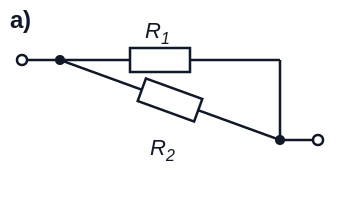 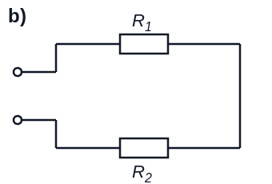
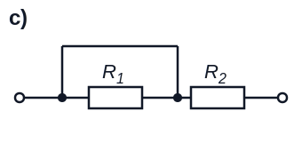 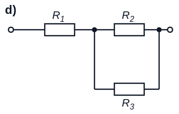

### 📝 Jetzt sind Sie dran: Spannungsteiler (zu zweit)

**Aufgabe 7**

Ein Spannungsteiler besteht aus $R_1 = R_2 = 1 \, \text{k}\Omega$ an einer Quelle $U = 12 \, \text{V}$. Am Abgriff (über $R_2$) wird die Spannung $U_a$ abgenommen. **Zeichnen Sie die Schaltung selbst!**

a) Wie groß ist $U_a$ im Leerlauf (kein Verbraucher angeschlossen)?

b) Nun wird ein Verbraucher $R_L = 1 \, \text{k}\Omega$ an den Abgriff angeschlossen (parallel zu $R_2$). Wie groß ist $U_a$ jetzt?

c) Wie viele Knoten, Zweige und unabhängige Gleichungen hat die Schaltung aus b)?

### Zwischenstand & Ausblick

Heute:

- Strom = Ladungstransport; $I = dQ/dt$, Stromdichte $J = I/A$
- Ohm: $R = U/I = \rho \, l/A$ – Material ($\rho$) × Geometrie ($l/A$)
- $R(T)$: linear mit Temperaturkoeffizient $\alpha$ → Pt100-Sensor
- Kirchhoff: $\sum I_k = 0$ (Knoten), $\sum U_k = 0$ (Masche); $k-1$ unabhängige Knotengleichungen
- Teilerregeln: Spannung ∝ R (Reihe), Strom ∝ G (parallel)
- Ein belasteter Spannungsteiler bricht ein!

**Nächste Woche:** Quellen und Zweipoltheorie – jedes lineare Netzwerk schrumpft auf zwei Kenngrößen.

### Zweipoltheorie

Ein Zweipol (*two-pole*) oder Eintor (*one-port*) ist ein elektrisches Bauteil mit zwei zugänglichen Anschlüssen.

**Das große Versprechen dieses Abschnitts:** Jedes noch so komplizierte lineare Netzwerk verhält sich an zwei Klemmen wie eine Quelle mit **zwei Kenngrößen** ($U_0$ und $R_i$).

### Passive lineare Zweipole

- Passiv: Zweipol gibt keine Energie ab
- Linear: Strom-Spannungs-Kennlinie ist eine Gerade

Passive lineare Zweipole können zu einem Ersatzwiderstand zusammengefasst werden:

$$U = R \cdot I$$

### Ideale Spannungsquelle

Eine ideale Spannungsquelle liefert eine konstante Spannung $U_0$, unabhängig von der Belastung.

- Konstante Klemmenspannung $U = U_0$
- Innenwiderstand $R_i = 0$
- Beliebiger Strom $I$ möglich

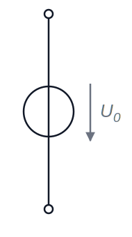

### Ideale Stromquelle

Eine ideale Stromquelle liefert einen konstanten Strom $I_0$, unabhängig von der Belastung.

- Konstanter Strom $I = I_0$
- Innenwiderstand $R_i = \infty$
- Beliebige Spannung $U$ möglich

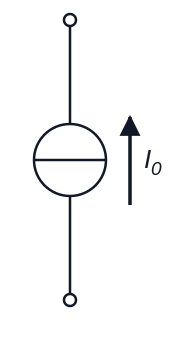

### Reale Spannungsquelle

Eine reale Spannungsquelle = ideale Spannungsquelle $U_0$ **in Reihe** mit einem Innenwiderstand $R_i$:

$$U = U_0 - R_i \cdot I$$

- Leerlauf ($I = 0$): $U = U_0$ (maximale Spannung)
- Kurzschluss ($U = 0$): $I_k = \frac{U_0}{R_i}$ (maximaler Strom)

### Reale Stromquelle

Eine reale Stromquelle = ideale Stromquelle $I_0$ **parallel** zu einem Innenwiderstand $R_i$:

$$I = I_0 - \frac{U}{R_i}$$

- Leerlauf: $U = I_0 \cdot R_i$
- Kurzschluss: $I = I_0$

### Die U-I-Kennlinie

Alle vier Quellentypen auf einen Blick – die reale Quelle ist eine fallende Gerade zwischen zwei Punkten, die man messen (oder berechnen) kann:

- $U_0$: Schnittpunkt mit der U-Achse (Leerlauf)
- $I_k$: Schnittpunkt mit der I-Achse (Kurzschluss)
- Steigung: $-R_i = -U_0/I_k$

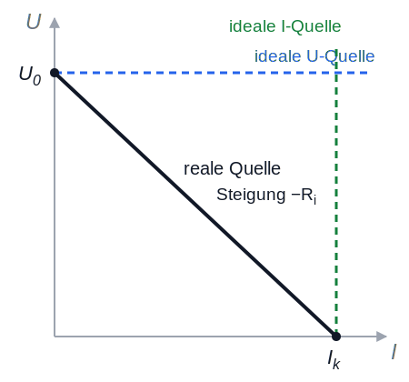

### Äquivalenz von realer Spannungs- und Stromquelle

Reale Spannungsquelle und reale Stromquelle sind **äquivalent** (gleiche Kennlinie!), wenn:

$$U_0 = I_0 \cdot R_i \qquad\Leftrightarrow\qquad I_0 = \frac{U_0}{R_i}$$

**Umrechnung** (gleiche $R_i$!):
- Spannungsquelle → Stromquelle: $I_0 = \frac{U_0}{R_i}$
- Stromquelle → Spannungsquelle: $U_0 = I_0 \cdot R_i$

Von außen sind beide nicht unterscheidbar – wählen Sie die Darstellung, die die Rechnung einfacher macht!

### Ersatzquelle eines beliebigen Netzwerks bestimmen 🔑

Jedes lineare Netzwerk mit Quellen lässt sich an zwei Klemmen a–b als **Ersatzspannungsquelle** ($U_0$, $R_i$) oder **Ersatzstromquelle** ($I_0$, $R_i$) darstellen. Rezept:

1. **Leerlaufspannung** $U_0$: Spannung an den offenen Klemmen berechnen
2. **Innenwiderstand** $R_i$: alle Quellen „deaktivieren" –
   Spannungsquellen → **Kurzschluss**, Stromquellen → **Unterbrechung** –
   dann Widerstand von den Klemmen aus berechnen
3. Kontrolle oder Alternative zu 2.: **Kurzschlussstrom** $I_k$ berechnen, dann $R_i = U_0 / I_k$

**Das ist die zentrale Technik der Klausur-Netzwerkaufgaben!**

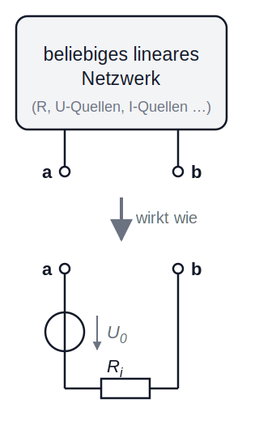

### Beispiel: Ersatzquelle des belasteten Spannungsteilers

Unser Spannungsteiler aus letzter Woche ($U = 12 \, \text{V}$, $R_1 = R_2 = 1 \, \text{k}\Omega$) als Ersatzquelle an den Abgriffklemmen:

→ Tafel:

1. $U_0 = U \cdot \frac{R_2}{R_1 + R_2} = 6 \, \text{V}$
2. Quelle deaktivieren (kurzschließen): $R_i = R_1 \parallel R_2 = 500 \, \Omega$
3. Last $R_L = 1 \, \text{k}\Omega$ anschließen: $U_a = U_0 \cdot \frac{R_L}{R_i + R_L} = 6 \cdot \frac{1000}{1500} = 4 \, \text{V}$ ✓

Gleiche Antwort wie letzte Woche – aber jetzt in 2 Zeilen statt Netzwerk-Umformung!

### Reihenschaltung von aktiven, linearen Zweipolen

Bei der Reihenschaltung von realen Spannungsquellen addieren sich Leerlaufspannungen und Innenwiderstände:

$$U_{0,\text{ges}} = \sum_j U_{0,j}, \qquad R_{i,\text{ges}} = \sum_j R_{i,j}$$

**Anwendung:** Batteriepacks (Taschenlampe, E-Auto)
**Vorteil:** höhere Gesamtspannung • **Nachteil:** höherer Innenwiderstand

### Parallelschaltung von aktiven, linearen Zweipolen

Bei der Parallelschaltung von realen Spannungsquellen mit gleicher Leerlaufspannung $U_0$ addieren sich die Leitwerte der Innenwiderstände:

$$\frac{1}{R_{i,\text{ges}}} = \sum_j \frac{1}{R_{i,j}}$$

**Anwendung:** höhere Ströme, Redundanz
**Nachteil:** nur bei gleichen Spannungen sinnvoll (sonst Ausgleichsströme!)

### 📝 Jetzt sind Sie dran: Ersatzquelle (zu zweit)

**Aufgabe 8** *(Klausuraufgaben-Typ!)*

Eine Spannungsquelle $U_e$ speist einen Spannungsteiler aus $R_1$ und $R_2$; an den Klemmen über $R_2$ wird $U_a$ abgenommen. **Schaltung zeichnen!**

a) Bestimmen Sie **allgemein** die Leerlaufspannung $U_0$, den Innenwiderstand $R_i$ und den Kurzschlussstrom $I_k$ der Ersatzquelle.

b) Gegeben: $U_e = 150 \, \text{V}$, im Leerlauf $U_a = 50 \, \text{V}$, bei $I = 0{,}5 \, \text{A}$ ist $U_a = 45 \, \text{V}$. Wie groß müssen $R_1$ und $R_2$ sein?

c) Wie groß muss ein Lastwiderstand $R_a$ sein, damit er die größtmögliche Leistung aufnimmt, und wie groß ist diese? *(Vorgriff auf nächste Woche – Vermutung reicht!)*

### 📝 Klausuraufgabe: Gleichstromnetzwerk (zu zweit)

Die Schaltung liefert an den Klemmen 1–2 die Spannung $U_a$:

a) Wie viele *unabhängige* Knotenpunktgleichungen gibt es? Stellen Sie sie auf.
b) **Leerlauf** ($R_a \to \infty$): Geben Sie $I_1$ und $I_2$ in Abhängigkeit der Stromquellen an.
c) Bestimmen Sie das **Spannungsquellen-Ersatzschaltbild** links der Klemmen 1–2 ($U_0$, $R_i$ allgemein).
d) Die Schaltung soll $U_0 = 10 \, \text{V}$ und $P_\text{max} = 5 \, \text{W}$ liefern. Wie groß muss $R_i$ sein?

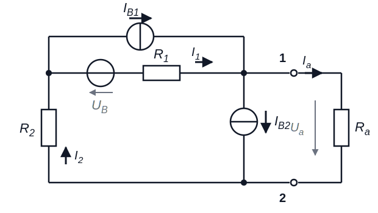

### Zwischenstand & Ausblick (Woche 4)

- Reale Quelle = zwei Kenngrößen: $U_0$ und $R_i$ (oder äquivalent $I_0 = U_0/R_i$)
- Kennlinie = fallende Gerade zwischen Leerlauf ($U_0$) und Kurzschluss ($I_k$)
- **Rezept Ersatzquelle:** $U_0$ im Leerlauf; $R_i$ mit deaktivierten Quellen; Kontrolle über $I_k$
- Quellen deaktivieren: U-Quelle → Kurzschluss, I-Quelle → Unterbrechung

**Nächste Woche:** Wie viel Leistung bekommt man aus einer Quelle heraus – und wie misst man in realen Schaltungen?

### Elektrische Arbeit (Energie)

Die elektrische Arbeit ist das Produkt aus Spannung, Strom und Zeit:

$$W = U \cdot I \cdot t = I^2 \cdot R \cdot t = \frac{U^2}{R} \cdot t$$

Einheit: $[W] = \text{V} \cdot \text{A} \cdot \text{s} = \text{W} \cdot \text{s} = \text{J}$ (Joule)

### Elektrische Leistung

Die elektrische Leistung ist Arbeit pro Zeiteinheit:

$$P = \frac{dW}{dt} = U \cdot I = I^2 \cdot R = \frac{U^2}{R}$$

Einheit: $[P] = \text{W}$ (Watt)

Die drei Schreibweisen sind über das Ohm’sche Gesetz äquivalent – nehmen Sie die, deren Größen Sie kennen.

### Leistungsanpassung

Bei welchem Verbraucherwiderstand $R$ liefert eine reale Quelle ($U_0$, $R_i$) die maximale Leistung an den Verbraucher?

$$P = R \cdot I^2 = U_0^2 \cdot \frac{R}{(R_i + R)^2}$$

- Leerlauf ($R \to \infty$): $P = 0$; Kurzschluss ($R = 0$): $P = 0$
- Maximum dazwischen: **$R = R_i$** (Herleitung → Tafel)

$$P_\text{max} = \frac{U_0^2}{4 R_i}$$

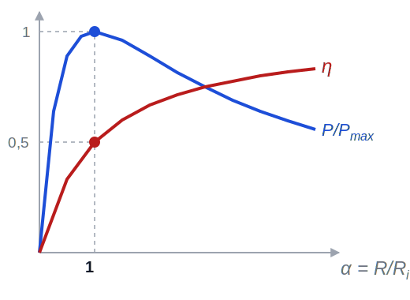

### Anpassungsverhältnis und Wirkungsgrad

Anpassungsverhältnis: $\alpha = \frac{R}{R_i}$

Wirkungsgrad = Verbraucherleistung / Gesamtleistung der Quelle:

$$\eta = \frac{P}{P_0} = \frac{R}{R_i + R} = \frac{\alpha}{1 + \alpha}$$

⚠️ Bei Leistungsanpassung ($\alpha = 1$) ist $\eta = 0{,}5$ – die Hälfte der Energie heizt die Quelle!

- Nachrichtentechnik: Anpassung (maximales Signal zählt)
- Energietechnik: Überanpassung $R \gg R_i$ (Wirkungsgrad zählt)

### Betriebszustände einer aktiven Quelle

|             | Last            | Leistung Quelle $P_0$                                | Leistung Last $P$               | Wirkungsgrad $\eta$ |
|-----------------|----------------------|------------------------------------------------------|---------------------------------|---------------------|
| Kurzschluss     | $R = 0$              | $P_0 = \frac{U_0^2}{R_i}$                            | $P = 0$                         | $\eta = 0$          |
| Unteranpassung  | $R < R_i$            | $P_0 = \frac{U_0^2}{R_i} \cdot \frac{R}{R+R_i}$      | $0 < P < P_\text{max}$          | $0 < \eta < 0{,}5$    |
| Anpassung       | $R = R_i$            | $P_0 = \frac{U_0^2}{2R_i}$                           | $P = \frac{U_0^2}{4R_i}$        | $\eta = 0{,}5$        |
| Überanpassung   | $R > R_i$            | $P_0 = \frac{U_0^2}{R_i} \cdot \frac{R}{R+R_i}$      | $0 < P < P_\text{max}$          | $0{,}5 < \eta < 1$    |
| Leerlauf        | $R \to \infty$       | $P_0 = 0$                                            | $P = 0$                         | $\eta = 1$          |

### U-I-Kennlinie und Arbeitspunkt

Quelle und Verbraucher in einem Diagramm:

- **Quelle:** fallende Gerade $U = U_0 - R_i \cdot I$
- **Verbraucher:** steigende Gerade $U = R \cdot I$
- Schnittpunkt = **Arbeitspunkt**: dort stellen sich $U$ und $I$ tatsächlich ein

Grafische Lösung – Klausuraufgaben sagen: „Ermitteln Sie grafisch …" oder „Arbeitspunkt einzeichnen"!

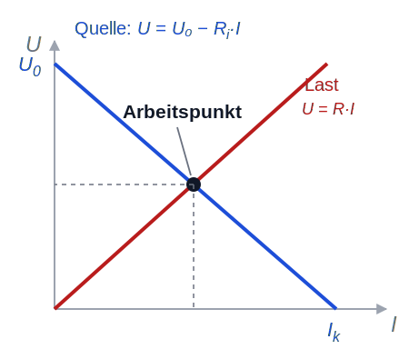

### 📝 Jetzt sind Sie dran: Autobatterie (zu zweit)

**Aufgabe 9** *(= Klausuraufgaben-Typ „Kennlinie aus Messwerten")*

An den Klemmen einer Autobatterie wird bei wechselnder Last gemessen:

| $U_a$/V | 11,8 | 11,6 | 11 | 10 | 8 |
|---------|------|------|-----|-----|-----|
| $I$/A   | 10   | 20   | 50  | 100 | 200 |

a) Bestimmen Sie die Leerlaufspannung $U_0$ und den Innenwiderstand $R_i$.

b) Die Batterie wird mit $R = 0{,}2 \, \Omega$ belastet. Wie hoch ist der Wirkungsgrad $\eta$?

### Reale Messungen: Spannung

Jedes reale Voltmeter hat einen **endlichen Innenwiderstand** und belastet die Schaltung:

- Digitalmultimeter (DMM): typisch $R_i \approx 10 \, \text{M}\Omega$
- Das Voltmeter liegt **parallel** zum Messobjekt → wirkt wie ein Lastwiderstand → **Lastfehler**, wenn $R_i$ nicht $\gg$ Quellwiderstand
- In Klausuraufgaben: „ideales Voltmeter" = $R_i \to \infty$, zieht keinen Strom

Faustregel: Spannungsmessung ist unkritisch, solange $R_\text{Quelle} \ll R_{i,\text{Voltmeter}}$

### Reale Messungen: Strom mit dem Shunt

Wie misst man große Ströme (z.B. 100 A im Bordnetz)? **Über einen Shunt:**

- Kleiner, präziser Widerstand (z.B. $R_S = 1 \, \text{m}\Omega$) im Strompfad
- Gemessen wird die **Spannung** über dem Shunt: $I = U_S / R_S$
- Bei 100 A: $U_S = 100 \, \text{mV}$ – gut messbar, Verlustleistung nur 10 W

Heute überall: Batteriemanagement, Motorsteuerungen, jedes DMM im Amperebereich hat intern einen Shunt.

### Reale Messungen: Vierleitermessung

Problem: Bei kleinen Widerständen (z.B. Pt100 mit $100 \, \Omega$) verfälscht der **Leitungswiderstand** der Zuleitungen die Messung.

**Lösung – Vierleitermessung:**

- Zwei Leitungen führen den (bekannten) Messstrom $I$
- Zwei separate Leitungen messen die Spannung **direkt am Sensor** – durch sie fließt (ideales Voltmeter!) kein Strom → kein Spannungsabfall → Leitungswiderstand fällt heraus

Klausur-Klassiker (SoSe 2019!) und Alltagstechnik: jedes Labornetzteil mit „Sense"-Klemmen.

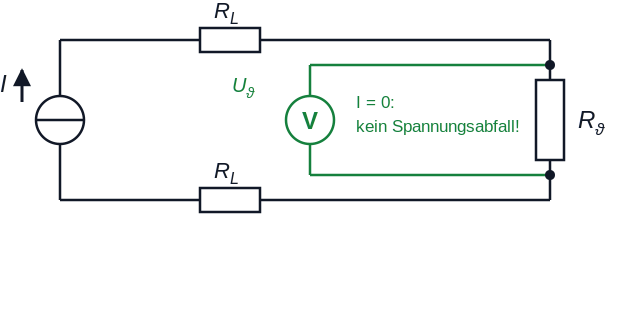

### 📝 Jetzt sind Sie dran: Temperaturmessung (zu zweit)

**Aufgabe 10** *(Klausuraufgaben-Typ SoSe 2019)*

Ein Pt100 ($R_0 = 100 \, \Omega$ bei $\vartheta_0 = 0 \, °\text{C}$, $\alpha = 4 \cdot 10^{-3} \, \text{K}^{-1}$) wird von einer idealen Stromquelle mit $I = 1 \, \text{mA}$ gespeist. Über eine Vierleitermessung wird direkt am Sensor $U_\vartheta = 120 \, \text{mV}$ gemessen.

a) Wie groß ist der Sensorwiderstand $R_\vartheta$?

b) Welche Temperatur $\vartheta$ hat der Sensor?

c) Welche Leistung $P_\vartheta$ nimmt der Sensor auf? Warum sollte sie klein bleiben?

### Unsere Basiseinheiten-Tabelle wächst

| Elektrische Größe | Formelzeichen | Einheit | Basiseinheiten |
|---|---|---|---|
| Ladung | $Q$ | C | $\text{A} \cdot \text{s}$ |
| Spannung | $U$ | V | $\frac{\text{kg} \cdot \text{m}^2}{\text{A} \cdot \text{s}^3}$ |
| Kapazität | $C$ | F | $\frac{\text{A}^2 \cdot \text{s}^4}{\text{kg} \cdot \text{m}^2}$ |
| **Widerstand** | $R$ | Ω | $\frac{\text{kg} \cdot \text{m}^2}{\text{A}^2 \cdot \text{s}^3}$ |
| **Leistung** | $P$ | W | $\frac{\text{kg} \cdot \text{m}^2}{\text{s}^3}$ |

Herleitung an der Tafel: $[R] = \frac{[U]}{[I]}$, $[P] = [U] \cdot [I]$

### Zusammenfassung: Gleichstrom

- $I = dQ/dt$; Ohm: $U = R \cdot I$; $R = \rho \, l / A$; $R(T)$ linear mit $\alpha$
- Kirchhoff: Knoten- und Maschenregel; $k-1$ unabhängige Knotengleichungen
- Reihe: R addieren, Spannungsteiler; parallel: G addieren, Stromteiler — **Topologie zählt, nicht die Zeichnung!**
- **Zweipoltheorie:** jedes lineare Netzwerk = $U_0$ + $R_i$; Quellen deaktivieren für $R_i$
- Leistungsanpassung: $P_\text{max} = U_0^2/4R_i$ bei $R = R_i$, dann $\eta = 0{,}5$
- Arbeitspunkt = Schnittpunkt von Quellen- und Lastkennlinie
- Messen: Lastfehler, Shunt, Vierleitermessung

**Nächstes Kapitel:** Magnetismus – das zweite große Feld der Elektrotechnik 🧲