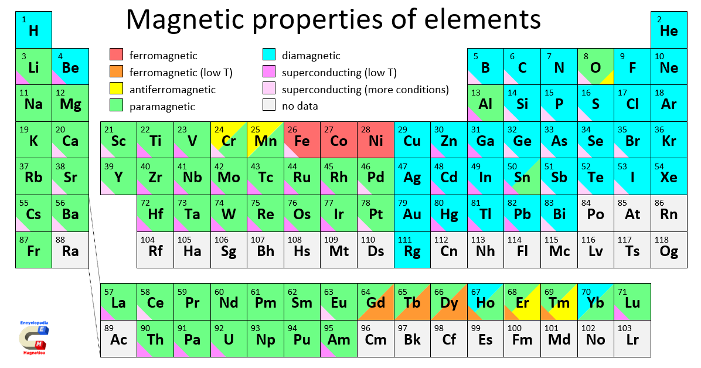

# Elektrotechnik – 4. Magnetismus

**Luft- und Raumfahrttechnik Bachelor, 1. Semester**

David Straub

## 4. Magnetismus

1. Magnetisches Feld
2. Kräfte im magnetischen Feld
3. Magnetische Feldgrößen und Durchflutungsgesetz
4. Materie im Magnetfeld
5. Der magnetische Kreis
6. Kraft am Luftspalt

### Elektrizität & Magnetismus

... sind untrennbar verbunden. Eine konsistente Naturbeschreibung erfordert beide.

Grenzfälle:

- Ruhende Ladungen → **Elektrostatik**
- Konstante Stromverteilungen → **Magnetostatik**
- Langsam bewegte Ladungen & langsam veränderliche Ströme → **Quasistatik**
- Allgemeiner Fall → **Elektrodynamik**

### Magnetpole

- Magnete besitzen immer zwei Pole: Nordpol (N) und Südpol (S)
    - Nordpol = Pol, der auf der Erde nach Norden zeigt
- Gleichnamige Pole stoßen sich ab, ungleichnamige Pole ziehen sich an

### Kräfte zwischen elektrischen Leitern

Zwei parallele, stromdurchflossene Leiter üben eine Kraft aufeinander aus:

$$\frac{|\vec{F_{12}}|}{l} = 2k_A \cdot \frac{I_1 I_2}{d}$$

Magnetfelder entstehen durch bewegte elektrische Ladungen (Ströme).

Im SI-System gilt $k_A = \frac{\mu_0}{4\pi}$ mit $\mu_0 \approx 4\pi \cdot 10^{-7} \, \frac{\text{N}}{\text{A}^2}$

### Wichtiger Unterschied zur Elektrostatik

- In der Elektrostatik haben wir die Feldstärke über die Kraft definiert: $\vec{E} = \frac{\vec{F}}{Q}$
- In der Magnetostatik geht das nicht so einfach, da die Kraft senkrecht zur Bewegungsrichtung der Ladung wirkt
- Experimentell lassen sich Feldlinien durch die Ausrichtung kleiner Permanentmagnete (Kompassnadeln) sichtbar machen

### Magnetische Feldlinien

- Magnetische Feldlinien zeigen in die Richtung, in die sich der Nordpol eines kleinen Testmagneten ausrichten würde: N → S außerhalb des Magneten
- Magnetische Feldlinien sind **immer geschlossen** (keine magnetischen Monopole!)
- Die Dichte der Feldlinien ist ein Maß für die Stärke des Magnetfeldes

### Magnetische Flussdichte $\vec{B}$

Die magnetische Flussdichte $\vec{B}$ zeigt entlang der magnetischen Feldlinien. Ihr Betrag ist proportional zur Dichte der Feldlinien.

### Rechte-Faust-Regel

- Ein gerader, stromdurchflossener Leiter erzeugt ein ringförmiges Magnetfeld. Wenn der Daumen der Faust in Stromrichtung zeigt, zeigen die gekrümmten Finger in Feldrichtung
- Alternativ: Eindrehen einer Schraube in Stromrichtung → Drehrichtung der Schraube entspricht der Feldlinienrichtung

### Magnetische Flussdichte eines stromdurchflossenen Leiters

Im Abstand $r$ von einem geraden, unendlich langen Leiter:

$$|\vec{B}| = \frac{\mu_0}{2\pi} \cdot \frac{I}{r}$$

Einheit: das **Tesla**

$$[\vec{B}] = [\mu_0] \cdot \frac{[I]}{[r]} = \frac{\text{N}}{\text{A}^2} \cdot \frac{\text{A}}{\text{m}} = \frac{\text{N}}{\text{A}\cdot\text{m}} = \text{T}$$

Zahlenbeispiel (→ Tafel): Wie viel Strom braucht man für 1 T in 1 m Abstand?

### Größenordnung der magnetischen Flussdichte

| Magnet                | Magnetische Flussdichte *B* |
|-----------------------------------|------------------------------------------|
| Erdmagnetfeld                     | 30 µT – 60 µT                            |
| Kühlschrankmagnet                 | 1 mT – 10 mT                             |
| Magnetstreifen (Kreditkarte)      | 10 mT – 100 mT                           |
| Lautsprechermagnet                | 100 mT – 1 T                             |
| MRT-Gerät            | 1 T – 3 T                             |
| Large Hadron Collider (LHC)  | 8 T                                      |
| Fusionskraftwerk  | 5–15 T |

### Kräfte im magnetischen Feld

**Lorentzkraft auf bewegte Ladung:**

$$\vec{F} = Q \cdot (\vec{v} \times \vec{B})$$

**Kraft auf stromdurchflossenen Leiter:**

$$\vec{F} = I \cdot (\vec{\ell} \times \vec{B})$$

- Skalar (wenn $\vec{\ell} \perp \vec{B}$): $F = I \cdot \ell \cdot B$
- **Rechte-Hand-Regel:** Daumen = Stromrichtung, Zeigefinger = Feldrichtung, Mittelfinger = Kraftrichtung

### Bewegte Ladung im Magnetfeld

**Kreisbewegung:**

- Lorentzkraft wirkt als Zentripetalkraft: $Q \cdot v \cdot B = \frac{m \cdot v^2}{r}$
- Bahnradius: $r = \frac{m \cdot v}{Q \cdot B}$
- Umlauffrequenz: $f = \frac{Q \cdot B}{2\pi m}$ (unabhängig von $v$!)

**Anwendungen:** Teilchenbeschleuniger (Zyklotron), Massenspektrometer

### Vergleich: Elektrisches und magnetisches Feld

| Eigenschaft | Elektrisches Feld | Magnetisches Feld |
|-------------|-------------------|-------------------|
| **Feldlinien** | Beginnen/enden auf Ladungen | Enden nie |
| **Quellen** | Ladungen | Keine (keine Monopole) |
| **Wirbel** | Keine (wirbelfrei) | Ströme erzeugen Wirbel |
| **Potential** | Darstellbar als Gradient | Nicht darstellbar |
| **Arbeit** | Wegunabhängig | Keine (Magnetostatik) |

**Elektrostatisches Feld** = Quellenfeld, wirbelfrei
**Magnetostatisches Feld** = quellenfrei, Wirbelfeld

### Magnetischer Fluss $\Phi$

Der magnetische Fluss $\Phi$ durch eine Fläche $A$:

$$\Phi = \int_A \vec{B} \cdot d\vec{A}$$

Einheit: $[\Phi] = \text{Vs} = \text{Wb}$ (Weber)

Da das magnetische Feld *quellenfrei* ist, gilt für jede geschlossene Fläche:

$$\oint_A \vec{B} \cdot d\vec{A} = 0$$

(Vergleiche: Satz von Gauß, $\oint_A \vec{D} \cdot d\vec{A} = Q_{\text{innen}}$)

### Magnetische Feldstärke $\vec{H}$

Die magnetische Feldstärke $\vec{H}$ beschreibt die Fähigkeit eines elektrischen Stroms, ein Magnetfeld zu erzeugen.

**Zusammenhang mit der magnetischen Flussdichte** (im Vakuum):

$$\vec{B} = \mu_0 \vec{H}$$

Einheit: $[H] = \frac{\text{A}}{\text{m}}$

**Beispiel:** gerader stromdurchflossener Leiter (Abstand $r$): $H = \frac{I}{2\pi r}$

### Durchflutungsgesetz (Ampèresches Gesetz)

Die Summe der magnetischen Feldstärke längs eines geschlossenen Weges ist gleich der Gesamtstromdurchflutung:

$$\Theta = N \cdot I = \oint \vec{H}(s) \cdot d\vec{s}$$

Erinnerung: in der Elektrostatik gilt aufgrund der Wegunabhängigkeit des Potentials:

$$\oint \vec{E}(s) \cdot d\vec{s} = 0$$

### Vergleich: Gaußsches Gesetz und Ampèresches Gesetz

| Elektrostatik | Magnetostatik |
|---------------|---------------|
| **Gaußsches Gesetz** | **Ampèresches Gesetz** |
| $\oint_A \vec{D} \cdot d\vec{A} = Q_{\text{innen}}$ | $\oint_s \vec{H} \cdot d\vec{s} = I_{\text{umschlossen}}$ |
| Quellenfeld | Wirbelfeld |
| **Wirbelfreiheit:** $\oint_s \vec{E} \cdot d\vec{s} = 0$ | **Quellenfreiheit:** $\oint_A \vec{B} \cdot d\vec{A} = 0$ |

**Anwendung bei Symmetrie:**
- Gauß → Kugel-, Zylinder-, Plattensymmetrie für Ladungen
- Ampère → Zylinder-, Ebenen-, Toroidsymmetrie für Ströme

### Magnetfeld einer langen Spule

Lange Spule mit $N$ Windungen, Länge $\ell$, Strom $I$. Durchflutungsgesetz:

$$\oint \vec{H} \cdot d\vec{s} = N \cdot I$$

**Im Inneren der Spule:**

$$H = \frac{N \cdot I}{\ell}, \qquad B = \mu_0 \mu_r H$$

**Außerhalb:** $B \approx 0$

### 📝 Jetzt sind Sie dran: Magnetfelder berechnen (zu zweit)

**Aufgabe 11**

a) Eine lange Spule hat $N = 500$ Windungen auf $\ell = 25 \, \text{cm}$ und führt $I = 1 \, \text{A}$. Wie groß sind $H$ und $B$ im Inneren (Luft)? Vergleichen Sie mit dem Erdmagnetfeld!

b) Bei einer langen Doppelleitung (Hin- und Rückleiter) beträgt der Achsabstand $a = 25 \, \text{cm}$; der Strom ist $I = 100 \, \text{A}$. Berechnen Sie allgemein den Betrag der magnetischen Feldstärke auf der Verbindungslinie zwischen den Leitern und werten Sie ihn in der Mitte aus. *(Tipp: Superposition – beide Beiträge addieren sich dort!)*

### Magnetisches Verhalten von Materie

Ähnlich wie bei Dielektrika im elektrischen Feld reagiert Materie im Magnetfeld durch **Magnetisierung**.

**Magnetische Dipole in Atomen:**

- Elektronen haben einen intrinsischen **Spin** (magnetischer Dipol)
- Bahnbewegung der Elektronen erzeugt **Bahnmagnetismus**
- Jedes Elektron ist ein winziger Permanentmagnet – makroskopische Magnete entstehen durch **Ausrichtung** vieler Spins

### Magnetische Suszeptibilität und Permeabilität

Die Magnetisierung $\vec{M}$ ist proportional zur magnetischen Feldstärke $\vec{H}$:

$$\vec{M} = \chi_m \vec{H}, \qquad \mu_r = 1 + \chi_m$$

**Reaktion auf äußeres Feld:**

- **Diamagnetismus:** gegen das äußere Feld ($\mu_r < 1$, $\chi_m < 0$)
- **Paramagnetismus:** mit dem äußeren Feld ($\mu_r > 1$, $\chi_m > 0$)
- **Ferromagnetismus:** starke Ausrichtung ($\mu_r \gg 1$)

### Magnetische Eigenschaften der Elemente

(S. Zurek, Encyclopedia Magnetica, CC-BY-SA 4.0)

### Diamagnetismus

- Tritt in **allen** Materialien auf; $\chi_m < 0$ (sehr klein), $\mu_r$ knapp unter 1
- Mechanismus: externes Feld induziert Änderung der Elektronenbahnen → magnetisches Moment **entgegen** dem äußeren Feld
- Effekt verschwindet mit dem Feld

**Beispiele:** Kupfer, Silber, Gold, Wasser, organische Materialien

Kuriosum: Diamagnete können in starken Feldern schweben →

### Paramagnetismus

- Atome besitzen **permanente magnetische Dipole**; $\chi_m > 0$ (klein), $\mu_r$ knapp über 1
- Ohne Feld: zufällige Ausrichtung (thermische Bewegung); mit Feld: partielle Ausrichtung **parallel**
- Paramagnete werden schwach von Magneten angezogen; stärker bei tiefen Temperaturen

**Beispiele:** **Aluminium**, Platin, Sauerstoff

⚠️ Merken für die Praxis: Aluminium ist *nicht* ferromagnetisch – ein Elektromagnet hebt keine Alu-Platten!

### Ferromagnetismus

- Sehr starke Magnetisierung: $\mu_r \gg 1$ (bis zu $10^5$!)
- **Spontane Magnetisierung** auch ohne externes Feld möglich
- Mechanismus: starke Wechselwirkung benachbarter Atome (**Austauschwechselwirkung**) → Bildung von **Weiss’schen Bezirken** (Domänen), die ein externes Feld ausrichtet

**Beispiele:** Eisen, Kobalt, Nickel

### Weiß’sche Bezirke

- Bereiche mit **gleich orientierten magnetischen Dipolen**
- Spontane Magnetisierung innerhalb der Bezirke

**Ohne äußeres Feld:** Bezirke zufällig orientiert → keine Gesamtmagnetisierung
**Mit äußerem Feld:** Bezirke richten sich aus; bei Sättigung einheitlich

### Ferromagnetismus: Hysterese

**Kenngrößen:**

- **Sättigungsmagnetisierung** (1): maximale Magnetisierung
- **Remanenz** (2): verbleibende Flussdichte bei verschwindendem äußeren Feld
- **Koerzitivfeldstärke** (3): Feldstärke zum Entmagnetisieren

Die Magnetisierung hängt von der *Vorgeschichte* ab – $B(H)$ ist keine eindeutige Funktion!

### Harte/weiche Magnete

- **Weichmagnetische Materialien:**
    - Schmale Hysteresekurve: leicht magnetisier- und entmagnetisierbar
    - Anwendung: Transformatoren, Elektromagnete

- **Hartmagnetische Materialien:**
    - Breite Hysteresekurve: behalten ihre Magnetisierung
    - Anwendung: Permanentmagnete, Motoren, Lautsprecher

### Magnetisches Feld und Magnetisierung

**Magnetisierung** $\vec{M}$: magnetisches Dipolmoment pro Volumeneinheit

$$\vec{B} = \mu_0(\vec{H} + \vec{M}) = \mu_0 \mu_r \vec{H}$$

**Konvention:** $\vec{H}$ beschreibt das durch **freie Ströme** erzeugte Feld – ohne Beiträge der Magnetisierung (vgl. $\vec{D}$ und freie Ladungen in der Elektrostatik!).

**Vorteil:** Das Durchflutungsgesetz gilt unverändert:

$$\oint \vec{H} \cdot d\vec{s} = I_{\text{frei}}$$

### Übersicht: Größen in der Magnetostatik

Größe | Definition | Einheit
--- | --- | ---
Magnetische Flussdichte (*magnetic flux density*) | $\vec{B}$ | $[\vec{B}] = \text{T} = \frac{\text{N}}{\text{A} \cdot \text{m}}$
Magnetische Feldstärke (*magnetic field [strength]*) | $\vec{H} = \frac{\vec{B}}{\mu_0 \mu_r}$ | $[\vec{H}] = \frac{\text{A}}{\text{m}}$
Magnetischer Fluss (*magnetic flux*) | $\Phi = \int_A \vec{B} \cdot d\vec{A}$ | $[\Phi] = \text{Vs} = \text{Wb}$
Durchflutung (*magnetomotive force*) | $\Theta = N \cdot I = \oint \vec{H} \cdot d\vec{s}$ | $[\Theta] = \text{A}$
Magnetische Feldkonstante | $\mu_0$ | $[\mu_0] = \frac{\text{N}}{\text{A}^2}$
Relative Permeabilität | $\mu_r = \frac{\mu}{\mu_0}$ | dimensionslos

### 📝 Jetzt sind Sie dran: Materie im Magnetfeld (zu zweit)

**Aufgabe 12** *(Begründungsfragen – Klausurstil!)*

a) Ein Elektromagnet soll in einer Recyclinganlage Metallteile sortieren. Kann er Aluminiumplatten anheben? Stahlplatten? (Mit Begründung!)

b) Lesen Sie aus der Hysteresekurve (vorige Folie) ab: Welche Größe muss ein Material für einen guten *Permanentmagneten* besitzen – und welche für einen guten *Transformatorkern*? (Mit Begründung!)

c) Ein Eisenkern wurde aufmagnetisiert und der Spulenstrom danach abgeschaltet. Warum ist $B$ im Kern nicht null?

### Zwischenstand – und nächste Woche: Übungsklausur!

Heute: Magnetfeld ($B$, $H$, $\Phi$, $\Theta$), Kräfte ($F = Q v B$, $F = I \ell B$), Durchflutungsgesetz, Materie (dia/para/ferro, Hysterese)

**Nächste Woche: Übungsklausur unter Klausurbedingungen**

- Stoff: Kapitel 1–3 (Einheiten, E-Feld, Gleichstrom)
- 60 Minuten, keine Hilfsmittel – wie in der echten Prüfung
- Mit „Ersatzwerten" wie im Original: wenn Sie eine Teilaufgabe nicht lösen, rechnen Sie mit dem Ersatzwert weiter!
- Danach: ausführliche Besprechung

**In zwei Wochen:** der magnetische Kreis – Magnetfelder berechnen wie Stromkreise.

### Der magnetische Kreis

**Definition:** geschlossener Pfad aus ferromagnetischem Material, durch den magnetischer Fluss geführt wird.

**Relevant in vielen Anwendungen:**

- Elektromotoren, Generatoren
- Transformatoren
- Induktives Laden
- Sensoren, Aktuatoren, Relais

**Problem:** Wie dimensioniert man diese Systeme effizient?

### Herausforderung: Komplexe Magnetfelder

**Direkter Ansatz wäre kompliziert:** 3D-Feldberechnung, numerische Simulation (FEM)

**Eindimensionale Lösung: der magnetische Kreis** – eine *mathematische Analogie* zum elektrischen Stromkreis:

- Einfache Berechnungen wie bei Widerstandsnetzwerken
- Gute Näherung für viele praktische Fälle

**Voraussetzung:** magnetischer Fluss „fließt" hauptsächlich durch ferromagnetisches Material

### Grundidee

**Elektrischer Kreis:** Spannung treibt Strom durch Widerstand: $U = R \cdot I$

**Magnetischer Kreis:** Durchflutung treibt magnetischen Fluss durch magnetischen Widerstand:

$$\Theta = R_m \cdot \Phi$$

**Wichtig:** Diese Analogie ist *mathematisch*, nicht physikalisch – es „fließt" nichts. Aber sie macht Magnetkreise so einfach berechenbar wie Widerstandsnetzwerke.

### Herleitung des magnetischen Widerstands

Homogener Kreis (konstantes $A$, ein Material, Feld folgt dem Materialweg):

$$\Theta = \oint \vec{H} \cdot d\vec{s} = H \cdot \ell$$

Mit $\Phi = B \cdot A$ und $B = \mu_0 \mu_r H$ folgt $H = \frac{\Phi}{\mu_0 \mu_r A}$, also:

$$\Theta = \frac{\ell}{\mu_0 \mu_r A} \cdot \Phi \qquad\Rightarrow\qquad \boxed{\Theta = R_m \cdot \Phi, \quad R_m = \frac{\ell}{\mu_0 \mu_r A}}$$

Das ist das **„Ohmsche Gesetz" des magnetischen Kreises**!

$[R_m] = \frac{\text{A}}{\text{Wb}} = \frac{1}{\text{H}}$ — analog zu $R = \frac{\ell}{\sigma A}$

### Magnetischer Leitwert (Permeanz)

Analog zum elektrischen Leitwert $G = \frac{1}{R}$:

$$\Lambda = \frac{1}{R_m} = \frac{\mu_0 \mu_r A}{\ell}, \qquad [\Lambda] = \frac{\text{Wb}}{\text{A}} = \text{H} \ \text{(Henry)}$$

Alternative Formulierung: $\Phi = \Lambda \cdot \Theta$

Große Permeabilität $\mu_r$ → großer Leitwert → viel Fluss.

### Zusammenfassung: Die Analogie

| Elektrischer Kreis | Magnetischer Kreis |
|---|---|
| Spannung $U=\int \vec{E} \cdot d\vec{s}$ | Durchflutung $\Theta = \oint \vec{H} \cdot d\vec{s}$ |
| Stromstärke $I=\int \vec{J} \cdot d\vec{A}$ | Magnetischer Fluss $\Phi = \int \vec{B} \cdot d\vec{A}$ |
| Widerstand $R = \frac{\ell}{\sigma A}$ | Mag. Widerstand $R_m = \frac{\ell}{\mu_0 \mu_r A}$ |
| Leitwert $G = \frac{1}{R}$ | Mag. Leitwert $\Lambda = \frac{1}{R_m}$ |
| $U = R \cdot I$ | $\Theta = R_m \cdot \Phi$ |

### Reihen- und Parallelschaltung magnetischer Widerstände

**Reihenschaltung** (verschiedene Abschnitte im selben Flusspfad — Eisen, Luftspalt, …):

$$R_{m,\text{ges}} = R_{m,1} + R_{m,2} + \ldots$$

Der gleiche Fluss $\Phi$ durchfließt alle Abschnitte (wie der Strom in der Reihenschaltung).

**Parallelschaltung** (der Fluss verzweigt sich auf mehrere Schenkel):

$$\frac{1}{R_{m,\text{ges}}} = \frac{1}{R_{m,1}} + \frac{1}{R_{m,2}} + \ldots$$

Am Verzweigungspunkt gilt die „Knotenregel": $\sum_k \Phi_k = 0$ — auch **magnetische Ersatzschaltbilder** zeichnet man wie Stromkreise! *(Klausuraufgabe WS 2000/01: Kern mit drei Schenkeln)*

### Praxisbeispiel: Elektromagnet mit Luftspalt

**Typische Anwendung:** Schaltschütz, Relais, Hubmagnet

**Aufbau:**

- Eisenkern mit Spule ($N$ Windungen, Strom $I$)
- Luftspalt der Länge $\delta$, Eisenweg $\ell_E$, Querschnitt $A$

$$R_{m,\text{ges}} = \underbrace{\frac{\ell_E}{\mu_0 \mu_r A}}_{\text{Eisen}} + \underbrace{\frac{\delta}{\mu_0 A}}_{\text{Luftspalt}}, \qquad \Phi = \frac{N \cdot I}{R_{m,\text{ges}}}$$

### Die überraschende Dominanz des Luftspalts

**Zahlenwerte (typisch):** Eisenweg $\ell_E = 30$ cm, $\mu_r = 2000$; Luftspalt $\delta = 1$ mm

$$\frac{R_{m,L}}{R_{m,E}} = \frac{\delta \cdot \mu_r}{\ell_E} = \frac{0{,}001 \cdot 2000}{0{,}3} \approx 6{,}7$$

**Der Luftspalt ist 7× wichtiger, obwohl er 300× kürzer ist!**

**Praktische Näherung** für $\mu_r \gg 1$ und $\delta \mu_r \gg \ell_E$: Eisenwiderstand vernachlässigen, $R_{m,\text{ges}} \approx R_{m,L}$. In Klausuraufgaben oft als „$\mu_r \to \infty$" formuliert!

### Kraft am Luftspalt

Ein Elektromagnet zieht ferromagnetisches Material an. Die Kraft pro Polfläche:

$$\boxed{F = \frac{B^2 \cdot A}{2 \mu_0}}$$

- $B$: Flussdichte im Luftspalt, $A$: Polfläche
- Herleitung über die Energie des Magnetfelds → Kapitel 5
- ⚠️ Bei einem U-Kern gibt es **zwei** Polflächen → zwei Luftspalte, doppelte Kraft (bzw. halbe Kraft pro Fläche nötig)

**Typische Klausuraufgabe:** Hubmagnet/Bestückungsautomat dimensionieren – von der geforderten Kraft rückwärts zu $B$, $\Phi$ und $I$.

### 📝 Jetzt sind Sie dran: Elektromagnet dimensionieren (zu zweit)

**Aufgabe 13** *(= Klausuraufgabe WiSe 2018/19!)*

Ein Elektromagnet am Roboterarm soll Eisenblechtafeln ($F_g = 160 \, \text{N}$) anheben. U-förmiger Kern, Querschnitt $A = 8 \, \text{cm}^2$ pro Pol, Luftspalt $d = 0{,}5 \, \text{mm}$ pro Pol (Verschmutzung), $\mu_r \to \infty$, $N = 1000$ Windungen. Hinweis: normierter Luftspalt (1 mm, 1 cm²) hat $R_{m} = 8 \cdot 10^6 \, \text{H}^{-1}$; $F = \frac{B^2 A}{2\mu_0}$ mit $\mu_0 = 1{,}25 \cdot 10^{-6} \, \frac{\text{Vs}}{\text{Am}}$.

a) Skizzieren Sie das magnetische Ersatzschaltbild. Wie groß ist $R_{m,\text{ges}}$ (zwei Luftspalte!)?
b) Welche Kraft muss **pro Luftspalt** wirken? Welche Flussdichte $B_\text{min}$ ist dafür nötig?
c) Welcher Strom $I$ stellt die notwendige Kraft sicher?
d) Kann der Magnet auch Aluminiumplatten anheben? (Begründung!)

### Unsere Basiseinheiten-Tabelle wächst

| Elektrische Größe | Formelzeichen | Einheit | Basiseinheiten |
|---|---|---|---|
| Ladung | $Q$ | C | $\text{A} \cdot \text{s}$ |
| Spannung | $U$ | V | $\frac{\text{kg} \cdot \text{m}^2}{\text{A} \cdot \text{s}^3}$ |
| Kapazität | $C$ | F | $\frac{\text{A}^2 \cdot \text{s}^4}{\text{kg} \cdot \text{m}^2}$ |
| Widerstand | $R$ | Ω | $\frac{\text{kg} \cdot \text{m}^2}{\text{A}^2 \cdot \text{s}^3}$ |
| **Magn. Flussdichte** | $B$ | T | $\frac{\text{kg}}{\text{A} \cdot \text{s}^2}$ |
| **Magn. Fluss** | $\Phi$ | Wb | $\frac{\text{kg} \cdot \text{m}^2}{\text{A} \cdot \text{s}^2}$ |

Herleitung an der Tafel: $[B] = \frac{[F]}{[I] \cdot [\ell]}$, $[\Phi] = [B] \cdot [A]$

### Zusammenfassung: Magnetismus

- Magnetfelder entstehen durch bewegte Ladungen; Feldlinien sind **immer geschlossen**
- Kräfte: $\vec{F} = Q(\vec{v} \times \vec{B})$ bzw. $F = I \ell B$; Rechte-Hand-Regel
- Durchflutungsgesetz: $\Theta = NI = \oint \vec{H} \cdot d\vec{s}$; lange Spule: $H = NI/\ell$
- Materie: dia- ($\mu_r < 1$), para- ($\mu_r \gtrsim 1$), ferromagnetisch ($\mu_r \gg 1$, Hysterese!)
- **Magnetischer Kreis:** $\Theta = R_m \Phi$ mit $R_m = \frac{\ell}{\mu_0 \mu_r A}$ — rechnen wie im Stromkreis
- Der Luftspalt dominiert; Kraft am Luftspalt: $F = \frac{B^2 A}{2\mu_0}$

**Nächstes Kapitel:** Elektromagnetische Induktion – wie aus Bewegung Spannung wird ⚡

### Vertiefung: Magnetfeld in einem Tokamak

### Vertiefung: Magnetfeld in einem Tokamak

Ringförmiges Fusionsreaktor-Design mit toroidalem Magnetfeld zum Plasmaeinschluss.

**Toroidale Feldspulen (TF):** $N$ Spulen, $M$ Windungen, Strom $I$; Ampèresches Gesetz auf kreisförmigem Weg (Radius $r$):

$$H \cdot 2\pi r = N M I \quad\Rightarrow\quad H(r) = \frac{N M I}{2\pi r}$$

Feld nimmt mit $1/r$ ab (inhomogen); typisch $B \approx 5{-}15 \, \text{T}$

**Beispiel ITER:** 18 TF-Spulen, 134 Windungen, 68 kA → B = 5,3 T bei 6,2 m Radius