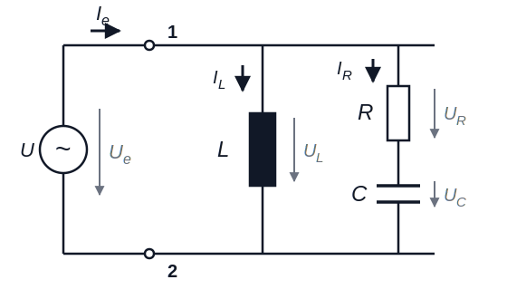

# Elektrotechnik – 6. Wechselstrom

**Luft- und Raumfahrttechnik Bachelor, 1. Semester**

David Straub

## 6. Wechselstrom

1. Grundlegende Begriffe und Kennwerte
2. Komplexe Wechselstromrechnung
3. Wechselstromwiderstände (Impedanz, Admittanz)
4. Grundschaltungen
5. Leistung (Wirk-, Blind-, Scheinleistung)
6. Blindleistungskompensation
7. Resonanz und Frequenzverhalten

### Wechselstrom: Grundlagen

**Periodische Größen:**

- Sich zeitlich wiederholende physikalische Größen
- Periodendauer $T$ → $u(t) = u(t + T)$
- Frequenz: $f = \frac{1}{T}$, Kreisfrequenz: $\omega = 2\pi f$

**Wechselgrößen:**

Periodische elektrische Größen mit verschwindendem arithmetischem Mittelwert

### Wechselgrößen: Eigenschaften

**Fourier-Analyse:** Jede Wechselgröße kann als Überlagerung von Sinusvorgängen dargestellt werden

$$a(t) = \sum_{n=1}^{\infty} \hat{A}_n \cdot \sin(n \cdot \omega t + \varphi_n)$$

→ Es genügt, **sinusförmige** Größen zu verstehen!

### Arithmetischer Mittelwert

**Definition:**
$$\overline{a} = \frac{1}{T} \cdot \int_{t_0}^{t_0 + T} a(t) \, dt$$

**Für sinusförmige Wechselgrößen** $a(t) = \hat{A} \cdot \sin(\omega t + \varphi_a)$ gilt:

$$\overline{a} = 0$$

### Gleichrichtwert

**Definition:**
$$\overline{|a|} = \frac{1}{T} \cdot \int_{t_0}^{t_0+T} |a(t)| \, dt$$

**Für sinusförmige Wechselgrößen:**

$$\overline{|a|} = \frac{2}{\pi} \cdot \hat{A} \approx 0{,}637 \cdot \hat{A}$$

### Effektivwert: Definition

**Physikalischer Hintergrund:** derjenige Wert einer Wechselgröße, der in seiner Wirkung bei Energieumformung einem Gleichstrom entspricht:

$$W_\text{el} = I^2 \cdot R \cdot T \stackrel{!}{=} \int_{0}^{T} i^2(t) \cdot R \, dt \quad\Rightarrow\quad I_\text{eff} = \sqrt{\frac{1}{T} \int_{0}^{T} i^2(t) \, dt}$$

**Allgemeine Definition** (quadratischer Mittelwert, *RMS*):

$$A_\text{eff} = \sqrt{\frac{1}{T} \cdot \int_{t_0}^{t_0 + T} a^2(t) \, dt}$$

### Effektivwert für Sinusschwingungen

$$A_\text{eff} = \sqrt{\frac{1}{T} \cdot \int_{0}^{T} \hat{A}^{2} \cdot \sin^{2}(\omega t) \, dt} = \frac{\hat{A}}{\sqrt{2}} \approx 0{,}707 \cdot \hat{A}$$

**Beispiele:**

- Netzspannung: $U_\text{eff} = 230 \, \text{V}$ → $\hat{U} = \sqrt{2} \cdot 230 \, \text{V} = 325 \, \text{V}$
- Haushaltssicherung: $I_\text{eff} = 16 \, \text{A}$ → $\hat{I} = 22{,}6 \, \text{A}$

**Der Effektivwert wird von Messgeräten angezeigt!**

### Zusammenfassung: Kennwerte von Wechselgrößen

| Kennwert | Formel | Für Sinusfunktion |
|----------|--------|-------------------|
| **Arithmetischer Mittelwert** | $\overline{a} = \frac{1}{T} \int a(t) \, dt$ | $\overline{a} = 0$ |
| **Gleichrichtwert** | $\overline{\|a\|} = \frac{1}{T} \int \|a(t)\| \, dt$ | $\approx 0{,}637 \cdot \hat{A}$ |
| **Effektivwert** | $A_\text{eff} = \sqrt{\frac{1}{T} \int a^2(t) \, dt}$ | $\frac{\hat{A}}{\sqrt{2}} \approx 0{,}707 \cdot \hat{A}$ |

**Notation ab jetzt:** Kleinbuchstaben $u(t), i(t)$ = Zeitverläufe; $\hat{U}, \hat{I}$ = Amplituden; $U, I$ (ohne Index!) = **Effektivwerte**

### 📝 Jetzt sind Sie dran: Effektivwert (zu zweit)

**Aufgabe 17**

a) Ein Oszilloskop zeigt eine sinusförmige Spannung mit Spitzenwert $\hat{U} = 17 \, \text{V}$. Was zeigt ein Multimeter an?

b) Eine Rechteckspannung springt periodisch zwischen $+10 \, \text{V}$ und $-10 \, \text{V}$ (je halbe Periode). Berechnen Sie den arithmetischen Mittelwert, den Gleichrichtwert und den Effektivwert **aus den Definitionen**.

c) Warum gilt die Faustregel $A_\text{eff} = \hat{A}/\sqrt{2}$ hier nicht?

### Zeigerdarstellung

**Sinusförmige Wechselgrößen** können als rotierende Zeiger in der komplexen Ebene dargestellt werden.

**Zeigereigenschaften:**

- Winkelgeschwindigkeit: $\omega = 2\pi f$
- Länge: Amplitude (oder Effektivwert, s.u.)
- Winkel zum Zeitpunkt $t=0$: $\varphi_u$

### Komplexe Darstellung

Anstatt mit trigonometrischen Funktionen zu rechnen, verwenden wir die Exponentialfunktion:

$$\underline{u}(t) = \hat{U} \cdot e^{j(\omega t + \varphi_u)} = \underbrace{\underbrace{\hat{U} \, e^{j\varphi_u}}_{\text{Festzeiger } \underline{U}} \; e^{j\omega t}}_{\text{Drehzeiger}}$$

**Reale Zeitfunktion:**
$$u(t) = \text{Re}\,\underline{u}(t) = \hat{U} \cdot \cos(\omega t + \varphi_u)$$

Bei **einer** festen Frequenz rotieren alle Zeiger gleich schnell → der Faktor $e^{j\omega t}$ kürzt sich aus allen Gleichungen → wir rechnen nur mit **Festzeigern**!

### ⚠️ Konvention: Amplituden- oder Effektivwertzeiger?

Zwei verbreitete Konventionen für die Zeigerlänge:

- **Amplitudenzeiger:** $\underline{U} = \hat{U} \, e^{j\varphi_u}$
- **Effektivwertzeiger:** $\underline{U} = U \, e^{j\varphi_u}$ mit $U = \hat{U}/\sqrt{2}$

**In der Prüfung** (und in der Energietechnik allgemein) sind **Effektivwertzeiger** üblich: „$\underline{U} = U \cdot e^{j\varphi_u} = 8\,\text{V} \cdot e^{j\pi/2}$ (komplexer Effektivwert)".

Für Impedanzen ist es egal (Quotient!) — für die **Leistung** nicht: $\underline{S} = \underline{U} \, \underline{I}^*$ gilt mit Effektivwertzeigern (mit Amplitudenzeigern: Faktor $\frac{1}{2}$).

### Komplexe Zahlen: Grundlagen

**Imaginäre Einheit** (in der Elektrotechnik als $j$ notiert – $i$ ist der Strom!):
$$j = \sqrt{-1}, \quad j^2 = -1$$

**Komplexe Zahl:**
$$\underline{z} = a + jb$$

mit Realteil $a = \text{Re}\, \underline{z}$ und Imaginärteil $b = \text{Im}\,\underline{z}$

### Euler’sche Formel

$$e^{j\varphi} = \cos(\varphi) + j\sin(\varphi)$$

**Wichtige Spezialfälle** (auswendig!):

- $e^{j0} = 1$
- $e^{j\pi/2} = j$
- $e^{j\pi} = -1$
- $e^{j3\pi/2} = e^{-j\pi/2} = -j$

### Darstellungsformen

**Komponentenform (kartesisch):** $\underline{Z} = R + jX$

**Polarform (Exponentialform):** $\underline{Z} = Z \cdot e^{j\varphi}$

**Umrechnung:**

- Betrag: $Z = \sqrt{R^2 + X^2}$
- Phase: $\varphi = \arctan\left(\frac{X}{R}\right)$ (Quadrant prüfen!)
- Realteil: $R = Z \cos\varphi$; Imaginärteil: $X = Z \sin\varphi$

### Konjugiert komplexe Zahl

$$\underline{Z} = R + jX \quad \Rightarrow \quad \underline{Z}^* = R - jX$$

$$\underline{Z} = Z \cdot e^{j\varphi} \quad \Rightarrow \quad \underline{Z}^* = Z \cdot e^{-j\varphi}$$

**Eigenschaften:**

- $\underline{Z} \cdot \underline{Z}^* = |\underline{Z}|^2 = Z^2$ (reell!)
- $\text{Re}\,\underline{Z} = \dfrac{\underline{Z} + \underline{Z}^*}{2}$

### Rechenregeln

**Addition/Subtraktion** → Komponentenform:
$$\underline{Z}_1 \pm \underline{Z}_2 = (R_1 \pm R_2) + j(X_1 \pm X_2)$$

**Multiplikation** → Polarform: Beträge multiplizieren, Phasen **addieren**:
$$\underline{Z}_1 \cdot \underline{Z}_2 = Z_1 Z_2 \cdot e^{j(\varphi_1 + \varphi_2)}$$

**Division** → Polarform: Beträge dividieren, Phasen **subtrahieren**:
$$\frac{\underline{Z}_1}{\underline{Z}_2} = \frac{Z_1}{Z_2} \cdot e^{j(\varphi_1 - \varphi_2)}$$

(in Komponentenform: mit konjugiertem Nenner erweitern)

**Faustregel: addieren kartesisch, multiplizieren polar!**

### 📝 Jetzt sind Sie dran: Komplexe Zahlen (zu zweit)

**Aufgabe 18**

Gegeben: $u(t) = 325\,\text{V} \cdot \cos(\omega t)$ und $i(t) = 10\,\text{A} \cdot \sin(\omega t)$
*(Hinweis: $\sin(\omega t) = \cos(\omega t - 90°)$)*

a) Zeichnen Sie beide Größen als **Zeiger** im Zeigerdiagramm.
b) Stellen Sie $\underline{U}$ und $\underline{I}$ in **kartesischer Form** dar.
c) Wandeln Sie beide in **Polarform** um.
d) Berechnen Sie $\underline{U} \cdot \underline{I}^*$ in beiden Darstellungen.
e) Vergleichen Sie die Ergebnisse: Was fällt auf?

### Grundelemente im Wechselstromkreis

Die drei Grundelemente im Wechselstromkreis sind:

- Ohmscher Widerstand R 
- Kapazität C 
- Induktivität L 

### Ohmscher Widerstand

Mit $u = R \cdot i$ und sinusförmigen Verläufen folgt:

$$\hat{U} = R \cdot \hat{I}, \qquad \varphi_u = \varphi_i$$

**Bei ohmschen Widerständen sind Strom und Spannung in Phase.**

### Leistung am ohmschen Widerstand

Momentanleistung (für $\varphi_u = \varphi_i = 0$):

$$p(t) = u(t) \cdot i(t) = \hat{U} \hat{I} \sin^2(\omega t) = \frac{\hat{U} \hat{I}}{2} (1 - \cos(2\omega t)) \geq 0$$

Mittlere Leistung:

$$\overline{p} = \frac{\hat{U} \hat{I}}{2} = U_\text{eff} \cdot I_\text{eff}$$

**Leistung wird ständig verbraucht → Wirkwiderstand**

### Beispiel: Einphasiges Laden von E-Autos

Ein Elektrofahrzeug wird mit Wechselstrom bei $U_\text{eff} = 230 \, \text{V}$ und $I_\text{eff} = 16 \, \text{A}$ geladen:

$$P = U_\text{eff} \cdot I_\text{eff} = 3680 \, \text{W} \approx 3{,}7 \, \text{kW}$$

- Ladedauer für 40-kWh-Akku: ca. 11 Stunden
- Bei $I_\text{eff} = 32 \, \text{A}$: $P \approx 7{,}4 \, \text{kW}$

### Kondensator im Wechselstromkreis

Die Änderung der Ladung ist der Strom:

$$i = \frac{dQ}{dt} = C \cdot \frac{du}{dt}$$

Einsetzen der Sinusverläufe (→ Tafel) liefert:

- Amplituden: $\frac{\hat{U}}{\hat{I}} = \frac{1}{\omega C}$
- Phasen: $\varphi_u - \varphi_i = -\frac{\pi}{2}$

**Am Kondensator eilt der Strom der Spannung um $\frac{\pi}{2}$ voraus.**

### Leistung am Kondensator

$$p(t) = u(t) \cdot i(t) = U_\text{eff} \, I_\text{eff} \cdot \sin(2\omega t)$$

- Positive Leistung: Aufladen; negative: Entladen
- **Mittlere Leistung:** $\overline{p} = 0$

→ **Blindwiderstand**: Energie pendelt zwischen Quelle und elektrischem Feld

### Induktivität im Wechselstromkreis

Grundgleichung (Selbstinduktion, Kapitel 5!):

$$u = L \cdot \frac{di}{dt}$$

Einsetzen der Sinusverläufe liefert:

- Amplituden: $\frac{\hat{U}}{\hat{I}} = \omega L$
- Phasen: $\varphi_u - \varphi_i = +\frac{\pi}{2}$

**An der Induktivität eilt die Spannung dem Strom um $\frac{\pi}{2}$ voraus.**

Merkspruch: „Bei Induktivitäten die Ströme sich verspäten; im Kondensator eilt der Strom vor."

### Leistung an der Induktivität

$$p(t) = U_\text{eff} \, I_\text{eff} \cdot \sin(2\omega t)$$

- Positive Leistung: Aufbau des Magnetfelds; negative: Abbau
- **Mittlere Leistung:** $\overline{p} = 0$

→ **Blindwiderstand**: Energie pendelt zwischen Quelle und Magnetfeld

### Impedanz & Admittanz

**Impedanz** (komplexer Widerstand):
$$\underline{Z} = \frac{\underline{U}}{\underline{I}} = \frac{U}{I} \cdot e^{j(\varphi_u - \varphi_i)}$$

**Admittanz** (komplexer Leitwert):
$$\underline{Y} = \frac{1}{\underline{Z}}$$

**Ohm’sches Gesetz, Kirchhoff, Reihen-/Parallelschaltung, Teiler, Zweipoltheorie — alles gilt weiter, nur mit komplexen Größen!**

### Impedanzen der Grundelemente

**Ohmscher Widerstand:** $\underline{Z}_R = R$

**Kapazität** (Strom eilt vor): 
$$\underline{Z}_C = \frac{1}{j\omega C} = -j\,\frac{1}{\omega C}, \qquad \underline{Y}_C = j\omega C$$

**Induktivität** (Spannung eilt vor):
$$\underline{Z}_L = j\omega L, \qquad \underline{Y}_L = \frac{1}{j\omega L} = -j\,\frac{1}{\omega L}$$

| | R | C | L |
|---|---|---|---|
| $\underline{Z}$ | $R$ | $\frac{1}{j\omega C}$ | $j\omega L$ |
| $\underline{Y}$ | $\frac{1}{R}$ | $j\omega C$ | $\frac{1}{j\omega L}$ |

### Serienschaltung R und L

**Komplexe Maschenregel:**
$$\underline{U} = \underline{U}_R + \underline{U}_L = (R + j\omega L) \cdot \underline{I}$$

**Impedanz:**
$$\underline{Z} = R + j\omega L$$

**Betrag und Phase:**
$$Z = \sqrt{R^2 + (\omega L)^2}, \qquad \varphi = \arctan\frac{\omega L}{R}$$

### Parallelschaltung R und L

**Komplexe Knotenregel:**
$$\underline{I} = \underline{I}_R + \underline{I}_L = \underline{Y} \cdot \underline{U}$$

**Admittanz** (parallel → Admittanzen addieren!):
$$\underline{Y} = \frac{1}{R} - j\,\frac{1}{\omega L}$$

**Betrag und Phase:**
$$Z = \frac{1}{\sqrt{\frac{1}{R^2} + \frac{1}{(\omega L)^2}}}, \qquad \varphi = \arctan\frac{R}{\omega L}$$

### Serienschaltung / Parallelschaltung R und C

**Serie:**
$$\underline{Z} = R - j\,\frac{1}{\omega C}, \qquad Z = \sqrt{R^2 + \left(\tfrac{1}{\omega C}\right)^2}, \qquad \varphi = -\arctan\frac{1}{\omega C R}$$

**Parallel:**
$$\underline{Y} = \frac{1}{R} + j\omega C, \qquad Z = \frac{1}{\sqrt{\frac{1}{R^2} + (\omega C)^2}}, \qquad \varphi = -\arctan(\omega C R)$$

Vorzeichen von $\varphi$: **kapazitiv → negativ, induktiv → positiv**

### Übersichtstabelle Grundschaltungen

| Schaltung | $\underline{Z}$ | $\underline{Y}$ | $\|Z\|$ | $\varphi$ |
|----------------------|-------------------|--------------------|-------------------|----------------|
| R-L Serie | $R + j\omega L$ | $\frac{R - j\omega L}{R^2 + \omega^2 L^2}$ | $\sqrt{R^2 + (\omega L)^2}$ | $\arctan \frac{\omega L}{R}$ |
| R-L Parallel | $\frac{\omega LR(\omega L + jR)}{R^2 + \omega^2 L^2}$ | $\frac{1}{R} - j \frac{1}{\omega L}$ | $\frac{1}{\sqrt{\frac{1}{R^2} + \frac{1}{(\omega L)^2}}}$ | $\arctan \frac{R}{\omega L}$ |
| R-C Serie | $R - j \frac{1}{\omega C}$ | $\frac{\omega C (\omega CR + j)}{1 + \omega^2 C^2 R^2}$ | $\sqrt{R^2 + \left(\frac{1}{\omega C}\right)^2}$ | $-\arctan\frac{1}{\omega CR}$ |
| R-C Parallel | $\frac{R(1 - j\omega CR)}{1 + \omega^2 C^2 R^2}$ | $\frac{1}{R} + j\omega C$ | $\frac{1}{\sqrt{\frac{1}{R^2} + (\omega C)^2}}$ | $-\arctan\omega CR$ |

### 📝 Jetzt sind Sie dran: RL-Schaltung komplett (zu zweit)

**Aufgabe 19** *(Klausur-Grundmuster — mit Zeigerdiagramm!)*

Eine Reihenschaltung aus $R = 40 \, \Omega$ und einer Spule mit $\omega L = 30 \, \Omega$ liegt an $\underline{U} = 10 \, \text{V} \cdot e^{j0}$ (komplexer Effektivwert).

a) Berechnen Sie $\underline{Z}$ in Komponenten- und Polarform.
b) Berechnen Sie den Strom $\underline{I}$ sowie $\underline{U}_R$ und $\underline{U}_L$.
c) **Zeichnen Sie das Zeigerdiagramm** mit $\underline{U}$, $\underline{I}$, $\underline{U}_R$, $\underline{U}_L$ (Achsen skalieren!).
d) Geben Sie für den Strom an: Effektivwert $I$, Amplitude $\hat{I}$ und Phase $\varphi_i$.

### Rückblick: Leistung an R, L und C

**Am Widerstand R:** $\overline{p} = U I$ — Energie wird verbraucht, $\varphi = 0°$

**An C und L:** $\overline{p} = 0$ — Energie pendelt, $\varphi = \mp 90°$

**In der Praxis:** Kombinationen aus R, L, C mit **beliebiger Phasenverschiebung** $0° < |\varphi| < 90°$ (Motor: $\varphi \approx 30°$–$60°$; Netzteil: R-C)

**Frage:** Wie berechnet man die Leistung bei beliebigem $\varphi$?

### Momentanleistung mit Phasenverschiebung

$$p(t) = u(t) \cdot i(t) = \hat{U} \cos(\omega t) \cdot \hat{I} \cos(\omega t - \varphi)$$

Mit trigonometrischer Umformung und Effektivwerten $U$, $I$:

$$p(t) = \underbrace{U I \cos\varphi}_{P} \cdot [1 + \cos(2\omega t)] + \underbrace{U I \sin\varphi}_{Q} \cdot \sin(2\omega t)$$

- Die Leistung oszilliert mit **doppelter Frequenz**
- Ein **konstanter** Anteil (wird verbraucht) + ein **pendelnder** Anteil (Mittelwert 0)

### Wirk-, Blind- und Scheinleistung

**Wirkleistung** (Mittelwert, tatsächlich umgesetzt):
$$\boxed{P = U I \cos\varphi} \qquad [P] = \text{W}$$

**Blindleistung** (pendelnder Energiefluss):
$$\boxed{Q = U I \sin\varphi} \qquad [Q] = \text{var}$$

**Scheinleistung** (Netzbelastung, Dimensionierung!):
$$\boxed{S = U I = \sqrt{P^2 + Q^2}} \qquad [S] = \text{VA}$$

Vorzeichen von $Q$: induktiv **positiv**, kapazitiv **negativ**.

### Blindleistung: Praktische Bedeutung

Blindleistung trägt **nicht** zur nutzbaren Leistung bei, belastet aber das Netz:

- Höhere Ströme in Leitungen und Transformatoren
- Erhöhte Verluste: $P_\text{Verlust} = R \cdot I^2$
- Spannungsabfälle im Netz

**Beispiel Transformator mit $S_\text{max} = 10 \, \text{kVA}$:**
bei $\cos\varphi = 0{,}7$ liefert er nur $P = 7 \, \text{kW}$ — voll ausgelastet, aber 30 % „verschenkt".

**Konsequenz:** Industriekunden zahlen Strafgebühren bei $\cos\varphi < 0{,}9$.

### Komplexe Scheinleistung: Motivation

**Naiver Ansatz:** $\underline{U} \cdot \underline{I} = U I \cdot e^{j(\varphi_u + \varphi_i)}$ — die Phasen *addieren* sich → **falsch!**

Wir brauchen die *Differenz* $\varphi = \varphi_u - \varphi_i$.

**Lösung: konjugiert komplexer Strom**

$$\underline{U} \cdot \underline{I}^* = U e^{j\varphi_u} \cdot I e^{-j\varphi_i} = U I \cdot e^{j\varphi} = \underbrace{U I \cos\varphi}_{P} + j \underbrace{U I \sin\varphi}_{Q}$$

### Definition der komplexen Scheinleistung

$$\boxed{\underline{S} = \underline{U} \cdot \underline{I}^* = P + jQ}$$

- **Betrag:** $S = |\underline{S}| = \sqrt{P^2 + Q^2}$
- **Phase:** $\varphi = \varphi_u - \varphi_i$

**Alternative Darstellungen:**
$$\underline{S} = \underline{Z} \cdot I^2 = \frac{U^2}{\underline{Z}^*}$$

**Beispiel RL-Reihenschaltung:** $\underline{S} = I^2 (R + j\omega L)$ — Realteil = Wirkleistung an R, Imaginärteil = Blindleistung an L. **Am Vorzeichen von $\text{Im}\,\underline{S}$ erkennt man die Impedanzcharakteristik** (+ induktiv, − kapazitiv)!

### Leistungsdreieck

Das **Leistungsdreieck** visualisiert den Zusammenhang:

- Wirkleistung: $P = S \cos\varphi$
- Blindleistung: $Q = S \sin\varphi$
- Scheinleistung: $S = \sqrt{P^2 + Q^2}$
- Phasenwinkel: $\tan\varphi = \frac{Q}{P}$

**Beispiel Industriebetrieb:** $P = 800 \, \text{kW}$, $Q = 600 \, \text{kvar}$ → $S = 1000 \, \text{kVA}$, $\varphi \approx 37°$ — der Trafo muss für 1000 kVA ausgelegt sein!

### Leistungsfaktor cos φ

$$\lambda = \cos\varphi = \frac{P}{S}$$

| Verbraucher | cos φ | Bemerkung |
|-------------|-------|-----------|
| Glühbirne, Heizung | ≈ 1,0 | rein ohmsch |
| Motor ohne Last | ≈ 0,3 | viel Magnetisierung |
| Motor Volllast | ≈ 0,85 | besser, aber nicht ideal |
| Transformator | ≈ 0,8–0,9 | Streuinduktivität |
| Modernes Netzteil (PFC) | > 0,95 | mit Kompensation |

Energieversorger fordern $\cos\varphi > 0{,}9$; bei $\cos\varphi = 0{,}7$ statt $0{,}95$ fließt **26 % mehr Strom** für dieselbe Wirkleistung.

### Blindleistungskompensation

**Problem bei induktiven Verbrauchern** (Motoren, Trafos): $Q_L > 0$, niedriger $\cos\varphi$, hohe Ströme, Strafzahlungen.

**Lösung:** Kondensatoren **parallel** schalten — $Q_C < 0$ kompensiert $Q_L > 0$:

$$Q_C = Q_1 - Q_2 = P \cdot (\tan\varphi_1 - \tan\varphi_2)$$

($\varphi_1$: vorher, $\varphi_2$: Ziel; vollständige Kompensation: $\varphi_2 = 0$)

**Warum parallel?** Damit die Spannung am Verbraucher — und damit seine Wirkleistung — unverändert bleibt!

### Kompensation: Praxisbeispiel

Betrieb: $P = 100 \, \text{kW}$, $\cos\varphi_1 = 0{,}8$ ($\varphi_1 \approx 37°$), $U = 400 \, \text{V}$

**Vorher:** $Q_L = 75 \, \text{kvar}$, $S_1 = 125 \, \text{kVA}$, $I_1 = 312 \, \text{A}$

**Kompensation auf $\cos\varphi_2 = 1$:** $Q_C = -75 \, \text{kvar}$

**Nachher:** $S_2 = P = 100 \, \text{kVA}$, $I_2 = 250 \, \text{A}$

- Strom: **−20 %**, Leitungsverluste ($\propto I^2$): **−36 %**, keine Strafzahlungen

### 📝 Jetzt sind Sie dran: Leuchtstoffröhre (zu zweit)

**Aufgabe 20** *(= Palme B5, Aufgabe 2 — kompletter Klausur-Durchlauf)*

Eine Leuchtstoffröhre mit Vorschaltdrossel (= Reihenschaltung aus $R$ und $L$; $P = 40 \, \text{W}$, $I = 0{,}4 \, \text{A}$) liegt am Netz ($U = 230 \, \text{V}$, $f = 50 \, \text{Hz}$).

a) Wie hoch ist die Scheinleistung $S$? Wie groß ist $\cos\varphi$?
b) Wie groß sind $R$ und $\omega L$?
c) Ein Kondensator soll die gesamte Blindleistung kompensieren. Wie muss er geschaltet werden (Begründung)?
d) Berechnen Sie $C$.
e) Veranschaulichen Sie die Kompensation im Zeigerdiagramm.

### Resonanz: Der Serienschwingkreis

Reihenschaltung aus R, L und C:

$$\underline{Z}(\omega) = R + j\left(\omega L - \frac{1}{\omega C}\right)$$

Bei der **Resonanzfrequenz** heben sich $X_L$ und $X_C$ auf:

$$\omega_0 L = \frac{1}{\omega_0 C} \qquad\Rightarrow\qquad \boxed{\omega_0 = \frac{1}{\sqrt{LC}}}$$

Bei $\omega_0$:

- $\underline{Z} = R$ — **rein reell**, minimal → Strom maximal
- Der Zweipol nimmt **nur Wirkleistung** auf ($Q = 0$)

**Klausur-Formulierung:** „Bei welcher Frequenz nimmt die Schaltung nur Wirkleistung auf? Wie nennt man diesen Arbeitspunkt?" → **Resonanz!**

### Resonanz: Der Parallelschwingkreis

L und C parallel (ggf. mit R):

$$\underline{Y}(\omega) = \frac{1}{R} + j\left(\omega C - \frac{1}{\omega L}\right)$$

Bei $\omega_0 = \frac{1}{\sqrt{LC}}$:

- $\underline{Y}$ minimal → $\underline{Z}$ **maximal**, rein reell
- Strom von außen minimal — L und C tauschen ihre Energie *untereinander* aus (Kreisstrom!)

Serienresonanz: $Z$ **minimal** • Parallelresonanz: $Z$ **maximal** — beide: $\underline{Z}$ reell, $Q = 0$

### Impedanzcharakteristik

Wie „verhält sich" ein Zweipol bei gegebener Frequenz?

- $\text{Im}\,\underline{Z} > 0$ (bzw. $\varphi > 0$, $\text{Im}\,\underline{S} > 0$): **induktiv**
- $\text{Im}\,\underline{Z} < 0$: **kapazitiv**
- $\text{Im}\,\underline{Z} = 0$: **reell** — Resonanzfall (oder rein ohmsch)

Beispiel Serienschwingkreis:

- $\omega < \omega_0$: $\frac{1}{\omega C} > \omega L$ → **kapazitiv**
- $\omega > \omega_0$: → **induktiv**

**Klausur-Frage:** „Welche Impedanzcharakteristik weist der Zweipol auf (Begründung)?" → Vorzeichen von $\text{Im}\,\underline{Z}$ oder $\text{Im}\,\underline{S}$ angeben!

### Frequenzverhalten: Die Grenzfälle ω → 0 und ω → ∞

Mächtige Kontrolltechnik (und Klausur-Standardfrage!): ersetze die Blindelemente durch ihre Grenzfälle —

| | $\omega \to 0$ (Gleichstrom) | $\omega \to \infty$ |
|---|---|---|
| Kondensator ($Z_C = \frac{1}{\omega C}$) | **Unterbrechung** ($Z \to \infty$) | **Kurzschluss** ($Z \to 0$) |
| Spule ($Z_L = \omega L$) | **Kurzschluss** ($Z \to 0$) | **Unterbrechung** ($Z \to \infty$) |

**Vorgehen:** Schaltung zweimal neu zeichnen (einmal pro Grenzfall), Blindelemente ersetzen, Verhalten ablesen.

So erklärt man die **Filterwirkung** einer Schaltung: Was passiert mit dem Ausgangssignal bei tiefen/hohen Frequenzen? (Tiefpass, Hochpass, ...)

### 📝 Jetzt sind Sie dran: Resonanz & Grenzfälle (zu zweit)

**Aufgabe 21**

Ein Serienschwingkreis besteht aus $R = 50 \, \Omega$, $L = 20 \, \text{mH}$, $C = 50 \, \mu\text{F}$.

a) Bei welcher Kreisfrequenz $\omega_0$ (und Frequenz $f_0$) nimmt die Schaltung nur Wirkleistung auf?
b) Wie groß ist $\underline{Z}$ bei $\omega_0$?
c) Welche Impedanzcharakteristik hat die Schaltung bei $\omega = \omega_0/2$? (Begründung!)
d) Geben Sie $\underline{Z}$ für $\omega \to 0$ und $\omega \to \infty$ an. Was macht diese Schaltung mit sehr langsamen und sehr schnellen Signalen?

### 📝 Klausuraufgabe: Zweipol (zu zweit)

$\underline{U} = 8 \, \text{V} \cdot e^{j\pi/2}$ (komplexer Effektivwert); $R = 0{,}8 \, \text{k}\Omega$, $L = 16 \, \text{mH}$. Bei $\omega_g = 5 \cdot 10^4 \, \text{s}^{-1}$ nimmt die Schaltung $\underline{S} = 40(1+j) \, \text{mVA}$ auf. *($C$ ist nicht gegeben — Sie brauchen es nicht!)*

a) Berechnen Sie $\underline{I}_e$. Welche Impedanzcharakteristik liegt vor (Begründung)?
b) Berechnen Sie $\underline{Z}_e$ und $\underline{Y}_e$.
c) Berechnen Sie $\underline{I}_L$, dann $\underline{I}_R$ und $\underline{U}_R$, dann $\underline{U}_C$.
d) **Zeichnen Sie** $\underline{I}_e$, $\underline{I}_L$, $\underline{U}_e$, $\underline{U}_R$, $\underline{U}_C$ als Effektivwertzeiger.
e) Geben Sie $I_e$, $\hat{I}_e$ und $\varphi_i$ an.
f) Bei $\omega_0$ nimmt der Zweipol nur Wirkleistung auf — wie heißt dieser Arbeitspunkt? Geben Sie $\underline{Z}_e$ für $\omega \to 0$ und $\omega \to \infty$ an.

### Zusammenfassung: Wechselstrom

- Kennwerte: Mittelwert, Gleichrichtwert, **Effektivwert** ($\hat{A}/\sqrt{2}$ nur für Sinus!)
- Komplexe Rechnung: Festzeiger, $e^{j\omega t}$ kürzt sich; addieren kartesisch, multiplizieren polar
- Impedanzen: $\underline{Z}_R = R$, $\underline{Z}_L = j\omega L$, $\underline{Z}_C = \frac{1}{j\omega C}$ — alle DC-Methoden gelten weiter
- Leistung: $P = UI\cos\varphi$, $Q = UI\sin\varphi$, $\underline{S} = \underline{U}\,\underline{I}^* = P + jQ$
- Kompensation: Kondensator **parallel**, $Q_C = P(\tan\varphi_1 - \tan\varphi_2)$
- **Resonanz:** $\omega_0 = \frac{1}{\sqrt{LC}}$, $\underline{Z}$ reell; Grenzfälle: C/L ↔ Unterbrechung/Kurzschluss

**Nächstes Kapitel:** Drehstrom — warum aus der Steckdose eigentlich drei Phasen kommen 🔌

### Wechselstrom: Niederspannung weltweit

### 👥 Gruppenarbeit: Westinghouse vs. Edison reloaded

Mit Ihrem jetzigen Wissen über Wechselstrom und Gleichstrom, Wirkleistung und Blindleistung, diskutieren Sie in Ihrer Gruppe die Vor- und Nachteile der beiden Stromsysteme:

- Edison 💡: Gleichstrom mit 110 V
- Westinghouse 〜: Wechselstrom mit 110 V, auf längere Strecken transformiert auf > 1000 V

**Hinweise:** Leitungsverluste (inkl. Blindleistung), Sicherheit, Wirtschaftlichkeit

**Zusatzfrage:** Würde die Entscheidung heute anders ausfallen?