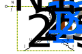

# Elektrotechnik – 7. Drehstrom

**Luft- und Raumfahrttechnik Bachelor, 1. Semester**

David Straub

## 7. Drehstrom

1. Das symmetrische Dreiphasensystem
2. Verbraucher in Stern- und Dreieckschaltung
3. Leistung im Drehstromsystem
4. Blindleistungskompensation

### Warum Drehstrom?

Fast die gesamte elektrische Energieversorgung arbeitet mit **drei** um 120° versetzten Wechselspannungen:

- **Weniger Material:** 3 (bzw. 4) Leiter übertragen die Leistung von 3 getrennten Wechselstromkreisen (6 Leiter)
- **Konstante Leistung:** Die Gesamtleistung pendelt nicht (anders als bei einer Phase!)
- **Drehfeld gratis:** Drei versetzte Spulen erzeugen ein rotierendes Magnetfeld → einfache, robuste Motoren (Asynchronmaschine)

### Das symmetrische Dreiphasensystem

Drei Spannungsquellen mit gleicher Amplitude und Frequenz, jeweils um $120°$ ($\frac{2\pi}{3}$) verschoben — als Effektivwertzeiger:

$$\underline{U}_1 = U_Y \cdot e^{j0°}, \qquad \underline{U}_2 = U_Y \cdot e^{-j120°}, \qquad \underline{U}_3 = U_Y \cdot e^{-j240°}$$

**Wichtige Eigenschaft** (Zeiger addieren!):

$$\underline{U}_1 + \underline{U}_2 + \underline{U}_3 = 0$$

### Das Vierleiternetz

Die drei Quellen werden im **Sternpunkt N** zusammengeschaltet:

- **Außenleiter** L1, L2, L3
- **Neutralleiter** N

**Zwei Spannungsebenen im selben Netz:**

- **Sternspannung** $U_Y$: Außenleiter ↔ Neutralleiter ($\underline{U}_1, \underline{U}_2, \underline{U}_3$)
- **Dreieckspannung** (Außenleiterspannung) $U_\Delta$: Außenleiter ↔ Außenleiter ($\underline{U}_{12}, \underline{U}_{23}, \underline{U}_{31}$)

### Zusammenhang der Spannungen

**Maschengleichungen:**

$$\underline{U}_{12} = \underline{U}_1 - \underline{U}_2, \qquad \underline{U}_{23} = \underline{U}_2 - \underline{U}_3, \qquad \underline{U}_{31} = \underline{U}_3 - \underline{U}_1$$

Aus dem Zeigerdiagramm (→ Tafel: Zeigersubtraktion, gleichschenkliges Dreieck mit 30°):

$$\boxed{U_\Delta = \sqrt{3} \cdot U_Y}$$

**Unser Niederspannungsnetz:** $U_Y = 230\,\text{V}$, $U_\Delta = \sqrt{3} \cdot 230\,\text{V} = 400\,\text{V}$

→ Schreibweise auf Typenschildern und in Aufgaben: **„Drehstromnetz 400/230 V"**

### Verbraucher in Sternschaltung (Y)

Drei gleiche Impedanzen $\underline{Z}$ (**symmetrischer Verbraucher**), jeweils zwischen Außenleiter und Sternpunkt:

**Strangspannung = Sternspannung:**
$$U_\text{Str} = U_Y = \frac{U_\Delta}{\sqrt{3}}$$

**Strangstrom = Außenleiterstrom:**
$$I_\text{Str} = I = \frac{U_Y}{Z}$$

**Neutralleiterstrom:** $\underline{I}_N = \underline{I}_1 + \underline{I}_2 + \underline{I}_3 = 0$ — bei symmetrischer Last fließt im Neutralleiter **kein Strom**!

### Verbraucher in Dreieckschaltung (Δ)

Drei gleiche Impedanzen $\underline{Z}$, jeweils **zwischen zwei Außenleitern**:

**Strangspannung = Dreieckspannung:**
$$U_\text{Str} = U_\Delta = \sqrt{3} \cdot U_Y$$

**Strangstrom vs. Außenleiterstrom** (Knotenregel an den Ecken, → Tafel):
$$I_\text{Str} = \frac{U_\Delta}{Z} = \frac{I}{\sqrt{3}}$$

**Merke:** Der Faktor $\sqrt{3}$ sitzt bei Y zwischen den *Spannungen*, bei Δ zwischen den *Strömen*.

### Leistung im Drehstromsystem

Symmetrischer Verbraucher: Gesamtleistung = 3 × Strangleistung

$$S = 3 \cdot U_\text{Str} \cdot I_\text{Str}$$

Einsetzen der Y- bzw. Δ-Beziehungen liefert **in beiden Fällen dasselbe Ergebnis** in Netzgrößen ($U_\Delta$, Außenleiterstrom $I$):

$$\boxed{S = \sqrt{3} \cdot U_\Delta \cdot I} \qquad P = S \cdot \cos\varphi, \qquad Q = S \cdot \sin\varphi$$

**Aber Achtung:** Dieselbe Impedanz $\underline{Z}$ nimmt in Δ die **dreifache Leistung** auf wie in Y ($U_\text{Str}$ ist $\sqrt{3}$-mal so groß, $P \propto U_\text{Str}^2$)!

→ Anwendung: **Stern-Dreieck-Anlauf** von Motoren (sanft in Y starten, auf Δ umschalten)

### Vertiefung: Konstante Momentanleistung

Bei einer Phase pendelt die Momentanleistung mit $2\omega$ (Kapitel 6). Addiert man die drei Strangleistungen, heben sich die Pendelanteile auf:

$$p(t) = p_1(t) + p_2(t) + p_3(t) = 3 \cdot U_\text{Str} I_\text{Str} \cos\varphi = P = \text{const}$$

**Konsequenz:**

- Drehstrommotoren liefern ein **konstantes Drehmoment** (kein Rütteln)
- Generatoren werden gleichmäßig belastet

Das ist neben der Leitermaterial-Ersparnis *der* technische Grund für Drehstrom.

### 📝 Jetzt sind Sie dran: Heizofen (zu zweit)

**Aufgabe 22** *(= Palme B6, Aufgabe 1 — Klausurniveau)*

Die Heizstäbe eines Heizofens ($R = 1\,\Omega$ pro Strang) liegen in **Dreieckschaltung** an einem Drehstromnetz mit $U = 400/230\,\text{V}$.

a) Wie groß sind die Strangströme $I_\text{Str}$ und die Außenleiterströme $I$?

b) Welche Leistung $P_\Delta$ wird umgesetzt?

c) Welche Leistung $P_Y$ wird umgesetzt, wenn die Heizstäbe stattdessen in **Stern** geschaltet werden?

d) Vergleichen Sie $P_\Delta$ und $P_Y$: Welcher Faktor ergibt sich, und warum?

### Blindleistungskompensation im Drehstromnetz

Wie in Kapitel 6: Kondensatoren parallel zum induktiven Verbraucher. Im Drehstromnetz gibt es dafür **zwei Möglichkeiten**:

**Kondensatoren in Stern** (an $U_Y$):
$$Q_C = 3 \cdot U_Y^2 \cdot \omega C_Y \quad\Rightarrow\quad C_Y = \frac{Q_C}{3 \cdot U_Y^2 \cdot \omega}$$

**Kondensatoren in Dreieck** (an $U_\Delta = \sqrt{3}\,U_Y$):
$$C_\Delta = \frac{Q_C}{3 \cdot U_\Delta^2 \cdot \omega} = \frac{C_Y}{3}$$

→ In Dreieckschaltung genügt **ein Drittel der Kapazität** (aber: Kondensatoren müssen für $400\,\text{V}$ ausgelegt sein)

### 📝 Jetzt sind Sie dran: Kompensation (zu zweit)

**Aufgabe 23** *(= Palme B6, Aufgabe 2 — Klausurniveau)*

An einem Drehstromnetz ($U = 400/230\,\text{V}$, $f = 50\,\text{Hz}$) mit einem Wirkleistungsverbrauch $P_1 = 1\,\text{MW}$ bei $\cos\varphi_1 = 0{,}75$ (induktiv) soll ein weiterer Verbraucher mit $P_2 = 500\,\text{kW}$ und $\cos\varphi_2 = 0{,}5$ (induktiv) installiert werden. Kondensatoren sollen den $\cos\varphi$ des Gesamtnetzes auf $0{,}9$ verbessern.

a) Berechnen Sie Blind- und Scheinleistung beider Verbraucher.

b) Welche kapazitive Blindleistung $Q_K$ müssen die Kondensatoren aufnehmen?

c) Berechnen Sie die Kondensatorwerte für Dreieckschaltung ($C_\Delta$) und Sternschaltung ($C_Y$).

### Zusammenfassung: Drehstrom

- **Symmetrisches Dreiphasensystem:** drei Spannungen, je 120° versetzt, Summe = 0
- **Zwei Spannungen:** $U_\Delta = \sqrt{3} \cdot U_Y$ — Netz „400/230 V"
- **Sternschaltung:** $U_\text{Str} = U_Y$, $I_\text{Str} = I$, symmetrisch → $I_N = 0$
- **Dreieckschaltung:** $U_\text{Str} = U_\Delta$, $I_\text{Str} = I/\sqrt{3}$
- **Leistung** (beide Schaltungen): $S = \sqrt{3} \cdot U_\Delta \cdot I$; dieselbe Last in Δ nimmt 3× so viel Leistung auf wie in Y
- **Kompensation:** $C_\Delta = C_Y / 3$

**Nächstes Kapitel:** Schaltvorgänge — was passiert im Moment des Einschaltens? ⚡
