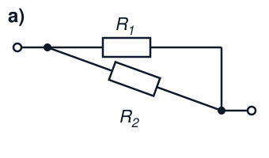
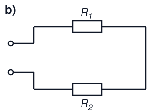
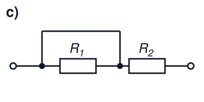
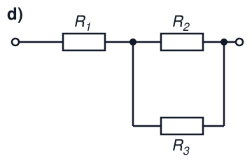

# Elektrotechnik – 3. Gleichstrom I

**Luft- und Raumfahrttechnik Bachelor, 1. Semester**

David Straub

## 3. Gleichstrom

1. Stromstärke und Stromdichte
2. Stromleitung in Metallen
3. Ohm’sches Gesetz und Widerstand
4. Temperaturabhängigkeit des Widerstands
5. Die Kirchhoff’schen Gesetze
6. Reihen- und Parallelschaltung, Teilerregeln
7. Zweipoltheorie
8. Arbeit und Leistung
9. Reale Messungen im Gleichstromkreis

### Elektrischer Strom (*electric current*)

Strom ist der gerichtete Fluss von elektrischer Ladung

- Stromdichte $\vec{J} = \rho \cdot \vec{v}$
    - $\vec{v}$: Geschwindigkeit *positiver* Ladungsträger
- Stromstärke $I = \int_A \vec{J} \cdot d\vec{A} = \dfrac{dQ}{dt}$
- $[I] = \text{A} = \dfrac{\text{C}}{\text{s}}$
- $[\vec{J}] = \dfrac{\text{A}}{\text{m}^2}$

### Stromrichtung & Ladungsträger

- $\vec{J} = \rho \cdot \vec{v}$ zeigt in die Richtung, in die sich *positive* Ladung bewegt – egal ob die tatsächlichen Ladungsträger positiv oder negativ sind!
- Das ist auch die *Zählrichtung* der Stromstärke $I$ („technische Stromrichtung")

### Stromleitung in Metallen

- In Metallen gibt jedes Atom Elektronen ab, die sich frei im Gitter der positiv geladenen Atomrümpfe bewegen können („Elektronengas")
- Die Ladungsdichte der Elektronen ist jederzeit konstant, da eine Ansammlung ein elektrisches Feld erzeugen würde, das durch Abstoßung der Elektronen wieder ausgeglichen wird → der Leiter ist überall elektrisch neutral

### Metalle im elektrischen Feld

Klassisches Bild: erfährt das Elektronengas ein elektrisches Feld, werden die Elektronen beschleunigt, nach kurzer Zeit aber durch Stöße mit dem Metallgitter wieder abgebremst. Im Mittel ergibt sich eine konstante **Driftgeschwindigkeit** $\vec{v}_d$, *entgegen* der Feldrichtung: $\vec{v}_d = \vec{J}/\rho$ mit $\rho = -ne$.

### Zahlenbeispiel: Driftgeschwindigkeit im Kupferdraht

Kupfer, $A=1 \, \text{mm}^2$, $I=1 \, \text{A}$:

- Dichte freier Elektronen: $n \approx 8{,}5 \cdot 10^{28} \, \frac{1}{\text{m}^3}$
- Ladungsträgerdichte: $\rho = -n \cdot e \approx -1{,}36 \cdot 10^{10} \, \frac{\text{C}}{\text{m}^3}$
- Stromdichte: $|\vec{J}| = \frac{I}{A} = 1 \cdot 10^{6} \, \frac{\text{A}}{\text{m}^2}$
- Driftgeschwindigkeit: $|\vec{v_d}| = \frac{|\vec{J}|}{|\rho|} \approx 7{,}35 \cdot 10^{-5} \, \frac{\text{m}}{\text{s}} \approx 0{,}26 \, \frac{\text{m}}{\text{h}}$ 🐌

Warum geht das Licht trotzdem sofort an? → Das *Feld* breitet sich (fast) mit Lichtgeschwindigkeit aus, nicht die Elektronen.

### Ohm’sches Gesetz (*Ohm’s law*)

- Für ein gegebenes Material ist die Stromdichte umso höher, je höher das elektrische Feld ist
- Der Proportionalitätsfaktor ist die elektrische **Leitfähigkeit** $\sigma$:

$$\vec{J} = \sigma \cdot \vec{E}$$

Achtung: die proportionale Beziehung gilt nur für *lineare Leiter* (z.B. Metalle bei konstanter Temperatur)

### Ohm’sches Gesetz im linearen Leiter

$$\vec{J} = \sigma \cdot \vec{E}$$

Leiter der Länge $l$, Querschnitt $A$, homogenes Feld:

$$I = J \cdot A = \sigma \cdot E \cdot A = \sigma \cdot \frac{U}{l} \cdot A = \frac{U}{R}$$

**Elektrischer Widerstand** (*electric resistance*):

$$R = \frac{l}{\sigma \cdot A} = \rho_R \cdot \frac{l}{A}$$

### Widerstand und Leitwert

Der elektrische Widerstand $R$ ist definiert durch das Ohm’sche Gesetz:

$$R = \frac{U}{I}, \qquad [R] = \frac{\text{V}}{\text{A}} = \Omega \ \text{(Ohm)}$$

Der elektrische Leitwert $G$ ist der Kehrwert des Widerstands:

$$G = \frac{1}{R} = \frac{I}{U}, \qquad [G] = \frac{\text{A}}{\text{V}} = \text{S} \ \text{(Siemens)}$$

### Materialeigenschaften vs. Bauteilgrößen

**Materialeigenschaften** (unabhängig von der Geometrie):
- **Spezifischer Widerstand** $\rho$
- **Leitfähigkeit** $\sigma = \frac{1}{\rho}$

**Bauteilgrößen** (abhängig von der Geometrie):
- **Widerstand** $R = \rho \frac{l}{A}$
- **Leitwert** $G = \frac{1}{R} = \sigma \frac{A}{l}$

**Beispiel:** Kupfer hat immer die gleiche Leitfähigkeit $\sigma_{\text{Cu}} = 58 \, \text{MS/m}$, aber ein dickeres Kabel hat einen kleineren Widerstand $R$.

### Übersicht der Größen im linearen Leiter

Größe | Definition | Einheit | Name
--- | --- | --- | ---
Spannung (*voltage*) | $U = \Delta \varphi$ | $[U] = \text{V}$ | Volt
Stromstärke (*current*) | $I = \frac{\Delta Q}{\Delta t}$ | $[I] = \text{A}$ | Ampere
Widerstand (*resistance*) | $R = \frac{U}{I}$ | $[R] = \Omega$ | Ohm
Leitwert (*conductance*) | $G = \frac{1}{R}$ | $[G] = \text{S} = \frac{1}{\Omega}$ | Siemens
spezifischer Widerstand (*resistivity*) | $\rho = R \frac{A}{l}$ | $[\rho] = \Omega \cdot \text{m}$ | Ohm-Meter
Leitfähigkeit (*conductivity*) | $\sigma = \frac{1}{\rho}$ | $[\sigma] = \text{S/m}$ | Siemens pro Meter

### 📝 Jetzt sind Sie dran: Stromdichte & Widerstand (zu zweit)

**Aufgabe 6**

In einer Glühlampe (12 V, Kfz-Blinker) fließt ein Strom $I = 0{,}5 \, \text{A}$.

a) Wie groß ist die Stromdichte $S_1$ im Glühfaden ($d_1 = 100 \, \mu\text{m}$)?
b) Wie groß ist die Stromdichte $S_2$ in der Zuleitung ($d_2 = 1{,}5 \, \text{mm}$)?
c) Ein Kupferdraht hat die Länge $l = 5 \, \text{m}$ und den Querschnitt $A = 3 \, \text{mm}^2$ ($\rho_\text{Cu} = 1{,}79 \cdot 10^{-8} \, \Omega\text{m}$). Wie groß ist sein Widerstand $R$?
d) Welchen Widerstand hat ein Draht gleicher Abmessungen aus Aluminium ($\rho_\text{Al} = 2{,}6 \cdot 10^{-8} \, \Omega\text{m}$)?

### Temperaturabhängigkeit des Widerstands

Bei den meisten Materialien ändert sich der Widerstand mit der Temperatur.

Lineare Näherung:

$$R(T) = R(T_0) \cdot [1 + \alpha \cdot (T - T_0)]$$

- $\alpha$: Temperaturkoeffizient, $[\alpha] = \frac{1}{\text{K}}$
- $T_0$: Bezugstemperatur (üblicherweise 20 °C oder 0 °C)

### Leitfähigkeit verschiedener Materialien

Bei Leitern nimmt der Widerstand mit steigender Temperatur zu ($\alpha > 0$).

Typische Werte bei 20 °C:

| Leitermaterial | $\rho$ (µΩ·m) | $\sigma$ (MS/m) | $\alpha$ (1/K) |
|----------------|---------------|-----------------|----------------|
| Silber         | 0,016         | 63              | 3,8 · 10⁻³     |
| Kupfer         | 0,017         | 58              | 3,9 · 10⁻³     |
| Aluminium      | 0,027         | 38              | 4,3 · 10⁻³     |
| Messing        | 0,062         | 16              | 2,0 · 10⁻³     |

### Metalle als Temperatursensoren

Die Temperaturabhängigkeit macht Metalle zu präzisen Temperatursensoren.

**Platin-Widerstandsthermometer (Pt100):**
- $R(0 \, °\text{C}) = 100 \, \Omega$
- $\alpha_{\text{Pt}} = 3{,}85 \cdot 10^{-3} \, \text{K}^{-1}$

**Vorteile:** hohe Langzeitstabilität, Messbereich −200 °C bis +850 °C, gute Linearität

Klausur-Klassiker: aus gemessenem $R$ (oder $U$ bei bekanntem Strom) die Temperatur bestimmen! (→ Woche 5)

### Knotenpunktregel (1. Kirchhoff’sches Gesetz)

In einem Knotenpunkt kann weder Ladung gespeichert noch erzeugt werden. Die Summe aller zufließenden Ströme ist gleich der Summe aller abfließenden Ströme:

$$\sum_{k} I_{k} = 0$$

### Maschenregel (2. Kirchhoff’sches Gesetz)

Die Summe aller in einer Masche auftretenden Spannungen ist Null:

$$\sum_{k} U_{k} = 0$$

### Wie viele unabhängige Gleichungen gibt es?

Netzwerk mit $k$ Knoten und $z$ Zweigen:

- **Unabhängige Knotengleichungen:** $k - 1$
  (die letzte Knotengleichung folgt aus den anderen)
- **Unabhängige Maschengleichungen:** $z - (k - 1)$

Zusammen: $z$ Gleichungen für $z$ unbekannte Zweigströme ✓

Beispiel: 2 Knoten, 3 Zweige → 1 Knotengleichung + 2 Maschengleichungen

**Typische Prüfungsfrage:** „Wie viele *unabhängige* Knotenpunktgleichungen gibt es hier? Stellen Sie diese auf."

### Reihenschaltung von Widerständen

$$R_\text{ges} = R_1 + R_2 + \dots + R_n = \sum_{i=1}^{n} R_i$$

- Gleicher Strom durch alle Widerstände: $I = I_1 = I_2 = \dots = I_n$
- Gesamtspannung = Summe der Einzelspannungen
- Gesamtwiderstand > größter Einzelwiderstand

### Spannungsteiler

Bei einer Reihenschaltung teilt sich die Gesamtspannung im Verhältnis der Widerstände auf:

$$I = \frac{U}{R_\text{ges}} = \frac{U_1}{R_1} = \frac{U_2}{R_2}$$

### Parallelschaltung von Widerständen

$$\frac{1}{R_\text{ges}} = \frac{1}{R_1} + \frac{1}{R_2} + \dots + \frac{1}{R_n} \qquad\Leftrightarrow\qquad G_\text{ges} = \sum_{i=1}^{n} G_i$$

- Gesamtstrom = Summe der Einzelströme (Knotenregel!)
- Gleiche Spannung an allen Widerständen
- Gesamtwiderstand < kleinster Einzelwiderstand

Herleitung: $I_\text{ges} = \frac{U}{R_1} + \dots + \frac{U}{R_n} \stackrel{!}{=} \frac{U}{R_\text{ges}}$

### Stromteilerregel

Bei einer Parallelschaltung teilt sich der Gesamtstrom im umgekehrten Verhältnis der Widerstände bzw. im direkten Verhältnis der Leitwerte auf:

$$\frac{I}{G_\text{ges}} = \frac{I_1}{G_1} = \frac{I_2}{G_2} = \dots = \frac{I_n}{G_n}$$

### Reihe oder parallel? So erkennt man es *wirklich*

- **In Reihe** ⇔ beide führen zwingend **denselben Strom**
  ⇔ zwischen ihnen liegt **kein Knoten mit Abzweig**
- **Parallel** ⇔ beide hängen an **denselben zwei Knoten**
  ⇔ an beiden liegt zwingend **dieselbe Spannung**

⚠️ Wie die Schaltung *gezeichnet* ist, bedeutet **gar nichts**!

**Methode:** Knoten markieren (einfärben/nummerieren) → alle Punkte, die nur durch Draht verbunden sind, sind *derselbe* Knoten → dann neu zeichnen.

### 🤔 Reihe, parallel – oder keins von beidem?

 
 

### 📝 Jetzt sind Sie dran: Spannungsteiler (zu zweit)

**Aufgabe 7**

Ein Spannungsteiler besteht aus $R_1 = R_2 = 1 \, \text{k}\Omega$ an einer Quelle $U = 12 \, \text{V}$. Am Abgriff (über $R_2$) wird die Spannung $U_a$ abgenommen. **Zeichnen Sie die Schaltung selbst!**

a) Wie groß ist $U_a$ im Leerlauf (kein Verbraucher angeschlossen)?

b) Nun wird ein Verbraucher $R_L = 1 \, \text{k}\Omega$ an den Abgriff angeschlossen (parallel zu $R_2$). Wie groß ist $U_a$ jetzt?

c) Wie viele Knoten, Zweige und unabhängige Gleichungen hat die Schaltung aus b)?

### Zwischenstand & Ausblick

Heute:

- Strom = Ladungstransport; $I = dQ/dt$, Stromdichte $J = I/A$
- Ohm: $R = U/I = \rho \, l/A$ – Material ($\rho$) × Geometrie ($l/A$)
- $R(T)$: linear mit Temperaturkoeffizient $\alpha$ → Pt100-Sensor
- Kirchhoff: $\sum I_k = 0$ (Knoten), $\sum U_k = 0$ (Masche); $k-1$ unabhängige Knotengleichungen
- Teilerregeln: Spannung ∝ R (Reihe), Strom ∝ G (parallel)
- Ein belasteter Spannungsteiler bricht ein!

**Nächste Woche:** Quellen und Zweipoltheorie – jedes lineare Netzwerk schrumpft auf zwei Kenngrößen.
