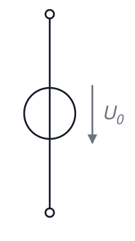
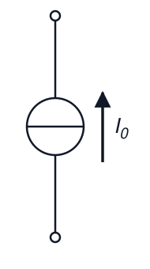
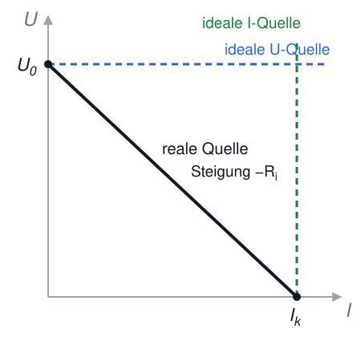
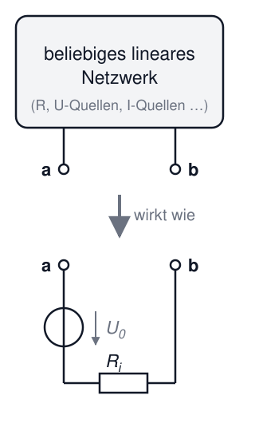
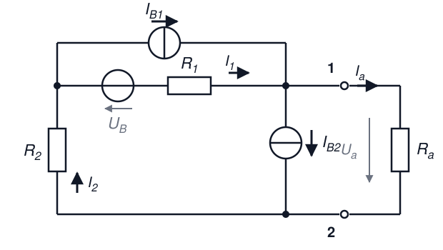

# Elektrotechnik – 3. Gleichstrom II

**Luft- und Raumfahrttechnik Bachelor, 1. Semester**

David Straub

## 3. Gleichstrom

1. Stromstärke und Stromdichte
2. Stromleitung in Metallen
3. Ohm’sches Gesetz und Widerstand
4. Temperaturabhängigkeit des Widerstands
5. Die Kirchhoff’schen Gesetze
6. Reihen- und Parallelschaltung, Teilerregeln
7. Zweipoltheorie
8. Arbeit und Leistung
9. Reale Messungen im Gleichstromkreis

### Zweipoltheorie

Ein Zweipol (*two-pole*) oder Eintor (*one-port*) ist ein elektrisches Bauteil mit zwei zugänglichen Anschlüssen.

**Das große Versprechen dieses Abschnitts:** Jedes noch so komplizierte lineare Netzwerk verhält sich an zwei Klemmen wie eine Quelle mit **zwei Kenngrößen** ($U_0$ und $R_i$).

### Passive lineare Zweipole

- Passiv: Zweipol gibt keine Energie ab
- Linear: Strom-Spannungs-Kennlinie ist eine Gerade

Passive lineare Zweipole können zu einem Ersatzwiderstand zusammengefasst werden:

$$U = R \cdot I$$

### Ideale Spannungsquelle

Eine ideale Spannungsquelle liefert eine konstante Spannung $U_0$, unabhängig von der Belastung.

- Konstante Klemmenspannung $U = U_0$
- Innenwiderstand $R_i = 0$
- Beliebiger Strom $I$ möglich

### Ideale Stromquelle

Eine ideale Stromquelle liefert einen konstanten Strom $I_0$, unabhängig von der Belastung.

- Konstanter Strom $I = I_0$
- Innenwiderstand $R_i = \infty$
- Beliebige Spannung $U$ möglich

### Reale Spannungsquelle

Eine reale Spannungsquelle = ideale Spannungsquelle $U_0$ **in Reihe** mit einem Innenwiderstand $R_i$:

$$U = U_0 - R_i \cdot I$$

- Leerlauf ($I = 0$): $U = U_0$ (maximale Spannung)
- Kurzschluss ($U = 0$): $I_k = \frac{U_0}{R_i}$ (maximaler Strom)

### Reale Stromquelle

Eine reale Stromquelle = ideale Stromquelle $I_0$ **parallel** zu einem Innenwiderstand $R_i$:

$$I = I_0 - \frac{U}{R_i}$$

- Leerlauf: $U = I_0 \cdot R_i$
- Kurzschluss: $I = I_0$

### Die U-I-Kennlinie

Alle vier Quellentypen auf einen Blick – die reale Quelle ist eine fallende Gerade zwischen zwei Punkten, die man messen (oder berechnen) kann:

- $U_0$: Schnittpunkt mit der U-Achse (Leerlauf)
- $I_k$: Schnittpunkt mit der I-Achse (Kurzschluss)
- Steigung: $-R_i = -U_0/I_k$

### Äquivalenz von realer Spannungs- und Stromquelle

Reale Spannungsquelle und reale Stromquelle sind **äquivalent** (gleiche Kennlinie!), wenn:

$$U_0 = I_0 \cdot R_i \qquad\Leftrightarrow\qquad I_0 = \frac{U_0}{R_i}$$

**Umrechnung** (gleiche $R_i$!):
- Spannungsquelle → Stromquelle: $I_0 = \frac{U_0}{R_i}$
- Stromquelle → Spannungsquelle: $U_0 = I_0 \cdot R_i$

Von außen sind beide nicht unterscheidbar – wählen Sie die Darstellung, die die Rechnung einfacher macht!

### Ersatzquelle eines beliebigen Netzwerks bestimmen 🔑

Jedes lineare Netzwerk mit Quellen lässt sich an zwei Klemmen a–b als **Ersatzspannungsquelle** ($U_0$, $R_i$) oder **Ersatzstromquelle** ($I_0$, $R_i$) darstellen. Rezept:

1. **Leerlaufspannung** $U_0$: Spannung an den offenen Klemmen berechnen
2. **Innenwiderstand** $R_i$: alle Quellen „deaktivieren" –
   Spannungsquellen → **Kurzschluss**, Stromquellen → **Unterbrechung** –
   dann Widerstand von den Klemmen aus berechnen
3. Kontrolle oder Alternative zu 2.: **Kurzschlussstrom** $I_k$ berechnen, dann $R_i = U_0 / I_k$

**Das ist die zentrale Technik der Klausur-Netzwerkaufgaben!**

### Beispiel: Ersatzquelle des belasteten Spannungsteilers

Unser Spannungsteiler aus letzter Woche ($U = 12 \, \text{V}$, $R_1 = R_2 = 1 \, \text{k}\Omega$) als Ersatzquelle an den Abgriffklemmen:

→ Tafel:

1. $U_0 = U \cdot \frac{R_2}{R_1 + R_2} = 6 \, \text{V}$
2. Quelle deaktivieren (kurzschließen): $R_i = R_1 \parallel R_2 = 500 \, \Omega$
3. Last $R_L = 1 \, \text{k}\Omega$ anschließen: $U_a = U_0 \cdot \frac{R_L}{R_i + R_L} = 6 \cdot \frac{1000}{1500} = 4 \, \text{V}$ ✓

Gleiche Antwort wie letzte Woche – aber jetzt in 2 Zeilen statt Netzwerk-Umformung!

### Reihenschaltung von aktiven, linearen Zweipolen

Bei der Reihenschaltung von realen Spannungsquellen addieren sich Leerlaufspannungen und Innenwiderstände:

$$U_{0,\text{ges}} = \sum_j U_{0,j}, \qquad R_{i,\text{ges}} = \sum_j R_{i,j}$$

**Anwendung:** Batteriepacks (Taschenlampe, E-Auto)
**Vorteil:** höhere Gesamtspannung • **Nachteil:** höherer Innenwiderstand

### Parallelschaltung von aktiven, linearen Zweipolen

Bei der Parallelschaltung von realen Spannungsquellen mit gleicher Leerlaufspannung $U_0$ addieren sich die Leitwerte der Innenwiderstände:

$$\frac{1}{R_{i,\text{ges}}} = \sum_j \frac{1}{R_{i,j}}$$

**Anwendung:** höhere Ströme, Redundanz
**Nachteil:** nur bei gleichen Spannungen sinnvoll (sonst Ausgleichsströme!)

### 📝 Jetzt sind Sie dran: Ersatzquelle (zu zweit)

**Aufgabe 8** *(Klausuraufgaben-Typ!)*

Eine Spannungsquelle $U_e$ speist einen Spannungsteiler aus $R_1$ und $R_2$; an den Klemmen über $R_2$ wird $U_a$ abgenommen. **Schaltung zeichnen!**

a) Bestimmen Sie **allgemein** die Leerlaufspannung $U_0$, den Innenwiderstand $R_i$ und den Kurzschlussstrom $I_k$ der Ersatzquelle.

b) Gegeben: $U_e = 150 \, \text{V}$, im Leerlauf $U_a = 50 \, \text{V}$, bei $I = 0{,}5 \, \text{A}$ ist $U_a = 45 \, \text{V}$. Wie groß müssen $R_1$ und $R_2$ sein?

c) Wie groß muss ein Lastwiderstand $R_a$ sein, damit er die größtmögliche Leistung aufnimmt, und wie groß ist diese? *(Vorgriff auf nächste Woche – Vermutung reicht!)*

### 📝 Klausuraufgabe: Gleichstromnetzwerk (zu zweit)

Die Schaltung liefert an den Klemmen 1–2 die Spannung $U_a$:

a) Wie viele *unabhängige* Knotenpunktgleichungen gibt es? Stellen Sie sie auf.
b) **Leerlauf** ($R_a \to \infty$): Geben Sie $I_1$ und $I_2$ in Abhängigkeit der Stromquellen an.
c) Bestimmen Sie das **Spannungsquellen-Ersatzschaltbild** links der Klemmen 1–2 ($U_0$, $R_i$ allgemein).
d) Die Schaltung soll $U_0 = 10 \, \text{V}$ und $P_\text{max} = 5 \, \text{W}$ liefern. Wie groß muss $R_i$ sein?

### Zwischenstand & Ausblick (Woche 4)

- Reale Quelle = zwei Kenngrößen: $U_0$ und $R_i$ (oder äquivalent $I_0 = U_0/R_i$)
- Kennlinie = fallende Gerade zwischen Leerlauf ($U_0$) und Kurzschluss ($I_k$)
- **Rezept Ersatzquelle:** $U_0$ im Leerlauf; $R_i$ mit deaktivierten Quellen; Kontrolle über $I_k$
- Quellen deaktivieren: U-Quelle → Kurzschluss, I-Quelle → Unterbrechung

**Nächste Woche:** Wie viel Leistung bekommt man aus einer Quelle heraus – und wie misst man in realen Schaltungen?
