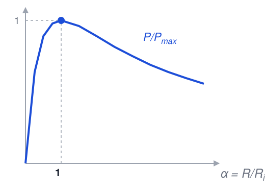
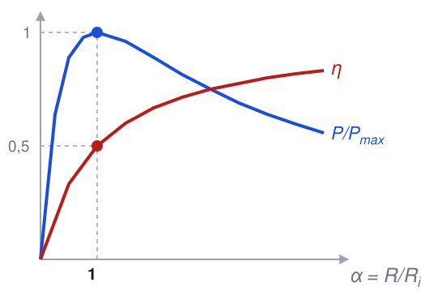
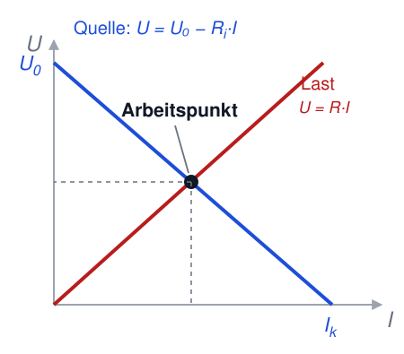
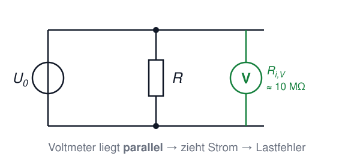
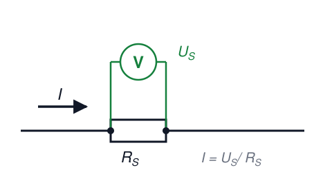
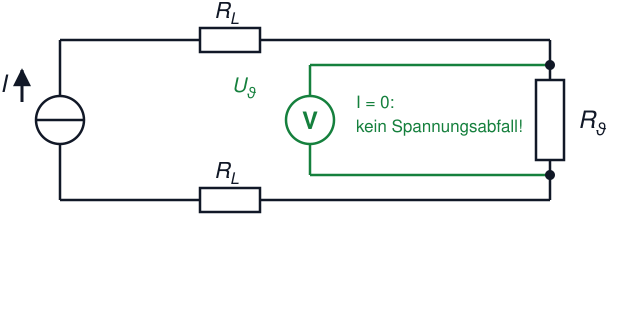

# Elektrotechnik – 3. Gleichstrom III

**Luft- und Raumfahrttechnik Bachelor, 1. Semester**

David Straub

## 3. Gleichstrom

1. Stromstärke und Stromdichte
2. Stromleitung in Metallen
3. Ohm’sches Gesetz und Widerstand
4. Temperaturabhängigkeit des Widerstands
5. Die Kirchhoff’schen Gesetze
6. Reihen- und Parallelschaltung, Teilerregeln
7. Zweipoltheorie
8. Arbeit und Leistung
9. Reale Messungen im Gleichstromkreis

### Elektrische Arbeit (Energie)

Die elektrische Arbeit ist das Produkt aus Spannung, Strom und Zeit:

$$W = U \cdot I \cdot t = I^2 \cdot R \cdot t = \frac{U^2}{R} \cdot t$$

Einheit: $[W] = \text{V} \cdot \text{A} \cdot \text{s} = \text{W} \cdot \text{s} = \text{J}$ (Joule)

### Elektrische Leistung

Die elektrische Leistung ist Arbeit pro Zeiteinheit:

$$P = \frac{dW}{dt} = U \cdot I = I^2 \cdot R = \frac{U^2}{R}$$

Einheit: $[P] = \text{W}$ (Watt)

Die drei Schreibweisen sind über das Ohm’sche Gesetz äquivalent – nehmen Sie die, deren Größen Sie kennen.

### Leistungsanpassung

Bei welchem Verbraucherwiderstand $R$ liefert eine reale Quelle ($U_0$, $R_i$) die maximale Leistung an den Verbraucher?

$$P = R \cdot I^2 = U_0^2 \cdot \frac{R}{(R_i + R)^2}$$

- Leerlauf ($R \to \infty$): $P = 0$; Kurzschluss ($R = 0$): $P = 0$
- Maximum dazwischen: **$R = R_i$** (Herleitung → Tafel)

$$P_\text{max} = \frac{U_0^2}{4 R_i}$$

### Anpassungsverhältnis und Wirkungsgrad

Anpassungsverhältnis: $\alpha = \frac{R}{R_i}$

Wirkungsgrad = Verbraucherleistung / Gesamtleistung der Quelle:

$$\eta = \frac{P}{P_0} = \frac{R}{R_i + R} = \frac{\alpha}{1 + \alpha}$$

⚠️ Bei Leistungsanpassung ($\alpha = 1$) ist $\eta = 0{,}5$ – die Hälfte der Energie heizt die Quelle!

- Nachrichtentechnik: Anpassung (maximales Signal zählt)
- Energietechnik: Überanpassung $R \gg R_i$ (Wirkungsgrad zählt)

### Betriebszustände einer aktiven Quelle

|             | Last            | Leistung Quelle $P_0$                                | Leistung Last $P$               | Wirkungsgrad $\eta$ |
|-----------------|----------------------|------------------------------------------------------|---------------------------------|---------------------|
| Kurzschluss     | $R = 0$              | $P_0 = \frac{U_0^2}{R_i}$                            | $P = 0$                         | $\eta = 0$          |
| Unteranpassung  | $R < R_i$            | $P_0 = \frac{U_0^2}{R + R_i}$      | $0 < P < P_\text{max}$          | $0 < \eta < 0{,}5$    |
| Anpassung       | $R = R_i$            | $P_0 = \frac{U_0^2}{2R_i}$                           | $P = \frac{U_0^2}{4R_i}$        | $\eta = 0{,}5$        |
| Überanpassung   | $R > R_i$            | $P_0 = \frac{U_0^2}{R + R_i}$      | $0 < P < P_\text{max}$          | $0{,}5 < \eta < 1$    |
| Leerlauf        | $R \to \infty$       | $P_0 = 0$                                            | $P = 0$                         | $\eta = 1$          |

### U-I-Kennlinie und Arbeitspunkt

Quelle und Verbraucher in einem Diagramm:

- **Quelle:** fallende Gerade $U = U_0 - R_i \cdot I$
- **Verbraucher:** steigende Gerade $U = R \cdot I$
- Schnittpunkt = **Arbeitspunkt**: dort stellen sich $U$ und $I$ tatsächlich ein

Grafische Lösung: beide Kennlinien zeichnen, Schnittpunkt ablesen.

### 📝 Aufgabe 9: Autobatterie

An den Klemmen einer Autobatterie wird bei wechselnder Last gemessen:

| $U_a$/V | 11,8 | 11,6 | 11 | 10 | 8 |
|---------|------|------|-----|-----|-----|
| $I$/A   | 10   | 20   | 50  | 100 | 200 |

a) Bestimmen Sie die Leerlaufspannung $U_0$ und den Innenwiderstand $R_i$.

b) Die Batterie wird mit $R = 0{,}2 \, \Omega$ belastet. Wie hoch ist der Wirkungsgrad $\eta$?

### Reale Messungen: Spannung

Jedes reale Voltmeter hat einen **endlichen Innenwiderstand** und belastet die Schaltung:

- Digitalmultimeter (DMM): typisch $R_i \approx 10 \, \text{M}\Omega$
- Das Voltmeter liegt **parallel** zum Messobjekt → wirkt wie ein Lastwiderstand → **Lastfehler**, wenn $R_i$ nicht $\gg$ Quellwiderstand
- In Klausuraufgaben: „ideales Voltmeter" = $R_i \to \infty$, zieht keinen Strom

Faustregel: Spannungsmessung ist unkritisch, solange $R_\text{Quelle} \ll R_{i,\text{Voltmeter}}$

### Reale Messungen: Strom mit dem Shunt

Wie misst man große Ströme (z.B. 100 A im Bordnetz)? **Über einen Shunt:**

- Kleiner, präziser Widerstand (z.B. $R_S = 1 \, \text{m}\Omega$) im Strompfad
- Gemessen wird die **Spannung** über dem Shunt: $I = U_S / R_S$
- Bei 100 A: $U_S = 100 \, \text{mV}$ – gut messbar, Verlustleistung nur 10 W

Heute überall: Batteriemanagement, Motorsteuerungen, jedes DMM im Amperebereich hat intern einen Shunt.

### Reale Messungen: Vierleitermessung

Problem: Bei kleinen Widerständen (z.B. Pt100 mit $100 \, \Omega$) verfälscht der **Leitungswiderstand** der Zuleitungen die Messung.

**Lösung – Vierleitermessung:**

- Zwei Leitungen führen den (bekannten) Messstrom $I$
- Zwei separate Leitungen messen die Spannung **direkt am Sensor** – durch sie fließt (ideales Voltmeter!) kein Strom → kein Spannungsabfall → Leitungswiderstand fällt heraus

Alltagstechnik: jedes Labornetzteil mit „Sense"-Klemmen arbeitet so.

### 📝 Aufgabe 10: Temperaturmessung

Ein Pt100 ($R_0 = 100 \, \Omega$ bei $\vartheta_0 = 0 \, °\text{C}$, $\alpha = 4 \cdot 10^{-3} \, \text{K}^{-1}$ – hier vereinfacht gerundet) wird von einer idealen Stromquelle mit $I = 1 \, \text{mA}$ gespeist. Über eine Vierleitermessung wird direkt am Sensor $U_\vartheta = 120 \, \text{mV}$ gemessen.

a) Wie groß ist der Sensorwiderstand $R_\vartheta$?

b) Welche Temperatur $\vartheta$ hat der Sensor?

c) Welche Leistung $P_\vartheta$ nimmt der Sensor auf? Warum sollte sie klein bleiben?

### Unsere Basiseinheiten-Tabelle wächst

| Elektrische Größe | Formelzeichen | Einheit | Basiseinheiten |
|---|---|---|---|
| Ladung | $Q$ | C | $\text{A} \cdot \text{s}$ |
| Spannung | $U$ | V | $\frac{\text{kg} \cdot \text{m}^2}{\text{A} \cdot \text{s}^3}$ |
| Kapazität | $C$ | F | $\frac{\text{A}^2 \cdot \text{s}^4}{\text{kg} \cdot \text{m}^2}$ |
| **Widerstand** | $R$ | Ω | $\frac{\text{kg} \cdot \text{m}^2}{\text{A}^2 \cdot \text{s}^3}$ |
| **Leistung** | $P$ | W | $\frac{\text{kg} \cdot \text{m}^2}{\text{s}^3}$ |

Herleitung an der Tafel: $[R] = \frac{[U]}{[I]}$, $[P] = [U] \cdot [I]$

### Zusammenfassung: Gleichstrom

- $I = dQ/dt$; Ohm: $U = R \cdot I$; $R = \rho \, l / A$; $R(T)$ linear mit $\alpha$
- Kirchhoff: Knoten- und Maschenregel; $k-1$ unabhängige Knotengleichungen
- Reihe: R addieren, Spannungsteiler; parallel: G addieren, Stromteiler — **Topologie zählt, nicht die Zeichnung!**
- **Zweipoltheorie:** jedes lineare Netzwerk = $U_0$ + $R_i$; Quellen deaktivieren für $R_i$
- Leistungsanpassung: $P_\text{max} = U_0^2/4R_i$ bei $R = R_i$, dann $\eta = 0{,}5$
- Arbeitspunkt = Schnittpunkt von Quellen- und Lastkennlinie
- Messen: Lastfehler, Shunt, Vierleitermessung

**Nächstes Kapitel:** Magnetismus – das zweite große Feld der Elektrotechnik 🧲
