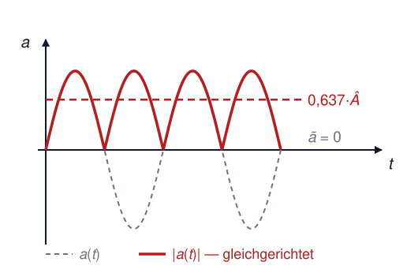
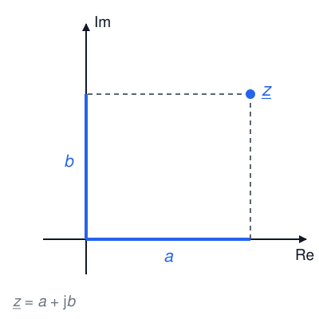
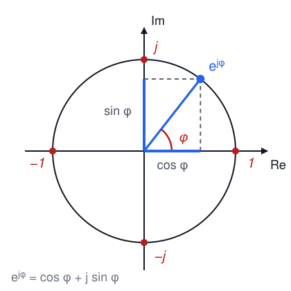
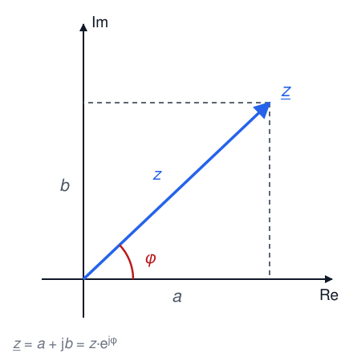

# Elektrotechnik – 6. Wechselstrom I

**Luft- und Raumfahrttechnik Bachelor, 1. Semester**

David Straub

## 6. Wechselstrom

1. Grundlegende Begriffe und Kennwerte
2. Komplexe Wechselstromrechnung
3. Wechselstromwiderstände (Impedanz, Admittanz)
4. Grundschaltungen
5. Leistung (Wirk-, Blind-, Scheinleistung)
6. Blindleistungskompensation
7. Resonanz und Frequenzverhalten

### Wechselstrom: Grundlagen

**Periodische Größen:**

- Sich zeitlich wiederholende physikalische Größen
- Periodendauer $T$ → $u(t) = u(t + T)$
- Frequenz: $f = \frac{1}{T}$, Kreisfrequenz: $\omega = 2\pi f$

**Wechselgrößen:**

Periodische elektrische Größen mit verschwindendem arithmetischem Mittelwert

### Wechselgrößen: Eigenschaften

**Fourier-Analyse:** Jede Wechselgröße kann als Überlagerung von Sinusvorgängen dargestellt werden

$$a(t) = \sum_{n=1}^{\infty} \hat{A}_n \cdot \sin(n \cdot \omega t + \varphi_n)$$

→ Es genügt, **sinusförmige** Größen zu verstehen!

### Arithmetischer Mittelwert

**Definition:**
$$\overline{a} = \frac{1}{T} \cdot \int_{t_0}^{t_0 + T} a(t) \, dt$$

**Für sinusförmige Wechselgrößen** $a(t) = \hat{A} \cdot \sin(\omega t + \varphi_a)$ gilt:

$$\overline{a} = 0$$

### Gleichrichtwert

**Definition:**
$$\overline{|a|} = \frac{1}{T} \cdot \int_{t_0}^{t_0+T} |a(t)| \, dt$$

**Für sinusförmige Wechselgrößen:**

$$\overline{|a|} = \frac{2}{\pi} \cdot \hat{A} \approx 0{,}637 \cdot \hat{A}$$

Anschaulich: der Mittelwert der **gleichgerichteten** Größe – das, was ein Gleichrichter aus der Wechselgröße macht.

### Effektivwert: Definition

**Physikalischer Hintergrund:** derjenige Wert einer Wechselgröße, der in seiner Wirkung bei Energieumformung einem Gleichstrom entspricht:

$$W_\text{el} = I^2 \cdot R \cdot T \stackrel{!}{=} \int_{0}^{T} i^2(t) \cdot R \, dt \quad\Rightarrow\quad I_\text{eff} = \sqrt{\frac{1}{T} \int_{0}^{T} i^2(t) \, dt}$$

**Allgemeine Definition** (quadratischer Mittelwert, *RMS*):

$$A_\text{eff} = \sqrt{\frac{1}{T} \cdot \int_{t_0}^{t_0 + T} a^2(t) \, dt}$$

### Effektivwert für Sinusschwingungen

$$A_\text{eff} = \sqrt{\frac{1}{T} \cdot \int_{0}^{T} \hat{A}^{2} \cdot \sin^{2}(\omega t) \, dt} = \frac{\hat{A}}{\sqrt{2}} \approx 0{,}707 \cdot \hat{A}$$

**Beispiele:**

- Netzspannung: $U_\text{eff} = 230 \, \text{V}$ → $\hat{U} = \sqrt{2} \cdot 230 \, \text{V} = 325 \, \text{V}$
- Haushaltssicherung: $I_\text{eff} = 16 \, \text{A}$ → $\hat{I} = 22{,}6 \, \text{A}$

**Der Effektivwert wird von Messgeräten angezeigt!**

### Zusammenfassung: Kennwerte von Wechselgrößen

| Kennwert | Formel | Für Sinusfunktion |
|----------|--------|-------------------|
| **Arithmetischer Mittelwert** | $\overline{a} = \frac{1}{T} \int a(t) \, dt$ | $\overline{a} = 0$ |
| **Gleichrichtwert** | $\overline{\|a\|} = \frac{1}{T} \int \|a(t)\| \, dt$ | $\approx 0{,}637 \cdot \hat{A}$ |
| **Effektivwert** | $A_\text{eff} = \sqrt{\frac{1}{T} \int a^2(t) \, dt}$ | $\frac{\hat{A}}{\sqrt{2}} \approx 0{,}707 \cdot \hat{A}$ |

**Notation ab jetzt:** Kleinbuchstaben $u(t), i(t)$ = Zeitverläufe; $\hat{U}, \hat{I}$ = Amplituden; $U, I$ (ohne Index!) = **Effektivwerte**

### 📝 Aufgabe 17: Effektivwert

a) Ein Oszilloskop zeigt eine sinusförmige Spannung mit Spitzenwert $\hat{U} = 17 \, \text{V}$. Was zeigt ein Multimeter an?

b) Eine Rechteckspannung springt periodisch zwischen $+10 \, \text{V}$ und $-10 \, \text{V}$ (je halbe Periode). Berechnen Sie den arithmetischen Mittelwert, den Gleichrichtwert und den Effektivwert **aus den Definitionen**.

c) Warum gilt die Faustregel $A_\text{eff} = \hat{A}/\sqrt{2}$ hier nicht?

### Zeigerdarstellung

**Sinusförmige Wechselgrößen** können als rotierende Zeiger in der komplexen Ebene dargestellt werden.

**Zeigereigenschaften:**

- Winkelgeschwindigkeit: $\omega = 2\pi f$
- Länge: Amplitude (oder Effektivwert, s.u.)
- Winkel zum Zeitpunkt $t=0$: $\varphi_u$

### Komplexe Zahlen: Grundlagen

**Imaginäre Einheit** (in der Elektrotechnik als $j$ notiert – $i$ ist der Strom!):
$$j = \sqrt{-1}, \quad j^2 = -1$$

**Komplexe Zahl:**
$$\underline{z} = a + jb$$

mit Realteil $a = \text{Re}\, \underline{z}$ und Imaginärteil $b = \text{Im}\,\underline{z}$

### Euler’sche Formel

$$e^{j\varphi} = \cos(\varphi) + j\sin(\varphi)$$

**Wichtige Spezialfälle** (auswendig!):

- $e^{j0} = 1$
- $e^{j\pi/2} = j$
- $e^{j\pi} = -1$
- $e^{j3\pi/2} = e^{-j\pi/2} = -j$

### Komplexe Darstellung

Anstatt mit trigonometrischen Funktionen zu rechnen, verwenden wir die Exponentialfunktion:

$$\underline{u}(t) = \hat{U} \cdot e^{j(\omega t + \varphi_u)} = \underbrace{\underbrace{\hat{U} \, e^{j\varphi_u}}_{\text{Festzeiger } \underline{U}} \; e^{j\omega t}}_{\text{Drehzeiger}}$$

**Reale Zeitfunktion:** $u(t) = \text{Re}\,\underline{u}(t) = \hat{U} \cdot \cos(\omega t + \varphi_u)$

Bei **einer** festen Frequenz rotieren alle Zeiger gleich schnell → der Faktor $e^{j\omega t}$ kürzt sich aus allen Gleichungen → wir rechnen nur mit **Festzeigern**!

**Bezugsfunktion ist ab hier der Kosinus** (er ist der Realteil von $e^{j\omega t}$). Sinusgrößen rechnet man um mit $\sin(x) = \cos(x - 90°)$.

### ⚠️ Konvention: Amplituden- oder Effektivwertzeiger?

Zwei verbreitete Konventionen für die Zeigerlänge:

- **Amplitudenzeiger:** $\underline{U} = \hat{U} \, e^{j\varphi_u}$
- **Effektivwertzeiger:** $\underline{U} = U \, e^{j\varphi_u}$ mit $U = \hat{U}/\sqrt{2}$

**In der Prüfung** (und in der Energietechnik allgemein) sind **Effektivwertzeiger** üblich: „$\underline{U} = U \cdot e^{j\varphi_u} = 8\,\text{V} \cdot e^{j\pi/2}$ (komplexer Effektivwert)".

Für Impedanzen ist es egal (Quotient!) — für die **Leistung** nicht: $\underline{S} = \underline{U} \, \underline{I}^*$ gilt mit Effektivwertzeigern (mit Amplitudenzeigern: Faktor $\frac{1}{2}$).

### Darstellungsformen

**Komponentenform (kartesisch):** $\underline{z} = a + jb$

**Polarform (Exponentialform):** $\underline{z} = z \cdot e^{j\varphi}$

**Umrechnung:**

- Betrag: $z = \sqrt{a^2 + b^2}$
- Phase: $\varphi = \arctan\left(\frac{b}{a}\right)$ (Quadrant prüfen!)
- Realteil: $a = z \cos\varphi$; Imaginärteil: $b = z \sin\varphi$

### Konjugiert komplexe Zahl

$$\underline{z} = a + jb \quad \Rightarrow \quad \underline{z}^* = a - jb$$

$$\underline{z} = z \cdot e^{j\varphi} \quad \Rightarrow \quad \underline{z}^* = z \cdot e^{-j\varphi}$$

**Eigenschaften:**

- $\underline{z} \cdot \underline{z}^* = |\underline{z}|^2 = z^2$ (reell!)
- $\text{Re}\,\underline{z} = \dfrac{\underline{z} + \underline{z}^*}{2}$

### Rechenregeln

**Addition/Subtraktion** → Komponentenform:
$$\underline{z}_1 \pm \underline{z}_2 = (a_1 \pm a_2) + j(b_1 \pm b_2)$$

**Multiplikation** → Polarform: Beträge multiplizieren, Phasen **addieren**:
$$\underline{z}_1 \cdot \underline{z}_2 = z_1 z_2 \cdot e^{j(\varphi_1 + \varphi_2)}$$

**Division** → Polarform: Beträge dividieren, Phasen **subtrahieren**:
$$\frac{\underline{z}_1}{\underline{z}_2} = \frac{z_1}{z_2} \cdot e^{j(\varphi_1 - \varphi_2)}$$

(in Komponentenform: mit konjugiertem Nenner erweitern)

**Faustregel: addieren kartesisch, multiplizieren polar!**

### 📝 Aufgabe 18: Komplexe Zahlen

Gegeben: $u(t) = 325\,\text{V} \cdot \cos(\omega t)$ und $i(t) = 10\,\text{A} \cdot \sin(\omega t)$

a) Zeichnen Sie beide Größen als **Zeiger** im Zeigerdiagramm.
b) Stellen Sie $\underline{U}$ und $\underline{I}$ in **kartesischer Form** dar.
c) Wandeln Sie beide in **Polarform** um.
d) Berechnen Sie $\underline{U} \cdot \underline{I}^*$ in beiden Darstellungen.
e) Vergleichen Sie die Ergebnisse: Was fällt auf?
