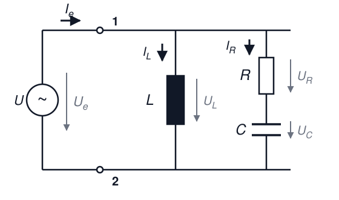

# Elektrotechnik – 6. Wechselstrom III

**Luft- und Raumfahrttechnik Bachelor, 1. Semester**

David Straub

## 6. Wechselstrom

1. Grundlegende Begriffe und Kennwerte
2. Komplexe Wechselstromrechnung
3. Wechselstromwiderstände (Impedanz, Admittanz)
4. Grundschaltungen
5. Leistung (Wirk-, Blind-, Scheinleistung)
6. Blindleistungskompensation
7. Resonanz und Frequenzverhalten

### Rückblick: Leistung an R, L und C

**Am Widerstand R:** $\overline{p} = U I$ — Energie wird verbraucht, $\varphi = 0°$

**An C und L:** $\overline{p} = 0$ — Energie pendelt, $\varphi = \mp 90°$

**In der Praxis:** Kombinationen aus R, L, C mit **beliebiger Phasenverschiebung** $0° < |\varphi| < 90°$ (Motor: $\varphi \approx 30°$–$60°$; Netzteil: R-C)

**Frage:** Wie berechnet man die Leistung bei beliebigem $\varphi$?

### Momentanleistung mit Phasenverschiebung

$$p(t) = u(t) \cdot i(t) = \hat{U} \cos(\omega t) \cdot \hat{I} \cos(\omega t - \varphi)$$

Mit trigonometrischer Umformung und Effektivwerten $U$, $I$:

$$p(t) = \underbrace{U I \cos\varphi}_{P} \cdot [1 + \cos(2\omega t)] + \underbrace{U I \sin\varphi}_{Q} \cdot \sin(2\omega t)$$

- Die Leistung oszilliert mit **doppelter Frequenz**
- Ein **konstanter** Anteil (wird verbraucht) + ein **pendelnder** Anteil (Mittelwert 0)

### Wirk-, Blind- und Scheinleistung

**Wirkleistung** (Mittelwert, tatsächlich umgesetzt):
$$\boxed{P = U I \cos\varphi} \qquad [P] = \text{W}$$

**Blindleistung** (pendelnder Energiefluss):
$$\boxed{Q = U I \sin\varphi} \qquad [Q] = \text{var}$$

**Scheinleistung** (Netzbelastung, Dimensionierung!):
$$\boxed{S = U I = \sqrt{P^2 + Q^2}} \qquad [S] = \text{VA}$$

Vorzeichen von $Q$: induktiv **positiv**, kapazitiv **negativ**.

### Blindleistung: Praktische Bedeutung

Blindleistung trägt **nicht** zur nutzbaren Leistung bei, belastet aber das Netz:

- Höhere Ströme in Leitungen und Transformatoren
- Erhöhte Verluste: $P_\text{Verlust} = R \cdot I^2$
- Spannungsabfälle im Netz

**Beispiel Transformator mit $S_\text{max} = 10 \, \text{kVA}$:**
bei $\cos\varphi = 0{,}7$ liefert er nur $P = 7 \, \text{kW}$ — voll ausgelastet, aber 30 % „verschenkt".

**Konsequenz:** Industriekunden zahlen Strafgebühren bei $\cos\varphi < 0{,}9$.

### Komplexe Scheinleistung: Motivation

**Naiver Ansatz:** $\underline{U} \cdot \underline{I} = U I \cdot e^{j(\varphi_u + \varphi_i)}$ — die Phasen *addieren* sich → **falsch!**

Wir brauchen die *Differenz* $\varphi = \varphi_u - \varphi_i$.

**Lösung: konjugiert komplexer Strom**

$$\underline{U} \cdot \underline{I}^* = U e^{j\varphi_u} \cdot I e^{-j\varphi_i} = U I \cdot e^{j\varphi} = \underbrace{U I \cos\varphi}_{P} + j \underbrace{U I \sin\varphi}_{Q}$$

### Definition der komplexen Scheinleistung

$$\boxed{\underline{S} = \underline{U} \cdot \underline{I}^* = P + jQ}$$

- **Betrag:** $S = |\underline{S}| = \sqrt{P^2 + Q^2}$
- **Phase:** $\varphi = \varphi_u - \varphi_i$

**Alternative Darstellungen:**
$$\underline{S} = \underline{Z} \cdot I^2 = \frac{U^2}{\underline{Z}^*}$$

**Beispiel RL-Reihenschaltung:** $\underline{S} = I^2 (R + j\omega L)$ — Realteil = Wirkleistung an R, Imaginärteil = Blindleistung an L. **Am Vorzeichen von $\text{Im}\,\underline{S}$ erkennt man die Impedanzcharakteristik** (+ induktiv, − kapazitiv)!

### Leistungsdreieck

Das **Leistungsdreieck** visualisiert den Zusammenhang:

- Wirkleistung: $P = S \cos\varphi$
- Blindleistung: $Q = S \sin\varphi$
- Scheinleistung: $S = \sqrt{P^2 + Q^2}$
- Phasenwinkel: $\tan\varphi = \frac{Q}{P}$

**Beispiel Industriebetrieb:** $P = 800 \, \text{kW}$, $Q = 600 \, \text{kvar}$ → $S = 1000 \, \text{kVA}$, $\varphi \approx 37°$ — der Trafo muss für 1000 kVA ausgelegt sein!

### Leistungsfaktor cos φ

$$\lambda = \cos\varphi = \frac{P}{S}$$

| Verbraucher | cos φ | Bemerkung |
|-------------|-------|-----------|
| Glühbirne, Heizung | ≈ 1,0 | rein ohmsch |
| Motor ohne Last | ≈ 0,3 | viel Magnetisierung |
| Motor Volllast | ≈ 0,85 | besser, aber nicht ideal |
| Transformator | ≈ 0,8–0,9 | Streuinduktivität |
| Modernes Netzteil (PFC) | > 0,95 | mit Kompensation |

Energieversorger fordern $\cos\varphi > 0{,}9$; bei $\cos\varphi = 0{,}7$ statt $0{,}95$ fließt **26 % mehr Strom** für dieselbe Wirkleistung.

### Blindleistungskompensation

**Problem bei induktiven Verbrauchern** (Motoren, Trafos): $Q_L > 0$, niedriger $\cos\varphi$, hohe Ströme, Strafzahlungen.

**Lösung:** Kondensatoren **parallel** schalten — $Q_C < 0$ kompensiert $Q_L > 0$:

$$Q_C = Q_1 - Q_2 = P \cdot (\tan\varphi_1 - \tan\varphi_2)$$

($\varphi_1$: vorher, $\varphi_2$: Ziel; vollständige Kompensation: $\varphi_2 = 0$)

**Warum parallel?** Damit die Spannung am Verbraucher — und damit seine Wirkleistung — unverändert bleibt!

### Kompensation: Praxisbeispiel

Betrieb: $P = 100 \, \text{kW}$, $\cos\varphi_1 = 0{,}8$ ($\varphi_1 \approx 37°$), $U = 400 \, \text{V}$

**Vorher:** $Q_L = 75 \, \text{kvar}$, $S_1 = 125 \, \text{kVA}$, $I_1 = 312 \, \text{A}$

**Kompensation auf $\cos\varphi_2 = 1$:** $Q_C = -75 \, \text{kvar}$

**Nachher:** $S_2 = P = 100 \, \text{kVA}$, $I_2 = 250 \, \text{A}$

- Strom: **−20 %**, Leitungsverluste ($\propto I^2$): **−36 %**, keine Strafzahlungen

### 📝 Jetzt sind Sie dran: Leuchtstoffröhre (zu zweit)

**Aufgabe 20**

Eine Leuchtstoffröhre mit Vorschaltdrossel (= Reihenschaltung aus $R$ und $L$; $P = 40 \, \text{W}$, $I = 0{,}4 \, \text{A}$) liegt am Netz ($U = 230 \, \text{V}$, $f = 50 \, \text{Hz}$).

a) Wie hoch ist die Scheinleistung $S$? Wie groß ist $\cos\varphi$?
b) Wie groß sind $R$ und $\omega L$?
c) Ein Kondensator soll die gesamte Blindleistung kompensieren. Wie muss er geschaltet werden (Begründung)?
d) Berechnen Sie $C$.
e) Veranschaulichen Sie die Kompensation im Zeigerdiagramm.

### Resonanz: Der Serienschwingkreis

Reihenschaltung aus R, L und C:

$$\underline{Z}(\omega) = R + j\left(\omega L - \frac{1}{\omega C}\right)$$

Bei der **Resonanzfrequenz** heben sich $X_L$ und $X_C$ auf:

$$\omega_0 L = \frac{1}{\omega_0 C} \qquad\Rightarrow\qquad \boxed{\omega_0 = \frac{1}{\sqrt{LC}}}$$

Bei $\omega_0$:

- $\underline{Z} = R$ — **rein reell**, minimal → Strom maximal
- Der Zweipol nimmt **nur Wirkleistung** auf ($Q = 0$)

**Klausur-Formulierung:** „Bei welcher Frequenz nimmt die Schaltung nur Wirkleistung auf? Wie nennt man diesen Arbeitspunkt?" → **Resonanz!**

### Resonanz: Der Parallelschwingkreis

L und C parallel (ggf. mit R):

$$\underline{Y}(\omega) = \frac{1}{R} + j\left(\omega C - \frac{1}{\omega L}\right)$$

Bei $\omega_0 = \frac{1}{\sqrt{LC}}$:

- $\underline{Y}$ minimal → $\underline{Z}$ **maximal**, rein reell
- Strom von außen minimal — L und C tauschen ihre Energie *untereinander* aus (Kreisstrom!)

Serienresonanz: $Z$ **minimal** • Parallelresonanz: $Z$ **maximal** — beide: $\underline{Z}$ reell, $Q = 0$

### Impedanzcharakteristik

Wie „verhält sich" ein Zweipol bei gegebener Frequenz?

- $\text{Im}\,\underline{Z} > 0$ (bzw. $\varphi > 0$, $\text{Im}\,\underline{S} > 0$): **induktiv**
- $\text{Im}\,\underline{Z} < 0$: **kapazitiv**
- $\text{Im}\,\underline{Z} = 0$: **reell** — Resonanzfall (oder rein ohmsch)

Beispiel Serienschwingkreis:

- $\omega < \omega_0$: $\frac{1}{\omega C} > \omega L$ → **kapazitiv**
- $\omega > \omega_0$: → **induktiv**

**Klausur-Frage:** „Welche Impedanzcharakteristik weist der Zweipol auf (Begründung)?" → Vorzeichen von $\text{Im}\,\underline{Z}$ oder $\text{Im}\,\underline{S}$ angeben!

### Frequenzverhalten: Die Grenzfälle ω → 0 und ω → ∞

Mächtige Kontrolltechnik (und Klausur-Standardfrage!): ersetze die Blindelemente durch ihre Grenzfälle —

| | $\omega \to 0$ (Gleichstrom) | $\omega \to \infty$ |
|---|---|---|
| Kondensator ($Z_C = \frac{1}{\omega C}$) | **Unterbrechung** ($Z \to \infty$) | **Kurzschluss** ($Z \to 0$) |
| Spule ($Z_L = \omega L$) | **Kurzschluss** ($Z \to 0$) | **Unterbrechung** ($Z \to \infty$) |

**Vorgehen:** Schaltung zweimal neu zeichnen (einmal pro Grenzfall), Blindelemente ersetzen, Verhalten ablesen.

So erklärt man die **Filterwirkung** einer Schaltung: Was passiert mit dem Ausgangssignal bei tiefen/hohen Frequenzen? (Tiefpass, Hochpass, ...)

### 📝 Jetzt sind Sie dran: Resonanz & Grenzfälle (zu zweit)

**Aufgabe 21**

Ein Serienschwingkreis besteht aus $R = 50 \, \Omega$, $L = 20 \, \text{mH}$, $C = 50 \, \mu\text{F}$.

a) Bei welcher Kreisfrequenz $\omega_0$ (und Frequenz $f_0$) nimmt die Schaltung nur Wirkleistung auf?
b) Wie groß ist $\underline{Z}$ bei $\omega_0$?
c) Welche Impedanzcharakteristik hat die Schaltung bei $\omega = \omega_0/2$? (Begründung!)
d) Geben Sie $\underline{Z}$ für $\omega \to 0$ und $\omega \to \infty$ an. Was macht diese Schaltung mit sehr langsamen und sehr schnellen Signalen?

### 📝 Klausuraufgabe: Zweipol (zu zweit)

$\underline{U} = 8 \, \text{V} \cdot e^{j\pi/2}$ (komplexer Effektivwert); $R = 0{,}8 \, \text{k}\Omega$, $L = 16 \, \text{mH}$. Bei $\omega_g = 5 \cdot 10^4 \, \text{s}^{-1}$ nimmt die Schaltung $\underline{S} = 40(1+j) \, \text{mVA}$ auf. *($C$ ist nicht gegeben — Sie brauchen es nicht!)*

a) Berechnen Sie $\underline{I}_e$. Welche Impedanzcharakteristik liegt vor (Begründung)?
b) Berechnen Sie $\underline{Z}_e$ und $\underline{Y}_e$.
c) Berechnen Sie $\underline{I}_L$, dann $\underline{I}_R$ und $\underline{U}_R$, dann $\underline{U}_C$.
d) **Zeichnen Sie** $\underline{I}_e$, $\underline{I}_L$, $\underline{U}_e$, $\underline{U}_R$, $\underline{U}_C$ als Effektivwertzeiger.
e) Geben Sie $I_e$, $\hat{I}_e$ und $\varphi_i$ an.
f) Bei $\omega_0$ nimmt der Zweipol nur Wirkleistung auf — wie heißt dieser Arbeitspunkt? Geben Sie $\underline{Z}_e$ für $\omega \to 0$ und $\omega \to \infty$ an.

### Zusammenfassung: Wechselstrom

- Kennwerte: Mittelwert, Gleichrichtwert, **Effektivwert** ($\hat{A}/\sqrt{2}$ nur für Sinus!)
- Komplexe Rechnung: Festzeiger, $e^{j\omega t}$ kürzt sich; addieren kartesisch, multiplizieren polar
- Impedanzen: $\underline{Z}_R = R$, $\underline{Z}_L = j\omega L$, $\underline{Z}_C = \frac{1}{j\omega C}$ — alle DC-Methoden gelten weiter
- Leistung: $P = UI\cos\varphi$, $Q = UI\sin\varphi$, $\underline{S} = \underline{U}\,\underline{I}^* = P + jQ$
- Kompensation: Kondensator **parallel**, $Q_C = P(\tan\varphi_1 - \tan\varphi_2)$
- **Resonanz:** $\omega_0 = \frac{1}{\sqrt{LC}}$, $\underline{Z}$ reell; Grenzfälle: C/L ↔ Unterbrechung/Kurzschluss

**Nächstes Kapitel:** Drehstrom — warum aus der Steckdose eigentlich drei Phasen kommen 🔌

### Wechselstrom: Niederspannung weltweit

### 👥 Gruppenarbeit: Westinghouse vs. Edison reloaded

Mit Ihrem jetzigen Wissen über Wechselstrom und Gleichstrom, Wirkleistung und Blindleistung, diskutieren Sie in Ihrer Gruppe die Vor- und Nachteile der beiden Stromsysteme:

- Edison 💡: Gleichstrom mit 110 V
- Westinghouse 〜: Wechselstrom mit 110 V, auf längere Strecken transformiert auf > 1000 V

**Hinweise:** Leitungsverluste (inkl. Blindleistung), Sicherheit, Wirtschaftlichkeit

**Zusatzfrage:** Würde die Entscheidung heute anders ausfallen?
