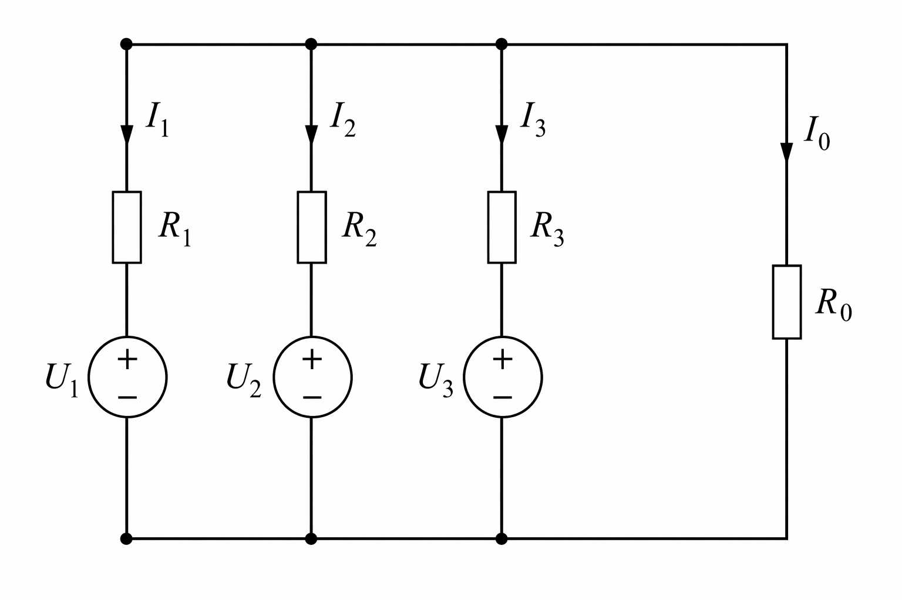
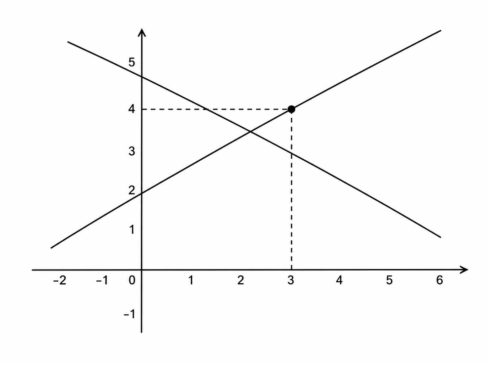

# Numerik

**Ingenieurinformatik Teil 2, Sommersemester 2026**

David Straub

### Gliederung

1. Einführung in Matlab
2. Arbeiten mit Arrays
3. Funktionen und Kontrollstrukturen
4. Analysis
5. **Lineare Algebra** 👈
6. Differentialgleichungen
7. Einführung in Simulink


### Fahrplan – 2 Einheiten

**Einheit 1 (heute):** Lineare Gleichungssysteme
- Motivation
- Matrixoperationen in Matlab
- Lineare Gleichungssysteme: Formen, Rang, Konditionierung
- Lösung mit `\` – wann exakt, wann Least-Squares?

**Einheit 2:** Eigenwertprobleme
- Eigenwerte und Eigenvektoren: `eig`
- Physikalische Interpretation
- Anwendung: Gekoppelte Schwingungen
- Verallgemeinertes Eigenwertproblem


## Motivation: Ein Ingenieurproblem


### Batteriezellen parallel schalten



Drei Batteriezellen mit unterschiedlichen Spannungen $U_1, U_2, U_3$ und Innenwiderständen $R_1, R_2, R_3$ werden parallel geschaltet.

**Gesucht:** Ströme $I_1, I_2, I_3$ durch jede Zelle.


### Kirchhoffsche Gesetze

**Maschenregel** (für jede Zelle):

$$U_1 - I_1 R_1 - I_0 R_0 = 0$$
$$U_2 - I_2 R_2 - I_0 R_0 = 0$$
$$U_3 - I_3 R_3 - I_0 R_0 = 0$$

**Knotenregel:**

$$I_1 + I_2 + I_3 = I_0$$

**4 Gleichungen, 4 Unbekannte** → Lineares Gleichungssystem!


### Als Matrixgleichung

$$\begin{pmatrix} R_1 & 0 & 0 & R_0 \\ 0 & R_2 & 0 & R_0 \\ 0 & 0 & R_3 & R_0 \\ 1 & 1 & 1 & -1 \end{pmatrix} \begin{pmatrix} I_1 \\ I_2 \\ I_3 \\ I_0 \end{pmatrix} = \begin{pmatrix} U_1 \\ U_2 \\ U_3 \\ 0 \end{pmatrix}$$

**Kurzform:** $A\boldsymbol{x} = \boldsymbol{b}$

**Frage:** Wie lösen wir das in Matlab effizient?


## Matrixoperationen


### Wiederholung: Matrix-Arithmetik

Matrizen sind das zentrale Datenobjekt in Matlab:

```matlab
A = [1 2; 3 4];
B = [5 6; 7 8];

C = A + B       % Addition
D = A * B       % Matrixmultiplikation (!)
E = A .* B      % Elementweise Multiplikation
```

**Wichtig:** `*` ist die mathematische Matrixmultiplikation!

$$\begin{pmatrix} 1 & 2 \\ 3 & 4 \end{pmatrix} \cdot \begin{pmatrix} 5 & 6 \\ 7 & 8 \end{pmatrix} = \begin{pmatrix} 19 & 22 \\ 43 & 50 \end{pmatrix}$$


### Transposition

```matlab
A = [1 2 3; 4 5 6]
```

**Punkt-Transposition:** Reines Vertauschen von Zeilen/Spalten

```matlab
A.'       % [1 4; 2 5; 3 6]
```

**Komplex-konjugierte Transposition:** Für komplexe Matrizen

```matlab
A'        % Transponiert UND konjugiert komplex
```

> Für reelle Matrizen sind `.'` und `'` identisch.


### Matrix-Vektor-Multiplikation

Ein lineares Gleichungssystem $A\boldsymbol{x} = \boldsymbol{b}$ ist eine Matrix-Vektor-Multiplikation:

```matlab
A = [-1  1;
      1  1];
x = [1.5; 3.5];

b = A * x      % b = [2; 5]
```

$$\begin{pmatrix} -1 & 1 \\ 1 & 1 \end{pmatrix} \begin{pmatrix} 1.5 \\ 3.5 \end{pmatrix} = \begin{pmatrix} 2 \\ 5 \end{pmatrix}$$


### Wichtige Matrixoperationen

```matlab
A = [1 2; 3 4];

det(A)      % Determinante
inv(A)      % Inverse Matrix
rank(A)     % Rang
cond(A)     % Konditionszahl
```

**Diese Funktionen brauchen wir, um Gleichungssysteme zu verstehen!**


## Lineare Gleichungssysteme


### Was ist ein lineares Gleichungssystem?

**Allgemeine Form:**

$$A\boldsymbol{x} = \boldsymbol{b}$$

- $A$: $(m \times n)$-Matrix (Koeffizientenmatrix)
- $\boldsymbol{x}$: Spaltenvektor mit $n$ Unbekannten
- $\boldsymbol{b}$: Spaltenvektor mit $m$ Gleichungen

**$m$ Gleichungen für $n$ Unbekannte**


### Formen von $A$

**Quadratisch:** $m = n$ (gleich viele Gleichungen wie Unbekannte)

```matlab
A = [2 1; 1 3];    % 2×2
```

**Überbestimmt:** $m > n$ (mehr Gleichungen als Unbekannte)

```matlab
A = [2 1; 1 3; -1 2];    % 3×2
```

**Unterbestimmt:** $m < n$ (weniger Gleichungen als Unbekannte)

```matlab
A = [2 1 3];    % 1×3
```


### Rang einer Matrix

Der **Rang** $\text{rank}(A)$ ist die Anzahl linear unabhängiger Zeilen/Spalten:

```matlab
A = [1  2  3;
     2  4  6];    % Zeile 2 = 2·Zeile 1

rank(A)           % 1 (nicht 2!)
```

**Bedeutung:** Gibt an, wie viele "echte" Gleichungen vorhanden sind.

$$\text{rank}(A) \leq \min(m, n)$$


### ✍️ Übung: Rang bestimmen

Welchen Rang haben diese Matrizen? Überlegen Sie erst, dann prüfen mit `rank()`:

```matlab
A1 = [1 2 3; 2 4 6; 1 1 1];
A2 = [1 0 0; 0 1 0; 0 0 1];
A3 = [1 2; 3 6; 2 4];
```


### Geometrische Interpretation

**2 Gleichungen, 2 Unbekannte:** Jede Gleichung = **Gerade**

$$\begin{aligned}
-x + y &= 2 \\
x + y &= 5
\end{aligned}$$

Lösung = **Schnittpunkt** der Geraden

**3 Gleichungen, 3 Unbekannte:** Jede Gleichung = **Ebene**

Lösung = **Schnittpunkt** der Ebenen



### Lösbarkeit: Quadratisches System

Für **quadratische** Systeme ($m = n$):

**Fall 1:** $\det(A) \neq 0$ und $\text{rank}(A) = n$
→ **Genau eine Lösung** für jedes $\boldsymbol{b}$

**Fall 2:** $\det(A) = 0$ oder $\text{rank}(A) < n$ (Matrix **singulär**)
→ Keine Lösung ODER unendlich viele Lösungen

```matlab
A = [-1  1;
     -2  2];    % Zeile 2 = 2·Zeile 1

det(A)          % 0
rank(A)         % 1
```


### Lösbarkeit: Nicht-quadratische Systeme

**Überbestimmt** ($m > n$):
- Falls $\text{rank}(A) = n$ und $\boldsymbol{b}$ im Spaltenraum: **eine Lösung**
- Sonst: **keine exakte Lösung** (aber bestmögliche Näherung möglich)

**Unterbestimmt** ($m < n$):
- Falls $\text{rank}(A) = m$: **unendlich viele Lösungen**
- Sonst: keine Lösung oder unendlich viele


### Konditionierung

Die **Konditionszahl** misst, wie empfindlich die Lösung auf Störungen reagiert:

```matlab
A = [1  1;
     1  1.0001];

cond(A)     % 40000 (schlecht konditioniert!)
```

**Faustregel:**
- $\kappa(A) < 100$: gut konditioniert
- $\kappa(A) > 10^{10}$: schlecht konditioniert
- $\kappa(A) = \infty$: singulär

**Bedeutung:** Bei $\kappa = 10^6$ können 6 Dezimalstellen im Ergebnis falsch sein!


### Singuläre vs. schlecht konditionierte Matrix

```matlab
% Singulär: det = 0, unendliche Konditionszahl
A1 = [1 2; 2 4];
det(A1)      % 0
cond(A1)     % Inf

% Schlecht konditioniert: det ≠ 0, aber sehr klein
A2 = [1 2; 2 4.001];
det(A2)      % 0.001
cond(A2)     % 16004
```

**Singuläre Matrix:** Keine eindeutige Lösung (mathematisches Problem)
**Schlecht konditioniert:** Lösung existiert, aber numerisch instabil


## Exakte Lösung vs. Least-Squares


### Exakte Lösung

Wenn $A\boldsymbol{x} = \boldsymbol{b}$ **exakt lösbar** ist:

```matlab
A = [2 1; 1 3];
b = [5; 6];

x = ???        % Gesucht!

A * x          % Ergebnis ist EXAKT b
```

**Probe:** $A\boldsymbol{x} - \boldsymbol{b} = \boldsymbol{0}$


### Keine exakte Lösung möglich

Überbestimmtes System – 3 Geraden haben keinen gemeinsamen Schnittpunkt:

```matlab
A = [-1    1;
      1    1;
     -0.4  1];
b = [0; 2; 0.5];
```

**Keine Lösung erfüllt alle 3 Gleichungen gleichzeitig!**

Was tun?


### Least-Squares-Lösung

**Idee:** Finde $\boldsymbol{x}$, das den **Fehler minimiert**:

$$\min_{\boldsymbol{x}} \|A\boldsymbol{x} - \boldsymbol{b}\|^2$$

```matlab
x = ???        % Bestmögliche Lösung

residuum = A * x - b     % ≠ 0, aber minimal!
norm(residuum)           % So klein wie möglich
```

**Least-Squares** = "Kleinste Quadrate" = Minimiere Summe der quadrierten Fehler


### Wann exakt, wann Least-Squares?

| System | Bedingung | Lösung |
|--------|-----------|--------|
| Quadratisch | $\det(A) \neq 0$ | **Exakt** |
| Quadratisch | $\det(A) = 0$ | Keine oder $\infty$ viele |
| Überbestimmt | $\boldsymbol{b}$ im Spaltenraum | **Exakt** (selten!) |
| Überbestimmt | Sonst | **Least-Squares** |
| Unterbestimmt | - | $\infty$ viele (min. Norm) |


## Lösung mit Linksdivision `\`


### Der Backslash-Operator `\`

**Der universelle Löser für lineare Gleichungssysteme:**

```matlab
A = [-1  1;
      1  1];
b = [2; 5];

x = A \ b           % Lösung: [1.5; 3.5]
```

$$A\boldsymbol{x} = \boldsymbol{b} \quad \Longrightarrow \quad \boldsymbol{x} = A \backslash \boldsymbol{b}$$


### `\` vs. `/` – Linksdivision vs. Rechtsdivision

**Linksdivision** `\`: Löst $A\boldsymbol{x} = \boldsymbol{b}$

```matlab
x = A \ b      % "A nach links teilen"
```

**Rechtsdivision** `/`: Löst $\boldsymbol{x}A = \boldsymbol{b}$

```matlab
x = b / A      % "A nach rechts teilen"
               % Äquivalent zu: x = (A' \ b')'
```

**In der Praxis:** Fast immer `\` verwenden! `/` nur für spezielle Fälle (z.B. bei transponierten Systemen).


### Was macht `\` genau?

Matlab analysiert $A$ und wählt den optimalen Algorithmus:

| $A$ | Was macht `\`? |
|-----|---------|
| Quadratisch, regulär ($m=n$, $\det \neq 0$) | **Exakte Lösung** (LU-Zerlegung) |
| Quadratisch, singulär ($m=n$, $\det = 0$) | Warnung! Pseudo-Inverse |
| Überbestimmt ($m > n$) | **Least-Squares** (QR-Zerlegung) |
| Unterbestimmt ($m < n$) | Lösung mit $\leq m$ Nicht-Null-Elementen |

**Matlab wählt automatisch – aber Sie müssen das Ergebnis überprüfen!**


### Beispiel 1: Quadratisches System (exakt)

```matlab
A = [-1  1;
      1  1];
b = [2; 5];

x = A \ b      % [1.5; 3.5]

% Probe:
norm(A*x - b)  % 0 → Exakte Lösung!
```


### Beispiel 2: Überbestimmtes System (Least-Squares)

```matlab
A = [-1    1;
      1    1;
     -0.4  1];
b = [0; 2; 0.5];

x = A \ b 

% Probe:
A * x          % ≠ b!
norm(A*x - b)  % ≠ 0 → Keine exakte Lösung!
```

**Matlab gibt automatisch Least-Squares-Lösung!**


### ⚠️ Wichtig: Überprüfen Sie die Lösung!

**Immer Residuum berechnen:**

```matlab
x = A \ b;
r = A*x - b;
fehler = norm(r);

if fehler < 1e-10
    disp('Exakte Lösung gefunden')
else
    disp('Least-Squares-Lösung (keine exakte Lösung)')
    fprintf('Fehler: %.3e\n', fehler)
end
```


### ⚠️ Warnung: Singuläre Matrix

```matlab
A = [1  2;
     2  4];    % Zeile 2 = 2·Zeile 1
b = [3; 4];

det(A)         % 0 (singulär!)
x = A \ b       % Warnung!
```

**Ausgabe:**
```
Warning: Matrix is singular to working precision.
x =
   Inf
  -Inf
```

**Bei Singularität:** Matlab warnt und gibt unsinnige Ergebnisse!


### ⚠️ Warnung: Fast singuläre Matrix

```matlab
A = [1      2;
     2  3.9999999999999995];  % Fast parallel!

det(A)         % -8.88e-16 (fast 0!)
x = A \ b
```

**Ausgabe:**
```
Warning: Matrix is close to singular or badly scaled.
         Results may be inaccurate. RCOND = 1.233581e-17. 
x =
  1.0e+15 *
   -9.0072
    4.5036
```

**Bei schlechter Konditionierung:** Kleine Fehler → riesige Ergebnisse!


### Beispiel: Lösung mit `inv` (nicht empfohlen!)

```matlab
A = [-1  1;
      1  1];
b = [2; 5];

% Mit inv (funktioniert, aber ineffizient)
IA = inv(A);
x = IA * b          % [1.5; 3.5]

% Probe
A * x               % [2; 5] ✓
A * IA              % [1 0; 0 1] = Einheitsmatrix
det(A) * det(IA)    % -2 * -0.5 = 1
```

**Aber:** Für große Matrizen langsam und ungenau!


## Zusammenfassung


### Wichtigste Erkenntnisse

**Lineare Gleichungssysteme:** $A\boldsymbol{x} = \boldsymbol{b}$
- Form von $A$: quadratisch, überbestimmt, unterbestimmt
- Rang und Konditionierung bestimmen Lösbarkeit
- **Exakte Lösung** vs. **Least-Squares**

**Lösung mit `\`:**
- Universeller Operator – wählt beste Methode
- Überprüfen: `norm(A*x - b)` → 0 bedeutet exakt
- **Nicht `inv(A)*b` für LGS verwenden!**

**Matrixfunktionen:**
- `det(A)`, `rank(A)`, `cond(A)` – Analyse
- `inv(A)` – okay für andere Zwecke, nicht für LGS

