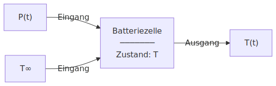

# Numerik

**Ingenieurinformatik Teil 2, Sommersemester 2026**

David Straub


### Gliederung

1. Einführung in Matlab
2. Arbeiten mit Arrays
3. Funktionen und Kontrollstrukturen
4. Analysis
5. Lineare Algebra
6. Differentialgleichungen
7. **Einführung in Simulink** 👈


### Fahrplan: Einführung in Simulink

**Einheit 1 – Heute**
→ Was ist Simulink?
→ Vom Anfangswertproblem (AWP) zum Signalflussplan
→ Simulink-Blöcke, Subsysteme und Parameter

**Einheit 2**
→ Weitere Beispiele und Anwendungen


## Einführung in Simulink


### Was ist Simulink?

**Simulink** ist eine blockbasierte, graphische Simulationsumgebung in Matlab.

Statt einen Algorithmus zu schreiben, beschreibt man das System als **Signalflussplan**: Blöcke berechnen mathematische Operationen, Verbindungen transportieren Signale.


### Beispiel: Batteriezelle als dynamisches System



Der Ausgang hängt vom **gespeicherten Zustand** ab → **dynamisches** System


## Vom Anfangswertproblem zum Signalflussplan


### Das Euler-Verfahren – Ausgangspunkt

Das Euler-Verfahren für $\dot{y} = f(t,\, y)$ führt pro Schritt **zwei Operationen** aus:

$$\dot{y}_n = f(t_n,\, y_n) \qquad \text{dann} \qquad y_{n+1} = y_n + \Delta t\cdot\dot{y}_n$$

```matlab
for n = 1 : length(t)-1
    dy_dt  = f( t(n), y(n) )     % rechte Seite auswerten
    y(n+1) = y(n) + dy_dt * dt   % Euler-Schritt
end
```

**Jetzt:** Jede Operation wird ein **Block**, jedes Zwischenergebnis ein **Signal**.


### Vom Euler-Schritt zum Signalflussplan

$$\dot{y}_n = f(t_n,\, y_n) \quad\Rightarrow\quad \xrightarrow{\;y\;}\boxed{f(t,y)}\xrightarrow{\;\dot{y}\;}$$

$$y_{n+1} = y_n + \Delta t\cdot\dot{y}_n \quad\Rightarrow\quad \xrightarrow{\;\dot{y}\;}\boxed{\int dt}\xrightarrow{\;y\;}$$

$y$ taucht auf **beiden** Seiten auf → Rückkopplung:

$$\xrightarrow{\;y\;}\boxed{f(t,y)}\xrightarrow{\;\dot{y}\;}\boxed{\int dt}\xrightarrow{\;y\;}\;\;\circlearrowleft$$

Ein **Signalflussplan** ist eine graphische for-Schleife.


### Signalflussplan und Solver

Ein **Zustand** ist ein Wert, den ein Block zwischen Zeitschritten speichert.

**f-Block** – kein Zustand: berechnet $\dot{y}_n = f(t_n, y_n)$ direkt aus dem Eingang.

**Integrator** – Zustand $y_n$:
- *Auswertung*: gibt den gespeicherten Wert $y_n$ aus
- *Fortschreibung*: speichert den neuen Wert $y_{n+1} = y_n + \Delta t \cdot \dot{y}_n$

Der **Solver** treibt die for-Schleife an und übernimmt die Zeitinkrementierung $t_{n+1} = t_n + \Delta t$.

Einstellbar: Euler (festes $\Delta t$), ode45 (adaptives $\Delta t$), …


### Batterie-DGL (1. Ordnung)

**Euler-Schritt** mit $f(t,T) = \dfrac{P(t) - \lambda(T-T_\infty)}{C_\text{th}}$:

$$T_{n+1} = T_n + \Delta t \cdot f(t_n,\, T_n)$$

Eine Akkumulationszeile → **ein Integrator**:

$$\xrightarrow{\;T\;} \boxed{f(t,T)} \xrightarrow{\;\dot{T}\;} \boxed{\int dt} \xrightarrow{\;T\;} \;\; \circlearrowleft$$


## Simulink-Blöcke


### Integrator-Block

$$\xrightarrow{\;\dot{y}\;} \boxed{\int dt} \xrightarrow{\;y\;}$$

- Eingang: Ableitung $\dot{y}$
- Ausgang: Zustand $y$
- Parameter: **Anfangsbedingung** $y_0$ (Initial Condition)

Symbol in Simulink: $\dfrac{1}{s}$ (Laplace-Notation: Integration im Zeitbereich = Division durch $s$)


### Scope und Mux

**Scope** – zeigt Signale als Funktion der Zeit an.

**Mux** – fasst mehrere Signale zu einem Vektorsignal zusammen:

$$\xrightarrow{\;x(t)\;}\;\Big\}\;\xrightarrow{\;\begin{pmatrix}x\\\dot{x}\end{pmatrix}\;}\boxed{\text{Scope}}$$

Scope mit einem Mux-Eingang → mehrere Kurven in einem Fenster.

Alternativ: Scope mit mehreren Eingängen direkt konfigurieren (Number of Input Ports).


### ✍️ Aufgabe: Batterie-DGL in Simulink

Implementieren Sie das Batterie-Modell $\dot{T} = f(T) = \dfrac{P - \lambda(T-T_\infty)}{C_\text{th}}$ in Simulink. $P=125\,\text{W}$, $T_\infty = 25\,^\circ\text{C}$, $C_\text{th} = 100\,\text{J/K}$, $\lambda = 2\,\text{W/K}$, $T_0 = 25\,^\circ\text{C}$.

1. Neues Modell erstellen
2. Blöcke platzieren: **Matlab Function**, **Integrator**, **Scope**
3. Matlab Function implementieren: `function T_dot = f(T)`
4. Blöcke verbinden – Rückkopplung nicht vergessen
5. Anfangswert $T_0 = 25$ am Integrator einstellen
6. Stoppzeit $t_\text{end} = 360\,\text{s}$, simulieren, Ergebnis prüfen

**Extraaufgabe:** Ersetzen Sie $P = \text{const}$ durch ein gemessenes Lastprofil $(t_i, P_i)$: **From Workspace**-Block hinzufügen, $P$ als zweiten Eingang in `f(T, P)` führen.


### Batterie ohne Matlab Function

$f(T) = \dfrac{P - \lambda(T-T_\infty)}{C_\text{th}}$ lässt sich direkt als Signalflussplan aus Elementarblöcken aufbauen:

$$\xrightarrow{\;T\;}\boxed{-T_\infty}\xrightarrow{\;T{-}T_\infty\;}\boxed{\times\lambda}\xrightarrow{\;\lambda\Delta T\;}\boxed{P-\,\cdot}\xrightarrow{\;P{-}\lambda\Delta T\;}\boxed{\times\tfrac{1}{C_\text{th}}}\xrightarrow{\;\dot{T}\;}$$

| Block | Funktion |
|-------|---------|
| **Constant** | liefert einen festen Wert ($P$, $\lambda$, $T_\infty$, $C_\text{th}$) |
| **Gain** | multipliziert ein Signal mit einer Konstanten |
| **Sum** | addiert oder subtrahiert Signale |

Der Matlab Function-Block ist kompakter — aber Elementarblöcke machen die Rechenoperationen explizit sichtbar und sind direkt für die **Codegenerierung** geeignet.


### Subsysteme: Modelle als Blöcke

Ein **Subsystem** fasst Blöcke zu einem wiederverwendbaren Block zusammen.

Das Batterie-Modell aus der Aufgabe wird zum Subsystem **„Zelle"**:

$$\xrightarrow{\;P(t)\;} \boxed{\text{Zelle}} \xrightarrow{\;T(t)\;}$$

Zwei thermisch gekoppelte Zellen (Einheit 9) → zwei Subsysteme verbinden.

Komplexe Systeme entstehen durch **Komposition** — jede Ebene zeigt nur den notwendigen Abstraktionsgrad.

**Industrieapplikation:** Ein Simulink-Modell kann direkt in C-Code übersetzt werden (**Codegenerierung**) — dieselbe Logik, die im Modell läuft, läuft dann auf eingebetteter Hardware.


### Parameter und Schnittstelle

**Parameter aus dem Workspace:** Variablen wie $C_\text{th}$, $\lambda$ im Matlab-Workspace definieren — Simulink-Blöcke lesen sie automatisch. Kein Hardcoding in der Matlab Function.

**From Workspace:** gemessene Daten (z.B. Lastprofil $P(t)$) direkt ins Modell laden.

**To Workspace:** Simulationsergebnisse als Matlab-Variable speichern und weiterverarbeiten.

→ Simulink modelliert, Matlab analysiert.


### From Workspace: Lastprofil laden

```matlab
% Zeitpunkte und Leistungswerte definieren
t = [0,  600, 1200, 1800, 2400, 3600];  % s
P = [50, 200,  800,  400,  100,    0];  % W

% Als timeseries verpacken
lastprofil = timeseries(P, t);
```

Im **From Workspace**-Block: Feldname `lastprofil` eintragen.

Simulink interpoliert zwischen den Stützstellen — der Block gibt bei jedem Zeitschritt den passenden $P(t)$-Wert aus.


### Federschwinger (2. Ordnung)

Standardform mit $y_1 := x,\; y_2 := \dot{x}$:

$$\dot{y}_1 = y_2, \qquad \dot{y}_2 = -\frac{k}{m}\,y_1$$

**Euler-Schritt** – **zwei** Akkumulationszeilen, beide mit demselben $\Delta t$:

$$\dot{x}_{n+1} = \dot{x}_n + \Delta t\cdot\ddot{x}_n \qquad x_{n+1} = x_n + \Delta t\cdot\dot{x}_n$$

Zwei Akkumulationszeilen → **zwei Integratoren**:

$$\xrightarrow{\;\ddot{x}\;} \boxed{\int dt} \xrightarrow{\;\dot{x}\;} \boxed{\int dt} \xrightarrow{\;x\;} \boxed{\times(-k/m)} \xrightarrow{\;\ddot{x}\;} \;\; \circlearrowleft$$


### Vorgehen: DGL $n$-ter Ordnung → Signalflussplan

| Schritt | |
|---------|---|
| 1 | DGL nach der **höchsten Ableitung** auflösen |
| 2 | $n$ **Integratoren** in Reihe zeichnen |
| 3 | Ausgänge benennen: $y^{(n-1)},\,\ldots,\,\dot{y},\,y$ |
| 4 | Rechte Seite als Signalpfad aufbauen |
| 5 | Ergebnis zurück in den ersten Integratoreingang; Anfangswerte einstellen |


### ✍️ Aufgabe: Federschwinger in Simulink

Implementieren Sie den harmonischen Oszillator $m\ddot{x} + kx = 0$ mit $m = 1$, $k = 1$, $x(0) = 1$, $\dot{x}(0) = 0$ in Simulink.

1. Signalflussplan aufzeichnen (zwei Integratoren, Gain-Block)
2. Modell in Simulink aufbauen
3. Anfangswerte an den Integratoren einstellen
4. $x(t)$ und $\dot{x}(t)$ mit Scope darstellen (Mux verwenden)
5. Ergebnis mit der analytischen Lösung $x(t) = \cos(t)$ vergleichen

**Extraaufgabe:** $k$ und $m$ als Workspace-Variablen definieren.
