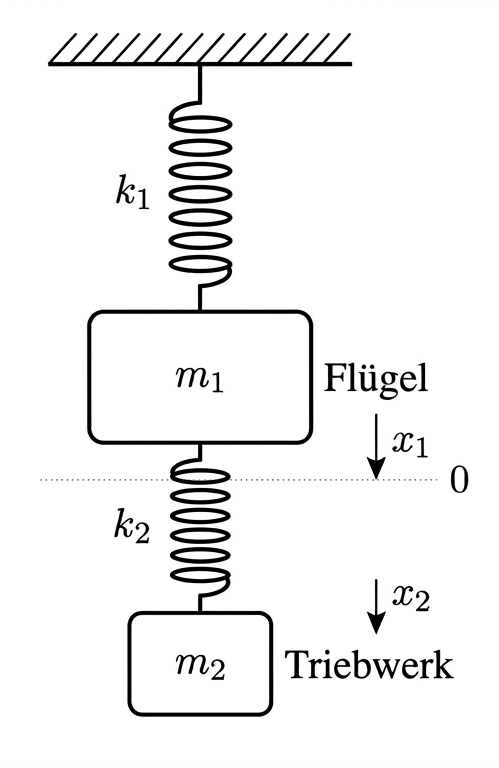

# Numerik

**Ingenieurinformatik Teil 2, Sommersemester 2026**

David Straub


### Gliederung

1. Einführung in Matlab
2. Arbeiten mit Arrays
3. Funktionen und Kontrollstrukturen
4. Analysis
5. **Lineare Algebra** 👈
6. Differentialgleichungen
7. Einführung in Simulink


### Fahrplan

**Letzte Einheit:** Matrizen und lineare Gleichungssysteme
→ Matrixoperationen, Determinante, Inverse
→ Linksdivision `\` für LGS
→ Überbestimmte Systeme und Least-Squares

**Heute:** Eigenwertprobleme
→ Eigenwerte und Eigenvektoren berechnen
→ Geometrische Interpretation
→ Anwendung: Gekoppelte Schwingungen


## Motivation


### Was ist ein Eigenwertproblem?

**Definition:** Ein Vektor $\mathbf{x} \neq \mathbf{0}$ heißt **Eigenvektor** der Matrix $A$, wenn es eine Zahl $\lambda$ gibt mit:

$$A\mathbf{x} = \lambda \mathbf{x}$$

Die Zahl $\lambda$ heißt **Eigenwert** zum Eigenvektor $\mathbf{x}$.


### Beispiel: Gitarrensaite

Modell: $n$ Massen $m$, durch Fadenkraft $T$ verbunden, Abstand $h$

```
○─────○─────○─────○─────○
u₁    u₂    u₃    u₄    u₅
```

Jede Masse wird von ihren **Nachbarn** gezogen:

$$F_i = \frac{T}{h}(u_{i-1} - 2u_i + u_{i+1})$$

$F = ma$, dann Ansatz $u_i(t) = v_i\cos(\omega t)$ einsetzen — für alle $n$ Massen gleichzeitig:

$$K\mathbf{v} = \omega^2 m\,\mathbf{v}$$


### Gitarrensaite: Die Steifigkeitsmatrix $K$

$K$ enkodiert die **Kopplung** zwischen Nachbarn ($n = 5$):

$$K = \frac{T}{h}\begin{pmatrix}2&-1&&&\\-1&2&-1&&\\&-1&2&-1&\\&&-1&2&-1\\&&&-1&2\end{pmatrix}$$

$m$ ist eine Zahl — alle Massen gleich.

Die **Eigenwerte** $\omega^2$ sind die erlaubten Schwingungsfrequenzen,  
die **Eigenvektoren** $\mathbf{v}$ die zugehörigen Schwingungsformen.


### Gitarrensaite: Grundton und 1. Oberton


**Grundton** $\omega_1$: alle Massen gleichphasig

$$\mathbf{v}_1 \approx (0.50,\ 0.87,\ 1.00,\ 0.87,\ 0.50)^T$$

**1. Oberton** $\omega_2 \approx 2\,\omega_1$ → **Oktave**

$$\mathbf{v}_2 \approx (0.87,\ 0.87,\ 0,\ {-0.87},\ {-0.87})^T$$

Knotenpunkt in der Mitte: zweite Hälfte schwingt **gegenphasig**.


### Beispiel: Flugzeugflügel Turboprop

**Problem:** Das Triebwerk dreht sich. Wenn die Drehfrequenz eine Eigenfrequenz des Flügels trifft $\rightarrow$ Resonanz $\rightarrow$ Materialversagen.

- Historisches Beispiel: Lockheed L-188 Electra, 1959: „Whirl Flutter“ führte zum strukturellen Versagen der Tragflächen.

Vereinfachtes Modell: Flügel + Triebwerk als 2-Massen-System:

$$K\,\mathbf{v} = \omega^2 M\,\mathbf{v}, \qquad M = \begin{pmatrix} m_\text{Flügel} & 0 \\ 0 & m_\text{Triebwerk} \end{pmatrix}$$

**Eigenvektoren** $\mathbf{v}$: Schwingungsform — z.B. Flügel hebt sich, Triebwerk senkt sich.

**Ziel der Konstruktion:** Struktur so auslegen, dass die Eigenfrequenzen außerhalb des Betriebsdrehzahlbereichs liegen!


## Eigenwertproblem


### Was ist ein Eigenwertproblem?

**Definition:** Ein Vektor $\mathbf{x} \neq \mathbf{0}$ heißt **Eigenvektor** der Matrix $A$, wenn es eine Zahl $\lambda$ gibt mit:

$$A\mathbf{x} = \lambda \mathbf{x}$$

Die Zahl $\lambda$ heißt **Eigenwert** zum Eigenvektor $\mathbf{x}$.

> $A$ muss **quadratisch** sein: $A\mathbf{x}$ und $\mathbf{x}$ müssen denselben Typ haben (gleiche Dimension), damit $A\mathbf{x} = \lambda\mathbf{x}$ überhaupt Sinn ergibt.


### Geometrische Interpretation

$$M\mathbf{v} = \lambda \mathbf{v}$$


- Öffnen Sie 🔗 [GeoGebra](https://www.geogebra.org/m/HY7k3Gg7)
- Finden Sie Vektoren, bei denen die Transformation $M$ die Richtung des Vektors $\boldsymbol{v}=\overrightarrow{OP}$ nicht ändert
- Intepretieren Sie und diskutieren Sie den Zusammenhang mit Eigenvektoren und Eigenwerten

### Eigenschaften

**Für symmetrische Matrizen** ($A = A^T$):
- Alle Eigenwerte sind **reell**
- Es gibt $n$ linear unabhängige Eigenvektoren

**Für nicht-symmetrische Matrizen:**
- Eigenwerte können **komplex** sein
- Nicht immer $n$ linear unabhängige Eigenvektoren

**Determinante:**

$$\det(A) = \lambda_1 \cdot \lambda_2 \cdot \ldots \cdot \lambda_n$$


## Eigenwerte in Matlab


### Die Funktion `eig`

```matlab
A = [1  2;
     3  4];

lambda = eig(A)          % Eigenwerte als Vektor
```

**Mit Eigenvektoren:**

```matlab
[V, D] = eig(A)
```

- `V`: Matrix, deren Spalten die Eigenvektoren sind
- `D`: Diagonalmatrix mit den Eigenwerten


### Beziehung: $A V = V D$

```matlab
A = [4 -5  1;
     2 -3  1;
     1 -2  2];

[V, D] = eig(A)
```

**Es gilt:**

$$A \cdot V = V \cdot D$$

**Komponentenweise** (Zeile $i$, Eigenvektor $k$):

$$\sum_j A_{ij}\, V_{jk} = \lambda_k\, V_{ik}$$


### Beispiel: 3×3 Matrix

```matlab
A = [4 -5  1;
     2 -3  1;
     1 -2  2];

[V, D] = eig(A);

D        % Diagonalmatrix mit Eigenwerten
```

**Ausgabe:**

```
D =
   -0.6180         0         0
         0    2.0000         0
         0         0    1.6180
```

Drei Eigenwerte: $\lambda_1 = -0.62$, $\lambda_2 = 2.00$, $\lambda_3 = 1.62$


### ✍️ Übung: Eigenwerte erkunden

Gegeben ist die symmetrische Matrix:

```matlab
A = [3 1; 1 3];
```

1. Berechnen Sie die Eigenwerte mit `eig(A)`
2. Berechnen Sie Eigenwerte **und** Eigenvektoren mit `[V, D] = eig(A)`
3. Überprüfen Sie: Gilt `A * V(:,1)` ≈ `D(1,1) * V(:,1)`?
4. Was fällt an den Eigenwerten auf? (*Hinweis: A ist symmetrisch*)
5. Berechnen Sie `det(A)` – wie hängt das mit den Eigenwerten zusammen?


### Eigenvektor zum 3. Eigenwert

```matlab
V(:,3)       % 3. Spalte von V
```

**Ausgabe:**

```
   0.3361
   0.3361
   0.8798
```

**Probe:**

```matlab
A * V(:,3)              % [0.544; 0.544; 1.424]
D(3,3) * V(:,3)         % [0.544; 0.544; 1.424] ✓
```


## Anwendung: Gekoppelte Schwingungen


### 2-Massen-Feder-System


Zwei Massen $m_1$, $m_2$ sind durch Federn verbunden.



**Bewegungsgleichungen:**

$$\begin{aligned}
m_1 \ddot{x}_1 &= -c_1 x_1 + c_2(x_2 - x_1) \\
m_2 \ddot{x}_2 &= -c_2(x_2 - x_1)
\end{aligned}$$

**Gesucht:** Wie schwingen die Massen?

> Dasselbe Modell wie der Flugzeugflügel von vorhin — jetzt rechnen wir es vollständig durch.


### Umformung zum Eigenwertproblem

Ansatz: $x_1(t) = A_1 \cos(\omega t)$, $x_2(t) = A_2 \cos(\omega t)$

**Führt auf:**

$$\begin{bmatrix} c_1 + c_2 & -c_2 \\ -c_2 & c_2 \end{bmatrix} \begin{bmatrix} A_1 \\ A_2 \end{bmatrix} = \omega^2 \begin{bmatrix} m_1 & 0 \\ 0 & m_2 \end{bmatrix} \begin{bmatrix} A_1 \\ A_2 \end{bmatrix}$$

Das ist ein **Eigenwertproblem**!

$$K \mathbf{A} = \omega^2 M \mathbf{A}$$


### Parameter festlegen

```matlab
m1 = 1;    % Masse 1 [kg]
m2 = 1;    % Masse 2 [kg]
c1 = 1;    % Federkonstante 1 [N/m]
c2 = 1;    % Federkonstante 2 [N/m]

K = [c1+c2, -c2;
     -c2,    c2];

M = [m1,  0;
      0, m2];
```


### Verallgemeinertes Eigenwertproblem

**Problem:** $K \mathbf{A} = \omega^2 M \mathbf{A}$

Das ist ein **verallgemeinertes Eigenwertproblem**:

$$A \mathbf{x} = \lambda B \mathbf{x}$$

**Matlab:**

```matlab
[V, D] = eig(K, M)
```

$V$ enthält die **Eigenvektoren** (Schwingungsformen)
$D$ enthält die **Eigenwerte** $\omega^2$


### Eigenfrequenzen berechnen

```matlab
[V, D] = eig(K, M);

omega_squared = diag(D)     % [0.382; 2.618]
omega = sqrt(omega_squared)  % [0.618; 1.618]
f = omega / (2*pi)           % Frequenzen in Hz
```

**Zwei Eigenfrequenzen:**
- $\omega_1 = 0.618$ rad/s
- $\omega_2 = 1.618$ rad/s


### Eigenschwingungen (Eigenvektoren)

```matlab
V
```

**Ausgabe:**

```
  -0.5257  -0.8507
  -0.8507   0.5257
```

**Erste Eigenschwingung:** Beide Massen schwingen **in Phase**
$\mathbf{v}_1 = \begin{bmatrix} -0.53 \\ -0.85 \end{bmatrix}$ (gleiches Vorzeichen)

**Zweite Eigenschwingung:** Beide Massen schwingen **gegenphasig**
$\mathbf{v}_2 = \begin{bmatrix} -0.85 \\ 0.53 \end{bmatrix}$ (entgegengesetztes Vorzeichen)


### Visualisierung der Eigenschwingungen

```matlab
t = linspace(0, 20, 500);

tiledlayout(1, 2)

nexttile
plot(t, V(1,1)*cos(omega(1)*t), t, V(2,1)*cos(omega(1)*t))
title(sprintf('Mode 1  (\\omega_1 = %.2f rad/s)', omega(1)))
xlabel('t [s]'); legend('Masse 1', 'Masse 2')

nexttile
plot(t, V(1,2)*cos(omega(2)*t), t, V(2,2)*cos(omega(2)*t))
title(sprintf('Mode 2  (\\omega_2 = %.2f rad/s)', omega(2)))
xlabel('t [s]'); legend('Masse 1', 'Masse 2')
```


### Spezialfälle: Reine Eigenschwingungen

Anfangsbedingung = Eigenvektor → nur **eine** Mode wird angeregt:

```matlab
x0 = V(:,1);   % → nur ω₁, beide Massen in Phase
x0 = V(:,2);   % → nur ω₂, Massen gegenphasig
```

Beliebige Anfangsbedingung → **Überlagerung** beider Moden.


### ✍️ Übung: Federsystem erkunden

Ändern Sie die Parameter und beobachten Sie das Verhalten:

```matlab
m1 = 2;  m2 = 1;   % Unterschiedliche Massen
c1 = 2;  c2 = 3;   % Unterschiedliche Federn
```

1. Wie ändern sich die Eigenfrequenzen $\omega_1$, $\omega_2$?
2. Wie sehen die neuen Eigenschwingungsformen aus?
3. Welche Anfangsbedingung `x0` regt **nur** die erste Eigenschwingung an?
4. **Bonusaufgabe:** Was passiert wenn `c1 = 0`? (Kein Anker für Masse 1)


## Zusammenfassung


### Eigenwertprobleme in Matlab

**Gewöhnliches Eigenwertproblem:**

```matlab
lambda = eig(A)           % Nur Eigenwerte
[V, D] = eig(A)           % Eigenvektoren und -werte
```

**Verallgemeinertes Eigenwertproblem:**

```matlab
[V, D] = eig(A, B)
```


### Wichtigste Erkenntnisse

- Eigenvektoren sind **besondere Richtungen**, die nur gestreckt/gestaucht werden
- **Physikalische Bedeutung:** Eigenschwingungen, Hauptachsen, stabile Richtungen
- Eigenwerte einer Matrix: $\det(A) = \prod \lambda_i$
- Für symmetrische Matrizen: Eigenwerte immer reell
- **Verallgemeinertes EWP:** $K\mathbf{x} = \omega^2 M\mathbf{x}$ → `eig(K, M)` (nicht `eig(inv(M)*K)`!)
- **Anwendungen:** Schwingungsanalyse, Stabilitätsuntersuchungen, FEM, Regelungstechnik, ...
