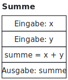
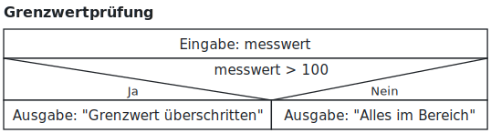
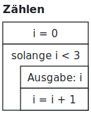
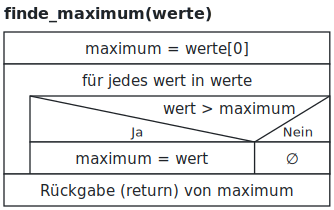
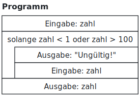

# Programmieren – 9. Funktionen 2 und Struktogramme

**Ingenieurinformatik Teil 1, Wintersemester 2026/27**

David Straub

### Warm-up: Was gibt der Code aus?

```python
txt = "SENSOR"
print(txt[1:4])
print(txt[-2:])
print(len(txt[2:]))
```

### Heute lernen Sie

- Funktionen mit **mehreren Parametern** und **mehreren Rückgabewerten**
- Was in der Funktion bleibt: **lokale Variablen** (und die Ausnahme `global`)
- Probleme **zerlegen**: Hauptfunktion und Hilfsfunktion
- **Struktogramme** – Programme auf Papier entwerfen

## Funktionen mit mehr Möglichkeiten

### Zwei Parameter

```python
def rechteckflaeche(breite, hoehe):
    return breite * hoehe

print(rechteckflaeche(4, 3))
print(rechteckflaeche(hoehe=3, breite=4))
```

- Parameter durch Komma getrennt – die **Reihenfolge** der Werte zählt
- Oder mit Namen übergeben, dann ist die Reihenfolge egal

### Mini-Aufgabe (2 min)

1. Schreiben Sie `rechteckflaeche(breite, hoehe)` selbst und testen Sie sie
2. Zusatz: `quadervolumen(laenge, breite, hoehe)` – Volumen zurückgeben (`return`)

### Mehrere Rückgabewerte

```python
from math import sin, cos

def sin_cos(x):
    return sin(x), cos(x)

s, c = sin_cos(0.5)
print(f"sin: {s:.3f}, cos: {c:.3f}")
```

- `return a, b` gibt **beide** Werte zurück
- Links entsprechend **zwei** Variablen, durch Komma getrennt („Unpacking“)

### Lokale Variablen

```python
def laufzeit(kapazitaet, strom):
    stunden = kapazitaet / strom
    return stunden

print(laufzeit(4800, 350))
print(stunden)
```

```
NameError: name 'stunden' is not defined
```

- Variablen, die **in** einer Funktion entstehen, leben nur **während des Aufrufs**
- Draußen existieren sie nicht – das ist Absicht: Funktionen räumen hinter sich auf
- Das hat einen Namen: **Kapselung** – was in der Funktion passiert, bleibt in der Funktion. Austausch nur über zwei Wege: Parameter rein, Rückgabe (`return`) raus

### Die Ausnahme: `global` – lesen ja, schreiben lieber nicht

```python
zaehler = 0

def erhoehe():
    global zaehler
    zaehler = zaehler + 1
```

- `global` lässt eine Funktion die **äußere** Variable verändern – ein drittes, **unsichtbares** Loch in der Kapselung
- Der Aufruf `erhoehe()` sieht harmlos aus und verändert heimlich etwas außerhalb; bei Parameter und `return` steht an der Aufrufstelle alles, was passiert
- Deshalb: `global` **lesen können** – im eigenen Code Parameter und `return` verwenden

### Vorhersage-Aufgabe (4 min)

Aufschreiben, in der **richtigen Reihenfolge** – dann ausführen:

```python
def f1():
    x = 20
    print("a:", x)

def f2():
    global x
    x = 30
    print("b:", x)

x = 10
print("c:", x)
f1()
print("d:", x)
f2()
print("e:", x)
```

### Zerlegen: Hauptfunktion denkt Hilfsfunktion mit

Aufgabe: ein Messbericht. Erst die **Hauptfunktion** schreiben – die Hilfsfunktion darf es dabei ruhig noch gar nicht geben:

```python
def bericht(werte):
    m = mittelwert(werte)          # gibt es noch nicht - kommt gleich!
    return f"{len(werte)} Werte, Mittelwert {m:.1f}"
```

Dann die Lücke füllen – `mittelwert` kennen Sie aus Woche 7:

```python
def mittelwert(werte):
    summe = 0
    for wert in werte:
        summe += wert
    return summe / len(werte)
```

Groß denken, klein bauen – so zerlegt man Probleme.

### Mini-Aufgabe (4 min): Zerlegen

Machen Sie aus diesem Skript **eine Funktion mit zwei Parametern** und **zwei Aufrufe**:

```python
kapazitaet_a = 4800
strom_a = 350
laufzeit_a = kapazitaet_a / strom_a
print(f"Gerät A: {laufzeit_a:.1f} h")

kapazitaet_b = 2200
strom_b = 150
laufzeit_b = kapazitaet_b / strom_b
print(f"Gerät B: {laufzeit_b:.1f} h")
```

### Debug-Check

Wenn ein Programm nicht tut, was es soll – der Reihe nach:

1. Was **soll** es tun?
2. Was tut es **stattdessen**?
3. Welche Stelle ist **verdächtig** – welche Bedingung, welche Variable?
4. Welcher **kleinste Test** entscheidet? Oft: ein `print` an der richtigen Stelle

Kennen Sie übrigens schon: genau so haben wir in Woche 1 die Batterie-Schleife entlarvt.

## Struktogramme

### Programme auf Papier: Struktogramme

In technischer Dokumentation werden Algorithmen manchmal **sprachunabhängig** festgehalten – Struktogramme sind eine klassische Notation dafür.

- Ihnen begegnen sie in Spezifikationen und Altdokumentation – **lesen** und in Code **umsetzen** können ist die Kernfertigkeit
- **Zeichnen** sollten Sie sie können, wenn eine Dokumentation (oder die Klausur) es verlangt

Drei Grundformen, alle drei kennen Sie längst aus Python:

1. **Anweisungsfolge** – Kästen untereinander
2. **Verzweigung** – Diagonalen mit Ja/Nein
3. **Schleife** – das umgekehrte L



### Grundform Verzweigung

Diagonalen teilen die Bedingung in **Ja** (links) und **Nein** (rechts) – darunter die beiden Zweige.

Das Beispiel kennen Sie aus Woche 3:

```python
messwert = float(input("Messwert: "))
if messwert > 100:
    print("Grenzwert überschritten")
else:
    print("Alles im Bereich")
```



### Grundform Schleife

Kopfzeile mit der Bedingung, der Schleifenkörper hängt im **umgekehrten L**.

Aus Woche 5:

```python
i = 0
while i < 3:
    print(i)
    i = i + 1
```

Für `for`-Schleifen: gleiche Form, Kopfzeile z. B. „für jedes wert in werte“.



### Alles zusammen: ein alter Bekannter

Verzweigung **in** einer Schleife – das ist `finde_maximum` aus Woche 7.

Der leere Nein-Zweig bekommt das Zeichen ∅.

Zuweisungen schreiben wir mit `=`, Rückgaben als „Rückgabe (return) von …“.



### Lese-Übung (4 min): Struktogramm → Python

Übersetzen Sie exakt in Python:



Tipp: Sie kennen dieses Programm.

### Zeichen-Übung (5 min, auf Papier): Python → Struktogramm

Zeichnen Sie das Struktogramm zu diesem Programm – alle Kontrollstrukturen müssen erkennbar sein:

```python
n = 5
while n > 0:
    print(n)
    n -= 1
print("Start!")
```

### Mini-Check

1. `a, b = f(...)` – was muss `f` dafür tun?
2. Eine Variable wird in einer Funktion angelegt (ohne `global`) – ist sie draußen sichtbar?
3. Welche Form hat eine Schleife im Struktogramm?
4. Debug-Check, Frage 4 – wie findet man den kleinsten Test?

### Bis nächste Woche!

Nächste Woche: **Diagramme mit matplotlib** – Ihre Daten als Bild

- Üben: KI-Quizze auf OneTutor: https://hm.onetutor.ai/
- Fragen: jederzeit im Matrix-Chat
