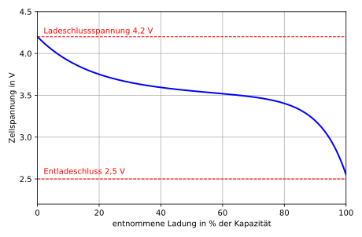
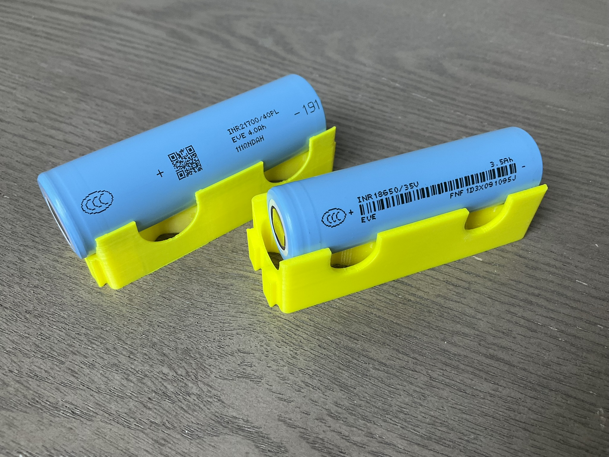
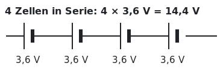
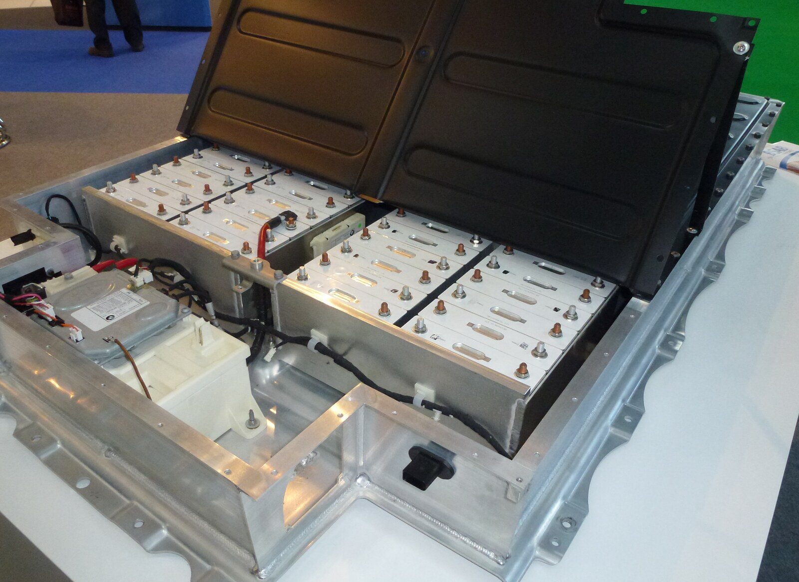

# Programmieren – Praktikum 1

**Ingenieurinformatik Teil 1, Wintersemester 2026/27**

David Straub

### Sicherheitsunterweisung für Benutzer des Verbundlabors KCA

- **Fluchtwege** von jedem Raum links und rechts auf den Flur in das Treppenhaus
- an der Flurdecke sind **grüne beleuchtete Hinweisschilder** als Fluchtwegmarkierung angebracht
- die **Feuerlöscher** befinden sich im Flur und sind mit **roten Hinweisschildern** an den Seitenwänden gekennzeichnet
- die **Feuermelder** befinden sich in beiden Treppenhäusern
- im Brandfall **keinen Aufzug benützen**; Begründung: möglicher Stromausfall
- im Brandfall die **Fenster geschlossen halten**
- wichtige Informationen sind im Raum **ausgehängt**: Raumnutzungsordnung usw.
- **Not-Aus-Schalter** sind in allen Räumen vorhanden


### Das Batterielabor

In den sechs Praktika entstehen Schritt für Schritt mehrere zusammenhängende Programme rund um ein Batterielabor – von den ersten Kennzahlen heute bis zu Diagrammen und eigenen Datentypen am Ende des Semesters.

- Jedes Praktikum steht für sich: Sie starten jeweils mit einem funktionierenden Stand
- Sie arbeiten in Ihrer Kleingruppe – diskutieren Sie Ansätze, vergleichen Sie Ergebnisse
- Im Praktikum arbeiten Sie **ohne** KI-Unterstützung – Fehler selbst zu finden ist der Kern der Sache

### Batterie-Grundlagen

- **Spannung** (V): bei Li-Ionen-Zellen je nach Ladezustand ca. 2,5 bis 4,2 V
- **Kapazität** (mAh): die gespeicherte Ladung. Bei 700 mA Stromaufnahme hält eine 3500-mAh-Zelle 3500 / 700 = 5 Stunden
- **Energieinhalt** (Wh): Spannung mal Ladung
- **Serienschaltung**: die Spannungen der Zellen addieren sich



### Aufgabe 1: Ihre Zelle

Jede Gruppe bewertet ihre eigene Zelle. Suchen Sie sich eine **reale Batteriezelle** (z. B. eine 18650- oder 21700-Rundzelle) in der Test-Datenbank https://lygte-info.dk/info/batteryIndex.html – dort stehen Kapazität, Spannung und gemessene Masse.

```python
kapazitaet_mAh =
spannung_V =
masse_g =
strom_mA =
```

1. Legen Sie die vier Variablen mit den Werten **Ihrer** Zelle an – den Entladestrom wählen Sie selbst
2. Geben Sie jede aus (`print`)
3. Prüfen Sie mit `type(...)`: Welche sind `int`, welche `float`?



### Aufgabe 2: Kennzahlen der Zelle

Berechnen Sie aus Ihren vier Variablen – jeweils in einer eigenen Variable, dann ausgeben (`print`):

1. **Laufzeit** in Stunden bei Ihrem Strom: Kapazität geteilt durch Strom
2. **Energieinhalt** in Wh: Spannung mal Kapazität, geteilt durch 1000
3. **Spezifische Energie** in Wh/kg: Energieinhalt geteilt durch die Masse in kg (Ihre Masse steht in Gramm – teilen Sie zuerst durch 1000)

Zum Diskutieren in der Gruppe: Welche Ergebnisse sind `int`, welche `float` – und warum?

### Aufgabe 3: Von der Zelle zum Pack

In Fahrzeugen werden viele Zellen zu einem Pack verschaltet – in Serie addieren sich die Spannungen.

1. Wählen Sie eine Zellenzahl für Ihr Pack (üblich sind z. B. 96 in Serie)
2. Berechnen Sie die **Pack-Spannung** und geben Sie sie aus (`print`)
3. Berechnen Sie den **Energieinhalt des Packs** in kWh und geben Sie ihn aus (`print`) – der Energieinhalt des Packs ist die Summe der Energieinhalte aller Zellen

Vergleichen Sie mit der Nachbargruppe: Wer hat das größere Pack – und woran liegt es?



### Aufgabe 4: Module und Reste

Verbaut werden Module zu je 12 Zellen.

1. Sie haben 500 Zellen: Wie viele bleiben übrig, wenn Sie volle Module bauen? (`%` hilft)
2. Wie viele **volle Module** sind das? (Ein Ausdruck aus dem, was Sie schon haben – ganz ohne neue Werkzeuge)
3. Probieren Sie andere Stückzahlen: Bei welcher Lieferung bleibt gar nichts übrig?



### Aufgabe 5 (falls Sie Verzweigungen schon hatten): Der erste Zellen-Check

Mit Verzweigungen wird aus Rechnen ein Urteil:

1. Bewerten Sie die Spannung Ihrer Zelle mit `if`/`elif`/`else` und geben Sie das Urteil aus (`print`):
   - über 4,2 V: `über Ladeschlussspannung!` (mehr verträgt die Zelle beim Laden nicht)
   - unter 2,5 V: `tiefentladen!` (schädigt die Zelle dauerhaft)
   - sonst: `im Spannungsfenster`
2. Testen Sie alle drei Fälle, indem Sie den Spannungswert ändern
3. Wählen Sie eigene Grenzen für eine **Temperatur-Bewertung** und bauen Sie sie dazu

### Zusatz für Schnelle

- Noch eine Kennzahl: die **C-Rate** (Strom geteilt durch Kapazität) – recherchieren Sie, was sie bedeutet
- Was passiert bei `kapazitaet_mAh = "3500"` (mit Anführungszeichen) in Ihren Rechnungen? Erklären Sie die Fehlermeldung
- Gestalten Sie die Ausgabe Ihres Zell-Steckbriefs so lesbar wie möglich – nur mit dem, was Sie kennen

### Bildnachweis

- Batteriepack: „Lithium-Ion Battery for BMW i3 – Battery Pack“ von RudolfSimon, CC BY-SA 3.0, via Wikimedia Commons
